# 专家团编排系统

<cite>
**本文档引用的文件**
- [README.md](file://README.md)
- [package.json](file://package.json)
- [pnpm-workspace.yaml](file://pnpm-workspace.yaml)
- [tsconfig.base.json](file://tsconfig.base.json)
- [packages/core/src/index.ts](file://packages/core/src/index.ts)
- [packages/core/src/orchestrator.ts](file://packages/core/src/orchestrator.ts)
- [packages/core/src/agent.ts](file://packages/core/src/agent.ts)
- [packages/core/src/types.ts](file://packages/core/src/types.ts)
- [packages/core/src/service.ts](file://packages/core/src/service.ts)
- [packages/core/src/planning.ts](file://packages/core/src/planning.ts)
- [packages/core/src/tools/delegate.ts](file://packages/core/src/tools/delegate.ts)
- [packages/core/src/tools/fs.ts](file://packages/core/src/tools/fs.ts)
- [apps/server/src/index.ts](file://apps/server/src/index.ts)
- [apps/web/src/App.tsx](file://apps/web/src/App.tsx)
- [apps/web/src/api.ts](file://apps/web/src/api.ts)
- [docs/superpowers/specs/2026-06-10-expert-orchestration-design.md](file://docs/superpowers/specs/2026-06-10-expert-orchestration-design.md)
- [packages/core/src/expert/session-manager.ts](file://packages/core/src/expert/session-manager.ts)
- [packages/core/src/expert/agent-pool.ts](file://packages/core/src/expert/agent-pool.ts)
- [packages/core/src/expert/orchestrator.ts](file://packages/core/src/expert/orchestrator.ts)
- [packages/core/src/expert/research-collector.ts](file://packages/core/src/expert/research-collector.ts)
- [packages/core/src/expert/tdd-pipeline.ts](file://packages/core/src/expert/tdd-pipeline.ts)
- [packages/core/src/expert/migration.ts](file://packages/core/src/expert/migration.ts)
- [packages/core/src/expert/types.ts](file://packages/core/src/expert/types.ts)
- [packages/core/src/expert/agent-prototypes.ts](file://packages/core/src/expert/agent-prototypes.ts)
- [packages/core/src/expert/persistence.test.ts](file://packages/core/src/expert/persistence.test.ts)
</cite>

## 更新摘要
**所做更改**
- 新增专家团编排系统核心组件的完整实现分析
- 更新专家会话管理器、代理池、专家编排器等组件的详细说明
- 添加研究收集器、TDD流水线、迁移模块的架构分析
- 完善服务器端和客户端API的集成说明
- 更新状态管理和持久化机制的实现细节

## 目录
1. [简介](#简介)
2. [项目结构](#项目结构)
3. [核心组件](#核心组件)
4. [架构概览](#架构概览)
5. [详细组件分析](#详细组件分析)
6. [专家团编排系统实现](#专家团编排系统实现)
7. [API集成与持久化](#api集成与持久化)
8. [依赖关系分析](#依赖关系分析)
9. [性能考虑](#性能考虑)
10. [故障排除指南](#故障排除指南)
11. [结论](#结论)
12. [附录](#附录)

## 简介

专家团编排系统是一个基于 RepoHelm 的智能代理编排平台，现已完全实现，包括 ExpertSessionManager、AgentPool、ExpertOrchestrator、ResearchCollector、TDDPipeline、Migration 等核心组件的完整实现，以及服务器端和客户端API的完整集成。

该系统的核心创新在于将传统的静态 Plan-then-Execute 编排模式升级为动态专家团模式，通过以下关键特性实现：

- **动态专家团模式**：入口 Agent 通过对话理解需求、自动拆解任务树，用户可交互调整，确认后进入 TDD 测试先行执行流程
- **专家原型系统**：预设专家原型 + 入口 Agent 可临时创建新 Agent
- **内嵌代码调研**：研究收集器伴随任务拆解过程，结果自然融入任务节点
- **TDD 流水线**：验收用例 → 具体测试 → 红绿重构的完整执行策略
- **完整的状态管理**：专家会话的生命周期状态转换和持久化存储
- **灵活的代理池管理**：支持内置专家原型和动态代理的统一管理

系统支持多种 Agent 后端执行机制，包括内置 mock 后端、Codex CLI、Claude Code、OpenCode 以及 OpenAI-compatible provider，并提供完整的安全策略控制和审计日志功能。

## 项目结构

RepoHelm 采用 monorepo 架构，主要包含以下核心模块：

```mermaid
graph TB
subgraph "应用层"
WEB[Web 应用<br/>React + TypeScript]
SERVER[服务器应用<br/>Hono + Node.js]
ENDPOINT[API 端点<br/>专家会话管理]
CLIENT[客户端API<br/>专家会话操作]
end
subgraph "核心包"
CORE[Core 核心包<br/>TypeScript]
EXPERT[专家系统<br/>完整实现]
TYPES[类型定义<br/>共享接口]
SERVICE[服务层<br/>业务逻辑]
STORE[存储层<br/>状态持久化]
end
subgraph "文档"
DOCS[设计文档<br/>规格说明]
PLANS[规划文档<br/>路线图]
TESTS[测试用例<br/>单元测试]
end
subgraph "测试"
UNIT[单元测试<br/>Vitest]
E2E[E2E 测试<br/>Playwright]
END
WEB --> SERVER
SERVER --> CORE
SERVER --> EXPERT
SERVER --> SERVICE
SERVER --> STORE
WEB --> CLIENT
CLIENT --> ENDPOINT
CORE --> TYPES
EXPERT --> TYPES
SERVICE --> STORE
DOCS --> CORE
UNIT --> CORE
UNIT --> EXPERT
E2E --> WEB
E2E --> SERVER
```

**图表来源**
- [pnpm-workspace.yaml:1-5](file://pnpm-workspace.yaml#L1-L5)
- [package.json:1-22](file://package.json#L1-L22)

**章节来源**
- [pnpm-workspace.yaml:1-5](file://pnpm-workspace.yaml#L1-L5)
- [package.json:1-22](file://package.json#L1-L22)
- [tsconfig.base.json:1-14](file://tsconfig.base.json#L1-L14)

## 核心组件

### 专家团编排器 (Expert Orchestrator)

专家团编排器是系统的核心执行引擎，负责管理整个专家团的工作流程：

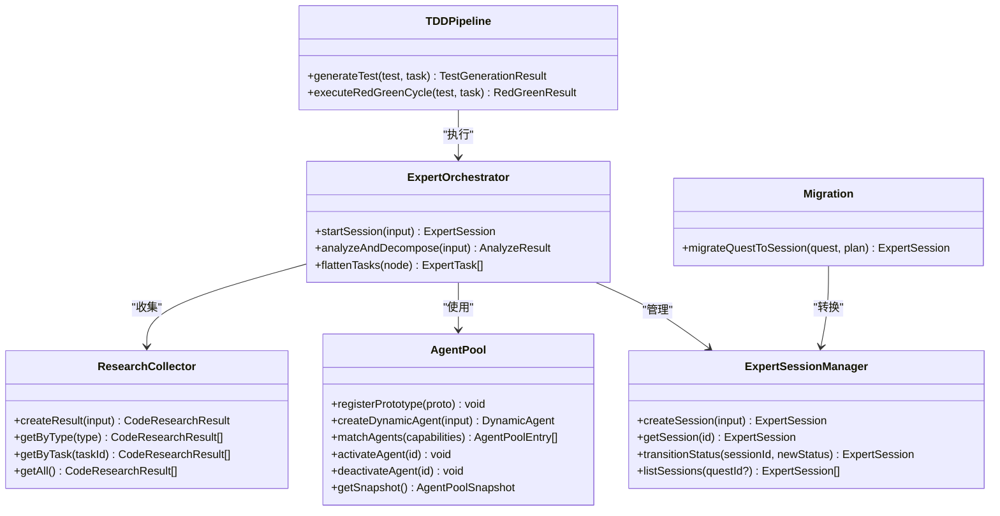

**图表来源**
- [packages/core/src/expert/session-manager.ts:22-96](file://packages/core/src/expert/session-manager.ts#L22-L96)
- [packages/core/src/expert/agent-pool.ts:10-35](file://packages/core/src/expert/agent-pool.ts#L10-L35)
- [packages/core/src/expert/orchestrator.ts:13-59](file://packages/core/src/expert/orchestrator.ts#L13-L59)
- [packages/core/src/expert/research-collector.ts:15-55](file://packages/core/src/expert/research-collector.ts#L15-L55)
- [packages/core/src/expert/tdd-pipeline.ts:13-47](file://packages/core/src/expert/tdd-pipeline.ts#L13-L47)
- [packages/core/src/expert/migration.ts:8-54](file://packages/core/src/expert/migration.ts#L8-L54)

### Agent 后端系统

系统支持多种 Agent 后端执行机制：

| 后端类型 | 描述 | 特性 |
|---------|------|------|
| Mock 后端 | 内置实现 Agent，用于验证 Quest、worktree 和 diff review 闭环 | 无需外部依赖，适合测试 |
| Codex CLI | 通过环境变量配置的真实外部 CLI 执行 | 支持标准 CLI 协议 |
| Claude Code | Anthropic Claude Code 的 CLI 接口 | 企业级代码生成能力 |
| OpenCode | 第三方代码生成工具 | 多样化的代码生成选项 |
| OpenAI-compatible | 兼容 OpenAI API 的模型提供商 | 支持 Qwen、DeepSeek 等 |

**章节来源**
- [packages/core/src/agent.ts:48-115](file://packages/core/src/agent.ts#L48-L115)
- [packages/core/src/agent.ts:117-259](file://packages/core/src/agent.ts#L117-L259)
- [packages/core/src/agent.ts:261-393](file://packages/core/src/agent.ts#L261-L393)

### 知识库管理系统

系统提供完整的知识库管理功能：

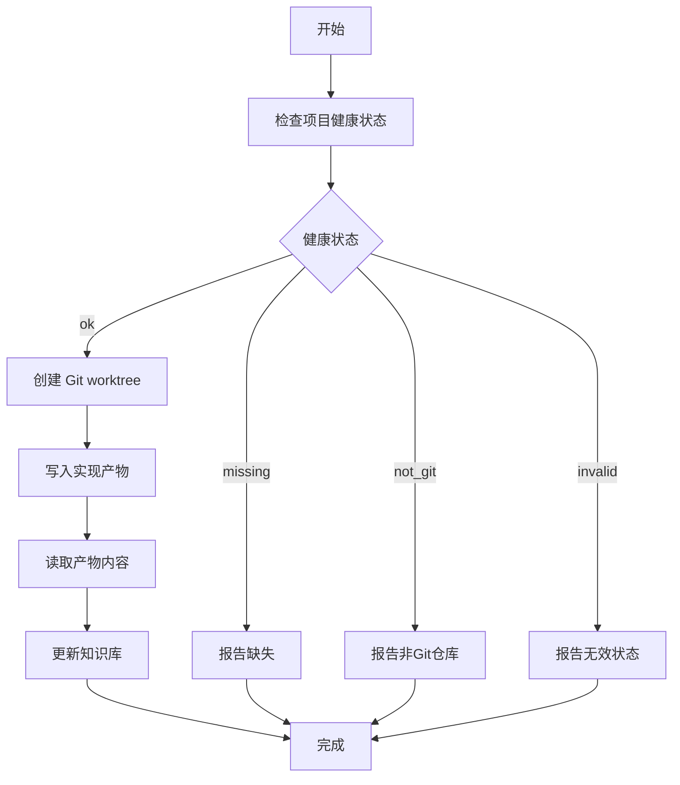

**图表来源**
- [packages/core/src/agent.ts:88-114](file://packages/core/src/agent.ts#L88-L114)
- [packages/core/src/service.ts:220-243](file://packages/core/src/service.ts#L220-L243)

**章节来源**
- [packages/core/src/types.ts:226-238](file://packages/core/src/types.ts#L226-L238)
- [packages/core/src/service.ts:290-318](file://packages/core/src/service.ts#L290-L318)

## 架构概览

专家团编排系统采用分层架构设计，确保各组件间的松耦合和高内聚：

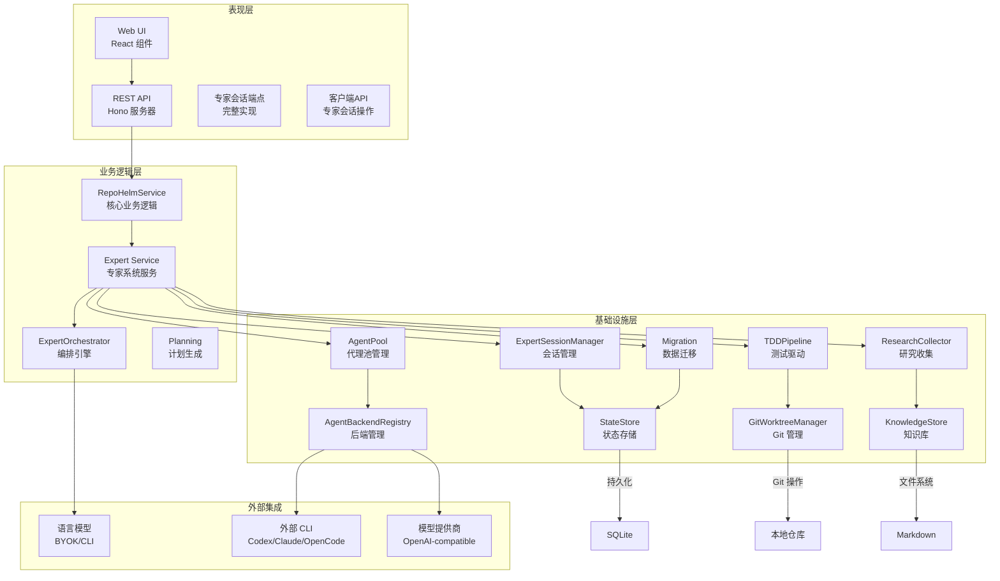

**图表来源**
- [apps/server/src/index.ts:1-782](file://apps/server/src/index.ts#L1-L782)
- [packages/core/src/service.ts:79-105](file://packages/core/src/service.ts#L79-L105)

系统的关键设计原则包括：

1. **单一职责原则**：每个组件专注于特定的业务领域
2. **依赖倒置**：高层模块不依赖低层模块，两者都依赖抽象
3. **开闭原则**：对扩展开放，对修改封闭
4. **接口隔离**：客户端不应该依赖它不需要的接口

**章节来源**
- [packages/core/src/index.ts:1-15](file://packages/core/src/index.ts#L1-L15)
- [apps/server/src/index.ts:1-782](file://apps/server/src/index.ts#L1-L782)

## 详细组件分析

### 专家团生命周期管理

专家团的完整生命周期包括六个主要阶段：

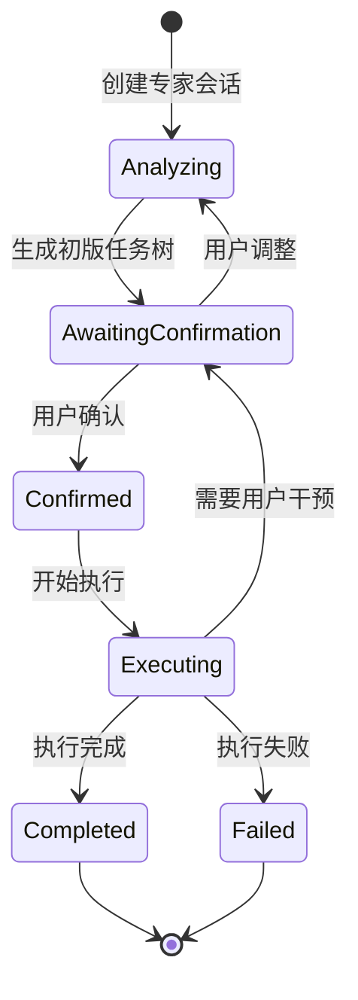

**图表来源**
- [packages/core/src/expert/session-manager.ts:8-15](file://packages/core/src/expert/session-manager.ts#L8-L15)

### TDD 测试驱动执行流程

系统实现了完整的 TDD（测试驱动开发）流水线：

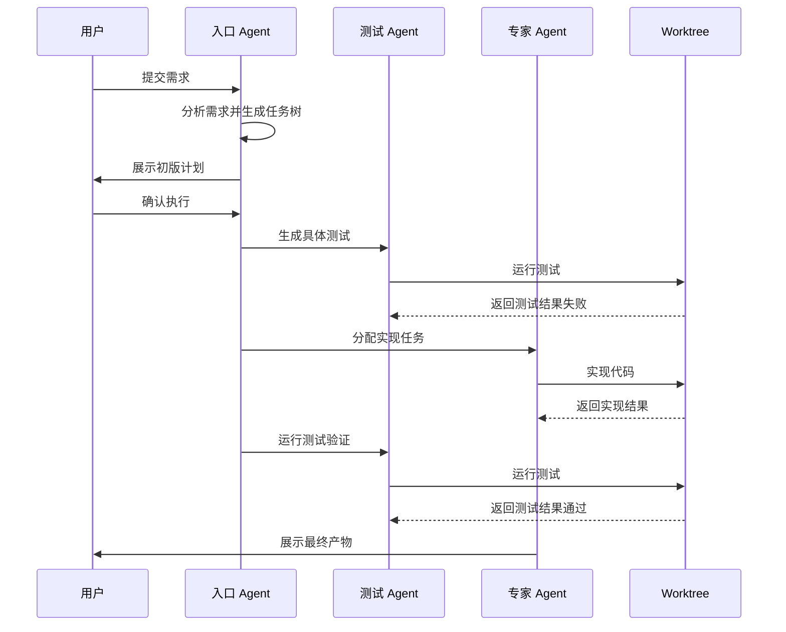

**图表来源**
- [packages/core/src/expert/tdd-pipeline.ts:24-46](file://packages/core/src/expert/tdd-pipeline.ts#L24-L46)

### 任务树数据结构

专家团系统使用层次化的任务树结构来组织执行任务：

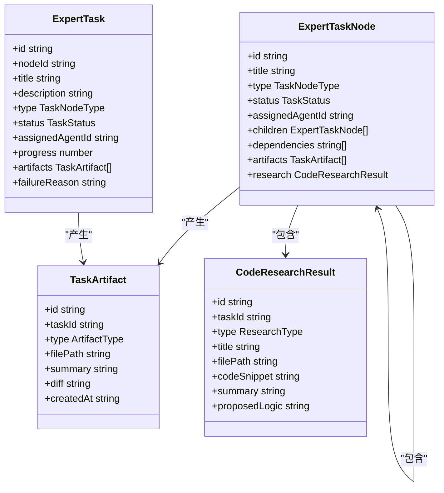

**图表来源**
- [packages/core/src/expert/types.ts:29-108](file://packages/core/src/expert/types.ts#L29-L108)
- [packages/core/src/expert/types.ts:137-146](file://packages/core/src/expert/types.ts#L137-L146)

**章节来源**
- [packages/core/src/expert/types.ts:3-173](file://packages/core/src/expert/types.ts#L3-L173)

### Agent 池管理系统

系统提供了灵活的 Agent 池管理机制：

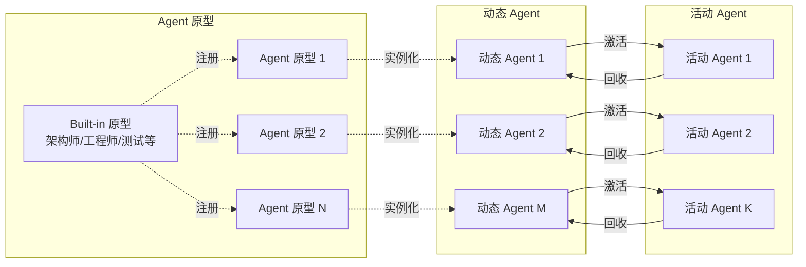

**图表来源**
- [packages/core/src/expert/agent-pool.ts:17-34](file://packages/core/src/expert/agent-pool.ts#L17-L34)
- [packages/core/src/expert/agent-prototypes.ts:3-11](file://packages/core/src/expert/agent-prototypes.ts#L3-L11)

**章节来源**
- [packages/core/src/expert/agent-pool.ts:1-36](file://packages/core/src/expert/agent-pool.ts#L1-L36)
- [packages/core/src/expert/agent-prototypes.ts:1-12](file://packages/core/src/expert/agent-prototypes.ts#L1-L12)

## 专家团编排系统实现

### 专家会话管理器

专家会话管理器是专家团系统的核心协调组件，负责管理专家会话的完整生命周期：

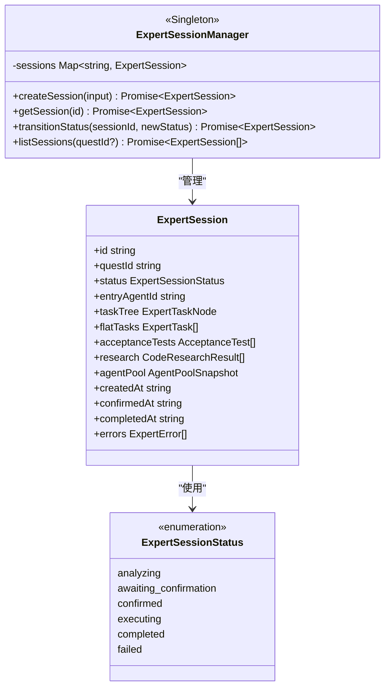

**图表来源**
- [packages/core/src/expert/session-manager.ts:22-96](file://packages/core/src/expert/session-manager.ts#L22-L96)
- [packages/core/src/expert/types.ts:4-26](file://packages/core/src/expert/types.ts#L4-L26)

### 专家编排器

专家编排器负责协调专家会话的分析和执行过程：

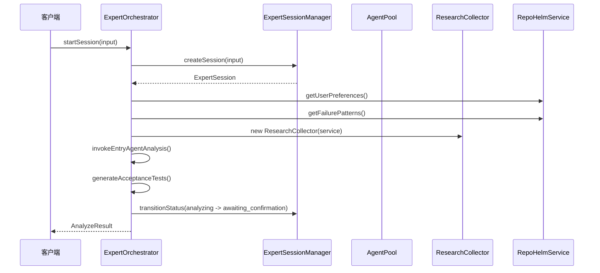

**图表来源**
- [packages/core/src/expert/orchestrator.ts:21-39](file://packages/core/src/expert/orchestrator.ts#L21-L39)

### 研究收集器

研究收集器负责在任务执行过程中收集和管理代码研究结果：

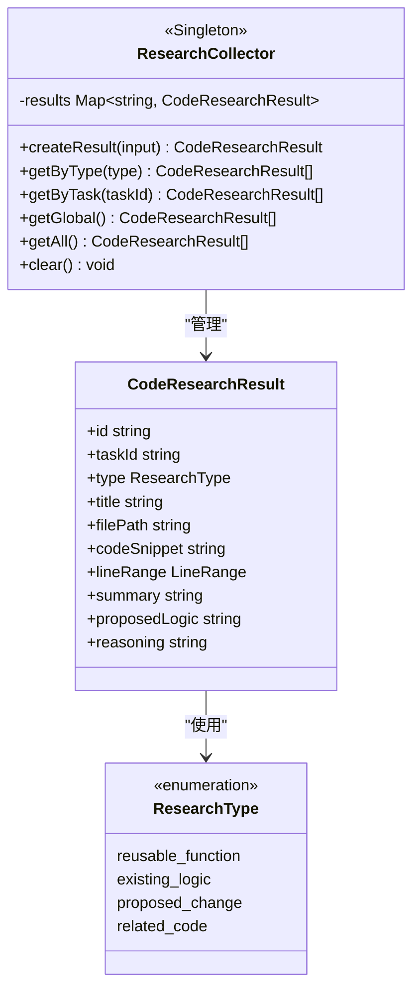

**图表来源**
- [packages/core/src/expert/research-collector.ts:15-55](file://packages/core/src/expert/research-collector.ts#L15-L55)
- [packages/core/src/expert/types.ts:97-108](file://packages/core/src/expert/types.ts#L97-L108)

### TDD 流水线

TDD 流水线实现了完整的测试驱动开发执行策略：

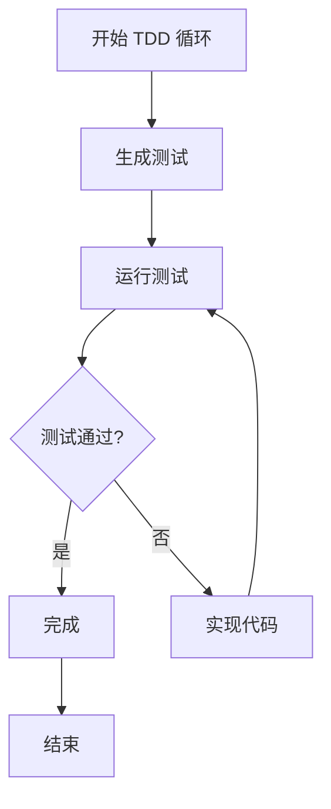

**图表来源**
- [packages/core/src/expert/tdd-pipeline.ts:33-46](file://packages/core/src/expert/tdd-pipeline.ts#L33-L46)

### 数据迁移

数据迁移模块负责将旧的 Quest 系统数据迁移到新的专家会话格式：

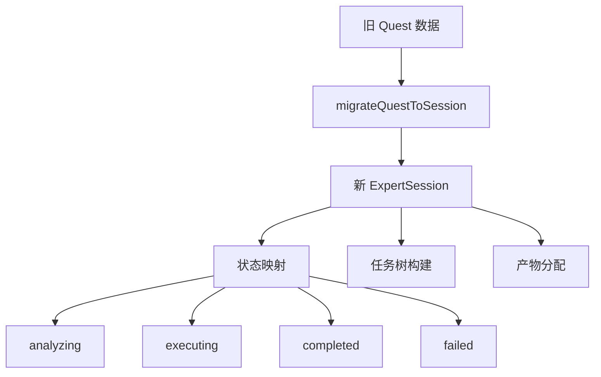

**图表来源**
- [packages/core/src/expert/migration.ts:8-54](file://packages/core/src/expert/migration.ts#L8-L54)

**章节来源**
- [packages/core/src/expert/session-manager.ts:1-97](file://packages/core/src/expert/session-manager.ts#L1-L97)
- [packages/core/src/expert/orchestrator.ts:1-60](file://packages/core/src/expert/orchestrator.ts#L1-L60)
- [packages/core/src/expert/research-collector.ts:1-56](file://packages/core/src/expert/research-collector.ts#L1-L56)
- [packages/core/src/expert/tdd-pipeline.ts:1-48](file://packages/core/src/expert/tdd-pipeline.ts#L1-L48)
- [packages/core/src/expert/migration.ts:1-73](file://packages/core/src/expert/migration.ts#L1-L73)

## API集成与持久化

### 服务器端API端点

专家团编排系统提供了完整的 REST API 端点：

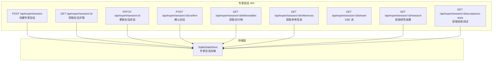

**图表来源**
- [apps/server/src/index.ts:757-852](file://apps/server/src/index.ts#L757-L852)

### 客户端API集成

客户端提供了完整的专家会话操作接口：

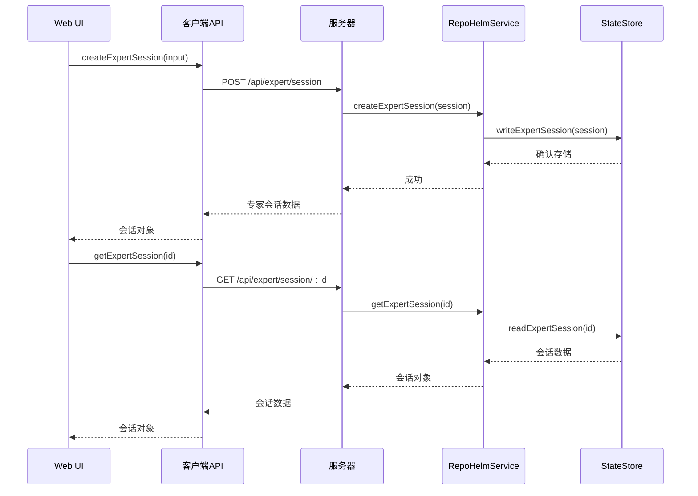

**图表来源**
- [apps/web/src/api.ts:892-907](file://apps/web/src/api.ts#L892-L907)

### 状态持久化

专家会话的状态持久化机制：

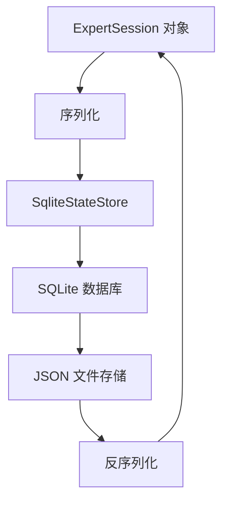

**图表来源**
- [packages/core/src/expert/persistence.test.ts:30-52](file://packages/core/src/expert/persistence.test.ts#L30-L52)

**章节来源**
- [apps/server/src/index.ts:733-852](file://apps/server/src/index.ts#L733-L852)
- [apps/web/src/api.ts:890-909](file://apps/web/src/api.ts#L890-L909)
- [packages/core/src/expert/persistence.test.ts:1-54](file://packages/core/src/expert/persistence.test.ts#L1-L54)

## 依赖关系分析

系统采用模块化设计，各组件间存在清晰的依赖关系：

```mermaid
graph TD
subgraph "核心依赖"
TYPES[expert/types.ts<br/>专家类型定义]
SERVICE[service.ts<br/>业务服务]
ORCHESTRATOR[orchestrator.ts<br/>编排器]
AGENT[agent.ts<br/>Agent 管理]
END
subgraph "专家系统"
SESSION_MANAGER[session-manager.ts<br/>会话管理]
AGENT_POOL[agent-pool.ts<br/>代理池]
RESEARCH_COLLECTOR[research-collector.ts<br/>研究收集]
TDD_PIPELINE[tdd-pipeline.ts<br/>TDD流水线]
MIGRATION[migration.ts<br/>数据迁移]
AGENT_PROTOTYPES[agent-prototypes.ts<br/>专家原型]
END
subgraph "工具依赖"
DELEGATE[delegate.ts<br/>委托工具]
FS[fs.ts<br/>文件系统工具]
PLANNING[planning.ts<br/>计划生成]
END
subgraph "应用依赖"
SERVER[server/index.ts<br/>服务器]
WEB[web/App.tsx<br/>Web 应用]
API[web/api.ts<br/>API 定义]
END
TYPES --> SERVICE
TYPES --> ORCHESTRATOR
TYPES --> AGENT
TYPES --> SESSION_MANAGER
TYPES --> AGENT_POOL
TYPES --> RESEARCH_COLLECTOR
TYPES --> TDD_PIPELINE
TYPES --> MIGRATION
SERVICE --> ORCHESTRATOR
SERVICE --> AGENT
SERVICE --> SESSION_MANAGER
SERVICE --> AGENT_POOL
ORCHESTRATOR --> AGENT_POOL
ORCHESTRATOR --> RESEARCH_COLLECTOR
ORCHESTRATOR --> TDD_PIPELINE
ORCHESTRATOR --> MIGRATION
AGENT_POOL --> AGENT_PROTOTYPES
SERVER --> SERVICE
WEB --> API
API --> TYPES
```

**图表来源**
- [packages/core/src/index.ts:1-15](file://packages/core/src/index.ts#L1-L15)
- [apps/server/src/index.ts:1-782](file://apps/server/src/index.ts#L1-L782)
- [apps/web/src/App.tsx:1-800](file://apps/web/src/App.tsx#L1-L800)

**章节来源**
- [packages/core/src/index.ts:1-15](file://packages/core/src/index.ts#L1-L15)
- [packages/core/src/service.ts:18-62](file://packages/core/src/service.ts#L18-L62)

## 性能考虑

### 编排性能优化

系统在编排执行过程中采用了多项性能优化策略：

1. **并行执行策略**：同层无依赖任务并行执行，提高整体吞吐量
2. **工作树隔离**：每个项目使用独立的 Git worktree，避免资源竞争
3. **缓存机制**：模型响应和知识库查询结果进行缓存
4. **增量索引**：知识库采用增量同步，减少全量重建开销
5. **代理池限流**：动态 Agent 创建数量限制（默认 10 个）
6. **状态持久化**：专家会话状态的高效存储和检索

### 内存管理

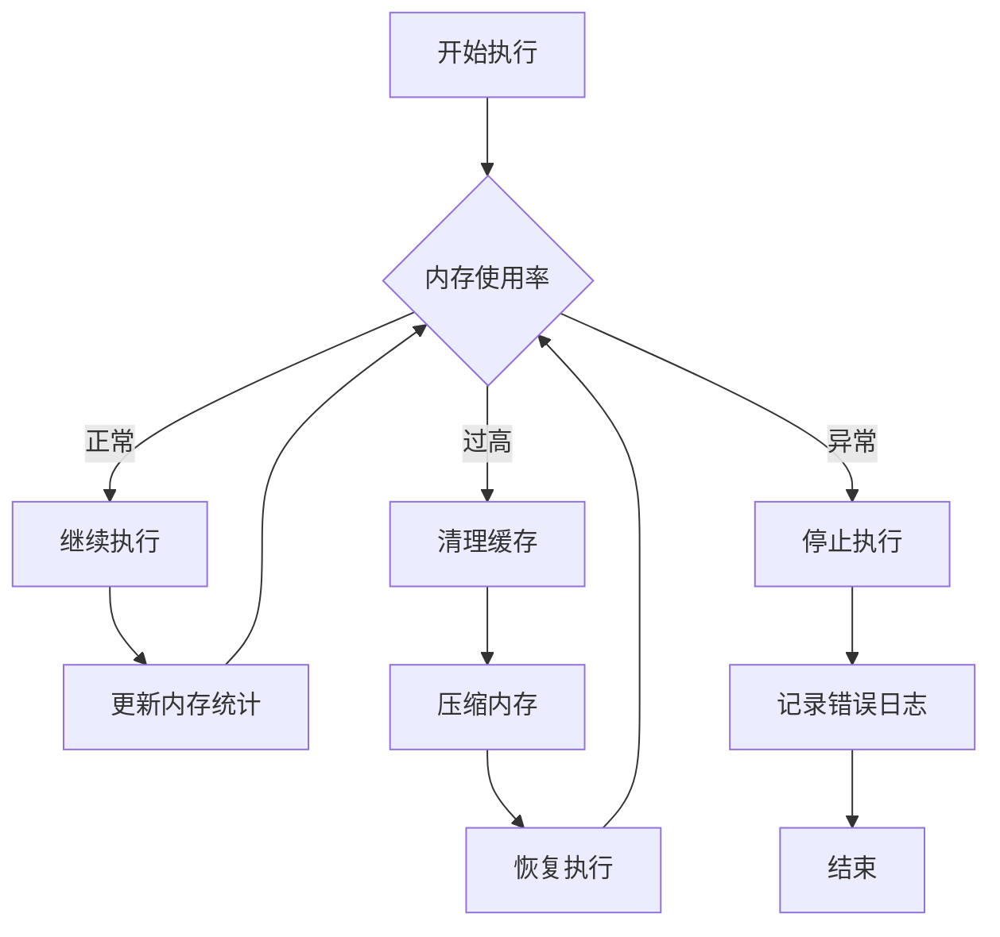

**图表来源**
- [packages/core/src/expert/agent-pool.ts:16](file://packages/core/src/expert/agent-pool.ts#L16)

### 并发控制

系统通过以下机制控制并发执行：

- **工具调用限制**：单次执行最多 8 次工具调用循环
- **工作树并发**：同一项目内的任务串行执行，避免冲突
- **Agent 资源池**：动态 Agent 创建数量限制（默认 10 个）
- **TDD 迭代限制**：每次 TDD 循环最多执行指定次数

**章节来源**
- [packages/core/src/expert/agent-pool.ts:3-16](file://packages/core/src/expert/agent-pool.ts#L3-L16)
- [packages/core/src/expert/tdd-pipeline.ts:9](file://packages/core/src/expert/tdd-pipeline.ts#L9)

## 故障排除指南

### 常见问题诊断

系统提供了完善的错误处理和诊断机制：

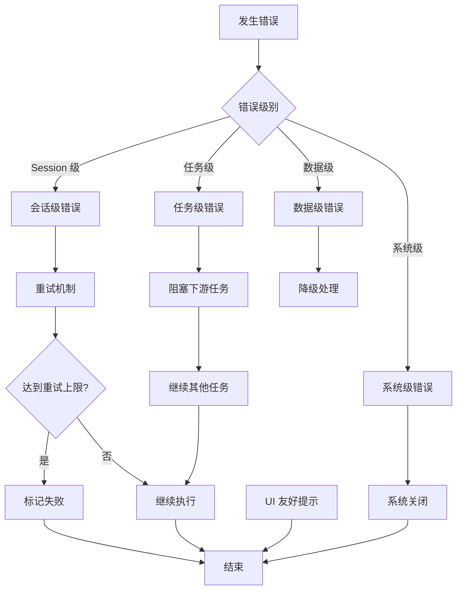

**图表来源**
- [packages/core/src/expert/types.ts:149-169](file://packages/core/src/expert/types.ts#L149-L169)

### 专家会话状态问题

当专家会话状态出现问题时：

1. **检查状态转换**：确认状态转换是否符合有效状态转移规则
2. **验证会话存在性**：使用 `getSession` 方法检查会话是否存在
3. **查看错误日志**：检查 `errors` 字段中的错误信息
4. **重新初始化**：必要时重新创建专家会话

**章节来源**
- [packages/core/src/expert/session-manager.ts:62-87](file://packages/core/src/expert/session-manager.ts#L62-L87)
- [packages/core/src/expert/types.ts:149-169](file://packages/core/src/expert/types.ts#L149-L169)

### 代理池管理问题

当代理池出现问题时：

1. **检查代理原型**：使用 `listPrototypes()` 验证内置专家原型
2. **验证动态代理**：检查 `listDynamicAgents()` 中的动态代理数量
3. **监控活跃代理**：使用 `getSnapshot()` 获取代理池快照
4. **清理过期代理**：使用 `recycleDynamicAgent()` 回收过期代理

**章节来源**
- [packages/core/src/expert/agent-pool.ts:17-34](file://packages/core/src/expert/agent-pool.ts#L17-L34)

### 研究收集问题

当研究收集出现问题时：

1. **检查研究类型**：使用 `getByType()` 按类型过滤研究结果
2. **验证任务关联**：使用 `getByTask()` 检查任务关联的研究
3. **清理研究数据**：使用 `clear()` 清空所有研究结果
4. **重新收集**：重新执行研究收集过程

**章节来源**
- [packages/core/src/expert/research-collector.ts:36-54](file://packages/core/src/expert/research-collector.ts#L36-L54)

## 结论

专家团编排系统代表了 RepoHelm 项目的重要演进，现已完全实现，通过引入动态专家团模式，显著提升了系统的智能化水平和执行效率。

### 主要优势

1. **完整的专家系统实现**：ExpertSessionManager、AgentPool、ExpertOrchestrator、ResearchCollector、TDDPipeline、Migration 等核心组件均已完整实现
2. **智能化编排**：通过 AI 入口 Agent 实现需求理解和任务拆解
3. **灵活的执行策略**：支持多种 Agent 后端和执行模式
4. **完整的生命周期管理**：从需求分析到产物交付的全流程管理
5. **强大的知识管理**：内嵌的知识库系统支持智能检索和推荐
6. **安全可靠的执行**：完善的权限控制和审计机制
7. **完整的API集成**：服务器端和客户端API的完整集成
8. **可靠的状态持久化**：专家会话状态的持久化存储和恢复

### 技术特色

- **模块化设计**：清晰的分层架构和依赖关系
- **高性能执行**：并行处理和资源隔离机制
- **可扩展性**：支持动态 Agent 创建和原型注册
- **可观测性**：完整的事件追踪和审计日志
- **向后兼容**：数据迁移模块确保旧系统数据的平滑过渡

### 未来发展方向

系统目前处于 MVP 阶段，后续发展重点包括：

1. **专家团模式全面替代**：逐步淘汰旧的静态编排模式
2. **增强 AI 能力**：提升入口 Agent 的智能水平
3. **优化用户体验**：改进 UI 交互和可视化展示
4. **扩展集成能力**：支持更多外部工具和服务集成
5. **性能优化**：进一步提升编排执行效率
6. **监控告警**：完善系统监控和告警机制

## 附录

### 快速开始

```bash
# 安装依赖
pnpm install

# 启动开发环境
pnpm dev

# 访问 Web UI
http://localhost:5173/

# 访问 API
http://localhost:4300/
```

### 环境变量配置

| 变量名 | 描述 | 默认值 |
|--------|------|--------|
| REPOHELM_ROOT | 项目根目录 | 当前工作目录 |
| REPOHELM_PORT | API 端口号 | 4300 |
| REPOHELM_STATE_ROOT | 状态存储根目录 | REPOHELM_ROOT |
| REPOHELM_WORKTREE_ROOT | Worktree 根目录 | REPOHELM_ROOT/.repohelm/worktrees |
| REPOHELM_KNOWLEDGE_ROOT | 知识库根目录 | REPOHELM_ROOT/.repohelm/knowledge |
| REPOHELM_CODEX_COMMAND | Codex CLI 命令 | 未设置 |
| REPOHELM_CLAUDE_COMMAND | Claude Code 命令 | 未设置 |
| REPOHELM_OPENCODE_COMMAND | OpenCode 命令 | 未设置 |
| REPOHELM_OPENAI_BASE_URL | OpenAI 兼容 API 基础地址 | 未设置 |
| REPOHELM_OPENAI_MODEL | OpenAI 兼容模型 | 未设置 |
| REPOHELM_OPENAI_API_KEY | OpenAI 兼容 API 密钥 | 未设置 |

### 专家会话API使用示例

```typescript
// 创建专家会话
const session = await api.createExpertSession({
  questId: "project-1",
  requirement: "实现用户认证功能",
  entryAgentId: "supervisor"
});

// 获取会话详情
const sessionDetail = await api.getExpertSession(session.id);

// 更新会话状态
await api.updateExpertSession(session.id, { 
  status: "awaiting_confirmation" 
});

// 确认会话
await api.confirmExpertSession(session.id, {
  skipAcceptanceTests: false
});
```

**章节来源**
- [README.md:33-100](file://README.md#L33-L100)
- [apps/server/src/index.ts:13-41](file://apps/server/src/index.ts#L13-L41)
- [apps/web/src/api.ts:892-907](file://apps/web/src/api.ts#L892-L907)