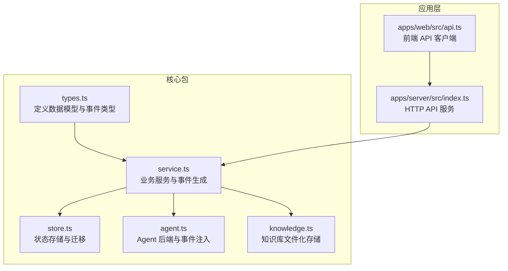
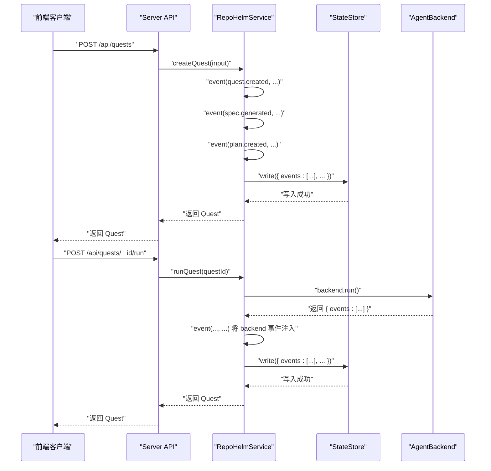
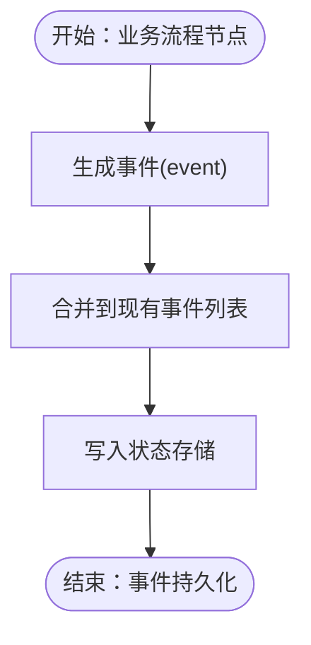
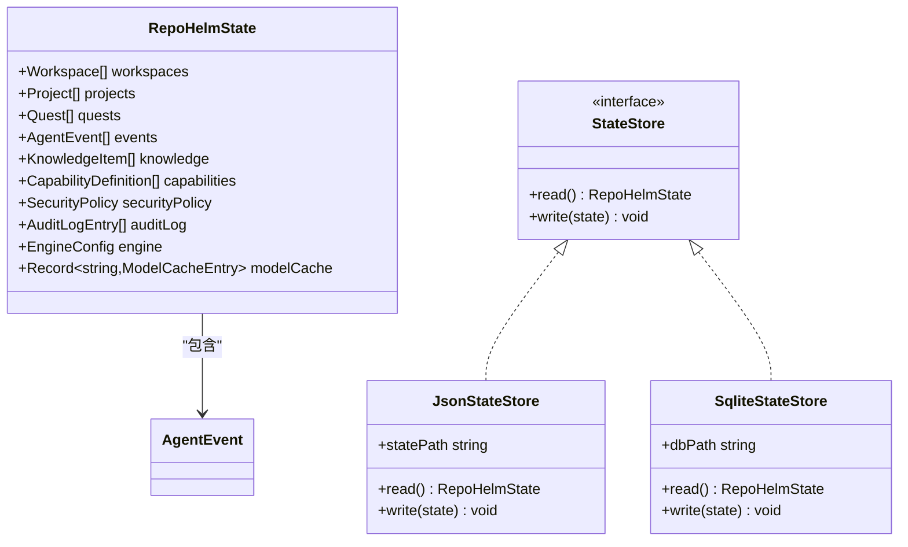
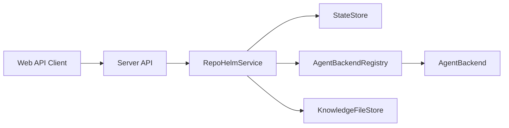

# 事件驱动架构

<cite>
**本文档引用的文件**
- [packages/core/src/types.ts](file://packages/core/src/types.ts)
- [packages/core/src/service.ts](file://packages/core/src/service.ts)
- [packages/core/src/store.ts](file://packages/core/src/store.ts)
- [packages/core/src/agent.ts](file://packages/core/src/agent.ts)
- [packages/core/src/knowledge.ts](file://packages/core/src/knowledge.ts)
- [apps/server/src/index.ts](file://apps/server/src/index.ts)
- [apps/web/src/api.ts](file://apps/web/src/api.ts)
</cite>

## 目录
1. [简介](#简介)
2. [项目结构](#项目结构)
3. [核心组件](#核心组件)
4. [架构总览](#架构总览)
5. [详细组件分析](#详细组件分析)
6. [依赖关系分析](#依赖关系分析)
7. [性能考量](#性能考量)
8. [故障排查指南](#故障排查指南)
9. [结论](#结论)
10. [附录](#附录)

## 简介
本文件系统性阐述 RepoHelm 的事件驱动架构，重点围绕 AgentEvent 的设计与实现、事件类型分类、事件传播与持久化机制展开。文档覆盖事件的生成、存储、查询与监听模式，解释不同事件（如 quest.created、spec.generated、worktree.created 等）的触发条件与处理逻辑，并提供订阅、回调、过滤与聚合的实践指导。同时说明事件与状态管理的集成关系，以及事件在审计日志与知识库中的应用，最后给出性能优化与扩展建议。

## 项目结构
RepoHelm 的事件系统位于核心包 packages/core 中，围绕服务层（RepoHelmService）组织事件生成与传播，状态层（StateStore）负责事件持久化，前端通过 API 层暴露事件相关的查询接口。

图表来源
- [packages/core/src/types.ts:88-97](file://packages/core/src/types.ts#L88-L97)
- [packages/core/src/service.ts:56-71](file://packages/core/src/service.ts#L56-L71)
- [packages/core/src/store.ts:86-115](file://packages/core/src/store.ts#L86-L115)
- [packages/core/src/agent.ts:41-46](file://packages/core/src/agent.ts#L41-L46)
- [packages/core/src/knowledge.ts:12-21](file://packages/core/src/knowledge.ts#L12-L21)
- [apps/server/src/index.ts:37](file://apps/server/src/index.ts#L37)
- [apps/web/src/api.ts:265-274](file://apps/web/src/api.ts#L265-L274)

章节来源
- [packages/core/src/types.ts:88-97](file://packages/core/src/types.ts#L88-L97)
- [packages/core/src/service.ts:56-71](file://packages/core/src/service.ts#L56-L71)
- [packages/core/src/store.ts:86-115](file://packages/core/src/store.ts#L86-L115)
- [apps/server/src/index.ts:37](file://apps/server/src/index.ts#L37)
- [apps/web/src/api.ts:265-274](file://apps/web/src/api.ts#L265-L274)

## 核心组件
- AgentEvent 数据模型：统一事件载体，包含事件标识、所属 Quest、事件类型、标题、详情、触发 Agent 与创建时间。
- RepoHelmService 事件生成器：在关键业务流程中生成事件，如 Quest 创建、Spec 生成、Worktree 创建、Agent 执行、验证与 Review、交付等。
- StateStore 持久化：提供 JSON 与 SQLite 两种存储后端，事件作为状态的一部分被持久化。
- AgentBackend 事件注入：外部 Agent 后端在执行过程中返回事件，由服务层统一转换为 AgentEvent 并持久化。
- AuditLog 与 Knowledge：事件与审计日志、知识库形成互补，支撑可审计与可追溯。

章节来源
- [packages/core/src/types.ts:88-97](file://packages/core/src/types.ts#L88-L97)
- [packages/core/src/service.ts:512-534](file://packages/core/src/service.ts#L512-L534)
- [packages/core/src/store.ts:91-115](file://packages/core/src/store.ts#L91-L115)
- [packages/core/src/agent.ts:30-39](file://packages/core/src/agent.ts#L30-L39)
- [packages/core/src/service.ts:1280-1289](file://packages/core/src/service.ts#L1280-L1289)

## 架构总览
事件驱动架构以 RepoHelmService 为核心，围绕事件生成、传播与持久化形成闭环：
- 事件生成：在业务流程的关键节点调用 event(...) 生成 AgentEvent。
- 事件传播：将新事件与现有事件合并，写入状态存储。
- 事件查询：通过 API 层提供状态查询，前端客户端可拉取事件列表。
- 事件与状态：事件作为 RepoHelmState 的一部分，与 Workspace、Project、Quest、Knowledge、AuditLog 等共同构成完整状态视图。

图表来源
- [packages/core/src/service.ts:512-534](file://packages/core/src/service.ts#L512-L534)
- [packages/core/src/service.ts:673-688](file://packages/core/src/service.ts#L673-L688)
- [packages/core/src/store.ts:111-114](file://packages/core/src/store.ts#L111-L114)
- [packages/core/src/agent.ts:30-39](file://packages/core/src/agent.ts#L30-L39)

## 详细组件分析

### AgentEvent 数据模型与分类
- AgentEvent 字段：id、questId、type、title、detail、agent、createdAt。
- 事件类型分类：
  - Quest 生命周期事件：quest.created、spec.generated、plan.created、agent.completed、validation.completed、review.completed、knowledge.updated、delivery.completed、worktree.created、worktree.cleaned、capability.recommended、capability.accepted、capability.dismissed、security.command.denied。
  - Agent 后端事件：agent.backend.started、agent.backend.completed、agent.backend.failed、agent.backend.blocked、agent.provider.completed、agent.provider.failed、agent.artifacts.standardized、implementation.changed_files。
  - Worktree 事件：worktree.created、worktree.cleaned。
  - 知识库事件：knowledge.retrieved、knowledge.updated。
  - 能力事件：capability.recommended、capability.accepted、capability.dismissed。
  - 审计事件：command、file、network、secrets、capability、sandbox 类型的审计条目。

章节来源
- [packages/core/src/types.ts:88-97](file://packages/core/src/types.ts#L88-L97)
- [packages/core/src/service.ts:512-534](file://packages/core/src/service.ts#L512-L534)
- [packages/core/src/service.ts:673-688](file://packages/core/src/service.ts#L673-L688)
- [packages/core/src/service.ts:1165-1173](file://packages/core/src/service.ts#L1165-L1173)
- [packages/core/src/service.ts:1280-1289](file://packages/core/src/service.ts#L1280-L1289)

### 事件生成与传播机制
- 生成位置：
  - 创建 Quest：生成 quest.created、spec.generated、plan.created、knowledge.retrieved、capability.recommended 等事件。
  - 运行 Quest：生成 worktree.created、agent.completed、validation.completed、review.completed、knowledge.updated 等事件。
  - 交付流程：生成 delivery.completed。
  - 能力推荐：生成 capability.recommended、capability.accepted、capability.dismissed。
  - 安全策略：生成 security.command.denied。
- 传播方式：每次生成事件后，将其与现有事件列表合并，写入状态存储；前端通过 /api/state 获取最新状态，从而获得事件列表。

图表来源
- [packages/core/src/service.ts:512-534](file://packages/core/src/service.ts#L512-L534)
- [packages/core/src/service.ts:673-688](file://packages/core/src/service.ts#L673-L688)
- [packages/core/src/service.ts:863-873](file://packages/core/src/service.ts#L863-L873)
- [packages/core/src/service.ts:1165-1173](file://packages/core/src/service.ts#L1165-L1173)
- [packages/core/src/store.ts:111-114](file://packages/core/src/store.ts#L111-L114)

章节来源
- [packages/core/src/service.ts:512-534](file://packages/core/src/service.ts#L512-L534)
- [packages/core/src/service.ts:673-688](file://packages/core/src/service.ts#L673-L688)
- [packages/core/src/service.ts:863-873](file://packages/core/src/service.ts#L863-L873)
- [packages/core/src/service.ts:1165-1173](file://packages/core/src/service.ts#L1165-L1173)
- [packages/core/src/store.ts:111-114](file://packages/core/src/store.ts#L111-L114)

### 事件存储与查询
- 存储后端：
  - JsonStateStore：基于 JSON 文件的状态存储，适用于开发与小规模使用。
  - SqliteStateStore：基于 SQLite 的状态存储，具备迁移与事务特性，适用于生产环境。
- 状态结构：RepoHelmState 中包含 events 数组，事件随状态一起持久化。
- 查询接口：
  - /api/state：返回完整状态，包含 events。
  - /api/audit-log：返回审计日志，与事件形成互补。
  - /api/workspaces/:id/knowledge：知识库检索，辅助事件上下文。

图表来源
- [packages/core/src/types.ts:279-290](file://packages/core/src/types.ts#L279-L290)
- [packages/core/src/store.ts:86-115](file://packages/core/src/store.ts#L86-L115)
- [packages/core/src/store.ts:117-165](file://packages/core/src/store.ts#L117-L165)

章节来源
- [packages/core/src/store.ts:91-115](file://packages/core/src/store.ts#L91-L115)
- [packages/core/src/store.ts:117-165](file://packages/core/src/store.ts#L117-L165)
- [packages/core/src/types.ts:279-290](file://packages/core/src/types.ts#L279-L290)
- [apps/server/src/index.ts:125-128](file://apps/server/src/index.ts#L125-L128)
- [apps/server/src/index.ts:205-208](file://apps/server/src/index.ts#L205-L208)
- [apps/server/src/index.ts:215-218](file://apps/server/src/index.ts#L215-L218)

### 事件监听与订阅模式
- 事件监听：前端通过 /api/state 定期轮询或一次性拉取，获取最新的事件列表。
- 事件过滤：可在前端对事件进行过滤，例如按 questId、type、agent 等字段筛选。
- 事件聚合：可将同一 Quest 的事件按时间顺序聚合展示，形成完整的事件轨迹。
- 回调与订阅：当前实现为拉取式，若需实时推送，可在 API 层引入 WebSocket 或 Server-Sent Events（SSE）机制。

章节来源
- [apps/web/src/api.ts:291-422](file://apps/web/src/api.ts#L291-L422)
- [apps/server/src/index.ts:125-128](file://apps/server/src/index.ts#L125-L128)

### 事件与状态管理的集成
- 事件作为状态的一部分：RepoHelmState.events 与 workspaces、projects、quests、knowledge、auditLog 等共同组成完整状态。
- 状态一致性：每次事件生成后，立即写入状态存储，保证事件与业务状态的一致性。
- 状态迁移：SqliteStateStore 支持从旧格式迁移，确保事件历史的连续性。

章节来源
- [packages/core/src/types.ts:279-290](file://packages/core/src/types.ts#L279-L290)
- [packages/core/src/store.ts:125-139](file://packages/core/src/store.ts#L125-L139)

### 事件在审计日志与知识库中的应用
- 审计日志：事件与审计日志互补，事件侧重业务过程，审计日志侧重权限与安全控制。
- 知识库：事件可触发知识库更新（如 Quest 记忆），形成可检索的知识资产。

章节来源
- [packages/core/src/service.ts:686-687](file://packages/core/src/service.ts#L686-L687)
- [packages/core/src/service.ts:1280-1289](file://packages/core/src/service.ts#L1280-L1289)
- [packages/core/src/knowledge.ts:12-21](file://packages/core/src/knowledge.ts#L12-L21)

## 依赖关系分析
- RepoHelmService 依赖 StateStore 进行事件持久化，依赖 AgentBackendRegistry 与 AgentBackend 注入事件，依赖 KnowledgeFileStore 生成知识库记忆。
- AgentBackend 返回的事件数组会被统一转换为 AgentEvent 并写入状态。
- Server API 通过 RepoHelmService 提供事件相关的查询接口，前端通过 API 客户端消费事件。

图表来源
- [packages/core/src/service.ts:56-71](file://packages/core/src/service.ts#L56-L71)
- [packages/core/src/agent.ts:395-411](file://packages/core/src/agent.ts#L395-L411)
- [packages/core/src/knowledge.ts:12-21](file://packages/core/src/knowledge.ts#L12-L21)
- [apps/server/src/index.ts:37](file://apps/server/src/index.ts#L37)
- [apps/web/src/api.ts:291-422](file://apps/web/src/api.ts#L291-L422)

章节来源
- [packages/core/src/service.ts:56-71](file://packages/core/src/service.ts#L56-L71)
- [packages/core/src/agent.ts:395-411](file://packages/core/src/agent.ts#L395-L411)
- [apps/server/src/index.ts:37](file://apps/server/src/index.ts#L37)
- [apps/web/src/api.ts:291-422](file://apps/web/src/api.ts#L291-L422)

## 性能考量
- 事件数量增长：随着 Quest 与 Agent 执行次数增加，事件数量可能快速增长。建议：
  - 分页查询：在 /api/state 中限制返回事件数量或提供分页参数。
  - 时间窗口过滤：按 createdAt 过滤近期事件。
  - 压缩与归档：对历史事件进行归档，保留关键事件。
- 存储性能：
  - SQLite 适合中小规模数据，生产环境建议使用 SQLite 并配合 WAL 模式与索引优化。
  - JSON 文件在大体量时存在读写开销，优先使用 SQLite。
- 事件生成成本：
  - 合理控制事件粒度，避免过度细碎事件导致存储与查询压力。
  - 对于高频事件（如 agent.backend.started/failed），可考虑聚合统计而非逐条记录。

[本节为通用性能建议，无需特定文件来源]

## 故障排查指南
- 事件未持久化：
  - 检查 StateStore 写入是否成功，确认数据库文件或 JSON 文件存在且可写。
  - 关注错误日志，定位写入异常。
- 事件缺失或顺序异常：
  - 确认事件生成顺序与写入顺序一致，避免并发写入导致的数据竞争。
  - 核对 createdAt 字段排序，确保前端展示顺序正确。
- 审计日志与事件不一致：
  - 检查审计条目生成逻辑，确保与事件生成点对应。
- Agent 后端事件未注入：
  - 确认 AgentBackend.run 返回的 events 数组非空，服务层 event(...) 调用正常。

章节来源
- [packages/core/src/store.ts:111-114](file://packages/core/src/store.ts#L111-L114)
- [packages/core/src/service.ts:673-688](file://packages/core/src/service.ts#L673-L688)
- [packages/core/src/agent.ts:30-39](file://packages/core/src/agent.ts#L30-L39)

## 结论
RepoHelm 的事件驱动架构以 AgentEvent 为核心，贯穿 Quest 生命周期的各个阶段，形成可审计、可追溯、可查询的事件体系。通过 RepoHelmService 统一生成与传播事件，结合 StateStore 的持久化能力，事件与状态管理紧密耦合。前端通过 API 层获取事件，实现可视化与交互。未来可在实时推送、事件过滤与聚合、性能优化等方面进一步增强。

[本节为总结性内容，无需特定文件来源]

## 附录

### 事件类型与触发条件速查
- quest.created：创建 Quest 时触发，伴随 spec.generated、plan.created。
- spec.generated：生成轻量 Spec 时触发。
- plan.created：推进到规划阶段时触发。
- worktree.created：成功创建 worktree 时触发。
- agent.completed：Agent 后端执行完成时触发。
- validation.completed：验证完成时触发。
- review.completed：Review 完成时触发。
- knowledge.updated：知识库更新时触发。
- delivery.completed：交付准备完成时触发。
- worktree.cleaned：清理 worktree 时触发。
- capability.recommended/accepted/dismissed：能力推荐、接受或忽略时触发。
- security.command.denied：安全策略阻止命令执行时触发。

章节来源
- [packages/core/src/service.ts:512-534](file://packages/core/src/service.ts#L512-L534)
- [packages/core/src/service.ts:673-688](file://packages/core/src/service.ts#L673-L688)
- [packages/core/src/service.ts:863-873](file://packages/core/src/service.ts#L863-L873)
- [packages/core/src/service.ts:1165-1173](file://packages/core/src/service.ts#L1165-L1173)
- [packages/core/src/service.ts:607-615](file://packages/core/src/service.ts#L607-L615)