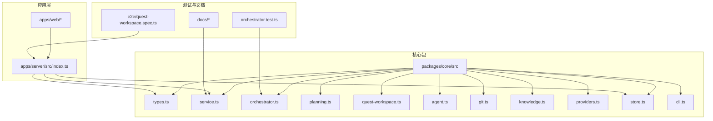
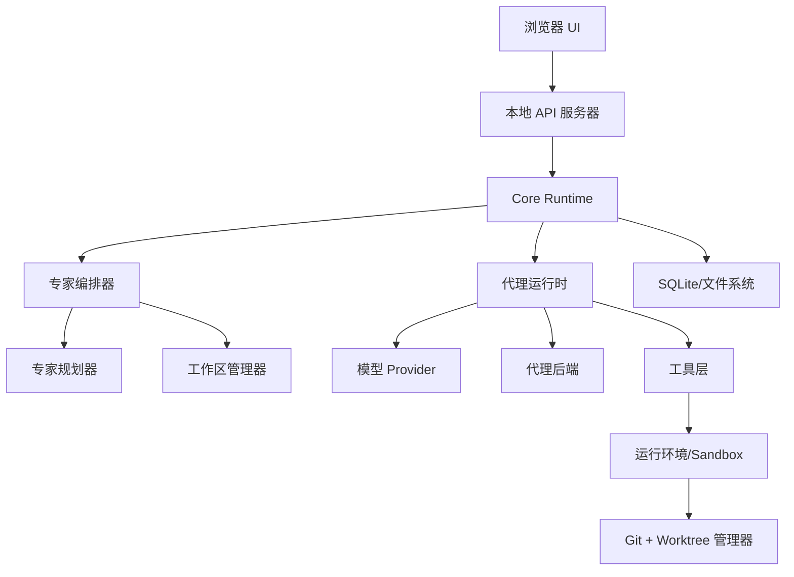
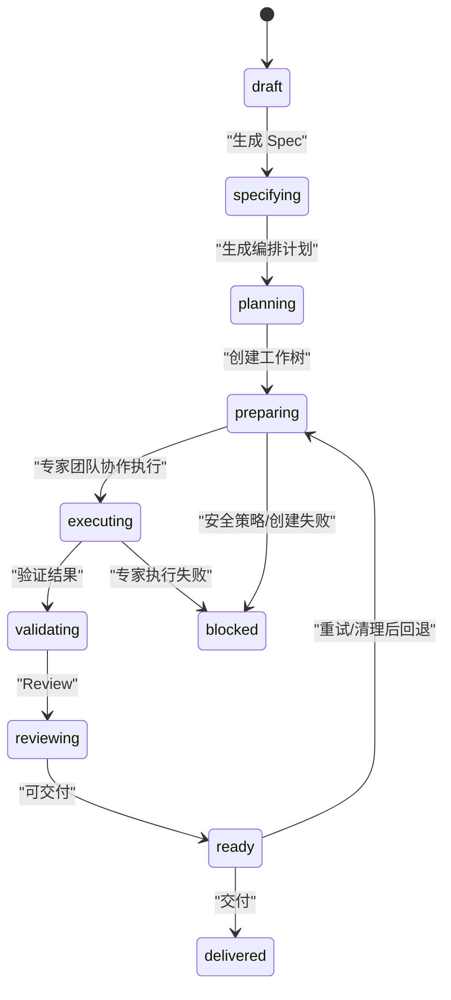
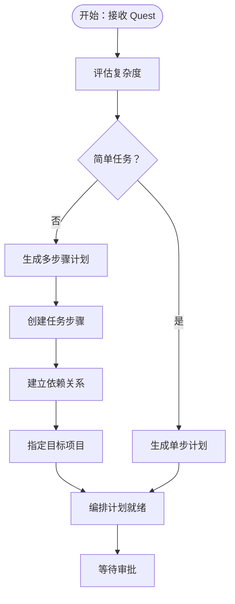
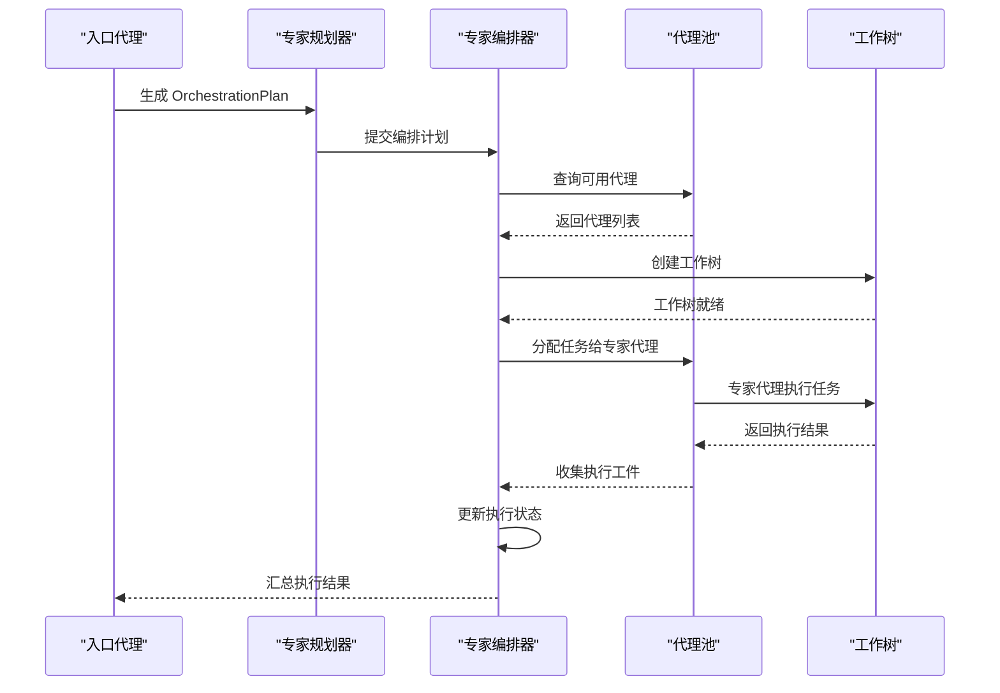
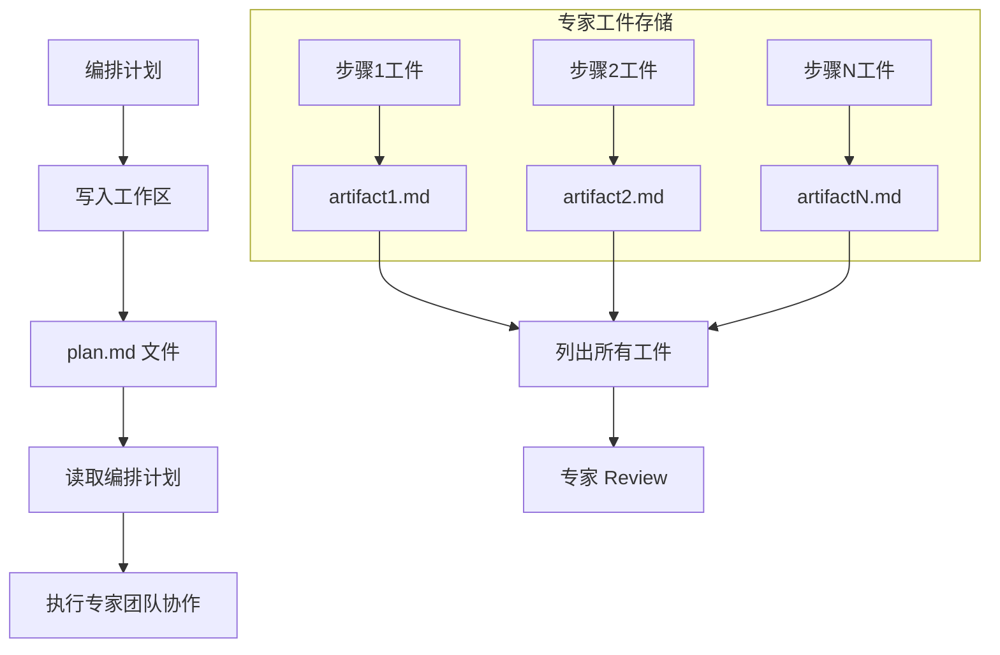
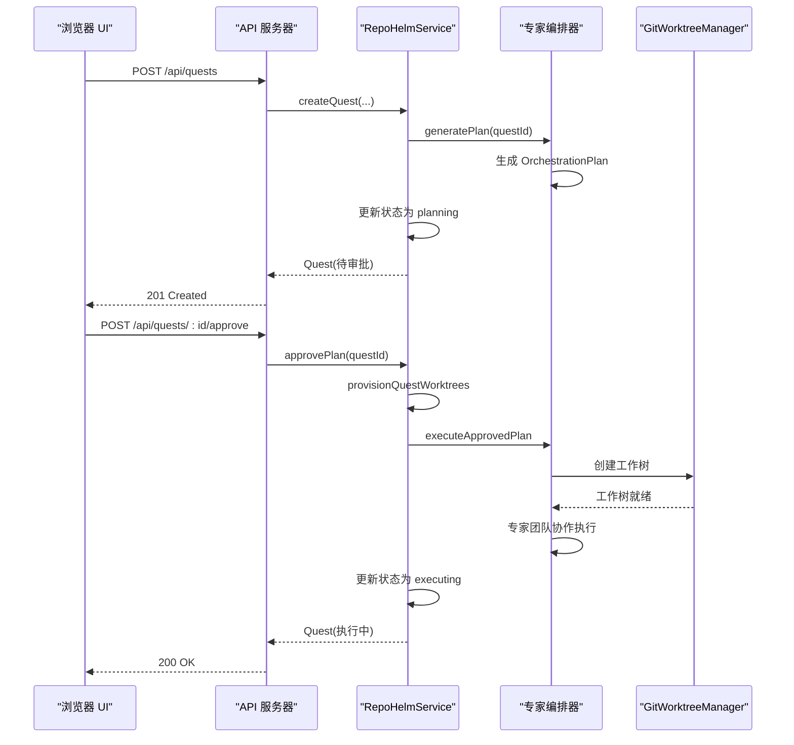
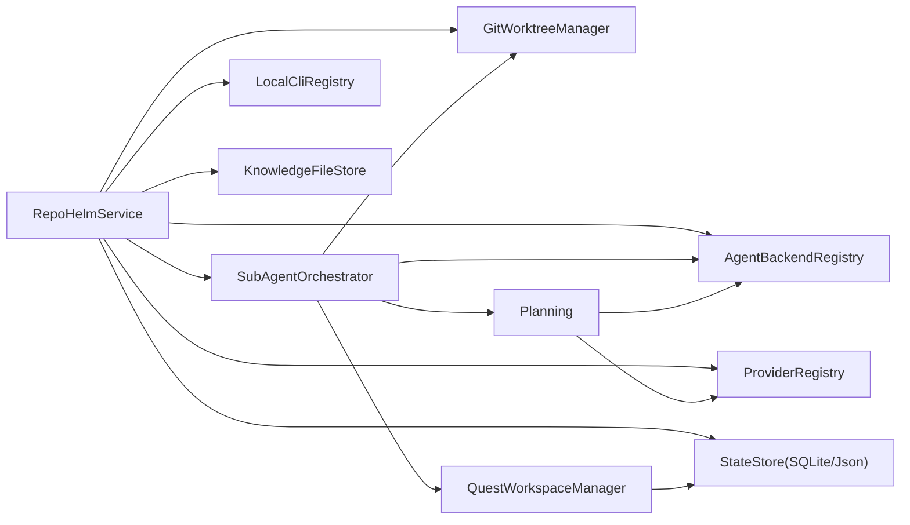

# 任务编排流程

<cite>
**本文引用的文件**
- [packages/core/src/orchestrator.ts](file://packages/core/src/orchestrator.ts)
- [packages/core/src/planning.ts](file://packages/core/src/planning.ts)
- [packages/core/src/quest-workspace.ts](file://packages/core/src/quest-workspace.ts)
- [packages/core/src/service.ts](file://packages/core/src/service.ts)
- [packages/core/src/types.ts](file://packages/core/src/types.ts)
- [packages/core/src/orchestrator.test.ts](file://packages/core/src/orchestrator.test.ts)
- [README.md](file://README.md)
- [架构文档](file://docs/architecture.md)
- [模型接入升级方案](file://docs/model-config-plan.md)
- [packages/core/src/index.ts](file://packages/core/src/index.ts)
- [packages/core/src/agent.ts](file://packages/core/src/agent.ts)
- [packages/core/src/git.ts](file://packages/core/src/git.ts)
- [packages/core/src/knowledge.ts](file://packages/core/src/knowledge.ts)
- [packages/core/src/providers.ts](file://packages/core/src/providers.ts)
- [packages/core/src/store.ts](file://packages/core/src/store.ts)
- [packages/core/src/cli.ts](file://packages/core/src/cli.ts)
- [apps/server/src/index.ts](file://apps/server/src/index.ts)
- [e2e/quest-workspace.spec.ts](file://e2e/quest-workspace.spec.ts)
- [package.json](file://package.json)
</cite>

## 更新摘要
**所做更改**
- 新增专家团模式（Expert Session）概念，替代传统的静态 Plan-then-Execute 流程
- 更新任务状态管理，增加编排计划生成和审批流程
- 重构任务树结构，引入 OrchestrationPlan 和 OrchestrationPlanStep 概念
- 更新代理后端调度机制，支持动态专家团队协作
- 新增工作树工作区管理，支持专家团队的协同工作

## 目录
1. [简介](#简介)
2. [项目结构](#项目结构)
3. [核心组件](#核心组件)
4. [架构总览](#架构总览)
5. [详细组件分析](#详细组件分析)
6. [依赖关系分析](#依赖关系分析)
7. [性能考量](#性能考量)
8. [故障排查指南](#故障排查指南)
9. [结论](#结论)
10. [附录](#附录)

## 简介
本文件系统性阐述 RepoHelm 的 Quest 工作流编排流程，覆盖从需求收集到最终交付的完整生命周期。文档聚焦以下关键主题：
- 专家团模式与动态编排计划生成
- 专家团队协作与代理委托机制
- OrchestrationPlan 任务树结构与依赖管理
- 动态状态转换逻辑（draft/specifying/planning/preparing/executing/validating/reviewing/ready/delivered/blocked/cancelled）
- 并行处理、资源管理与错误恢复策略
- 与外部系统的集成（Git、代理通信、知识库）
- 性能优化与调试技巧

RepoHelm 通过"虚拟 workspace + 多项目 Quest + 专家团编排 + worktree 隔离 + 专家团队协作 + 知识库"的产品方向，验证端到端闭环：创建 workspace → 关联项目 → 创建 Quest → 生成编排计划 → 审批执行 → 专家团队协作 → Review diff → 记录知识 → 交付。

**章节来源**
- [README.md:1-100](file://README.md#L1-L100)
- [架构文档:1-1262](file://docs/architecture.md#L1-L1262)

## 项目结构
RepoHelm 采用多包（monorepo）组织，核心位于 packages/core，提供领域模型、服务编排、Git 工作树、知识库、Provider/CLI 注册表、状态存储等能力；apps/server 提供本地 API 服务；apps/web 为前端 UI；e2e 提供端到端测试。

**图表来源**
- [packages/core/src/index.ts:1-9](file://packages/core/src/index.ts#L1-L9)
- [apps/server/src/index.ts:1-366](file://apps/server/src/index.ts#L1-L366)

**章节来源**
- [package.json:1-21](file://package.json#L1-L21)
- [packages/core/src/index.ts:1-9](file://packages/core/src/index.ts#L1-L9)

## 核心组件
- 专家编排器（SubAgentOrchestrator）：实现专家团模式的动态编排，负责生成 OrchestrationPlan、执行专家团队协作、管理代理委托和工作树。
- 专家规划器（Planning）：基于 Quest 复杂度评估生成 OrchestrationPlan，支持简单任务的快速路径和复杂任务的专家团队协作。
- 工作区管理器（QuestWorkspaceManager）：管理专家团队的工作区，包括编排计划的持久化、专家输出工件的存储。
- 服务编排器（RepoHelmService）：统一编排 Quest 生命周期，集成专家编排器，处理状态转换和工作流协调。
- 代理后端注册表：抽象多种代理后端（内置 mock、Codex CLI、Claude Code、OpenCode、OpenAI 兼容 Provider），统一可用性检测与执行。
- Git 工作树管理器：创建/删除 worktree、列出分支、检查仓库健康、运行验证命令、提交变更、创建 PR。
- 知识库文件存储：将知识项写入 Markdown 文件，配合 SQLite 元数据持久化。
- Provider/CLI 注册表：统一模型提供商与本地 CLI 的探测、模型枚举、连通性测试。
- 状态存储：SQLite/JSON 双态存储，支持迁移与缓存。

**章节来源**
- [packages/core/src/orchestrator.ts:58-94](file://packages/core/src/orchestrator.ts#L58-L94)
- [packages/core/src/planning.ts:74-105](file://packages/core/src/planning.ts#L74-L105)
- [packages/core/src/quest-workspace.ts:5-60](file://packages/core/src/quest-workspace.ts#L5-L60)
- [packages/core/src/service.ts:79-105](file://packages/core/src/service.ts#L79-L105)
- [packages/core/src/agent.ts:395-411](file://packages/core/src/agent.ts#L395-L411)
- [packages/core/src/git.ts:33-120](file://packages/core/src/git.ts#L33-L120)
- [packages/core/src/knowledge.ts:12-68](file://packages/core/src/knowledge.ts#L12-L68)
- [packages/core/src/providers.ts:163-303](file://packages/core/src/providers.ts#L163-L303)
- [packages/core/src/cli.ts:112-202](file://packages/core/src/cli.ts#L112-L202)
- [packages/core/src/store.ts:91-165](file://packages/core/src/store.ts#L91-L165)

## 架构总览
RepoHelm 的系统架构围绕"本地优先"的三层进程模型：浏览器 UI → 本地 API Server → Core Runtime。Core Runtime 内部组合专家编排器、Git/Worktree、本地项目、SQLite/知识库文件系统。

**图表来源**
- [架构文档:621-760](file://docs/architecture.md#L621-L760)

**章节来源**
- [架构文档:276-500](file://docs/architecture.md#L276-L500)

## 详细组件分析

### 1) 专家团模式与动态编排
RepoHelm 引入专家团模式，替代传统的静态 Plan-then-Execute 流程。专家编排器负责：

- **编排计划生成**：根据 Quest 复杂度评估，生成 OrchestrationPlan，包含多个步骤和依赖关系。
- **专家团队协作**：动态分配任务给合适的专家代理，支持并行执行和依赖管理。
- **工作树隔离**：为每个专家团队成员提供独立的工作树环境，确保任务隔离。

**图表来源**
- [packages/core/src/orchestrator.ts:52-57](file://packages/core/src/orchestrator.ts#L52-L57)
- [packages/core/src/types.ts:1-12](file://packages/core/src/types.ts#L1-L12)

**章节来源**
- [packages/core/src/orchestrator.ts:58-94](file://packages/core/src/orchestrator.ts#L58-L94)
- [packages/core/src/service.ts:1630-1676](file://packages/core/src/service.ts#L1630-L1676)

### 2) OrchestrationPlan 任务树结构
专家团模式的核心是 OrchestrationPlan 任务树结构，包含以下关键元素：

- **任务步骤（steps）**：每个步骤包含唯一 ID、描述、执行代理、依赖关系和预期输出。
- **依赖管理**：支持复杂的依赖关系，确保步骤按正确顺序执行。
- **项目目标**：每个步骤可以指定目标项目，确保任务在正确的项目工作树中执行。

**图表来源**
- [packages/core/src/planning.ts:14-36](file://packages/core/src/planning.ts#L14-L36)
- [packages/core/src/planning.ts:85-105](file://packages/core/src/planning.ts#L85-L105)

**章节来源**
- [packages/core/src/types.ts:90-96](file://packages/core/src/types.ts#L90-L96)
- [packages/core/src/planning.ts:171-195](file://packages/core/src/planning.ts#L171-L195)

### 3) 专家团队协作机制
专家编排器实现动态专家团队协作，包括：

- **代理池管理**：维护可用专家代理列表，排除入口代理。
- **任务分发**：根据任务要求和代理能力，智能分配最适合的专家执行任务。
- **执行监控**：跟踪每个步骤的执行状态，收集执行结果和工件。
- **错误处理**：处理代理执行失败，提供详细的错误报告和重试机制。

**图表来源**
- [packages/core/src/orchestrator.ts:131-236](file://packages/core/src/orchestrator.ts#L131-L236)
- [packages/core/src/service.ts:1688-1702](file://packages/core/src/service.ts#L1688-L1702)

**章节来源**
- [packages/core/src/orchestrator.ts:238-241](file://packages/core/src/orchestrator.ts#L238-L241)
- [packages/core/src/orchestrator.ts:243-341](file://packages/core/src/orchestrator.ts#L243-L341)

### 4) 工作区管理与工件存储
工作区管理器负责专家团队的协同工作，包括：

- **编排计划持久化**：将生成的 OrchestrationPlan 保存为 Markdown 文件，便于审查和审计。
- **专家工件存储**：为每个专家代理的执行结果创建独立的工件文件，支持历史追踪。
- **工作区隔离**：为每个专家团队成员提供独立的工作区，确保任务隔离和安全性。

**图表来源**
- [packages/core/src/quest-workspace.ts:18-34](file://packages/core/src/quest-workspace.ts#L18-L34)
- [packages/core/src/quest-workspace.ts:36-59](file://packages/core/src/quest-workspace.ts#L36-L59)

**章节来源**
- [packages/core/src/quest-workspace.ts:62-120](file://packages/core/src/quest-workspace.ts#L62-L120)
- [packages/core/src/orchestrator.test.ts:42-126](file://packages/core/src/orchestrator.test.ts#L42-L126)

### 5) 动态状态转换逻辑
专家团模式下的状态转换更加复杂，包含编排计划生成和审批流程：

- **planning**：生成 OrchestrationPlan 并等待审批。
- **preparing**：创建工作树环境，准备专家团队协作。
- **executing**：专家团队协作执行任务，跟踪每个步骤的进展。
- **validating/reviewing**：验证执行结果，生成 Review 报告。
- **ready**：可交付状态，等待最终交付。
- **delivered**：执行交付流程。

**章节来源**
- [packages/core/src/service.ts:1630-1676](file://packages/core/src/service.ts#L1630-L1676)
- [packages/core/src/service.ts:1678-1702](file://packages/core/src/service.ts#L1678-L1702)
- [packages/core/src/service.ts:1874-1994](file://packages/core/src/service.ts#L1874-L1994)

### 6) 并行处理、资源管理与错误恢复
专家团模式支持高级的并行处理和资源管理：

- **并行执行**：多个专家代理可以并行执行不同的任务步骤。
- **资源隔离**：每个专家代理在独立的工作树环境中执行，确保资源隔离。
- **错误恢复**：支持部分失败的场景，记录失败详情并提供重试机制。
- **依赖管理**：自动处理步骤间的依赖关系，确保正确的执行顺序。

**章节来源**
- [packages/core/src/orchestrator.ts:148-219](file://packages/core/src/orchestrator.ts#L148-L219)
- [packages/core/src/orchestrator.ts:348-381](file://packages/core/src/orchestrator.ts#L348-L381)

### 7) 与外部系统的集成
专家团模式下的外部系统集成更加丰富：

- **Git 操作**：为每个专家代理创建独立的工作树，支持并行开发和隔离。
- **代理通信**：通过标准输入 JSON（.repohelm/agent-input.json）传递 Quest 信息；外部 CLI/Provider 在工作树中执行。
- **知识库交互**：将专家团队的执行经验和学习成果写入知识库，支持后续检索和复用。
- **模型集成**：支持 BYOK 和 CLI 两种模型后端，满足不同专家代理的需求。

**章节来源**
- [packages/core/src/git.ts:33-120](file://packages/core/src/git.ts#L33-L120)
- [packages/core/src/agent.ts:413-431](file://packages/core/src/agent.ts#L413-L431)
- [packages/core/src/knowledge.ts:12-68](file://packages/core/src/knowledge.ts#L12-L68)

### 8) API 与 UI 工作流示例
专家团模式下的 API 工作流更加复杂：

- **创建 Quest**：通过 API POST /api/quests，触发专家编排器生成编排计划。
- **审批流程**：专家编排器生成的计划需要用户审批，审批后才开始执行。
- **监控进度**：通过 /api/state 获取状态，查看编排计划、执行进度、专家工件。
- **处理异常**：支持部分步骤失败的场景，提供详细的错误报告和重试机制。

**图表来源**
- [apps/server/src/index.ts:317-341](file://apps/server/src/index.ts#L317-L341)
- [packages/core/src/service.ts:1630-1702](file://packages/core/src/service.ts#L1630-L1702)
- [packages/core/src/git.ts:159-249](file://packages/core/src/git.ts#L159-L249)

**章节来源**
- [apps/server/src/index.ts:317-341](file://apps/server/src/index.ts#L317-L341)
- [e2e/quest-workspace.spec.ts:130-197](file://e2e/quest-workspace.spec.ts#L130-L197)

## 依赖关系分析
专家团模式下的依赖关系更加复杂：

- **专家编排器**依赖于专家规划器、工作区管理器、Git 工作树管理器、代理后端注册表。
- **专家规划器**依赖于代理后端接口和 Quest 复杂度评估。
- **工作区管理器**负责编排计划和专家工件的持久化。
- **服务编排器**作为中枢，协调专家编排器、Git、Provider/CLI、存储与 UI。

**图表来源**
- [packages/core/src/service.ts:79-105](file://packages/core/src/service.ts#L79-L105)
- [packages/core/src/orchestrator.ts:58-65](file://packages/core/src/orchestrator.ts#L58-L65)
- [packages/core/src/planning.ts:74-105](file://packages/core/src/planning.ts#L74-L105)
- [packages/core/src/quest-workspace.ts:5-16](file://packages/core/src/quest-workspace.ts#L5-L16)

**章节来源**
- [packages/core/src/service.ts:79-105](file://packages/core/src/service.ts#L79-L105)

## 性能考量
专家团模式下的性能优化策略：

- **编排计划缓存**：对简单的 Quest 直接生成单步计划，避免不必要的 LLM 调用。
- **并行执行优化**：多个专家代理可以并行执行，缩短整体执行时间。
- **工作树隔离**：为每个专家代理提供独立的工作树，避免资源竞争。
- **工件存储优化**：专家工件按步骤和代理分类存储，便于快速检索和审计。
- **模型后端选择**：根据任务复杂度选择合适的模型后端（BYOK vs CLI）。

**章节来源**
- [packages/core/src/planning.ts:77-81](file://packages/core/src/planning.ts#L77-L81)
- [packages/core/src/orchestrator.ts:348-381](file://packages/core/src/orchestrator.ts#L348-L381)
- [packages/core/src/quest-workspace.ts:36-59](file://packages/core/src/quest-workspace.ts#L36-L59)

## 故障排查指南
专家团模式下的故障排查：

- **编排计划生成失败**：检查入口代理配置和模型后端可用性。
- **专家代理执行失败**：查看专家工件中的错误信息，检查代理能力和权限。
- **工作树创建失败**：确认项目路径、Git 仓库状态和工作树根目录权限。
- **依赖关系冲突**：检查 OrchestrationPlan 中的步骤依赖关系是否正确。
- **模型后端问题**：验证 BYOK 模型配置或 CLI 后端环境变量设置。

**章节来源**
- [packages/core/src/orchestrator.ts:158-168](file://packages/core/src/orchestrator.ts#L158-L168)
- [packages/core/src/orchestrator.ts:402-505](file://packages/core/src/orchestrator.ts#L402-L505)
- [packages/core/src/service.ts:1709-1771](file://packages/core/src/service.ts#L1709-L1771)
- [packages/core/src/planning.ts:107-169](file://packages/core/src/planning.ts#L107-L169)

## 结论
RepoHelm 通过引入专家团模式，实现了从静态 Plan-then-Execute 到动态专家协作的重大转变。专家编排器、OrchestrationPlan 任务树结构和工作区管理器共同构建了灵活、可扩展的专家团队协作框架。服务编排器作为中枢，串联专家编排器、Git、Provider/CLI、存储与 UI，形成完整的专家团工作流体系。建议在生产环境中进一步完善专家代理能力评估、动态负载均衡和自动化交付能力。

## 附录
- **端到端测试覆盖**：从 UI 创建 Quest、生成专家编排计划、专家团队协作执行、专家工件存储、专家 Review、交付、清理、安全审计与产品就绪度。
- **专家团模式特性**：支持复杂任务的专家团队协作、动态代理调度、工作树隔离、编排计划持久化和专家工件审计。
- **模型接入升级**：将"大模型接入"升级为"专家编排模式"，支持 BYOK 和 CLI 两种子模式，打通专家代理配置与持久化。

**章节来源**
- [e2e/quest-workspace.spec.ts:1-198](file://e2e/quest-workspace.spec.ts#L1-L198)
- [模型接入升级方案:1-88](file://docs/model-config-plan.md#L1-L88)
- [packages/core/src/orchestrator.test.ts:128-179](file://packages/core/src/orchestrator.test.ts#L128-L179)