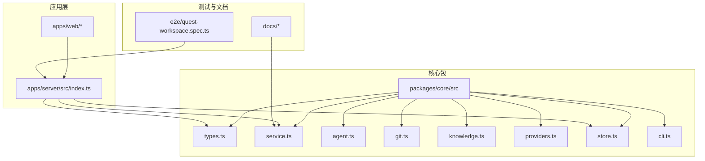
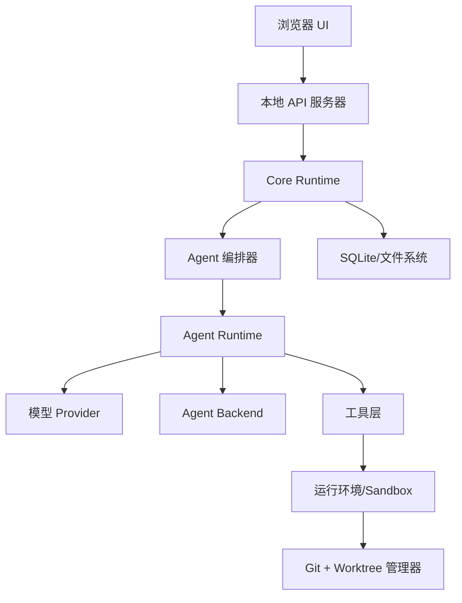
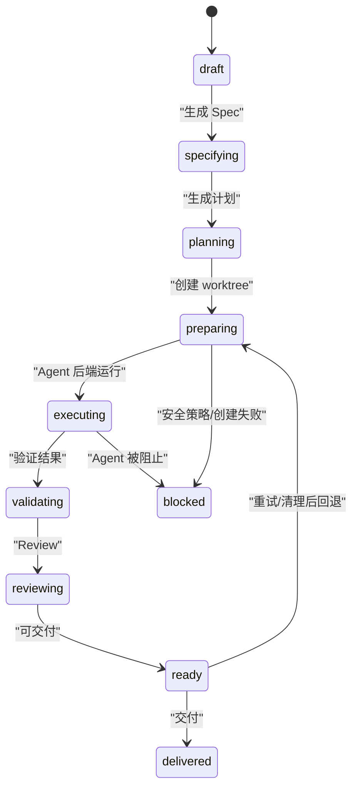
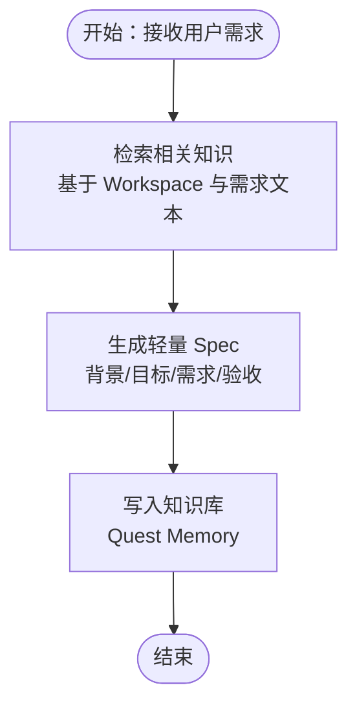
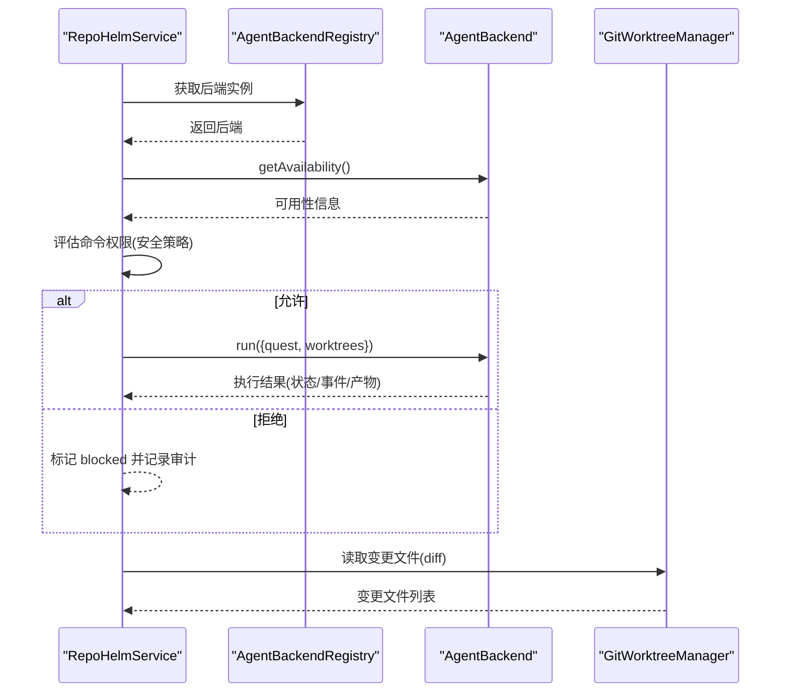
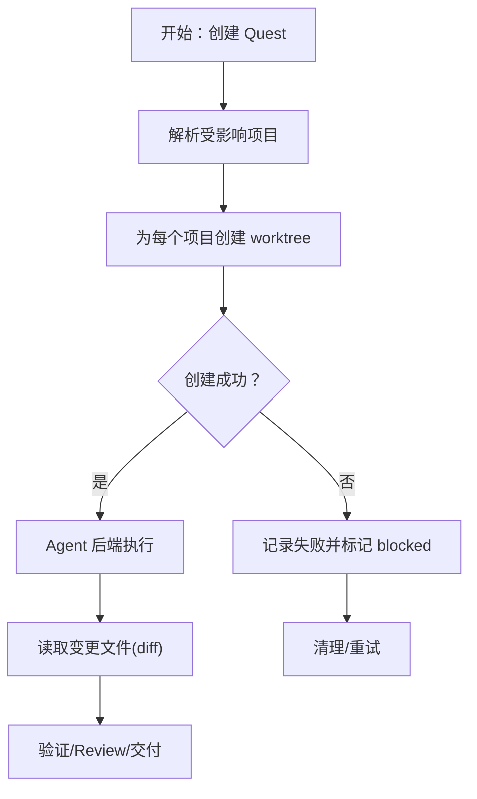
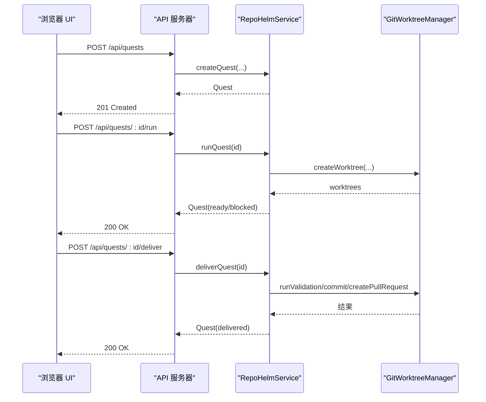
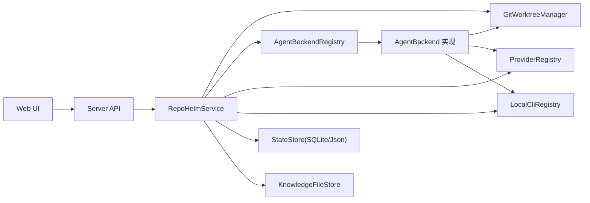

# 任务编排流程

<cite>
**本文引用的文件**
- [README.md](file://README.md)
- [架构文档](file://docs/architecture.md)
- [模型接入升级方案](file://docs/model-config-plan.md)
- [packages/core/src/index.ts](file://packages/core/src/index.ts)
- [packages/core/src/service.ts](file://packages/core/src/service.ts)
- [packages/core/src/types.ts](file://packages/core/src/types.ts)
- [packages/core/src/agent.ts](file://packages/core/src/agent.ts)
- [packages/core/src/git.ts](file://packages/core/src/git.ts)
- [packages/core/src/knowledge.ts](file://packages/core/src/knowledge.ts)
- [packages/core/src/providers.ts](file://packages/core/src/providers.ts)
- [packages/core/src/store.ts](file://packages/core/src/store.ts)
- [packages/core/src/cli.ts](file://packages/core/src/cli.ts)
- [apps/server/src/index.ts](file://apps/server/src/index.ts)
- [e2e/quest-workspace.spec.ts](file://e2e/quest-workspace.spec.ts)
- [package.json](file://package.json)
</cite>

## 目录
1. [简介](#简介)
2. [项目结构](#项目结构)
3. [核心组件](#核心组件)
4. [架构总览](#架构总览)
5. [详细组件分析](#详细组件分析)
6. [依赖关系分析](#依赖关系分析)
7. [性能考量](#性能考量)
8. [故障排查指南](#故障排查指南)
9. [结论](#结论)
10. [附录](#附录)

## 简介
本文件系统性阐述 RepoHelm 的 Quest 工作流编排流程，覆盖从需求收集到最终交付的完整生命周期。文档聚焦以下关键主题：
- Spec 生成算法与知识库检索
- Agent 后端调度与权限控制
- 工作树（worktree）创建与管理
- 任务状态转换逻辑（draft/specifying/planning/preparing/executing/validating/reviewing/ready/delivered/blocked/cancelled）
- 并行处理、资源管理与错误恢复策略
- 与外部系统的集成（Git、Agent 通信、知识库）
- 性能优化与调试技巧

RepoHelm 通过“虚拟 workspace + 多项目 Quest + Spec 驱动 + worktree 隔离 + Agent 编排 + 知识库”的产品方向，验证端到端闭环：创建 workspace → 关联项目 → 创建 Quest → 生成 Spec → 创建 worktree → 运行 Agent → Review diff → 记录知识 → 交付。

章节来源
- [README.md:1-100](file://README.md#L1-L100)
- [架构文档:1-1262](file://docs/architecture.md#L1-L1262)

## 项目结构
RepoHelm 采用多包（monorepo）组织，核心位于 packages/core，提供领域模型、服务编排、Git 工作树、知识库、Provider/CLI 注册表、状态存储等能力；apps/server 提供本地 API 服务；apps/web 为前端 UI；e2e 提供端到端测试。

图表来源
- [packages/core/src/index.ts:1-9](file://packages/core/src/index.ts#L1-L9)
- [apps/server/src/index.ts:1-366](file://apps/server/src/index.ts#L1-L366)

章节来源
- [package.json:1-21](file://package.json#L1-L21)
- [packages/core/src/index.ts:1-9](file://packages/core/src/index.ts#L1-L9)

## 核心组件
- 服务编排器（RepoHelmService）：统一编排 Quest 生命周期，负责创建/更新 Workspace、Project、Quest；生成 Spec；创建/清理 worktree；调度 Agent 后端；执行验证与交付；写入知识库与审计日志。
- Agent 后端注册表：抽象多种 Agent 后端（内置 mock、Codex CLI、Claude Code、OpenCode、OpenAI 兼容 Provider），统一可用性检测与执行。
- Git 工作树管理器：创建/删除 worktree、列出分支、检查仓库健康、运行验证命令、提交变更、创建 PR。
- 知识库文件存储：将知识项写入 Markdown 文件，配合 SQLite 元数据持久化。
- Provider/CLI 注册表：统一模型提供商与本地 CLI 的探测、模型枚举、连通性测试。
- 状态存储：SQLite/JSON 双态存储，支持迁移与缓存。

章节来源
- [packages/core/src/service.ts:56-133](file://packages/core/src/service.ts#L56-L133)
- [packages/core/src/agent.ts:395-411](file://packages/core/src/agent.ts#L395-L411)
- [packages/core/src/git.ts:33-120](file://packages/core/src/git.ts#L33-L120)
- [packages/core/src/knowledge.ts:12-68](file://packages/core/src/knowledge.ts#L12-L68)
- [packages/core/src/providers.ts:163-303](file://packages/core/src/providers.ts#L163-L303)
- [packages/core/src/cli.ts:112-202](file://packages/core/src/cli.ts#L112-L202)
- [packages/core/src/store.ts:91-165](file://packages/core/src/store.ts#L91-L165)

## 架构总览
RepoHelm 的系统架构围绕“本地优先”的三层进程模型：浏览器 UI → 本地 API Server → Core Runtime。Core Runtime 内部组合 Agent 编排器、Git/Worktree、本地项目、SQLite/知识库文件系统。

图表来源
- [架构文档:621-760](file://docs/architecture.md#L621-L760)

章节来源
- [架构文档:276-500](file://docs/architecture.md#L276-L500)

## 详细组件分析

### 1) 任务状态与生命周期
RepoHelm 的 Quest 状态集合覆盖 draft/specifying/planning/preparing/executing/validating/reviewing/ready/delivered/blocked/cancelled。状态转换由服务编排器驱动，结合 Agent 后端执行结果、Git 工作树创建结果与安全策略评估。

图表来源
- [packages/core/src/types.ts:1-12](file://packages/core/src/types.ts#L1-L12)
- [架构文档:216-225](file://docs/architecture.md#L216-L225)

章节来源
- [packages/core/src/types.ts:1-12](file://packages/core/src/types.ts#L1-L12)
- [packages/core/src/service.ts:544-698](file://packages/core/src/service.ts#L544-L698)

### 2) Spec 生成算法与知识库检索
- 需求 → 相关知识检索：基于 Workspace 与需求文本进行知识库检索，选取 Top-K 相关条目。
- Spec 生成：依据需求与检索到的知识，生成轻量 Spec，包含背景、目标、功能/非功能需求、影响面、验收标准、开放问题等。
- 知识沉淀：将 Quest 执行过程中的记忆写入知识库文件系统，便于后续检索与复用。

图表来源
- [packages/core/src/service.ts:478-542](file://packages/core/src/service.ts#L478-L542)
- [packages/core/src/knowledge.ts:12-68](file://packages/core/src/knowledge.ts#L12-L68)

章节来源
- [packages/core/src/service.ts:478-542](file://packages/core/src/service.ts#L478-L542)
- [packages/core/src/knowledge.ts:12-68](file://packages/core/src/knowledge.ts#L12-L68)

### 3) Agent 后端调度与权限控制
- 后端注册表：内置 mock 与多种外部后端（Codex CLI、Claude Code、OpenCode、OpenAI 兼容 Provider）。统一可用性检测与执行。
- 权限控制：在运行前评估命令权限（基于安全策略），若被拒绝则标记 blocked 并记录审计日志。
- 执行结果：聚合各 worktree 的 stdout/stderr/退出码与 diff，标准化为事件流，供 UI 展示与审计。

图表来源
- [packages/core/src/service.ts:589-615](file://packages/core/src/service.ts#L589-L615)
- [packages/core/src/agent.ts:395-411](file://packages/core/src/agent.ts#L395-L411)
- [packages/core/src/git.ts:122-140](file://packages/core/src/git.ts#L122-L140)

章节来源
- [packages/core/src/agent.ts:48-115](file://packages/core/src/agent.ts#L48-L115)
- [packages/core/src/agent.ts:117-259](file://packages/core/src/agent.ts#L117-L259)
- [packages/core/src/agent.ts:261-393](file://packages/core/src/agent.ts#L261-L393)
- [packages/core/src/service.ts:589-615](file://packages/core/src/service.ts#L589-L615)

### 4) 工作树创建与管理
- 创建：为每个受影响项目创建独立 worktree，分支名基于 Quest 与项目名派生，支持指定基分支。
- 健康检查：检测路径是否存在、是否为 Git 仓库、当前分支与默认分支一致性。
- 清理：删除 worktree 与对应分支，支持批量清理。
- 验证与交付：在 worktree 内运行项目配置的验证命令，提交变更并生成 PR（可选）。

图表来源
- [packages/core/src/service.ts:555-586](file://packages/core/src/service.ts#L555-L586)
- [packages/core/src/git.ts:79-120](file://packages/core/src/git.ts#L79-L120)
- [packages/core/src/git.ts:142-157](file://packages/core/src/git.ts#L142-L157)
- [packages/core/src/git.ts:159-249](file://packages/core/src/git.ts#L159-L249)

章节来源
- [packages/core/src/service.ts:555-586](file://packages/core/src/service.ts#L555-L586)
- [packages/core/src/git.ts:79-120](file://packages/core/src/git.ts#L79-L120)
- [packages/core/src/git.ts:142-157](file://packages/core/src/git.ts#L142-L157)
- [packages/core/src/git.ts:159-249](file://packages/core/src/git.ts#L159-L249)

### 5) 任务状态转换逻辑详解
- planning：创建 Quest 时进入，生成 Spec 与计划事件。
- preparing：创建 worktree 成功后进入；若全部失败则 blocked。
- executing：Agent 后端运行，根据结果标记 completed/completed/failed/block。
- validating/reviewing：生成验证与 Review 结果，推动进入 ready。
- ready：可交付状态；若执行失败或被阻止则停留在 blocked。
- delivered：执行交付流程（验证、提交、PR）。

章节来源
- [packages/core/src/service.ts:512-541](file://packages/core/src/service.ts#L512-L541)
- [packages/core/src/service.ts:624-655](file://packages/core/src/service.ts#L624-L655)
- [packages/core/src/service.ts:762-760](file://packages/core/src/service.ts#L762-L760)

### 6) 并行处理、资源管理与错误恢复
- 并行：为每个受影响项目并行创建 worktree；并行运行 Agent 后端（外部 CLI/Provider）。
- 资源管理：限制单次执行超时（Agent/验证命令），避免长时间阻塞；清理失败 worktree。
- 错误恢复：清理后重试；若部分项目失败，记录失败原因并提示修复；blocked 状态需人工干预。

章节来源
- [packages/core/src/service.ts:557-586](file://packages/core/src/service.ts#L557-L586)
- [packages/core/src/agent.ts:223-249](file://packages/core/src/agent.ts#L223-L249)
- [packages/core/src/git.ts:159-187](file://packages/core/src/git.ts#L159-L187)

### 7) 与外部系统的集成
- Git 操作：创建/删除 worktree、列出分支、运行验证命令、提交变更、创建 PR。
- Agent 通信：通过标准输入 JSON（.repohelm/agent-input.json）传递 Quest 信息；外部 CLI/Provider 在 worktree 中执行并输出 stdout/stderr/退出码。
- 知识库交互：将知识项写入 Markdown 文件，支持检索与回放。

章节来源
- [packages/core/src/git.ts:33-120](file://packages/core/src/git.ts#L33-L120)
- [packages/core/src/agent.ts:413-431](file://packages/core/src/agent.ts#L413-L431)
- [packages/core/src/knowledge.ts:12-68](file://packages/core/src/knowledge.ts#L12-L68)

### 8) API 与 UI 工作流示例
- 创建 Quest：通过 API POST /api/quests，随后 POST /api/quests/:id/run 触发执行。
- 监控进度：通过 /api/state 获取状态，查看 events、worktrees、changedFiles、validationResults、reviewNotes。
- 处理异常：POST /api/quests/:id/cleanup 清理 worktree，POST /api/quests/:id/retry 重试。
- 交付：POST /api/quests/:id/deliver 执行验证、提交与 PR（可选）。

图表来源
- [apps/server/src/index.ts:317-341](file://apps/server/src/index.ts#L317-L341)
- [packages/core/src/service.ts:544-698](file://packages/core/src/service.ts#L544-L698)
- [packages/core/src/git.ts:159-249](file://packages/core/src/git.ts#L159-L249)

章节来源
- [apps/server/src/index.ts:317-341](file://apps/server/src/index.ts#L317-L341)
- [e2e/quest-workspace.spec.ts:130-197](file://e2e/quest-workspace.spec.ts#L130-L197)

## 依赖关系分析
- 服务编排器依赖 Git 工作树管理器、Agent 后端注册表、Provider/CLI 注册表、知识库存储与状态存储。
- Agent 后端通过外部 CLI/Provider 在 worktree 中执行，输出标准化事件与产物。
- API 服务器封装服务编排器，提供 REST 接口；前端通过 API 与后端交互。

图表来源
- [packages/core/src/service.ts:56-71](file://packages/core/src/service.ts#L56-L71)
- [packages/core/src/agent.ts:395-411](file://packages/core/src/agent.ts#L395-L411)
- [packages/core/src/providers.ts:163-303](file://packages/core/src/providers.ts#L163-L303)
- [packages/core/src/cli.ts:112-202](file://packages/core/src/cli.ts#L112-L202)
- [packages/core/src/store.ts:91-165](file://packages/core/src/store.ts#L91-L165)
- [packages/core/src/knowledge.ts:12-68](file://packages/core/src/knowledge.ts#L12-L68)

章节来源
- [packages/core/src/service.ts:56-71](file://packages/core/src/service.ts#L56-L71)

## 性能考量
- 模型与 CLI 检测：Provider/CLI 注册表支持“快速默认值 + 刷新实时模型”的双策略，减少首次加载延迟。
- 缓存：Provider 模型列表带 TTL 缓存，降低频繁请求成本。
- 并行：worktree 创建与 Agent 后端执行并行化，缩短整体时延。
- 超时控制：Agent/验证命令设置超时阈值，避免阻塞。
- 存储：SQLite 作为首选存储，JSON 作为迁移与降级方案。

章节来源
- [packages/core/src/providers.ts:421-455](file://packages/core/src/providers.ts#L421-L455)
- [packages/core/src/cli.ts:126-198](file://packages/core/src/cli.ts#L126-L198)
- [packages/core/src/service.ts:557-586](file://packages/core/src/service.ts#L557-L586)
- [packages/core/src/git.ts:159-187](file://packages/core/src/git.ts#L159-L187)

## 故障排查指南
- Agent 后端被阻止：检查安全策略命令白名单与权限，查看审计日志。
- worktree 创建失败：检查路径是否存在、是否为 Git 仓库、默认分支配置；清理后重试。
- 验证命令失败：确认项目验证命令在 worktree 环境可执行；必要时临时调整命令。
- 知识库写入失败：检查知识库根目录权限与磁盘空间。
- Provider/CLI 探测失败：确认环境变量与二进制可用性；使用“重新扫描/测试”功能验证。

章节来源
- [packages/core/src/service.ts:589-615](file://packages/core/src/service.ts#L589-L615)
- [packages/core/src/git.ts:34-120](file://packages/core/src/git.ts#L34-L120)
- [packages/core/src/git.ts:159-187](file://packages/core/src/git.ts#L159-L187)
- [packages/core/src/knowledge.ts:12-68](file://packages/core/src/knowledge.ts#L12-L68)
- [packages/core/src/providers.ts:207-220](file://packages/core/src/providers.ts#L207-L220)
- [packages/core/src/cli.ts:204-272](file://packages/core/src/cli.ts#L204-L272)

## 结论
RepoHelm 通过清晰的状态机、可审计的 Agent 编排、worktree 隔离与知识库沉淀，构建了从需求到交付的闭环。服务编排器作为中枢，串联 Git、Provider/CLI、存储与 UI，形成可扩展、可调试、可恢复的工作流体系。建议在生产环境中进一步完善沙箱运行时、能力市场与自动化交付能力。

## 附录
- 端到端测试覆盖：从 UI 创建 Quest、生成 Spec、推荐能力、运行 Agent、展示 worktree/diff/review、交付、清理、安全审计与产品就绪度。
- 模型接入升级：将“大模型接入”升级为“执行模式”，支持本机 CLI 与 BYOK 两种子模式，打通配置与持久化。

章节来源
- [e2e/quest-workspace.spec.ts:1-198](file://e2e/quest-workspace.spec.ts#L1-L198)
- [模型接入升级方案:1-88](file://docs/model-config-plan.md#L1-L88)