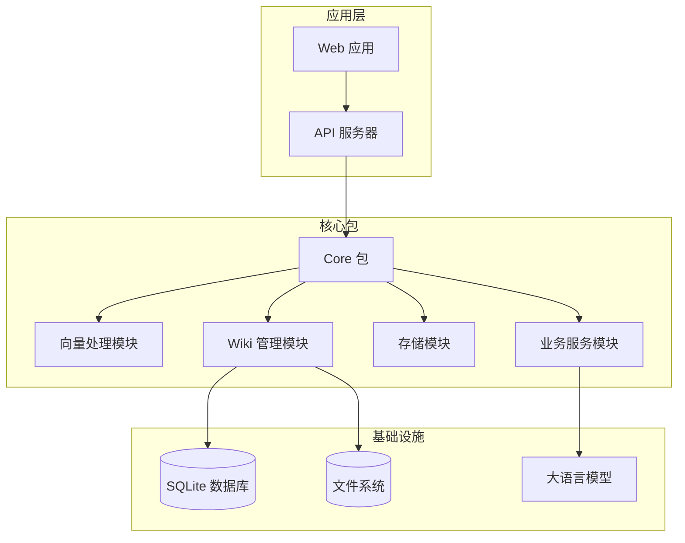
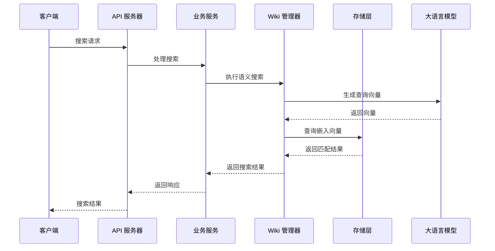
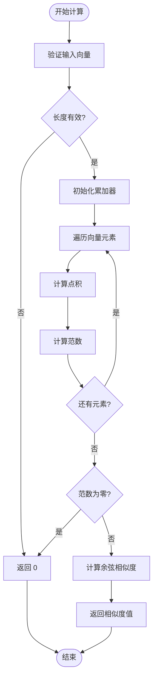
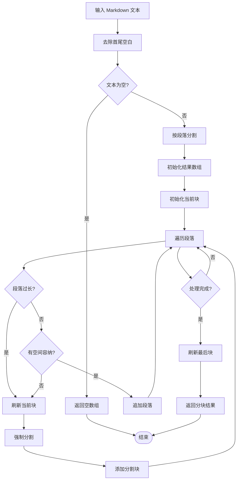
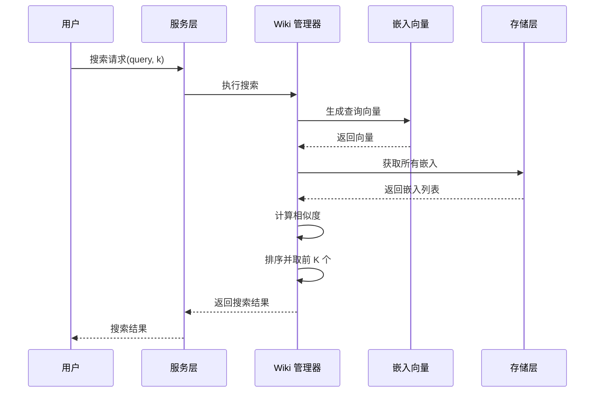
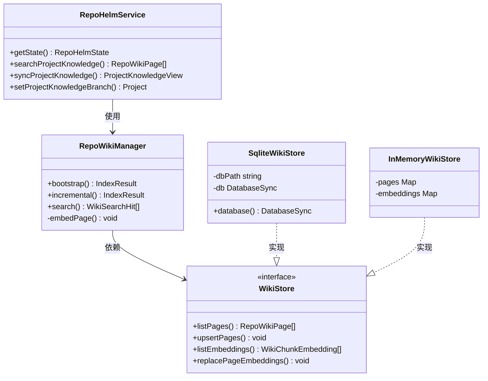
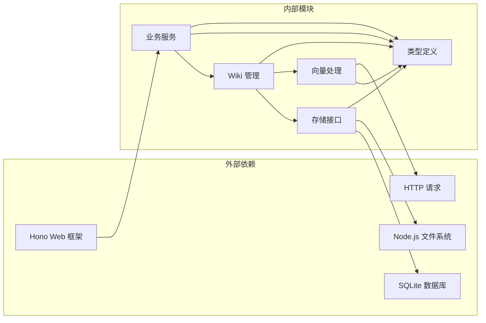

# 向量相似度搜索系统

<cite>
**本文档引用的文件**
- [packages/core/src/vector.ts](file://packages/core/src/vector.ts)
- [packages/core/src/repo-wiki.ts](file://packages/core/src/repo-wiki.ts)
- [packages/core/src/llm.ts](file://packages/core/src/llm.ts)
- [packages/core/src/wiki-store.ts](file://packages/core/src/wiki-store.ts)
- [packages/core/src/service.ts](file://packages/core/src/service.ts)
- [apps/server/src/index.ts](file://apps/server/src/index.ts)
- [apps/web/src/api.ts](file://apps/web/src/api.ts)
- [packages/core/src/types.ts](file://packages/core/src/types.ts)
- [README.md](file://README.md)
</cite>

## 目录
1. [简介](#简介)
2. [项目结构](#项目结构)
3. [核心组件](#核心组件)
4. [架构概览](#架构概览)
5. [详细组件分析](#详细组件分析)
6. [依赖关系分析](#依赖关系分析)
7. [性能考虑](#性能考虑)
8. [故障排除指南](#故障排除指南)
9. [结论](#结论)

## 简介

RepoHelm 是一个开源的 Quest 工作区原型，专注于验证"虚拟 workspace + 多项目 Quest + Spec 驱动 + worktree 隔离 + Agent 编排 + 知识库"的产品方向。该系统实现了完整的向量相似度搜索功能，支持基于语义理解的知识库检索。

系统的核心特性包括：
- 基于 OpenAI 兼容接口的嵌入向量生成
- 余弦相似度计算的向量搜索算法
- 分块处理的 Markdown 文档索引
- SQLite 存储的 Wiki 页面和嵌入向量管理
- Hono Web 服务器提供 REST API 接口

## 项目结构

RepoHelm 采用多包架构，主要包含以下核心模块：

**图表来源**
- [packages/core/src/vector.ts:1-70](file://packages/core/src/vector.ts#L1-L70)
- [packages/core/src/repo-wiki.ts:1-223](file://packages/core/src/repo-wiki.ts#L1-L223)
- [apps/server/src/index.ts:1-660](file://apps/server/src/index.ts#L1-L660)

**章节来源**
- [README.md:1-100](file://README.md#L1-L100)

## 核心组件

### 向量相似度算法

系统实现了高效的向量相似度搜索算法，包含三个核心函数：

1. **余弦相似度计算** (`cosineSimilarity`)
2. **Markdown 分块处理** (`chunkMarkdown`)
3. **Top-K 搜索** (`topKBySimilarity`)

这些组件共同构成了系统的语义搜索基础。

**章节来源**
- [packages/core/src/vector.ts:1-70](file://packages/core/src/vector.ts#L1-L70)

### Wiki 知识库管理

RepoWikiManager 负责知识库的完整生命周期管理，包括：
- 项目知识库的引导构建
- 增量更新机制
- 向量化嵌入处理
- 搜索结果排序

**章节来源**
- [packages/core/src/repo-wiki.ts:1-223](file://packages/core/src/repo-wiki.ts#L1-L223)

### 存储层设计

系统提供了两种存储实现：
- **内存存储** (`InMemoryWikiStore`)：用于测试和开发环境
- **SQLite 存储** (`SqliteWikiStore`)：生产环境的持久化存储

**章节来源**
- [packages/core/src/wiki-store.ts:1-130](file://packages/core/src/wiki-store.ts#L1-L130)

## 架构概览

系统采用分层架构设计，各层职责清晰分离：

**图表来源**
- [apps/server/src/index.ts:292-295](file://apps/server/src/index.ts#L292-L295)
- [packages/core/src/repo-wiki.ts:118-132](file://packages/core/src/repo-wiki.ts#L118-L132)
- [packages/core/src/llm.ts:124-151](file://packages/core/src/llm.ts#L124-L151)

## 详细组件分析

### 向量相似度处理模块

#### 余弦相似度算法

余弦相似度是衡量两个向量之间角度的统计指标，范围在[-1, 1]之间。系统实现了优化的计算过程：

**图表来源**
- [packages/core/src/vector.ts:2-18](file://packages/core/src/vector.ts#L2-L18)

#### Markdown 分块算法

系统采用智能分块策略处理长文档：

**图表来源**
- [packages/core/src/vector.ts:24-57](file://packages/core/src/vector.ts#L24-L57)

**章节来源**
- [packages/core/src/vector.ts:1-70](file://packages/core/src/vector.ts#L1-L70)

### Wiki 知识库搜索流程

#### 搜索算法实现

系统实现了基于向量相似度的搜索算法：

**图表来源**
- [packages/core/src/repo-wiki.ts:118-132](file://packages/core/src/repo-wiki.ts#L118-L132)
- [packages/core/src/vector.ts:59-69](file://packages/core/src/vector.ts#L59-L69)

**章节来源**
- [packages/core/src/repo-wiki.ts:118-132](file://packages/core/src/repo-wiki.ts#L118-L132)

### API 服务集成

#### Web 服务器架构

系统使用 Hono 框架构建高性能 API 服务器：

**图表来源**
- [apps/server/src/index.ts:37-41](file://apps/server/src/index.ts#L37-L41)
- [packages/core/src/wiki-store.ts:6-12](file://packages/core/src/wiki-store.ts#L6-L12)
- [packages/core/src/wiki-store.ts:54-129](file://packages/core/src/wiki-store.ts#L54-L129)

**章节来源**
- [apps/server/src/index.ts:1-660](file://apps/server/src/index.ts#L1-L660)

## 依赖关系分析

系统采用松耦合的设计模式，各组件之间的依赖关系清晰：

**图表来源**
- [packages/core/src/types.ts:1-559](file://packages/core/src/types.ts#L1-L559)
- [packages/core/src/vector.ts:1-70](file://packages/core/src/vector.ts#L1-L70)

**章节来源**
- [packages/core/src/types.ts:1-559](file://packages/core/src/types.ts#L1-L559)

## 性能考虑

### 向量搜索优化

系统在性能方面采用了多项优化策略：

1. **批量嵌入处理**：支持一次性处理多个文本片段
2. **内存缓存**：避免重复的向量计算
3. **索引优化**：使用 SQLite 的索引机制加速查询
4. **分块策略**：智能的 Markdown 分块减少向量维度

### 存储性能

- **WAL 模式**：SQLite 使用 Write-Ahead Logging 提高并发性能
- **索引优化**：为常用查询字段建立索引
- **增量更新**：只更新变化的数据，减少全量重建

## 故障排除指南

### 常见问题及解决方案

#### 嵌入向量生成失败

**问题症状**：知识库同步时报错，提示缺少嵌入模型配置

**解决方法**：
1. 检查 Engine 配置中的 `embeddingModelKitId`
2. 确认 ModelKit 已正确配置
3. 验证 API 密钥和基础 URL 设置

#### 搜索结果不准确

**问题症状**：语义搜索返回的相关性不高

**解决方法**：
1. 检查嵌入模型的质量
2. 调整分块大小参数
3. 优化查询语句的表达方式

#### 性能问题

**问题症状**：搜索响应时间过长

**解决方法**：
1. 检查数据库索引是否正常
2. 优化分块策略
3. 考虑增加硬件资源

**章节来源**
- [packages/core/src/service.ts:119-159](file://packages/core/src/service.ts#L119-L159)
- [packages/core/src/repo-wiki.ts:162-170](file://packages/core/src/repo-wiki.ts#L162-L170)

## 结论

RepoHelm 的向量相似度搜索系统展现了现代 AI 增强应用的最佳实践。系统通过精心设计的架构实现了：

1. **高效的向量处理**：实现了优化的余弦相似度计算和智能分块策略
2. **可扩展的存储架构**：支持内存和持久化两种存储模式
3. **完整的知识库管理**：从引导构建到增量更新的全流程支持
4. **高性能的 API 服务**：基于 Hono 框架的现代化 Web 服务

该系统为大型代码库的知识管理和智能搜索提供了坚实的技术基础，具备良好的扩展性和维护性。通过合理的架构设计和性能优化，能够满足生产环境的严格要求。