# 核心服务模块

<cite>
**本文档引用的文件**
- [packages/core/src/service.ts](file://packages/core/src/service.ts)
- [packages/core/src/store.ts](file://packages/core/src/store.ts)
- [packages/core/src/types.ts](file://packages/core/src/types.ts)
- [packages/core/src/git.ts](file://packages/core/src/git.ts)
- [packages/core/src/knowledge.ts](file://packages/core/src/knowledge.ts)
- [packages/core/src/providers.ts](file://packages/core/src/providers.ts)
- [packages/core/src/cli.ts](file://packages/core/src/cli.ts)
- [packages/core/src/agent.ts](file://packages/core/src/agent.ts)
- [packages/core/src/orchestrator.ts](file://packages/core/src/orchestrator.ts)
- [packages/core/src/planning.ts](file://packages/core/src/planning.ts)
- [packages/core/src/quest-workspace.ts](file://packages/core/src/quest-workspace.ts)
- [packages/core/src/seed-agents.ts](file://packages/core/src/seed-agents.ts)
- [packages/core/src/tools/habits.ts](file://packages/core/src/tools/habits.ts)
- [packages/core/src/tools/failure.ts](file://packages/core/src/tools/failure.ts)
- [packages/core/src/tools/knowledge.ts](file://packages/core/src/tools/knowledge.ts)
- [packages/core/src/expert/types.ts](file://packages/core/src/expert/types.ts)
- [packages/core/src/expert/orchestrator.ts](file://packages/core/src/expert/orchestrator.ts)
- [packages/core/src/expert/session-manager.ts](file://packages/core/src/expert/session-manager.ts)
- [packages/core/src/expert/agent-pool.ts](file://packages/core/src/expert/agent-pool.ts)
- [packages/core/src/expert/research-collector.ts](file://packages/core/src/expert/research-collector.ts)
- [packages/core/src/expert/tdd-pipeline.ts](file://packages/core/src/expert/tdd-pipeline.ts)
- [packages/core/src/expert/migration.ts](file://packages/core/src/expert/migration.ts)
- [packages/core/src/llm.ts](file://packages/core/src/llm.ts)
- [apps/server/src/index.ts](file://apps/server/src/index.ts)
- [apps/server/src/sse.ts](file://apps/server/src/sse.ts)
- [apps/web/src/api.ts](file://apps/web/src/api.ts)
- [apps/web/src/App.tsx](file://apps/web/src/App.tsx)
- [e2e/system-agents.spec.ts](file://e2e/system-agents.spec.ts)
- [packages/core/src/service.test.ts](file://packages/core/src/service.test.ts)
- [packages/core/src/orchestrator.test.ts](file://packages/core/src/orchestrator.test.ts)
- [README.md](file://README.md)
</cite>

## 更新摘要
**变更内容**
- 新增 Quest Spec 流式生成系统，包括 streamQuestSpec 方法、placeholderSpec 占位符、流式事件处理
- 新增 streamLlmWithModelKit 流式 LLM 调用实现，支持 SSE 流式传输
- 新增 SSE 服务器端点 /api/quests/:id/spec-stream，提供流式事件推送
- 新增前端 streamQuestSpec API，支持分析文本流式显示和事件实时更新
- 新增 SPEC_EVENT_PACE_MS 常量，控制事件推送节奏（350ms）
- 新增 QuestSpecStreamEvent 类型定义，支持 analysis_delta、spec_ready、event_added、done、error 五种事件类型

## 目录
1. [简介](#简介)
2. [项目结构](#项目结构)
3. [核心组件](#核心组件)
4. [架构总览](#架构总览)
5. [详细组件分析](#详细组件分析)
6. [专家团编排系统](#专家团编排系统)
7. [专家会话管理](#专家会话管理)
8. [依赖关系分析](#依赖关系分析)
9. [性能考量](#性能考量)
10. [故障排查指南](#故障排查指南)
11. [结论](#结论)
12. [附录](#附录)

## 简介
本文件面向 RepoHelm 的核心服务模块，聚焦以下目标：
- 深入解析 RepoHelmService 的业务逻辑与状态管理机制
- 解释 StateStore 的设计与实现（含 SQLite 数据库与迁移）
- 详述 Quest 工作流的编排流程（Spec 生成、Agent 后端调度、工作树管理）
- **新增**：Quest Spec 流式生成系统，支持实时分析文本流式显示和事件推送
- **新增**：streamLlmWithModelKit 流式 LLM 调用实现，支持 OpenAI 兼容的 SSE 流式传输
- **新增**：SSE 服务器端点和前端 API，提供完整的流式事件处理机制
- **新增**：placeholderSpec 占位符机制，确保用户界面在生成过程中始终显示有效内容
- **新增**：SPEC_EVENT_PACE_MS 节奏控制，确保事件推送的用户体验
- **新增**：QuestSpecStreamEvent 类型系统，支持五种标准化的流式事件类型
- **新增**：专家团编排系统的设计与实现，包括 Expert Orchestrator、Agent Pool 管理、TDD Pipeline
- **新增**：专家会话管理器，提供完整的任务树管理和状态跟踪
- **新增**：专家会话存储与持久化机制，支持 SQLite 数据库存储
- **新增**：动态专家代理管理，支持临时专家的创建、激活和回收
- **新增**：代码调研收集器，伴随任务拆解过程收集代码上下文
- **新增**：测试驱动开发管道，实现红绿重构循环
- **新增**：状态转换验证机制，确保专家会话状态的合法性
- 提供使用模式与代码示例路径
- 说明与其他组件的集成关系
- 给出常见问题与性能优化建议

RepoHelm 以"虚拟 workspace + 多项目 Quest + Spec 驱动 + worktree 隔离 + Agent 编排 + 知识库"为核心产品方向，核心服务模块负责状态持久化、工作流编排、安全策略与审计、以及与 Git、Provider、CLI、Agent 的集成。**新增**的 Quest Spec 流式生成系统将传统的同步 Spec 生成升级为实时流式体验，显著提升用户交互质量和系统响应性。**新增**的专家团编排系统将传统的静态 Plan-then-Execute 模式升级为动态专家团模式，提供更智能、更灵活的任务执行和管理能力。

## 项目结构
核心服务模块位于 packages/core，主要文件与职责如下：
- service.ts：RepoHelmService 主控制器，封装所有业务操作与工作流编排，**新增**：streamQuestSpec 流式 Spec 生成、placeholderSpec 占位符、SPEC_EVENT_PACE_MS 节奏控制
- store.ts：StateStore 抽象与实现（JsonStateStore、SqliteStateStore），**新增**：专家会话存储方法
- types.ts：统一的数据模型与类型定义，包含用户偏好和失败模式接口，**新增**：QuestSpecStreamEvent 类型定义
- git.ts：GitWorktreeManager，负责 Git 仓库健康检查、分支枚举、worktree 创建/删除、变更文件检测、验证/提交/PR 等
- knowledge.ts：知识库文件存储，将知识项渲染为 Markdown 文件
- providers.ts：Provider 注册表，统一拉取各模型提供商的模型列表
- cli.ts：本地 CLI 注册表，检测与测试本地 CLI，合并实时模型
- agent.ts：Agent 后端抽象与实现（Mock、External CLI、OpenAI-Compatible）
- **新增**：orchestrator.ts：子代理编排器，实现多代理协作与任务委派
- **新增**：planning.ts：规划系统，包含 QuestComplexity 评估和计划生成逻辑
- **新增**：quest-workspace.ts：Quest 工作区管理，负责计划文件和工件的持久化
- **新增**：seed-agents.ts：内置子代理种子，提供 Supervisor-Worker 模式的基础代理集
- **新增**：tools/habits.ts：用户偏好工具集，支持偏好记录、查询和建议
- **新增**：tools/failure.ts：失败模式工具集，支持失败记录、搜索和风险检查
- **新增**：tools/knowledge.ts：知识库工具集，支持知识搜索、读取、写入和索引
- **新增**：expert/orchestrator.ts：专家编排器主类，实现专家团模式的核心逻辑
- **新增**：expert/types.ts：专家编排系统的新数据模型和类型定义
- **新增**：expert/agent-pool.ts：Agent Pool 管理器，支持专家原型和动态代理创建
- **新增**：expert/research-collector.ts：代码调研收集器，伴随任务拆解过程收集代码上下文
- **新增**：expert/tdd-pipeline.ts：TDD 流程管道，实现测试驱动的开发执行模式
- **新增**：expert/migration.ts：旧 Quest 到新专家会话的迁移机制
- **新增**：expert/session-manager.ts：专家会话管理器，管理 ExpertSession 的完整生命周期
- **新增**：llm.ts：流式 LLM 调用实现，支持 OpenAI 兼容的 SSE 流式传输
- **新增**：apps/server/src/index.ts：SSE 服务器端点，提供 /api/quests/:id/spec-stream 流式事件推送
- **新增**：apps/server/src/sse.ts：SSE 辅助函数，包含 setupSSE 和 formatSSE 实现
- **新增**：apps/web/src/api.ts：前端流式 API，包含 streamQuestSpec 方法和 QuestSpecStreamEvent 类型
- **新增**：apps/web/src/App.tsx：前端集成，实现流式 Spec 生成的用户界面逻辑

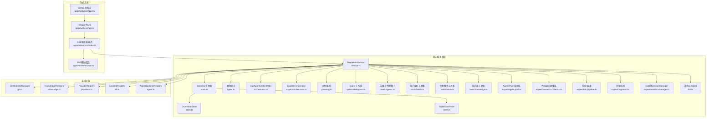
```mermaid
graph TB
subgraph "核心服务模块"
S["RepoHelmService<br/>service.ts"]
ST["StateStore 抽象<br/>store.ts"]
JS["JsonStateStore<br/>store.ts"]
SQ["SqliteStateStore<br/>store.ts"]
T["类型定义<br/>types.ts"]
O["SubAgentOrchestrator<br/>orchestrator.ts"]
EO["ExpertOrchestrator<br/>expert/orchestrator.ts"]
P["规划系统<br/>planning.ts"]
QW["Quest 工作区<br/>quest-workspace.ts"]
SA["内置子代理种子<br/>seed-agents.ts"]
HT["用户偏好工具集<br/>tools/habits.ts"]
FT["失败模式工具集<br/>tools/failure.ts"]
KT["知识库工具集<br/>tools/knowledge.ts"]
AP["Agent Pool 管理器<br/>expert/agent-pool.ts"]
RC["代码调研收集器<br/>expert/research-collector.ts"]
TP["TDD 管道<br/>expert/tdd-pipeline.ts"]
MIG["迁移机制<br/>expert/migration.ts"]
SM["ExpertSessionManager<br/>expert/session-manager.ts"]
LLM["流式LLM调用<br/>llm.ts"]
end
subgraph "基础设施"
G["GitWorktreeManager<br/>git.ts"]
KF["KnowledgeFileStore<br/>knowledge.ts"]
PR["ProviderRegistry<br/>providers.ts"]
LR["LocalCliRegistry<br/>cli.ts"]
AR["AgentBackendRegistry<br/>agent.ts"]
end
subgraph "流式系统"
SS["SSE服务器端点<br/>apps/server/src/index.ts"]
SSE["SSE辅助函数<br/>apps/server/src/sse.ts"]
WS["Web流式API<br/>apps/web/src/api.ts"]
WA["Web应用集成<br/>apps/web/src/App.tsx"]
end
S --> ST
ST --> JS
ST --> SQ
S --> O
S --> EO
S --> P
S --> QW
S --> SA
S --> HT
S --> FT
S --> KT
S --> AP
S --> RC
S --> TP
S --> MIG
S --> SM
S --> G
S --> KF
S --> PR
S --> LR
S --> AR
S --> T
S --> LLM
SS --> SSE
SS --> S
WS --> SS
WA --> WS
```

**图表来源**
- [packages/core/src/service.ts](file://packages/core/src/service.ts)
- [packages/core/src/store.ts](file://packages/core/src/store.ts)
- [packages/core/src/orchestrator.ts](file://packages/core/src/orchestrator.ts)
- [packages/core/src/planning.ts](file://packages/core/src/planning.ts)
- [packages/core/src/quest-workspace.ts](file://packages/core/src/quest-workspace.ts)
- [packages/core/src/seed-agents.ts](file://packages/core/src/seed-agents.ts)
- [packages/core/src/git.ts](file://packages/core/src/git.ts)
- [packages/core/src/knowledge.ts](file://packages/core/src/knowledge.ts)
- [packages/core/src/providers.ts](file://packages/core/src/providers.ts)
- [packages/core/src/cli.ts](file://packages/core/src/cli.ts)
- [packages/core/src/agent.ts](file://packages/core/src/agent.ts)
- [packages/core/src/types.ts](file://packages/core/src/types.ts)
- [packages/core/src/tools/habits.ts](file://packages/core/src/tools/habits.ts)
- [packages/core/src/tools/failure.ts](file://packages/core/src/tools/failure.ts)
- [packages/core/src/tools/knowledge.ts](file://packages/core/src/tools/knowledge.ts)
- [packages/core/src/expert/types.ts](file://packages/core/src/expert/types.ts)
- [packages/core/src/expert/orchestrator.ts](file://packages/core/src/expert/orchestrator.ts)
- [packages/core/src/expert/session-manager.ts](file://packages/core/src/expert/session-manager.ts)
- [packages/core/src/expert/agent-pool.ts](file://packages/core/src/expert/agent-pool.ts)
- [packages/core/src/expert/research-collector.ts](file://packages/core/src/expert/research-collector.ts)
- [packages/core/src/expert/tdd-pipeline.ts](file://packages/core/src/expert/tdd-pipeline.ts)
- [packages/core/src/expert/migration.ts](file://packages/core/src/expert/migration.ts)
- [packages/core/src/llm.ts](file://packages/core/src/llm.ts)
- [apps/server/src/index.ts](file://apps/server/src/index.ts)
- [apps/server/src/sse.ts](file://apps/server/src/sse.ts)
- [apps/web/src/api.ts](file://apps/web/src/api.ts)
- [apps/web/src/App.tsx](file://apps/web/src/App.tsx)

## 核心组件
- RepoHelmService：统一的业务控制器，负责工作区/项目/知识/Quest 的生命周期管理、工作流编排、安全策略与审计、产品就绪度计算等
- **新增**：Quest Spec 流式生成系统：提供实时的 Spec 生成体验，包括 placeholderSpec 占位符、streamQuestSpec 方法、SPEC_EVENT_PACE_MS 节奏控制
- **新增**：streamLlmWithModelKit：流式 LLM 调用实现，支持 OpenAI 兼容的 SSE 流式传输，提供增量内容输出
- **新增**：SSE 服务器端点：/api/quests/:id/spec-stream 提供流式事件推送，支持 analysis_delta、spec_ready、event_added、done、error 五种事件类型
- **新增**：前端流式 API：streamQuestSpec 方法支持分析文本流式显示、Spec 就绪通知、事件实时更新和错误处理
- **新增**：ExpertOrchestrator：专家编排器，实现动态专家团模式，支持任务树生成、用户交互调整、TDD 测试执行
- **新增**：ExpertSessionManager：专家会话管理器，管理 ExpertSession 的完整生命周期，包括状态跟踪和任务树管理
- **新增**：Agent Pool 管理器：支持专家原型注册和动态代理创建，提供代理生命周期管理
- **新增**：代码调研收集器：伴随任务拆解过程收集相关代码上下文，支持智能代码分析
- **新增**：TDD Pipeline：实现测试驱动的开发执行模式，包括验收用例生成、具体测试执行、红绿重构循环
- **新增**：SubAgentOrchestrator：子代理编排器，实现 Supervisor-Worker 模式的多代理协作，支持复杂度评估、快速路径优化和目标项目执行
- **新增**：规划系统（planning.ts）：包含 QuestComplexity 评估接口、assessComplexity 函数和 generateOrchestrationPlan 实现
- **新增**：Quest 工作区管理（quest-workspace.ts）：负责计划文件和工件的持久化存储
- **新增**：内置子代理种子：提供 Supervisor、Spec Writer、Coder、Reviewer、用户习惯助手、失败经验助手六种预定义子代理，支持一键部署和入口代理设置
- **新增**：知识库工具集（tools/knowledge.ts）：提供知识搜索、读取、写入、索引和上下文获取的工具方法
- **新增**：用户偏好工具集（tools/habits.ts）：提供偏好记录、查询、建议和删除的工具方法
- **新增**：失败模式工具集（tools/failure.ts）：提供失败记录、搜索、风险检查和更新的工具方法
- StateStore：状态持久化抽象，提供 read/write 接口；默认使用 SQLite 存储，具备从旧 JSON 格式迁移的能力
- GitWorktreeManager：Git 仓库与 worktree 的管理器，负责健康检查、分支枚举、worktree 创建/删除、变更文件检测、验证/提交/PR
- KnowledgeFileStore：知识库文件存储，将知识项渲染为 Markdown 文件并写入文件系统
- ProviderRegistry：统一的模型提供商注册表，支持 OpenAI、Anthropic、Gemini、DeepSeek、OpenRouter 等
- LocalCliRegistry：本地 CLI 检测与测试，支持实时模型拉取与回退策略
- AgentBackendRegistry：Agent 后端抽象与实现，包含 Mock、External CLI、OpenAI-Compatible Provider

## 架构总览
RepoHelmService 作为核心协调者，围绕以下关键流程运作：
- 状态初始化与迁移：bootstrap 时读取/写入状态，必要时从旧 JSON 迁移到 SQLite
- **新增**：原子状态突变：通过_mutateState方法确保并发写入的安全性
- 工作区与项目管理：创建/更新工作区与项目，维护健康状态
- 知识库管理：将知识项写入文件系统 Markdown，并在状态中保留元数据
- Quest 工作流：创建 Quest、生成轻量 Spec、调度 Agent 后端、创建/清理 worktree、验证/提交/PR
- **新增**：智能规划系统：通过 assessComplexity 评估任务复杂度，自动选择快速路径或标准规划流程
- **新增**：目标项目执行：增强 executeApprovedPlan 的目标项目路由能力，支持单项目直接执行
- **新增**：系统代理服务：通过 invokeSystemAgent 方法调用内置的用户习惯助手和失败经验助手
- **新增**：用户偏好管理：记录和跟踪用户的编码风格、命名习惯、架构倾向和工作流偏好
- **新增**：失败模式分析：捕获 Quest 执行中的失败经验，分析根因并提供缓解方案
- **新增**：专家团编排系统：引入 ExpertOrchestrator，实现动态专家团模式，支持任务树生成、用户交互调整、TDD 测试执行
- **新增**：专家会话管理：通过 createExpertSession、getExpertSession、updateExpertSession 等方法管理专家会话
- **新增**：Agent Pool 管理：支持专家原型注册和动态代理创建，提供代理生命周期管理
- **新增**：代码调研收集：伴随任务拆解过程收集相关代码上下文，支持智能代码分析
- **新增**：TDD Pipeline：实现测试驱动的开发执行模式，包括验收用例生成、具体测试执行、红绿重构循环
- **新增**：流式 Spec 生成：通过 placeholderSpec 占位符和 streamQuestSpec 方法提供实时的 Spec 生成体验
- **新增**：流式 LLM 调用：通过 streamLlmWithModelKit 实现增量内容输出，支持 SSE 流式传输
- **新增**：SSE 事件推送：通过 /api/quests/:id/spec-stream 端点推送 analysis_delta、spec_ready、event_added、done、error 事件
- **新增**：前端流式处理：通过 streamQuestSpec API 实现分析文本流式显示和事件实时更新
- 安全与审计：基于安全策略评估命令执行权限，记录审计日志
- 产品就绪度：根据工作区与项目关系生成里程碑、模板、依赖图与治理视图

```mermaid
sequenceDiagram
participant U as "用户"
participant WA as "Web应用<br/>App.tsx"
participant WS as "Web API<br/>api.ts"
participant SS as "SSE服务器<br/>index.ts"
par 服务器端
S as "RepoHelmService<br/>service.ts"
L as "流式LLM<br/>llm.ts"
end
U->>WA : 创建 Quest
WA->>WS : createQuest()
WS->>SS : POST /api/quests
SS->>S : createQuest()
S-->>SS : 返回 Quest
SS-->>WS : 201 Created
WS-->>WA : 返回 Quest
WA->>WS : streamQuestSpec(questId)
WS->>SS : GET /api/quests/ : id/spec-stream
SS->>S : streamQuestSpec()
S->>L : streamLlmWithModelKit()
L-->>S : 分析文本增量
S-->>SS : analysis_delta 事件
SS-->>WS : SSE : analysis_delta
WS-->>WA : onAnalysis(text)
WA->>WA : 更新分析文本显示
S->>S : 解析 JSON Spec
S-->>SS : spec_ready 事件
SS-->>WS : SSE : spec_ready
WS-->>WA : onSpecReady(spec)
WA->>WA : 刷新页面状态
S->>S : 生成事件序列
loop 事件推送
S->>S : mutateState()
S-->>SS : event_added 事件
SS-->>WS : SSE : event_added
WS-->>WA : onEvent(event)
WA->>WA : 刷新事件列表
end
S->>S : 推进到 planning 状态
S-->>SS : done 事件
SS-->>WS : SSE : done
WS-->>WA : onDone(quest)
WA->>WA : 清理流式状态
```

**图表来源**
- [packages/core/src/service.ts](file://packages/core/src/service.ts)
- [packages/core/src/llm.ts](file://packages/core/src/llm.ts)
- [apps/server/src/index.ts](file://apps/server/src/index.ts)
- [apps/web/src/api.ts](file://apps/web/src/api.ts)
- [apps/web/src/App.tsx](file://apps/web/src/App.tsx)

## 详细组件分析

### RepoHelmService：业务逻辑与状态管理
- 状态初始化与迁移
  - bootstrap：若状态为空，创建演示工作区、项目与种子知识；若已有状态，确保知识文件存在并进行规范化；必要时从旧 JSON 迁移到 SQLite
  - normalizeState：对历史状态字段进行补齐与默认化，保证向后兼容
- **新增**：原子状态突变处理
  - _mutationQueue：串行化队列，防止并发写入冲突
  - mutateState：原子性读取-修改-写入操作，确保数据一致性
- 工作区与项目管理
  - createWorkspace/updateWorkspace：增删改工作区及其根目录、项目集合
  - createProject/updateProject：注册项目、生成项目摘要知识、更新健康状态
  - linkProjectToWorkspace/unlinkProjectFromWorkspace/removeProject：工作区与项目的关联/解绑与级联删除
- **新增**：子代理生命周期管理
  - createSubAgent/updateSubAgent/deleteSubAgent：创建、更新、删除子代理
  - listSubAgents/setEntrySubAgent/getEntrySubAgent：子代理列表管理与入口代理设置
  - updateSubAgentUsage：子代理使用统计更新
  - **新增**：invokeSystemAgent：直接调用系统代理（用户习惯助手、失败经验助手、知识库助手）
- **新增**：内置子代理种子
  - ensureBuiltInSubAgents：服务器启动时确保内置子代理存在
  - seedBuiltInSubAgents：提供 Supervisor、Spec Writer、Coder、Reviewer、用户习惯助手、失败经验助手六种预定义代理
- **新增**：知识库管理服务
  - getProjectKnowledge：获取项目知识库状态
  - syncProjectKnowledge：同步项目知识库索引
  - setProjectKnowledgeBranch：设置项目知识库分支
  - searchProjectKnowledge：搜索项目知识库内容
  - writeWikiPage：写入或更新项目维基页面
  - getKnowledgePages：按ID获取知识页
- **新增**：用户偏好管理服务
  - recordPreference：记录或更新用户偏好
  - getUserPreferences：获取用户偏好列表
  - suggestConventions：根据任务上下文生成用户偏好约束文本
  - deletePreference：删除用户偏好
- **新增**：失败模式分析服务
  - recordFailure：记录新的失败模式
  - searchFailures：搜索相似的失败模式
  - checkRisk：检查任务风险
  - updateFailure：更新失败模式状态
- **新增**：专家会话管理服务
  - createExpertSession：创建专家会话并持久化存储
  - getExpertSession：根据ID获取专家会话
  - updateExpertSession：更新专家会话状态和数据
  - listExpertSessions：列出专家会话（可按 Quest 过滤）
- **新增**：Quest Spec 流式生成
  - placeholderSpec：生成占位符 Spec，确保用户界面始终显示有效内容
  - streamQuestSpec：异步生成器方法，提供实时的 Spec 生成体验
  - buildSpecPrompt：构建 Spec 生成提示词，包含知识库引用和用户需求
  - SPEC_EVENT_PACE_MS：350ms 事件推送节奏，确保用户体验流畅
- Git 与工作树
  - listBranches：枚举仓库分支并识别默认分支
  - createQuest/runQuest/cleanupQuestWorktrees/retryQuest：创建/运行/清理/重试 Quest；为每个受影响项目创建 worktree；调用 Agent 后端；收集变更文件；生成记忆知识
  - deliverQuest：对已准备好的 worktree 执行验证、commit、PR handoff
- 引擎与模型
  - getEngine/updateEngine：读取/更新引擎配置（CLI/Provider 选择、模型映射、BYOK 提供商）
  - listProviders/testProvider/listProviderModels：列出/探测/缓存模型列表（带 TTL）
  - listLocalClis/testLocalCli：检测本地 CLI 并进行真实连通性测试
  - **新增**：createModelKit/updateModelKit/deleteModelKit/listModelKits：ModelKit 管理
  - **新增**：testAndSaveModelKit：测试模型配置并保存为 ModelKit
  - **新增**：enhanceRequirement：使用入口代理增强需求描述
- 安全与审计
  - getSecurityPolicy/updateSecurityPolicy：读取/更新安全策略（命令白名单、文件/网络作用域、secrets 策略、沙箱运行时）
  - evaluateCommandPermission：基于策略评估命令执行许可
  - listAuditLog/audit：查询审计日志与记录审计事件
- 知识库与能力
  - searchKnowledge：按工作区检索知识项
  - listCapabilities/acceptCapabilityRecommendation/dismissCapabilityRecommendation：能力推荐、接受/忽略
  - seedCapabilities/seedSecurityPolicy：内置能力与安全策略的种子数据
- 产品就绪度
  - getProductReadiness：生成里程碑、模板、依赖图与治理视图

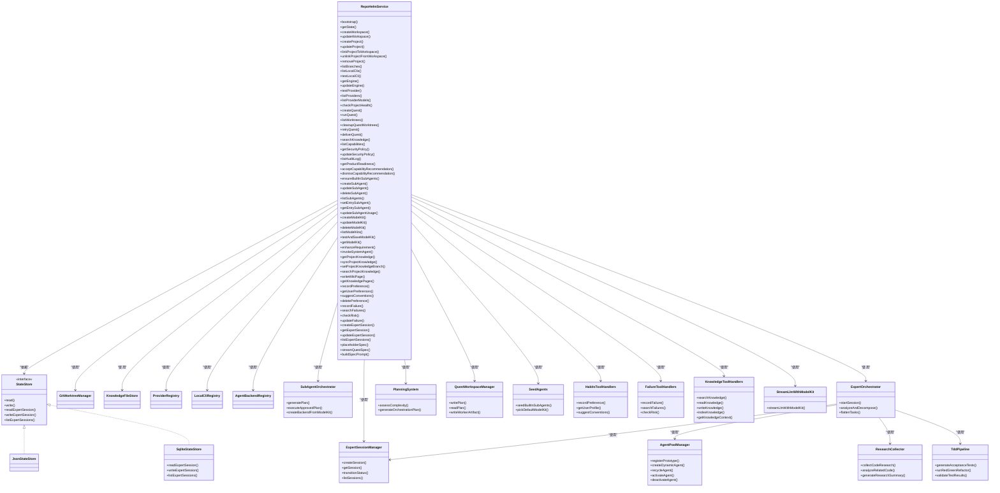
```mermaid
classDiagram
class RepoHelmService {
+bootstrap()
+getState()
+createWorkspace()
+updateWorkspace()
+createProject()
+updateProject()
+linkProjectToWorkspace()
+unlinkProjectFromWorkspace()
+removeProject()
+listBranches()
+listLocalClis()
+testLocalCli()
+getEngine()
+updateEngine()
+testProvider()
+listProviders()
+listProviderModels()
+checkProjectHealth()
+createQuest()
+runQuest()
+listWorktrees()
+cleanupQuestWorktrees()
+retryQuest()
+deliverQuest()
+searchKnowledge()
+listCapabilities()
+getSecurityPolicy()
+updateSecurityPolicy()
+listAuditLog()
+getProductReadiness()
+acceptCapabilityRecommendation()
+dismissCapabilityRecommendation()
+ensureBuiltInSubAgents()
+createSubAgent()
+updateSubAgent()
+deleteSubAgent()
+listSubAgents()
+setEntrySubAgent()
+getEntrySubAgent()
+updateSubAgentUsage()
+createModelKit()
+updateModelKit()
+deleteModelKit()
+listModelKits()
+testAndSaveModelKit()
+getModelKit()
+enhanceRequirement()
+invokeSystemAgent()
+getProjectKnowledge()
+syncProjectKnowledge()
+setProjectKnowledgeBranch()
+searchProjectKnowledge()
+writeWikiPage()
+getKnowledgePages()
+recordPreference()
+getUserPreferences()
+suggestConventions()
+deletePreference()
+recordFailure()
+searchFailures()
+checkRisk()
+updateFailure()
+createExpertSession()
+getExpertSession()
+updateExpertSession()
+listExpertSessions()
+placeholderSpec()
+streamQuestSpec()
+buildSpecPrompt()
}
class StateStore {
<<interface>>
+read()
+write()
+readExpertSession()
+writeExpertSession()
+listExpertSessions()
}
class JsonStateStore
class SqliteStateStore {
+readExpertSession()
+writeExpertSession()
+listExpertSessions()
}
class GitWorktreeManager
class KnowledgeFileStore
class ProviderRegistry
class LocalCliRegistry
class AgentBackendRegistry
class SubAgentOrchestrator {
+generatePlan()
+executeApprovedPlan()
+createBackendFromModelKit()
}
class ExpertOrchestrator {
+startSession()
+analyzeAndDecompose()
+flattenTasks()
}
class ExpertSessionManager {
+createSession()
+getSession()
+transitionStatus()
+listSessions()
}
class AgentPoolManager {
+registerPrototype()
+createDynamicAgent()
+recycleAgent()
+activateAgent()
+deactivateAgent()
}
class ResearchCollector {
+collectCodeResearch()
+analyzeRelatedCode()
+generateResearchSummary()
}
class TddPipeline {
+generateAcceptanceTests()
+runRedGreenRefactor()
+validateTestResults()
}
class PlanningSystem {
+assessComplexity()
+generateOrchestrationPlan()
}
class QuestWorkspaceManager {
+writePlan()
+readPlan()
+writeWorkerArtifact()
}
class SeedAgents {
+seedBuiltInSubAgents()
+pickDefaultModelKit()
}
class HabitsToolHandlers {
+recordPreference()
+getUserProfile()
+suggestConventions()
}
class FailureToolHandlers {
+recordFailure()
+searchFailures()
+checkRisk()
}
class KnowledgeToolHandlers {
+searchKnowledge()
+readKnowledge()
+writeKnowledge()
+indexKnowledge()
+getKnowledgeContext()
}
class StreamLlmWithModelKit {
+streamLlmWithModelKit()
}
RepoHelmService --> StateStore : "依赖"
StateStore <|.. JsonStateStore
StateStore <|.. SqliteStateStore
RepoHelmService --> GitWorktreeManager : "使用"
RepoHelmService --> KnowledgeFileStore : "使用"
RepoHelmService --> ProviderRegistry : "使用"
RepoHelmService --> LocalCliRegistry : "使用"
RepoHelmService --> AgentBackendRegistry : "使用"
RepoHelmService --> SubAgentOrchestrator : "使用"
RepoHelmService --> ExpertOrchestrator : "使用"
RepoHelmService --> ExpertSessionManager : "使用"
RepoHelmService --> PlanningSystem : "使用"
RepoHelmService --> QuestWorkspaceManager : "使用"
RepoHelmService --> SeedAgents : "使用"
RepoHelmService --> HabitsToolHandlers : "使用"
RepoHelmService --> FailureToolHandlers : "使用"
RepoHelmService --> KnowledgeToolHandlers : "使用"
RepoHelmService --> StreamLlmWithModelKit : "使用"
ExpertOrchestrator --> ExpertSessionManager : "使用"
ExpertOrchestrator --> AgentPoolManager : "使用"
ExpertOrchestrator --> ResearchCollector : "使用"
ExpertOrchestrator --> TddPipeline : "使用"
```

**图表来源**
- [packages/core/src/service.ts](file://packages/core/src/service.ts)
- [packages/core/src/store.ts](file://packages/core/src/store.ts)
- [packages/core/src/orchestrator.ts](file://packages/core/src/orchestrator.ts)
- [packages/core/src/planning.ts](file://packages/core/src/planning.ts)
- [packages/core/src/quest-workspace.ts](file://packages/core/src/quest-workspace.ts)
- [packages/core/src/seed-agents.ts](file://packages/core/src/seed-agents.ts)
- [packages/core/src/git.ts](file://packages/core/src/git.ts)
- [packages/core/src/knowledge.ts](file://packages/core/src/knowledge.ts)
- [packages/core/src/providers.ts](file://packages/core/src/providers.ts)
- [packages/core/src/cli.ts](file://packages/core/src/cli.ts)
- [packages/core/src/agent.ts](file://packages/core/src/agent.ts)
- [packages/core/src/types.ts](file://packages/core/src/types.ts)
- [packages/core/src/tools/habits.ts](file://packages/core/src/tools/habits.ts)
- [packages/core/src/tools/failure.ts](file://packages/core/src/tools/failure.ts)
- [packages/core/src/tools/knowledge.ts](file://packages/core/src/tools/knowledge.ts)
- [packages/core/src/expert/types.ts](file://packages/core/src/expert/types.ts)
- [packages/core/src/expert/orchestrator.ts](file://packages/core/src/expert/orchestrator.ts)
- [packages/core/src/expert/session-manager.ts](file://packages/core/src/expert/session-manager.ts)
- [packages/core/src/expert/agent-pool.ts](file://packages/core/src/expert/agent-pool.ts)
- [packages/core/src/expert/research-collector.ts](file://packages/core/src/expert/research-collector.ts)
- [packages/core/src/expert/tdd-pipeline.ts](file://packages/core/src/expert/tdd-pipeline.ts)
- [packages/core/src/expert/migration.ts](file://packages/core/src/expert/migration.ts)
- [packages/core/src/llm.ts](file://packages/core/src/llm.ts)

**章节来源**
- [packages/core/src/service.ts](file://packages/core/src/service.ts)
- [packages/core/src/service.test.ts](file://packages/core/src/service.test.ts)

### StateStore 设计与实现
- 抽象接口 StateStore：定义 read/write
- JsonStateStore：以 JSON 文件形式持久化状态，路径为 .repohelm/state.json
- SqliteStateStore：以 SQLite 表 state 持久化状态，包含 id/payload/updated_at 字段；首次访问自动创建表；具备从旧 JSON 迁移的能力
- **新增**：专家会话存储方法
  - readExpertSession：根据会话ID查询专家会话，返回 JSON 解析后的对象
  - writeExpertSession：将专家会话序列化为 JSON 并写入 expert_sessions 表
  - listExpertSessions：列出所有专家会话或按 Quest ID 过滤
- 迁移逻辑：读取旧 JSON 状态并写入 SQLite，确保平滑过渡

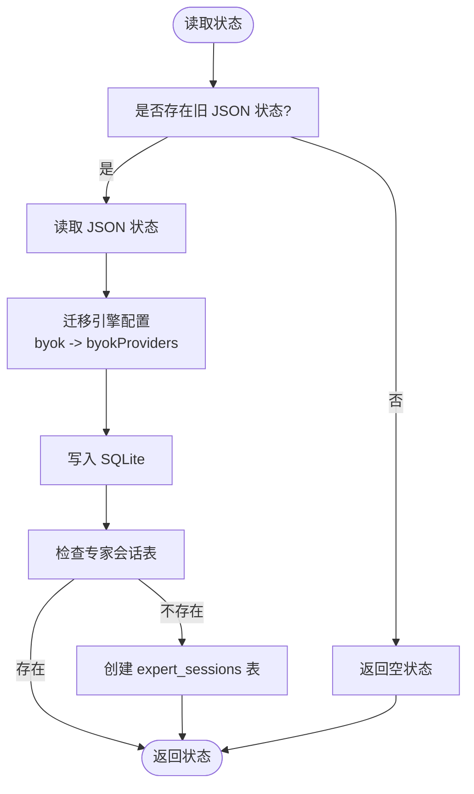
```mermaid
flowchart TD
Start(["读取状态"]) --> CheckLegacy["是否存在旧 JSON 状态?"]
CheckLegacy --> |是| ReadJson["读取 JSON 状态"]
ReadJson --> Migrate["迁移引擎配置<br/>byok -> byokProviders"]
Migrate --> WriteSqlite["写入 SQLite"]
CheckLegacy --> |否| Empty["返回空状态"]
WriteSqlite --> CheckExpert["检查专家会话表"]
CheckExpert --> |不存在| CreateTable["创建 expert_sessions 表"]
CheckExpert --> |存在| Done(["返回状态"])
CreateTable --> Done
Empty --> Done
```

**章节来源**
- [packages/core/src/store.ts](file://packages/core/src/store.ts)

### Quest Spec 流式生成系统

#### placeholderSpec 占位符机制
placeholderSpec 方法生成临时的 Spec 对象，确保用户界面在 Spec 生成过程中始终显示有效内容：

- **占位符内容**：background 显示"正在分析需求并生成 Spec…"，其他字段为空数组
- **使用时机**：createQuest 方法立即返回，spec 字段使用占位符，避免空白界面
- **更新机制**：streamQuestSpec 完成后，通过 mutateState 更新为真实 Spec

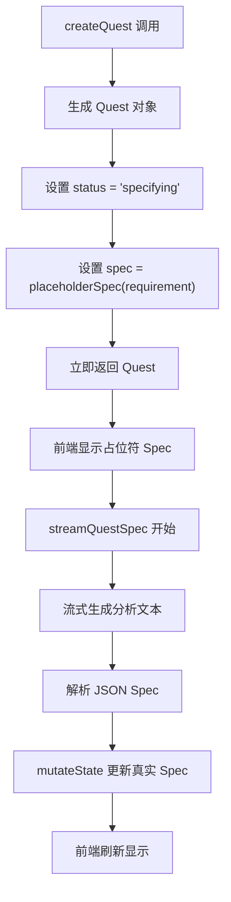
```mermaid
flowchart TD
A["createQuest 调用"] --> B["生成 Quest 对象"]
B --> C["设置 status = 'specifying'"]
C --> D["设置 spec = placeholderSpec(requirement)"]
D --> E["立即返回 Quest"]
E --> F["前端显示占位符 Spec"]
F --> G["streamQuestSpec 开始"]
G --> H["流式生成分析文本"]
H --> I["解析 JSON Spec"]
I --> J["mutateState 更新真实 Spec"]
J --> K["前端刷新显示"]
```

**图表来源**
- [packages/core/src/service.ts](file://packages/core/src/service.ts)

**章节来源**
- [packages/core/src/service.ts](file://packages/core/src/service.ts)

#### streamQuestSpec 流式生成方法
streamQuestSpec 是核心的异步生成器方法，提供完整的流式 Spec 生成体验：

- **分析阶段**：使用 streamLlmWithModelKit 流式调用 LLM，实时输出分析文本
- **JSON 解析**：从流式输出中提取 JSON 块，解析为 QuestSpec 对象
- **降级机制**：当 JSON 解析失败时，回退到传统 generateSpec 方法
- **事件推送**：按 350ms 节奏推送多个事件，包括知识库引用、用户偏好注入、风险提示、能力推荐等
- **状态推进**：最终将 Quest 状态推进到 planning 阶段

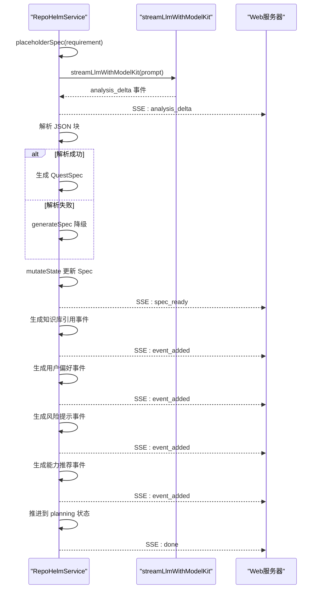
```mermaid
sequenceDiagram
participant S as "RepoHelmService"
participant L as "streamLlmWithModelKit"
participant WS as "Web服务器"
S->>S : placeholderSpec(requirement)
S->>L : streamLlmWithModelKit(prompt)
L-->>S : analysis_delta 事件
S-->>WS : SSE : analysis_delta
S->>S : 解析 JSON 块
alt 解析成功
S->>S : 生成 QuestSpec
else 解析失败
S->>S : generateSpec 降级
end
S->>S : mutateState 更新 Spec
S-->>WS : SSE : spec_ready
S->>S : 生成知识库引用事件
S-->>WS : SSE : event_added
S->>S : 生成用户偏好事件
S-->>WS : SSE : event_added
S->>S : 生成风险提示事件
S-->>WS : SSE : event_added
S->>S : 生成能力推荐事件
S-->>WS : SSE : event_added
S->>S : 推进到 planning 状态
S-->>WS : SSE : done
```

**图表来源**
- [packages/core/src/service.ts](file://packages/core/src/service.ts)
- [packages/core/src/llm.ts](file://packages/core/src/llm.ts)

**章节来源**
- [packages/core/src/service.ts](file://packages/core/src/service.ts)

#### buildSpecPrompt 提示词构建
buildSpecPrompt 方法构建专门的提示词，引导 LLM 生成高质量的 Spec：

- **分析要求**：要求 LLM 用 2-4 句简体中文口语化地分析用户需求
- **JSON 输出**：要求输出严格的 JSON 代码块，包含 8 个指定字段
- **知识库引用**：根据相关知识页标题生成知识库引用行
- **用户需求**：包含原始用户需求文本
- **字段规范**：userGoal 使用用户原始需求，其他字段按要求生成

**章节来源**
- [packages/core/src/service.ts](file://packages/core/src/service.ts)

#### SPEC_EVENT_PACE_MS 节奏控制
SPEC_EVENT_PACE_MS 常量定义事件推送的节奏间隔：

- **数值设置**：350ms 延迟，确保事件推送不会过于密集
- **用户体验**：提供流畅的事件显示体验，避免视觉闪烁
- **实现位置**：在 streamQuestSpec 方法中使用 setTimeout 控制事件推送节奏
- **事件类型**：包括 spec.generated、knowledge.retrieved、preference.injected、risk.warning、capability.recommended、plan.created 等

**章节来源**
- [packages/core/src/service.ts](file://packages/core/src/service.ts)

### 流式 LLM 调用实现

#### streamLlmWithModelKit 方法
streamLlmWithModelKit 实现了完整的流式 LLM 调用功能：

- **Fake 模式**：当 REPOHELM_FAKE_MODELS=1 时，直接返回预设文本，便于测试
- **真实模式**：通过 OpenAI 兼容的 /chat/completions 端点进行流式调用
- **SSE 解析**：解析服务器发送的事件流，提取增量内容
- **错误处理**：处理网络错误和解析异常，提供清晰的错误信息
- **流式输出**：异步生成器模式，逐个产出增量内容

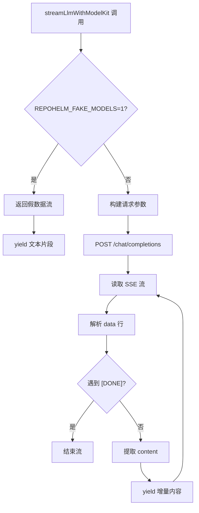
```mermaid
flowchart TD
A["streamLlmWithModelKit 调用"] --> B{"REPOHELM_FAKE_MODELS=1?"}
B --> |是| C["返回假数据流"]
C --> D["yield 文本片段"]
B --> |否| E["构建请求参数"]
E --> F["POST /chat/completions"]
F --> G["读取 SSE 流"]
G --> H["解析 data 行"]
H --> I{"遇到 [DONE]?"}
I --> |是| J["结束流"]
I --> |否| K["提取 content"]
K --> L["yield 增量内容"]
L --> G
```

**图表来源**
- [packages/core/src/llm.ts](file://packages/core/src/llm.ts)

**章节来源**
- [packages/core/src/llm.ts](file://packages/core/src/llm.ts)

#### SSE 服务器端点实现
/apps/server/src/index.ts 提供了完整的 SSE 服务器端点：

- **端点路径**：/api/quests/:id/spec-stream
- **流式生成**：遍历 service.streamQuestSpec 生成的事件流
- **SSE 格式**：使用 formatSSE 函数格式化事件数据
- **错误处理**：捕获异常并发送 error 事件
- **连接管理**：设置正确的 HTTP 头部，维持长连接

**章节来源**
- [apps/server/src/index.ts](file://apps/server/src/index.ts)
- [apps/server/src/sse.ts](file://apps/server/src/sse.ts)

### 前端流式 API 集成

#### streamQuestSpec 前端方法
apps/web/src/api.ts 提供了完整的前端流式 API：

- **EventSource**：使用浏览器原生 EventSource 进行 SSE 连接
- **事件监听**：监听 analysis_delta、spec_ready、event_added、done、error 五种事件
- **回调处理**：提供 onAnalysis、onSpecReady、onEvent、onDone、onError 回调
- **自动关闭**：done 事件后自动关闭连接，error 事件时也进行清理
- **错误处理**：区分传输错误和业务错误，提供适当的错误信息

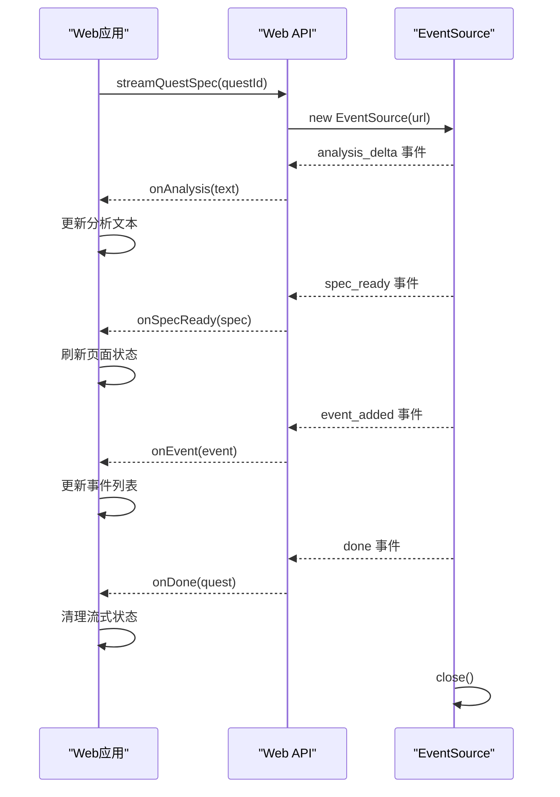
```mermaid
sequenceDiagram
participant WA as "Web应用"
participant WS as "Web API"
participant ES as "EventSource"
WA->>WS : streamQuestSpec(questId)
WS->>ES : new EventSource(url)
ES-->>WS : analysis_delta 事件
WS-->>WA : onAnalysis(text)
WA->>WA : 更新分析文本
ES-->>WS : spec_ready 事件
WS-->>WA : onSpecReady(spec)
WA->>WA : 刷新页面状态
ES-->>WS : event_added 事件
WS-->>WA : onEvent(event)
WA->>WA : 更新事件列表
ES-->>WS : done 事件
WS-->>WA : onDone(quest)
WA->>WA : 清理流式状态
ES->>ES : close()
```

**图表来源**
- [apps/web/src/api.ts](file://apps/web/src/api.ts)
- [apps/web/src/App.tsx](file://apps/web/src/App.tsx)

**章节来源**
- [apps/web/src/api.ts](file://apps/web/src/api.ts)
- [apps/web/src/App.tsx](file://apps/web/src/App.tsx)

#### 前端集成逻辑
apps/web/src/App.tsx 实现了完整的前端集成逻辑：

- **创建 Quest**：createQuest 方法中调用 streamQuestSpec 获取实时反馈
- **状态管理**：使用 streamingAnalysis 状态变量显示流式分析文本
- **自动恢复**：页面恢复时自动重新订阅仍在进行的流式生成
- **竞态控制**：使用 streamingQuestIdRef 防止多个流式订阅冲突
- **错误处理**：优雅处理流式连接中断和错误情况

**章节来源**
- [apps/web/src/App.tsx](file://apps/web/src/App.tsx)

### 专家会话管理

#### ExpertSession 类型定义
ExpertSession 是专家编排系统的核心数据结构，包含以下关键字段：

- **基础信息**：id、questId、status、entryAgentId
- **任务树结构**：taskTree（ExpertTaskNode 根节点）、flatTasks（扁平化任务列表）
- **验收测试**：acceptanceTests（AcceptanceTest 数组）
- **代码调研**：research（CodeResearchResult 数组）
- **代理池快照**：agentPool（AgentPoolSnapshot）
- **时间戳**：createdAt、confirmedAt、completedAt
- **错误信息**：errors（ExpertError 数组）

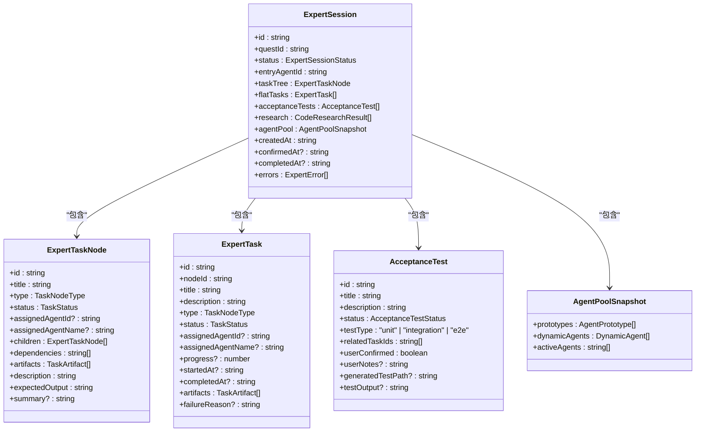
```mermaid
classDiagram
class ExpertSession {
+id : string
+questId : string
+status : ExpertSessionStatus
+entryAgentId : string
+taskTree : ExpertTaskNode
+flatTasks : ExpertTask[]
+acceptanceTests : AcceptanceTest[]
+research : CodeResearchResult[]
+agentPool : AgentPoolSnapshot
+createdAt : string
+confirmedAt? : string
+completedAt? : string
+errors : ExpertError[]
}
class ExpertTaskNode {
+id : string
+title : string
+type : TaskNodeType
+status : TaskStatus
+assignedAgentId? : string
+assignedAgentName? : string
+children : ExpertTaskNode[]
+dependencies : string[]
+artifacts : TaskArtifact[]
+description : string
+expectedOutput : string
+summary? : string
}
class ExpertTask {
+id : string
+nodeId : string
+title : string
+description : string
+type : TaskNodeType
+status : TaskStatus
+assignedAgentId? : string
+assignedAgentName? : string
+progress? : number
+startedAt? : string
+completedAt? : string
+artifacts : TaskArtifact[]
+failureReason? : string
}
class AcceptanceTest {
+id : string
+title : string
+description : string
+status : AcceptanceTestStatus
+testType : "unit" | "integration" | "e2e"
+relatedTaskIds : string[]
+userConfirmed : boolean
+userNotes? : string
+generatedTestPath? : string
+testOutput? : string
}
class AgentPoolSnapshot {
+prototypes : AgentPrototype[]
+dynamicAgents : DynamicAgent[]
+activeAgents : string[]
}
ExpertSession --> ExpertTaskNode : "包含"
ExpertSession --> ExpertTask : "包含"
ExpertSession --> AcceptanceTest : "包含"
ExpertSession --> AgentPoolSnapshot : "包含"
```

**图表来源**
- [packages/core/src/expert/types.ts](file://packages/core/src/expert/types.ts)

**章节来源**
- [packages/core/src/expert/types.ts](file://packages/core/src/expert/types.ts)

#### ExpertSessionManager 状态管理
ExpertSessionManager 负责专家会话的完整生命周期管理：

- **会话创建**：createSession 根据输入参数创建新的 ExpertSession
- **会话获取**：getSession 根据ID获取会话，支持内存缓存
- **状态转换**：transitionStatus 验证状态转换的合法性
- **会话列表**：listSessions 支持按 Quest 过滤

状态转换验证机制确保专家会话状态的合法性：

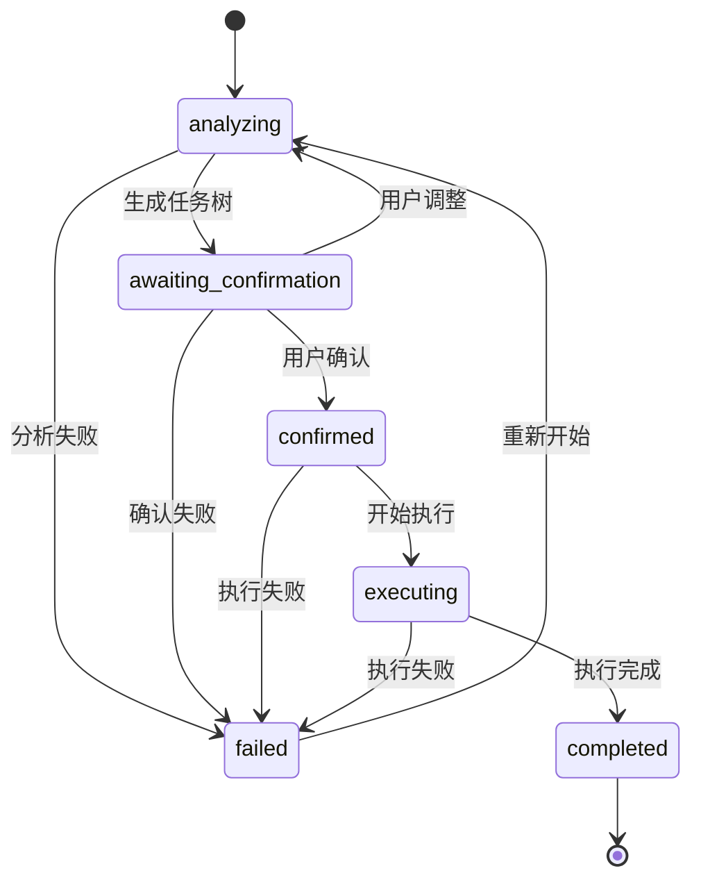
```mermaid
stateDiagram-v2
[*] --> analyzing
analyzing --> awaiting_confirmation : 生成任务树
analyzing --> failed : 分析失败
awaiting_confirmation --> confirmed : 用户确认
awaiting_confirmation --> analyzing : 用户调整
awaiting_confirmation --> failed : 确认失败
confirmed --> executing : 开始执行
confirmed --> failed : 执行失败
executing --> completed : 执行完成
executing --> failed : 执行失败
completed --> [*]
failed --> analyzing : 重新开始
```

**图表来源**
- [packages/core/src/expert/session-manager.ts](file://packages/core/src/expert/session-manager.ts)

**章节来源**
- [packages/core/src/expert/session-manager.ts](file://packages/core/src/expert/session-manager.ts)

#### AgentPool 动态代理管理
AgentPool 管理专家原型和动态代理：

- **专家原型**：registerPrototype 注册内置专家原型
- **动态代理**：createDynamicAgent 创建临时专家代理，支持 TTL 限制
- **代理激活**：activateAgent/deactivateAgent 管理代理使用状态
- **代理回收**：recycleDynamicAgent 回收临时代理资源
- **代理匹配**：matchAgents 根据能力匹配合适的代理

**章节来源**
- [packages/core/src/expert/agent-pool.ts](file://packages/core/src/expert/agent-pool.ts)

#### 专家会话存储实现
SqliteStateStore 为专家会话提供持久化存储：

- **数据库表结构**：expert_sessions 表包含 id、quest_id、status、data、created_at、updated_at 字段
- **读取操作**：readExpertSession 根据ID查询并解析 JSON 数据
- **写入操作**：writeExpertSession 序列化会话数据并写入数据库
- **列表查询**：listExpertSessions 支持按 Quest 过滤查询

**章节来源**
- [packages/core/src/store.ts](file://packages/core/src/store.ts)

### 知识库管理服务
- **新增**：知识库工具集（tools/knowledge.ts）
  - SEARCH_KNOWLEDGE_TOOL：搜索项目知识库内容
  - READ_KNOWLEDGE_TOOL：读取特定知识页内容
  - WRITE_KNOWLEDGE_TOOL：创建或更新项目知识页
  - INDEX_KNOWLEDGE_TOOL：触发项目知识库索引
  - GET_KNOWLEDGE_CONTEXT_TOOL：获取任务相关的知识上下文
- **新增**：RepoHelmService 知识库方法
  - getProjectKnowledge：获取项目知识库状态和页面列表
  - syncProjectKnowledge：同步项目知识库索引，支持增量更新
  - setProjectKnowledgeBranch：设置项目知识库分支
  - searchProjectKnowledge：基于语义搜索项目知识库内容
  - writeWikiPage：写入或更新项目维基页面，同时持久化到文件系统
  - getKnowledgePages：按ID批量获取知识页

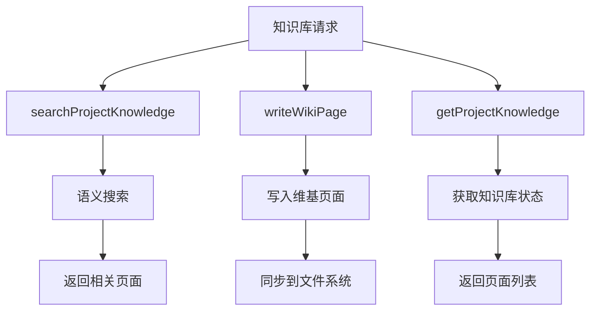
```mermaid
flowchart TD
A["知识库请求"] --> B["searchProjectKnowledge"]
B --> C["语义搜索"]
C --> D["返回相关页面"]
A --> E["writeWikiPage"]
E --> F["写入维基页面"]
F --> G["同步到文件系统"]
A --> H["getProjectKnowledge"]
H --> I["获取知识库状态"]
I --> J["返回页面列表"]
```

**图表来源**
- [packages/core/src/tools/knowledge.ts](file://packages/core/src/tools/knowledge.ts)
- [packages/core/src/service.ts](file://packages/core/src/service.ts)

**章节来源**
- [packages/core/src/tools/knowledge.ts](file://packages/core/src/tools/knowledge.ts)
- [packages/core/src/service.ts](file://packages/core/src/service.ts)

### 用户偏好跟踪服务
- **新增**：用户偏好工具集（tools/habits.ts）
  - RECORD_PREFERENCE_TOOL：记录或更新用户偏好
  - GET_USER_PROFILE_TOOL：获取用户偏好档案
  - SUGGEST_CONVENTIONS_TOOL：根据任务上下文生成约定建议
- **新增**：RepoHelmService 用户偏好方法
  - recordPreference：记录或更新用户偏好，支持同类别键去重和置信度更新
  - getUserPreferences：按分类和最低置信度过滤用户偏好
  - suggestConventions：生成用户偏好约束文本，供其他代理使用
  - deletePreference：删除指定用户偏好
- **新增**：内置子代理种子
  - 用户习惯助手：专门观察和建模用户偏好，提供偏好记录、查询和建议功能

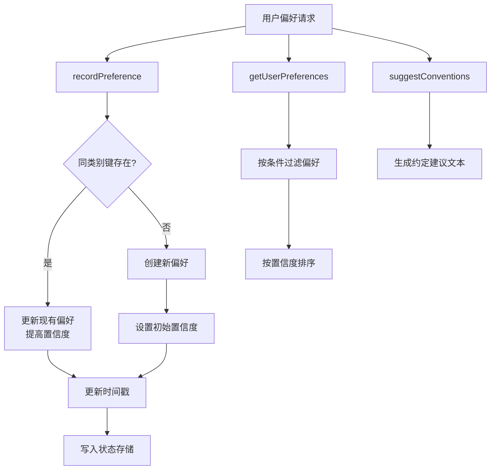
```mermaid
flowchart TD
A["用户偏好请求"] --> B["recordPreference"]
B --> C{"同类别键存在?"}
C --> |是| D["更新现有偏好<br/>提高置信度"]
C --> |否| E["创建新偏好"]
E --> F["设置初始置信度"]
D --> G["更新时间戳"]
F --> G
G --> H["写入状态存储"]
A --> I["getUserPreferences"]
I --> J["按条件过滤偏好"]
J --> K["按置信度排序"]
A --> L["suggestConventions"]
L --> M["生成约定建议文本"]
```

**图表来源**
- [packages/core/src/tools/habits.ts](file://packages/core/src/tools/habits.ts)
- [packages/core/src/service.ts](file://packages/core/src/service.ts)
- [packages/core/src/seed-agents.ts](file://packages/core/src/seed-agents.ts)

**章节来源**
- [packages/core/src/tools/habits.ts](file://packages/core/src/tools/habits.ts)
- [packages/core/src/service.ts](file://packages/core/src/service.ts)
- [packages/core/src/seed-agents.ts](file://packages/core/src/seed-agents.ts)

### 失败模式分析服务
- **新增**：失败模式工具集（tools/failure.ts）
  - RECORD_FAILURE_TOOL：记录失败模式，包含根因分析和缓解方案
  - SEARCH_FAILURES_TOOL：搜索相似失败模式
  - CHECK_RISK_TOOL：检查任务风险，基于已知失败模式提供警告
- **新增**：RepoHelmService 失败模式方法
  - recordFailure：记录新的失败模式，支持项目和Quest关联
  - searchFailures：基于关键词和信号搜索相似失败模式
  - checkRisk：检查任务风险，返回相关失败模式列表
  - updateFailure：更新失败模式状态（标记解决、调整严重性或缓解方案）
- **新增**：内置子代理种子
  - 失败经验助手：专门捕获和分析失败经验，提供风险检查和缓解建议

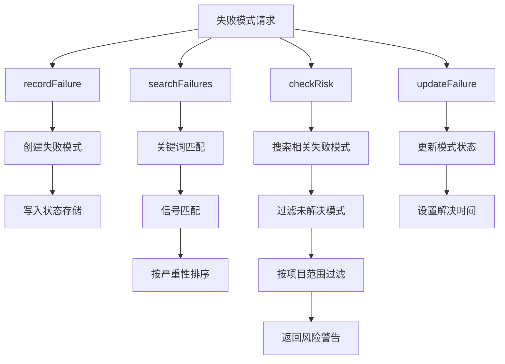
```mermaid
flowchart TD
A["失败模式请求"] --> B["recordFailure"]
B --> C["创建失败模式"]
C --> D["写入状态存储"]
A --> E["searchFailures"]
E --> F["关键词匹配"]
F --> G["信号匹配"]
G --> H["按严重性排序"]
A --> I["checkRisk"]
I --> J["搜索相关失败模式"]
J --> K["过滤未解决模式"]
K --> L["按项目范围过滤"]
L --> M["返回风险警告"]
A --> N["updateFailure"]
N --> O["更新模式状态"]
O --> P["设置解决时间"]
```

**图表来源**
- [packages/core/src/tools/failure.ts](file://packages/core/src/tools/failure.ts)
- [packages/core/src/service.ts](file://packages/core/src/service.ts)
- [packages/core/src/seed-agents.ts](file://packages/core/src/seed-agents.ts)

**章节来源**
- [packages/core/src/tools/failure.ts](file://packages/core/src/tools/failure.ts)
- [packages/core/src/service.ts](file://packages/core/src/service.ts)
- [packages/core/src/seed-agents.ts](file://packages/core/src/seed-agents.ts)

### 系统代理调用机制
- **新增**：invokeSystemAgent 方法
  - 支持三种系统角色：知识库助手（默认）、用户习惯助手、失败经验助手
  - 基于 systemRole 选择对应的工具规范和处理器
  - 限制最大迭代次数（8次）防止无限循环
  - 支持工具调用循环，自动处理工具输出
- **新增**：系统代理工具处理器
  - buildHabitsToolHandlers：处理用户偏好相关工具调用
  - buildFailureToolHandlers：处理失败模式相关工具调用
  - buildKnowledgeToolHandlers：处理知识库相关工具调用

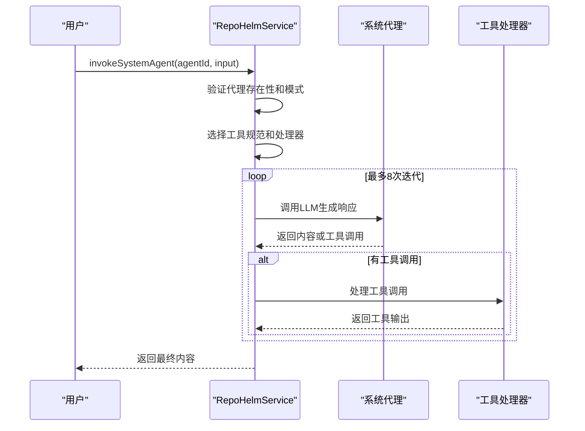
```mermaid
sequenceDiagram
participant U as "用户"
participant S as "RepoHelmService"
participant A as "系统代理"
participant T as "工具处理器"
U->>S : invokeSystemAgent(agentId, input)
S->>S : 验证代理存在性和模式
S->>S : 选择工具规范和处理器
loop 最多8次迭代
S->>A : 调用LLM生成响应
A-->>S : 返回内容或工具调用
alt 有工具调用
S->>T : 处理工具调用
T-->>S : 返回工具输出
end
end
S-->>U : 返回最终内容
```

**图表来源**
- [packages/core/src/service.ts](file://packages/core/src/service.ts)
- [packages/core/src/tools/habits.ts](file://packages/core/src/tools/habits.ts)
- [packages/core/src/tools/failure.ts](file://packages/core/src/tools/failure.ts)
- [packages/core/src/tools/knowledge.ts](file://packages/core/src/tools/knowledge.ts)

**章节来源**
- [packages/core/src/service.ts](file://packages/core/src/service.ts)
- [packages/core/src/tools/habits.ts](file://packages/core/src/tools/habits.ts)
- [packages/core/src/tools/failure.ts](file://packages/core/src/tools/failure.ts)
- [packages/core/src/tools/knowledge.ts](file://packages/core/src/tools/knowledge.ts)

### 规划系统性能优化
- **新增**：QuestComplexity 评估接口
  - isSimple：判断任务是否为简单任务的标准
  - affectedProjectCount：受影响项目数量
  - requirementLength：需求文本长度
  - hasExplicitSteps：需求中是否包含显式步骤关键词
- **新增**：assessComplexity 函数实现
  - 单项目、短需求文本、无显式步骤的任务被视为简单任务
  - 支持中文步骤关键词："首先"、"然后"、"接着"、"最后"等
  - 简单任务阈值：单项目、需求长度小于200字符、无显式步骤
- **新增**：快速路径优化
  - 简单任务直接生成单步计划，避免 LLM 调用开销
  - 复杂任务使用标准规划流程，通过 generateOrchestrationPlan 生成详细计划
- **新增**：createSimplePlan 实现
  - 自动选择最佳编码代理（具备 coding 能力的代理）
  - 为目标项目生成单步执行计划
  - 包含目标项目 ID 信息，支持后续执行路由

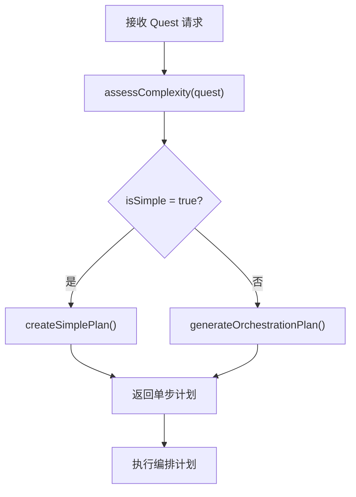
```mermaid
flowchart TD
A["接收 Quest 请求"] --> B["assessComplexity(quest)"]
B --> C{"isSimple = true?"}
C --> |是| D["createSimplePlan()"]
C --> |否| E["generateOrchestrationPlan()"]
D --> F["返回单步计划"]
E --> F
F --> G["执行编排计划"]
```

**图表来源**
- [packages/core/src/planning.ts](file://packages/core/src/planning.ts)
- [packages/core/src/orchestrator.ts](file://packages/core/src/orchestrator.ts)

**章节来源**
- [packages/core/src/planning.ts](file://packages/core/src/planning.ts)
- [packages/core/src/orchestrator.ts](file://packages/core/src/orchestrator.ts)

### 多代理编排架构
- **新增**：SubAgentOrchestrator 增强
  - 复杂度评估：通过 assessComplexity 判断任务复杂度，自动选择快速路径
  - 快速路径：简单任务直接生成单步计划，避免 LLM 调用
  - 标准路径：复杂任务使用 generateOrchestrationPlan 生成详细计划
  - 目标项目执行：增强 executeApprovedPlan 的目标项目路由能力
- **新增**：内置子代理种子
  - Supervisor：入口监督者，负责任务分解、委派和结果汇总
  - Spec Writer：规范编写者，生成轻量级规范和需求分解
  - Coder：编码者，实现代码和具体的文件级变更
  - Reviewer：审查者，审查计划和代码的质量、正确性和安全性
  - **新增**：用户习惯助手：观察并建模用户偏好，提供个性化约束
  - **新增**：失败经验助手：捕获失败经验，提供风险预警和缓解方案
- **新增**：子代理生命周期管理
  - 完整的 CRUD 操作：创建、更新、删除、查询子代理
  - 权限控制：支持工具访问控制和最大执行步数限制
  - 使用统计：记录子代理使用次数和最后使用时间
- **新增**：原子状态突变处理
  - _mutationQueue：串行化队列，确保状态修改的原子性
  - mutateState：包装状态修改操作，防止并发冲突

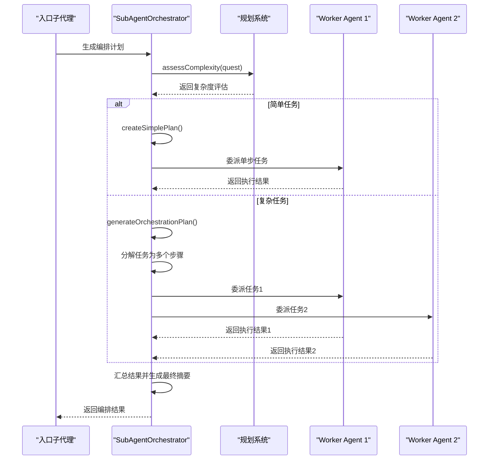
```mermaid
sequenceDiagram
participant E as "入口子代理"
participant S as "SubAgentOrchestrator"
participant P as "规划系统"
participant W1 as "Worker Agent 1"
participant W2 as "Worker Agent 2"
E->>S : 生成编排计划
S->>P : assessComplexity(quest)
P-->>S : 返回复杂度评估
alt 简单任务
S->>S : createSimplePlan()
S->>W1 : 委派单步任务
W1-->>S : 返回执行结果
else 复杂任务
S->>S : generateOrchestrationPlan()
S->>S : 分解任务为多个步骤
S->>W1 : 委派任务1
S->>W2 : 委派任务2
W1-->>S : 返回执行结果1
W2-->>S : 返回执行结果2
end
S->>S : 汇总结果并生成最终摘要
S-->>E : 返回编排结果
```

**图表来源**
- [packages/core/src/orchestrator.ts](file://packages/core/src/orchestrator.ts)
- [packages/core/src/planning.ts](file://packages/core/src/planning.ts)
- [packages/core/src/seed-agents.ts](file://packages/core/src/seed-agents.ts)
- [packages/core/src/service.ts](file://packages/core/src/service.ts)

**章节来源**
- [packages/core/src/orchestrator.ts](file://packages/core/src/orchestrator.ts)
- [packages/core/src/seed-agents.ts](file://packages/core/src/seed-agents.ts)
- [packages/core/src/service.ts](file://packages/core/src/service.ts)

### Quest 工作流编排
- 规划阶段
  - createQuest：根据需求生成轻量 Spec，检索相关知识，推荐能力，创建初始事件
  - **新增**：自动钩子：获取用户偏好和风险检查，注入到事件流中
  - **新增**：placeholderSpec 占位符：确保用户界面始终显示有效内容
- **新增**：智能规划阶段
  - runQuest：解析入口子代理，调用 assessComplexity 评估任务复杂度
  - 简单任务：直接调用 createSimplePlan 生成单步计划
  - 复杂任务：调用 generateOrchestrationPlan 生成详细计划
  - approvePlan：批准编排计划，创建工作树，执行已批准计划，收集变更文件
- 执行阶段
  - provisionQuestWorktrees：为受影响项目创建工作树，确保隔离执行环境
  - **新增**：executeApprovedPlan 增强
    - 支持目标项目路由：根据 step.targetProjectId 将任务定向到特定项目
    - 依赖关系管理：按依赖顺序执行步骤，支持复杂的多项目协作
    - 工具调用循环：限制最大迭代次数，防止无限循环
  - **新增**：自动钩子：成功时总结学习，失败时记录模式
- 交付阶段
  - deliverQuest：对已准备好的 worktree 执行验证、commit、PR handoff，更新状态为 delivered
- 清理与重试
  - cleanupQuestWorktrees：清理 worktree 与对应分支
  - retryQuest：清理后重试

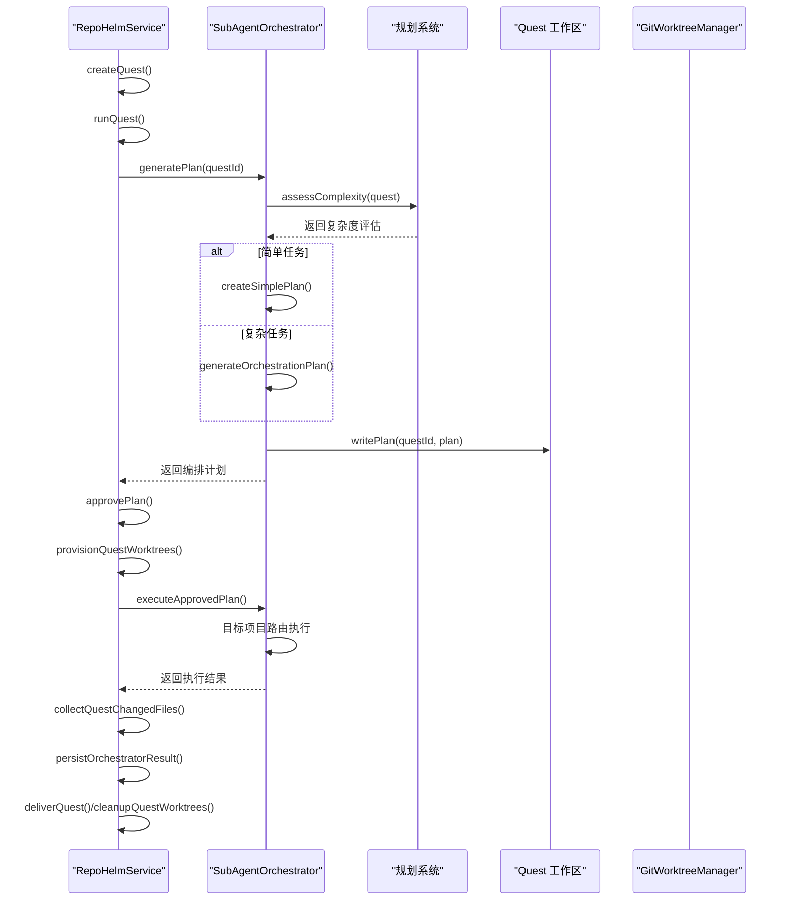
```mermaid
sequenceDiagram
participant S as "RepoHelmService"
participant O as "SubAgentOrchestrator"
participant P as "规划系统"
participant QW as "Quest 工作区"
participant G as "GitWorktreeManager"
S->>S : createQuest()
S->>S : runQuest()
S->>O : generatePlan(questId)
O->>P : assessComplexity(quest)
P-->>O : 返回复杂度评估
alt 简单任务
O->>O : createSimplePlan()
else 复杂任务
O->>O : generateOrchestrationPlan()
end
O->>QW : writePlan(questId, plan)
O-->>S : 返回编排计划
S->>S : approvePlan()
S->>S : provisionQuestWorktrees()
S->>O : executeApprovedPlan()
O->>O : 目标项目路由执行
O-->>S : 返回执行结果
S->>S : collectQuestChangedFiles()
S->>S : persistOrchestratorResult()
S->>S : deliverQuest()/cleanupQuestWorktrees()
```

**图表来源**
- [packages/core/src/service.ts](file://packages/core/src/service.ts)
- [packages/core/src/orchestrator.ts](file://packages/core/src/orchestrator.ts)
- [packages/core/src/planning.ts](file://packages/core/src/planning.ts)
- [packages/core/src/quest-workspace.ts](file://packages/core/src/quest-workspace.ts)
- [packages/core/src/git.ts](file://packages/core/src/git.ts)
- [packages/core/src/providers.ts](file://packages/core/src/providers.ts)
- [packages/core/src/cli.ts](file://packages/core/src/cli.ts)
- [packages/core/src/agent.ts](file://packages/core/src/agent.ts)

**章节来源**
- [packages/core/src/service.ts](file://packages/core/src/service.ts)
- [packages/core/src/orchestrator.ts](file://packages/core/src/orchestrator.ts)
- [packages/core/src/planning.ts](file://packages/core/src/planning.ts)
- [packages/core/src/quest-workspace.ts](file://packages/core/src/quest-workspace.ts)
- [packages/core/src/git.ts](file://packages/core/src/git.ts)

### Quest 工作区管理
- **新增**：QuestWorkspaceManager
  - writePlan/readPlan：计划文件的持久化与读取，支持 Markdown 格式
  - writeWorkerArtifact：工件文件的存储，按步骤和代理名称命名
  - listArtifacts：工件文件列表的查询
  - 计划文件格式：包含 Quest ID、生成时间、摘要、步骤详情和备注
  - 工件文件命名：stepId-agentName.md，支持步骤级别的结果追踪

**章节来源**
- [packages/core/src/quest-workspace.ts](file://packages/core/src/quest-workspace.ts)

### 知识库与文件存储
- KnowledgeFileStore：将知识项渲染为 Markdown 文件，文件名包含标题与 ID，元数据通过 YAML front matter 表达
- RepoHelmService 在创建项目与 Quest 时写入知识文件，确保状态中的知识项与文件系统一致

**章节来源**
- [packages/core/src/knowledge.ts](file://packages/core/src/knowledge.ts)
- [packages/core/src/service.ts](file://packages/core/src/service.ts)

### Agent 后端与调度
- AgentBackendRegistry：聚合多种后端实现
  - MockAgentBackend：内置后端，用于 MVP 闭环验证
  - ExternalCliAgentBackend：通过环境变量配置外部 CLI 命令模板，在 worktree 中执行
  - OpenAICompatibleAgentBackend：通过 OpenAI 兼容接口调用 Provider，生成实现产物
- RepoHelmService 在 runQuest 中根据配置选择后端并评估命令权限

**章节来源**
- [packages/core/src/agent.ts](file://packages/core/src/agent.ts)
- [packages/core/src/service.ts](file://packages/core/src/service.ts)

### Provider 与 CLI 集成
- ProviderRegistry：统一模型提供商注册表，支持多厂商模型列表拉取与解析
- LocalCliRegistry：检测本地 CLI 可用性，支持实时模型拉取与回退策略，进行真实连通性测试

**章节来源**
- [packages/core/src/providers.ts](file://packages/core/src/providers.ts)
- [packages/core/src/cli.ts](file://packages/core/src/cli.ts)
- [packages/core/src/service.ts](file://packages/core/src/service.ts)

## 专家团编排系统

### ExpertOrchestrator：专家编排器
ExpertOrchestrator 是专家团编排系统的核心组件，实现了动态专家团模式，支持以下关键功能：

- **专家会话管理**：创建和管理 ExpertSession，跟踪任务树状态和执行进度
- **任务树生成**：基于入口 Agent 的分析能力生成初始任务树
- **用户交互调整**：允许用户查看、编辑和调整任务树和验收用例
- **TDD 测试执行**：集成 TDD Pipeline，实现测试驱动的开发执行模式
- **Agent Pool 协调**：管理专家原型和动态代理，协调任务分配和执行

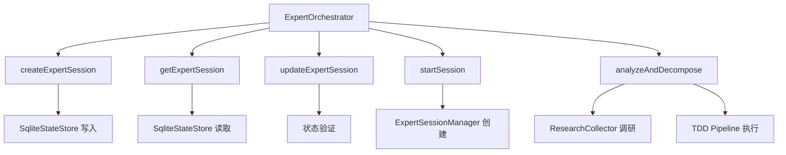
```mermaid
flowchart TD
A["ExpertOrchestrator"] --> B["createExpertSession"]
A --> C["getExpertSession"]
A --> D["updateExpertSession"]
A --> E["startSession"]
A --> F["analyzeAndDecompose"]
B --> G["SqliteStateStore 写入"]
C --> H["SqliteStateStore 读取"]
D --> I["状态验证"]
E --> J["ExpertSessionManager 创建"]
F --> K["ResearchCollector 调研"]
F --> L["TDD Pipeline 执行"]
```

**图表来源**
- [packages/core/src/expert/orchestrator.ts](file://packages/core/src/expert/orchestrator.ts)
- [packages/core/src/service.ts](file://packages/core/src/service.ts)
- [packages/core/src/store.ts](file://packages/core/src/store.ts)

**章节来源**
- [packages/core/src/expert/orchestrator.ts](file://packages/core/src/expert/orchestrator.ts)
- [packages/core/src/service.ts](file://packages/core/src/service.ts)
- [packages/core/src/store.ts](file://packages/core/src/store.ts)

### Agent Pool 管理机制
Agent Pool 管理器支持专家原型注册和动态代理创建，提供完整的代理生命周期管理：

- **专家原型注册**：预设专家原型注册到 Pool，支持系统内置和用户自定义专家
- **动态代理创建**：入口 Agent 可以在运行时请求创建临时 Agent，支持 TTL 限制
- **代理实例化**：根据原型创建代理实例，分配到具体任务执行
- **代理回收**：管理代理的生命周期，支持自动回收和资源清理

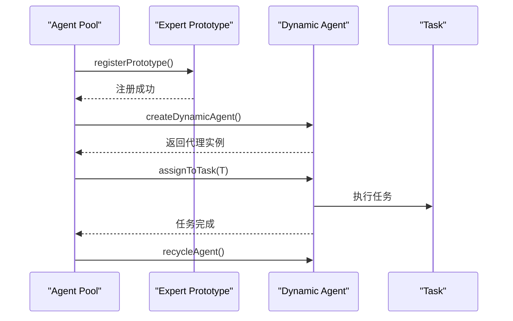
```mermaid
sequenceDiagram
participant AP as "Agent Pool"
participant EP as "Expert Prototype"
participant DA as "Dynamic Agent"
participant T as "Task"
AP->>EP : registerPrototype()
EP-->>AP : 注册成功
AP->>DA : createDynamicAgent()
DA-->>AP : 返回代理实例
AP->>DA : assignToTask(T)
DA->>T : 执行任务
DA-->>AP : 任务完成
AP->>DA : recycleAgent()
```

**图表来源**
- [packages/core/src/expert/agent-pool.ts](file://packages/core/src/expert/agent-pool.ts)

**章节来源**
- [packages/core/src/expert/agent-pool.ts](file://packages/core/src/expert/agent-pool.ts)

### TDD Pipeline 流程
TDD Pipeline 实现测试驱动的开发执行模式，包括以下关键步骤：

- **验收用例生成**：基于任务需求生成验收测试用例
- **具体测试执行**：运行测试确认当前实现状态（红灯）
- **专家实现**：由专家代理实现代码（绿灯）
- **测试验证**：运行测试验证实现是否满足要求
- **红绿重构循环**：重复执行直到测试通过或达到迭代上限

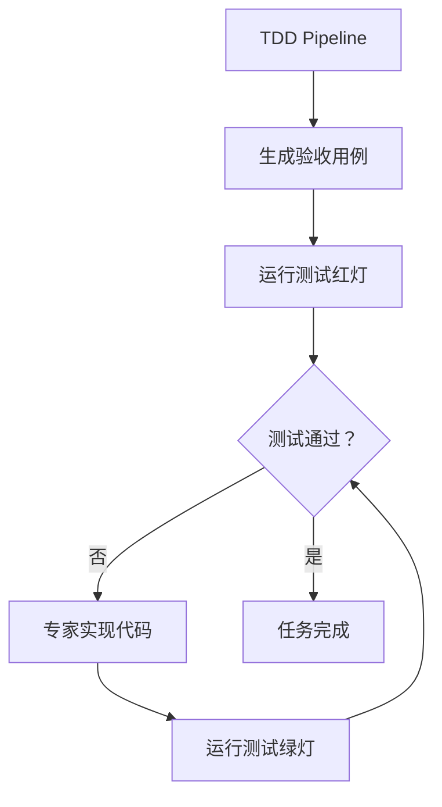
```mermaid
flowchart TD
A["TDD Pipeline"] --> B["生成验收用例"]
B --> C["运行测试红灯"]
C --> D{"测试通过？"}
D --> |否| E["专家实现代码"]
E --> F["运行测试绿灯"]
F --> D
D --> |是| G["任务完成"]
```

**图表来源**
- [packages/core/src/expert/tdd-pipeline.ts](file://packages/core/src/expert/tdd-pipeline.ts)

**章节来源**
- [packages/core/src/expert/tdd-pipeline.ts](file://packages/core/src/expert/tdd-pipeline.ts)

### 代码调研收集器
代码调研收集器伴随任务拆解过程收集相关代码上下文，支持智能代码分析：

- **伴随扫描**：入口 Agent 每分析一个子任务，同步调用 Research Collector
- **代码上下文收集**：收集相关代码文件、函数、逻辑片段
- **智能分析**：分析代码结构、依赖关系、潜在问题
- **结果写入**：将调研结果直接写入任务节点的 `research` 字段

```mermaid
sequenceDiagram
participant EA as "入口 Agent"
participant RC as "代码调研收集器"
participant CT as "代码树"
EA->>RC : 分析子任务
RC->>CT : 收集相关代码
CT-->>RC : 返回代码上下文
RC-->>EA : 返回调研结果
EA->>EA : 写入任务节点 research 字段
```

**图表来源**
- [packages/core/src/expert/research-collector.ts](file://packages/core/src/expert/research-collector.ts)

**章节来源**
- [packages/core/src/expert/research-collector.ts](file://packages/core/src/expert/research-collector.ts)

### 专家会话管理器
专家会话管理器管理 ExpertSession 的完整生命周期，包括状态跟踪和任务树管理：

- **会话状态管理**：跟踪 ExpertSession 的生命周期状态（analyzing、awaiting_confirmation、confirmed、executing、completed、failed）
- **任务树管理**：维护任务树结构，支持扁平化任务列表
- **进度跟踪**：实时跟踪任务执行进度和状态变更
- **产物管理**：管理任务产生的各种产物（文件变更、测试结果、研究摘要等）

```mermaid
stateDiagram-v2
[*] --> analyzing
analyzing --> awaiting_confirmation : 生成初版任务树
awaiting_confirmation --> confirmed : 用户确认
awaiting_confirmation --> analyzing : 用户调整
confirmed --> executing : 启动 TDD 流程
executing --> completed : 所有任务完成
executing --> failed : 任务执行失败
completed --> [*]
failed --> [*]
```

**图表来源**
- [packages/core/src/expert/session-manager.ts](file://packages/core/src/expert/session-manager.ts)

**章节来源**
- [packages/core/src/expert/session-manager.ts](file://packages/core/src/expert/session-manager.ts)

### API 设计与集成
专家团编排系统提供了完整的 API 接口设计，支持专家会话的创建、管理和监控：

- **会话管理 API**：创建、获取、更新专家会话状态
- **任务管理 API**：修改任务节点、新增任务节点
- **聊天交互 API**：向入口 Agent 发送消息进行交互
- **验收测试 API**：管理验收用例和测试执行
- **实时推送 API**：通过 SSE 推送任务执行状态和结果

```mermaid
graph LR
A["客户端"] --> B["/api/expert/session"]
B --> C["创建会话"]
B --> D["获取会话状态"]
B --> E["更新会话"]
A --> F["/api/expert/session/:id/chat"]
F --> G["聊天交互"]
A --> H["/api/expert/session/:id/task"]
H --> I["修改任务"]
H --> J["新增任务"]
A --> K["/api/expert/session/:id/confirm"]
K --> L["用户确认执行"]
A --> M["/api/expert/session/:id/stream"]
M --> N["SSE 实时推送"]
```

**图表来源**
- [docs/superpowers/specs/2026-06-10-expert-orchestration-design.md](file://docs/superpowers/specs/2026-06-10-expert-orchestration-design.md)

**章节来源**
- [docs/superpowers/specs/2026-06-10-expert-orchestration-design.md](file://docs/superpowers/specs/2026-06-10-expert-orchestration-design.md)

### 迁移策略
专家团编排系统提供了从旧 Quest 模型到新专家会话的迁移策略：

- **数据映射规则**：定义旧数据到新数据的映射关系
- **迁移流程**：启动时检测未迁移 Quest，逐个转换为 ExpertSession
- **状态标记**：标记旧数据 migratedToExpertSession: true
- **兼容性处理**：旧 Quest UI 只读展示，提供友好提示

**章节来源**
- [packages/core/src/expert/migration.ts](file://packages/core/src/expert/migration.ts)

## 依赖关系分析
- RepoHelmService 对外依赖 StateStore、GitWorktreeManager、KnowledgeFileStore、ProviderRegistry、LocalCliRegistry、AgentBackendRegistry
- **新增**：ExpertOrchestrator 依赖 RepoHelmService 提供的状态访问和工具调用能力
- **新增**：ExpertSessionManager 依赖 ExpertOrchestrator 提供的会话管理功能
- **新增**：Agent Pool 管理器依赖 ExpertOrchestrator 提供的代理生命周期管理
- **新增**：代码调研收集器依赖 ExpertOrchestrator 提供的伴随扫描能力
- **新增**：TDD Pipeline 依赖 ExpertOrchestrator 提供的测试执行环境
- **新增**：SubAgentOrchestrator 依赖 RepoHelmService 提供的状态访问和工具调用能力
- **新增**：规划系统依赖 QuestComplexity 评估接口和 generateOrchestrationPlan
- **新增**：Quest 工作区管理依赖 QuestWorkspaceManager 进行文件持久化
- **新增**：内置子代理种子依赖 RepoHelmService 的子代理管理功能
- **新增**：知识库工具集、用户偏好工具集、失败模式工具集分别提供特定领域的工具方法
- **新增**：系统代理调用机制依赖对应的工具处理器和模型后端
- **新增**：流式 Spec 生成系统依赖 streamLlmWithModelKit 和 SSE 服务器端点
- **新增**：前端流式 API 依赖 EventSource 和流式事件处理
- 各组件之间通过清晰的接口耦合，便于替换与扩展
- 类型定义集中于 types.ts，确保跨模块一致性

```mermaid
graph LR
S["RepoHelmService"] --> ST["StateStore"]
S --> G["GitWorktreeManager"]
S --> KF["KnowledgeFileStore"]
S --> PR["ProviderRegistry"]
S --> LR["LocalCliRegistry"]
S --> AR["AgentBackendRegistry"]
S --> O["SubAgentOrchestrator"]
S --> EO["ExpertOrchestrator"]
S --> SM["ExpertSessionManager"]
S --> P["规划系统"]
S --> QW["Quest 工作区"]
S --> SA["SeedAgents"]
S --> HT["用户偏好工具集"]
S --> FT["失败模式工具集"]
S --> KT["知识库工具集"]
S --> T["Types"]
S --> LLM["流式LLM调用"]
S --> SS["SSE服务器端点"]
S --> WS["Web流式API"]
O --> S
O --> P
O --> QW
EO --> S
EO --> SM
EO --> AP["Agent Pool"]
EO --> RC["Research Collector"]
EO --> TP["TDD Pipeline"]
SM --> S
AP --> EO
RC --> EO
TP --> EO
P --> S
QW --> S
SA --> S
HT --> S
FT --> S
KT --> S
SS --> S
WS --> SS
```

**图表来源**
- [packages/core/src/service.ts](file://packages/core/src/service.ts)
- [packages/core/src/types.ts](file://packages/core/src/types.ts)
- [packages/core/src/expert/types.ts](file://packages/core/src/expert/types.ts)
- [packages/core/src/expert/orchestrator.ts](file://packages/core/src/expert/orchestrator.ts)
- [packages/core/src/expert/session-manager.ts](file://packages/core/src/expert/session-manager.ts)
- [packages/core/src/expert/agent-pool.ts](file://packages/core/src/expert/agent-pool.ts)
- [packages/core/src/expert/research-collector.ts](file://packages/core/src/expert/research-collector.ts)
- [packages/core/src/expert/tdd-pipeline.ts](file://packages/core/src/expert/tdd-pipeline.ts)
- [packages/core/src/llm.ts](file://packages/core/src/llm.ts)
- [apps/server/src/index.ts](file://apps/server/src/index.ts)
- [apps/web/src/api.ts](file://apps/web/src/api.ts)

**章节来源**
- [packages/core/src/service.ts](file://packages/core/src/service.ts)
- [packages/core/src/types.ts](file://packages/core/src/types.ts)

## 性能考量
- 状态持久化
  - SQLite 相比 JSON 更适合频繁写入与并发访问；注意磁盘 I/O 与 WAL/同步策略
  - 迁移逻辑仅在首次读取旧格式时触发，避免重复开销
  - **新增**：原子状态突变通过串行化队列避免并发写入冲突，提高数据一致性
  - **新增**：专家会话存储采用 SQLite 专用表，支持高效的查询和更新操作
- 模型列表缓存
  - ProviderRegistry 的模型列表带 TTL 缓存，减少对外部 API 的频繁调用
- Git 操作
  - worktree 创建/删除为重量级操作，应避免不必要的重复；清理与重试需谨慎
- CLI/Provider 调用
  - 外部 CLI 与 Provider 调用带有超时控制，建议合理设置超时参数
- 审计与日志
  - 审计日志与事件列表限制长度，避免无限增长导致性能下降
- **新增**：规划系统性能优化
  - QuestComplexity 评估：O(n) 时间复杂度，n 为需求文本长度
  - 快速路径：简单任务直接生成单步计划，避免 LLM 调用开销
  - 复杂度阈值：单项目、需求长度<200字符、无显式步骤
  - 工具调用循环限制：MAX_TOOL_LOOP_ITERATIONS=8，防止无限循环
  - 目标项目路由：按目标项目 ID 直接定位执行位置，避免全局搜索
- **新增**：流式 Spec 生成性能优化
  - placeholderSpec 占位符：立即显示，避免空白界面等待
  - streamLlmWithModelKit：增量内容输出，减少内存占用
  - SSE 事件推送：350ms 节奏控制，平衡用户体验和服务器负载
  - Fake 模式：REPOHELM_FAKE_MODELS 环境变量，便于开发测试
  - 错误处理：优雅降级，确保系统稳定性
- **新增**：专家会话管理性能优化
  - 专家会话缓存：ExpertSessionManager 内存缓存提升查询性能
  - 状态转换验证：预先验证状态转换合法性，避免无效操作
  - 专家原型缓存：AgentPool 预加载内置专家原型，避免重复创建
  - 动态代理 TTL：限制动态代理生命周期，避免资源泄漏
  - 代码调研缓存：缓存调研结果，避免重复扫描相同代码
  - SQLite 查询优化：专家会话表建立适当的索引，支持按 quest_id 过滤
- **新增**：知识库性能优化
  - 语义搜索：基于关键词和信号匹配，支持大规模知识库检索
  - 索引缓存：增量索引更新，避免重复扫描整个仓库
- **新增**：用户偏好性能优化
  - 置信度衰减：避免偏好过度累积影响决策质量
  - 最大示例数：限制每个偏好的示例数量，控制内存使用
- **新增**：失败模式性能优化
  - 关键词匹配：基于信号和关键词的快速匹配算法
  - 严重性排序：优先处理高严重性模式，提高风险响应效率

## 故障排查指南
- 状态读取失败或为空
  - 检查 .repohelm/state.sqlite 是否存在；如不存在，bootstrap 会自动生成
  - 若存在旧 .repohelm/state.json，SqliteStateStore 会自动迁移
  - **新增**：检查_mutateState队列是否阻塞，重启服务可清空队列
  - **新增**：检查 expert_sessions 表是否存在，必要时手动创建
- Git worktree 创建失败
  - 检查仓库路径、默认分支与目标 worktree 路径是否冲突
  - 确认 Git 可用且具有相应权限
- Agent 后端被阻止
  - 检查安全策略中的命令白名单；确认后端命令模板已正确配置
- Provider 模型列表为空
  - 检查 API Key、Base URL 与网络连通性；必要时刷新缓存
- 交付失败
  - 检查验证命令返回、提交状态与 PR 创建条件；确认已启用 gh 且已认证
- **新增**：知识库问题
  - 检查知识库索引状态：确认 lastIndexedSha 和 status 字段正常
  - 验证知识库分支设置：确保 knowledgeBranch 配置正确
  - 确认文件系统权限：检查 .repohelm/knowledge 目录可写性
- **新增**：用户偏好问题
  - 检查偏好键唯一性：同类别下相同键会被合并更新
  - 验证置信度范围：确保 0.0-1.0 之间的有效值
  - 确认偏好示例数量：最多保留 5 个示例
- **新增**：失败模式问题
  - 检查失败模式分类有效性：确保使用预定义的分类枚举
  - 验证缓解方案完整性：每个记录的失败模式必须包含具体可行的缓解措施
  - 确认信号关键词：用于检测相似场景的关键字列表
- **新增**：系统代理问题
  - 检查代理模式：确保系统代理的 mode 属性设置为 "system"
  - 验证工具权限：确认代理的 allowedTools 列表包含所需工具
  - 确认模型配置：检查系统代理使用的 ModelKit 类型为 BYOK
- **新增**：规划系统问题
  - 检查 QuestComplexity 评估结果：确认需求文本长度、项目数量和步骤关键词
  - 验证快速路径是否正确触发：简单任务应直接生成单步计划
  - 检查规划系统日志：确认 generateOrchestrationPlan 执行状态
- **新增**：编排系统问题
  - 检查入口子代理是否已设置；确认子代理池中存在可用代理
  - 查看编排计划文件是否存在；检查子代理权限配置
  - 确认 ModelKit 配置正确，模型可用
  - 验证目标项目路由：检查 step.targetProjectId 是否正确
- **新增**：原子状态突变失败
  - 检查_mutationQueue队列状态，避免长时间阻塞
  - 确认并发操作不会同时修改同一状态字段
- **新增**：专家会话管理问题
  - 检查 ExpertSession 状态：确认会话状态转换符合预期
  - 验证专家原型注册：确认内置专家原型正确加载
  - 检查动态代理创建：确认代理数量未超过最大限制
  - 验证代码调研结果：确认调研收集器正常工作
  - 确认专家会话存储：检查 SQLite 表结构和数据完整性
  - 检查状态转换验证：确认状态转换符合合法状态图
  - 验证 TDD 流程：确认测试用例生成和执行流程正常
  - 确认 API 接口可用：检查专家会话相关 API 是否正常响应
  - 检查 SSE 推送：确认实时状态推送正常
  - 验证迁移流程：确认旧 Quest 数据正确迁移到新专家会话
- **新增**：Agent Pool 问题
  - 检查代理原型注册：确认专家原型正确注册到池中
  - 验证动态代理创建：确认代理创建数量和 TTL 设置
  - 检查代理激活状态：确认代理使用状态正确更新
  - 验证代理匹配算法：确认能力匹配逻辑正确
- **新增**：TDD Pipeline 问题
  - 检查验收用例生成：确认测试用例生成逻辑正确
  - 验证测试执行：确认测试运行和结果验证流程正常
  - 检查红绿重构循环：确认循环次数限制和退出条件
  - 验证测试结果存储：确认测试结果正确持久化
- **新增**：流式 Spec 生成问题
  - 检查 placeholderSpec 是否正确返回占位符
  - 验证 streamLlmWithModelKit 是否正确解析 SSE 流
  - 确认 SSE 服务器端点 /api/quests/:id/spec-stream 是否正常响应
  - 检查前端 streamQuestSpec API 是否正确处理事件
  - 验证 SPEC_EVENT_PACE_MS 节奏控制是否生效
  - 确认 Fake 模式下的文本模拟是否正常工作
  - 检查错误处理：确认 error 事件是否正确发送

**章节来源**
- [packages/core/src/service.test.ts](file://packages/core/src/service.test.ts)
- [packages/core/src/orchestrator.test.ts](file://packages/core/src/orchestrator.test.ts)
- [packages/core/src/git.ts](file://packages/core/src/git.ts)
- [packages/core/src/providers.ts](file://packages/core/src/providers.ts)
- [packages/core/src/agent.ts](file://packages/core/src/agent.ts)
- [packages/core/src/orchestrator.ts](file://packages/core/src/orchestrator.ts)
- [packages/core/src/planning.ts](file://packages/core/src/planning.ts)
- [packages/core/src/tools/habits.ts](file://packages/core/src/tools/habits.ts)
- [packages/core/src/tools/failure.ts](file://packages/core/src/tools/failure.ts)
- [packages/core/src/tools/knowledge.ts](file://packages/core/src/tools/knowledge.ts)
- [packages/core/src/expert/types.ts](file://packages/core/src/expert/types.ts)
- [packages/core/src/expert/orchestrator.ts](file://packages/core/src/expert/orchestrator.ts)
- [packages/core/src/expert/session-manager.ts](file://packages/core/src/expert/session-manager.ts)
- [packages/core/src/expert/agent-pool.ts](file://packages/core/src/expert/agent-pool.ts)
- [packages/core/src/expert/research-collector.ts](file://packages/core/src/expert/research-collector.ts)
- [packages/core/src/expert/tdd-pipeline.ts](file://packages/core/src/expert/tdd-pipeline.ts)
- [packages/core/src/expert/migration.ts](file://packages/core/src/expert/migration.ts)
- [packages/core/src/llm.ts](file://packages/core/src/llm.ts)
- [apps/server/src/index.ts](file://apps/server/src/index.ts)
- [apps/server/src/sse.ts](file://apps/server/src/sse.ts)
- [apps/web/src/api.ts](file://apps/web/src/api.ts)
- [apps/web/src/App.tsx](file://apps/web/src/App.tsx)

## 结论
RepoHelm 核心服务模块以 RepoHelmService 为中心，围绕状态持久化、工作流编排、安全与审计、Git/Provider/CLI/Agent 集成构建了完整的 Quest 工作区原型。通过 SQLite 状态存储与规范化迁移、轻量 Spec 与能力推荐、多 Agent 后端调度与 worktree 隔离，实现了从需求到交付的闭环。

**新增**的 Quest Spec 流式生成系统显著提升了用户体验和系统响应性：
- **占位符机制**：placeholderSpec 立即显示有效内容，避免空白等待
- **实时分析**：streamLlmWithModelKit 提供增量内容输出，支持流式显示
- **事件推送**：SSE 服务器端点提供完整的事件推送机制
- **前端集成**：streamQuestSpec API 支持完整的流式事件处理
- **SPEC_EVENT_PACE_MS**：350ms 节奏控制，确保流畅的用户体验
- **降级机制**：JSON 解析失败时自动回退到传统生成方法
- **错误处理**：完善的错误处理和用户提示机制

**新增**的专家团编排系统进一步增强了系统的智能化水平和执行能力：
- **专家会话管理**：提供完整的 ExpertSession 生命周期管理，支持任务树生成、用户交互调整、TDD 测试执行
- **Agent Pool 管理**：支持专家原型注册和动态代理创建，提供灵活的代理资源管理
- **TDD Pipeline**：实现测试驱动的开发执行模式，确保代码质量和测试覆盖率
- **代码调研收集**：伴随任务拆解过程收集相关代码上下文，提供智能代码分析能力
- **专家会话存储**：通过 SQLite 专用表提供高效的状态持久化和查询能力
- **状态转换验证**：确保专家会话状态的合法性和一致性
- **API 设计**：提供完整的专家会话管理 API，支持实时交互和状态监控
- **迁移策略**：确保从旧 Quest 模型到新专家会话的平滑过渡
- **UI Inspector Tab**：重构前端界面，提供全景展示专家编排信息的可视化界面

这些新增功能将 RepoHelm 从传统的静态编排模式升级为动态专家团模式，显著提升了系统的智能化水平、灵活性和执行效率，为复杂项目的自动化管理和智能执行提供了强有力的支持。流式 Spec 生成系统特别增强了用户交互体验，使用户能够实时看到需求分析过程和生成结果，提高了系统的透明度和可信度。

## 附录

### 使用模式与示例路径
- 初始化与读取状态
  - 示例路径：[packages/core/src/service.test.ts](file://packages/core/src/service.test.ts)
- 创建工作区与项目
  - 示例路径：[packages/core/src/service.test.ts](file://packages/core/src/service.test.ts)
- 创建 Quest 并运行
  - 示例路径：[packages/core/src/service.test.ts](file://packages/core/src/service.test.ts)
- **新增**：专家会话创建与管理
  - 示例路径：[packages/core/src/service.ts](file://packages/core/src/service.ts)
  - 专家会话存储：[packages/core/src/store.ts](file://packages/core/src/store.ts)
  - 专家会话类型：[packages/core/src/expert/types.ts](file://packages/core/src/expert/types.ts)
- **新增**：Agent Pool 管理
  - 示例路径：[packages/core/src/expert/agent-pool.ts](file://packages/core/src/expert/agent-pool.ts)
- **新增**：TDD Pipeline 执行
  - 示例路径：[packages/core/src/expert/tdd-pipeline.ts](file://packages/core/src/expert/tdd-pipeline.ts)
- **新增**：代码调研收集
  - 示例路径：[packages/core/src/expert/research-collector.ts](file://packages/core/src/expert/research-collector.ts)
- **新增**：专家会话管理器
  - 示例路径：[packages/core/src/expert/session-manager.ts](file://packages/core/src/expert/session-manager.ts)
- **新增**：知识库管理
  - 示例路径：[packages/core/src/service.test.ts](file://packages/core/src/service.test.ts)
  - 知识库工具：[packages/core/src/tools/knowledge.ts](file://packages/core/src/tools/knowledge.ts)
- **新增**：用户偏好管理
  - 示例路径：[packages/core/src/service.test.ts](file://packages/core/src/service.test.ts)
  - 用户偏好工具：[packages/core/src/tools/habits.ts](file://packages/core/src/tools/habits.ts)
- **新增**：失败模式分析
  - 示例路径：[packages/core/src/service.test.ts](file://packages/core/src/service.test.ts)
  - 失败模式工具：[packages/core/src/tools/failure.ts](file://packages/core/src/tools/failure.ts)
- **新增**：系统代理调用
  - 示例路径：[packages/core/src/service.test.ts](file://packages/core/src/service.test.ts)
  - 系统代理 UI：[e2e/system-agents.spec.ts](file://e2e/system-agents.spec.ts)
- **新增**：流式 Spec 生成
  - 示例路径：[packages/core/src/service.test.ts](file://packages/core/src/service.test.ts)
  - 流式 LLM 调用：[packages/core/src/llm.ts](file://packages/core/src/llm.ts)
  - SSE 服务器端点：[apps/server/src/index.ts](file://apps/server/src/index.ts)
  - 前端流式 API：[apps/web/src/api.ts](file://apps/web/src/api.ts)
  - 前端集成：[apps/web/src/App.tsx](file://apps/web/src/App.tsx)
- 交付与清理
  - 示例路径：[packages/core/src/service.test.ts](file://packages/core/src/service.test.ts)
- 安全策略与审计
  - 示例路径：[packages/core/src/service.test.ts](file://packages/core/src/service.test.ts)
- Provider 与 CLI 集成
  - 示例路径：[packages/core/src/service.test.ts](file://packages/core/src/service.test.ts)

### 关键 API 一览（示例路径）
- 状态管理
  - [packages/core/src/service.ts](file://packages/core/src/service.ts)
  - [packages/core/src/store.ts](file://packages/core/src/store.ts)
- Git 工作流
  - [packages/core/src/git.ts](file://packages/core/src/git.ts)
- 知识库
  - [packages/core/src/knowledge.ts](file://packages/core/src/knowledge.ts)
  - [packages/core/src/tools/knowledge.ts](file://packages/core/src/tools/knowledge.ts)
- Provider/CLI
  - [packages/core/src/providers.ts](file://packages/core/src/providers.ts)
  - [packages/core/src/cli.ts](file://packages/core/src/cli.ts)
- Agent 后端
  - [packages/core/src/agent.ts](file://packages/core/src/agent.ts)
- **新增**：规划系统
  - [packages/core/src/planning.ts](file://packages/core/src/planning.ts)
- **新增**：编排系统
  - [packages/core/src/orchestrator.ts](file://packages/core/src/orchestrator.ts)
- **新增**：专家编排系统
  - [packages/core/src/expert/orchestrator.ts](file://packages/core/src/expert/orchestrator.ts)
  - [packages/core/src/expert/session-manager.ts](file://packages/core/src/expert/session-manager.ts)
  - [packages/core/src/expert/agent-pool.ts](file://packages/core/src/expert/agent-pool.ts)
  - [packages/core/src/expert/research-collector.ts](file://packages/core/src/expert/research-collector.ts)
  - [packages/core/src/expert/tdd-pipeline.ts](file://packages/core/src/expert/tdd-pipeline.ts)
  - [packages/core/src/expert/migration.ts](file://packages/core/src/expert/migration.ts)
  - [packages/core/src/expert/types.ts](file://packages/core/src/expert/types.ts)
- **新增**：Quest 工作区
  - [packages/core/src/quest-workspace.ts](file://packages/core/src/quest-workspace.ts)
- **新增**：子代理管理
  - [packages/core/src/service.ts](file://packages/core/src/service.ts)
- **新增**：用户偏好管理
  - [packages/core/src/service.ts](file://packages/core/src/service.ts)
  - [packages/core/src/tools/habits.ts](file://packages/core/src/tools/habits.ts)
- **新增**：失败模式分析
  - [packages/core/src/service.ts](file://packages/core/src/service.ts)
  - [packages/core/src/tools/failure.ts](file://packages/core/src/tools/failure.ts)
- **新增**：系统代理调用
  - [packages/core/src/service.ts](file://packages/core/src/service.ts)
- **新增**：流式 Spec 生成
  - [packages/core/src/service.ts](file://packages/core/src/service.ts)
  - [packages/core/src/llm.ts](file://packages/core/src/llm.ts)
  - [apps/server/src/index.ts](file://apps/server/src/index.ts)
  - [apps/web/src/api.ts](file://apps/web/src/api.ts)
  - [apps/web/src/App.tsx](file://apps/web/src/App.tsx)
- 类型定义
  - [packages/core/src/types.ts](file://packages/core/src/types.ts)
  - [packages/core/src/expert/types.ts](file://packages/core/src/expert/types.ts)
- **新增**：Web API
  - [apps/web/src/api.ts](file://apps/web/src/api.ts)
- **新增**：服务器端点
  - [apps/server/src/index.ts](file://apps/server/src/index.ts)
  - [apps/server/src/index.test.ts](file://apps/server/src/index.test.ts)