# 核心服务模块

<cite>
**本文档引用的文件**
- [packages/core/src/service.ts](file://packages/core/src/service.ts)
- [packages/core/src/store.ts](file://packages/core/src/store.ts)
- [packages/core/src/types.ts](file://packages/core/src/types.ts)
- [packages/core/src/git.ts](file://packages/core/src/git.ts)
- [packages/core/src/knowledge.ts](file://packages/core/src/knowledge.ts)
- [packages/core/src/providers.ts](file://packages/core/src/providers.ts)
- [packages/core/src/cli.ts](file://packages/core/src/cli.ts)
- [packages/core/src/agent.ts](file://packages/core/src/agent.ts)
- [packages/core/src/orchestrator.ts](file://packages/core/src/orchestrator.ts)
- [packages/core/src/planning.ts](file://packages/core/src/planning.ts)
- [packages/core/src/quest-workspace.ts](file://packages/core/src/quest-workspace.ts)
- [packages/core/src/seed-agents.ts](file://packages/core/src/seed-agents.ts)
- [packages/core/src/tools/habits.ts](file://packages/core/src/tools/habits.ts)
- [packages/core/src/tools/failure.ts](file://packages/core/src/tools/failure.ts)
- [packages/core/src/tools/knowledge.ts](file://packages/core/src/tools/knowledge.ts)
- [apps/server/src/index.ts](file://apps/server/src/index.ts)
- [apps/server/src/index.test.ts](file://apps/server/src/index.test.ts)
- [apps/web/src/api.ts](file://apps/web/src/api.ts)
- [e2e/system-agents.spec.ts](file://e2e/system-agents.spec.ts)
- [packages/core/src/service.test.ts](file://packages/core/src/service.test.ts)
- [packages/core/src/orchestrator.test.ts](file://packages/core/src/orchestrator.test.ts)
- [README.md](file://README.md)
</cite>

## 更新摘要
**变更内容**
- 新增知识管理服务方法：知识库搜索、读取、写入、索引和上下文获取
- 新增用户偏好跟踪服务：用户偏好记录、查询、建议和删除功能
- 新增失败模式分析服务：失败模式记录、搜索、风险检查和更新
- 扩展的服务层能力：系统代理调用、原子状态突变、增强需求处理
- 新增内置子代理种子：用户习惯助手和失败经验助手

## 目录
1. [简介](#简介)
2. [项目结构](#项目结构)
3. [核心组件](#核心组件)
4. [架构总览](#架构总览)
5. [详细组件分析](#详细组件分析)
6. [依赖关系分析](#依赖关系分析)
7. [性能考量](#性能考量)
8. [故障排查指南](#故障排查指南)
9. [结论](#结论)
10. [附录](#附录)

## 简介
本文件面向 RepoHelm 的核心服务模块，聚焦以下目标：
- 深入解析 RepoHelmService 的业务逻辑与状态管理机制
- 解释 StateStore 的设计与实现（含 SQLite 数据库与迁移）
- 详述 Quest 工作流的编排流程（Spec 生成、Agent 后端调度、工作树管理）
- **新增**：知识管理服务方法（搜索、读取、写入、索引、上下文获取）
- **新增**：用户偏好跟踪服务（记录、查询、建议、删除）
- **新增**：失败模式分析服务（记录、搜索、风险检查、更新）
- **新增**：系统代理调用机制和内置子代理种子
- **新增**：原子状态突变处理和增强需求处理能力
- 提供使用模式与代码示例路径
- 说明与其他组件的集成关系
- 给出常见问题与性能优化建议

RepoHelm 以"虚拟 workspace + 多项目 Quest + Spec 驱动 + worktree 隔离 + Agent 编排 + 知识库"为核心产品方向，核心服务模块负责状态持久化、工作流编排、安全策略与审计、以及与 Git、Provider、CLI、Agent 的集成。

## 项目结构
核心服务模块位于 packages/core，主要文件与职责如下：
- service.ts：RepoHelmService 主控制器，封装所有业务操作与工作流编排
- store.ts：StateStore 抽象与实现（JsonStateStore、SqliteStateStore）
- types.ts：统一的数据模型与类型定义，包含用户偏好和失败模式接口
- git.ts：GitWorktreeManager，负责 Git 仓库健康检查、分支枚举、worktree 创建/删除、变更文件检测、验证/提交/PR 等
- knowledge.ts：知识库文件存储，将知识项渲染为 Markdown 文件
- providers.ts：Provider 注册表，统一拉取各模型提供商的模型列表
- cli.ts：本地 CLI 注册表，检测与测试本地 CLI，合并实时模型
- agent.ts：Agent 后端抽象与实现（Mock、External CLI、OpenAI-Compatible）
- **新增**：orchestrator.ts：子代理编排器，实现多代理协作与任务委派
- **新增**：planning.ts：规划系统，包含 QuestComplexity 评估和计划生成逻辑
- **新增**：quest-workspace.ts：Quest 工作区管理，负责计划文件和工件的持久化
- **新增**：seed-agents.ts：内置子代理种子，提供 Supervisor-Worker 模式的基础代理集
- **新增**：tools/habits.ts：用户偏好工具集，支持偏好记录、查询和建议
- **新增**：tools/failure.ts：失败模式工具集，支持失败记录、搜索和风险检查
- **新增**：tools/knowledge.ts：知识库工具集，支持知识搜索、读取、写入和索引

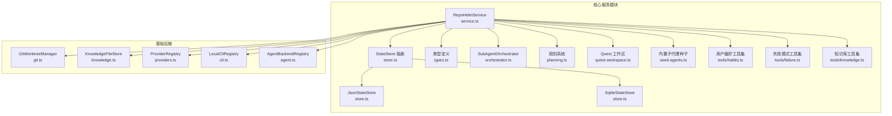

**图表来源**
- [packages/core/src/service.ts](file://packages/core/src/service.ts)
- [packages/core/src/store.ts](file://packages/core/src/store.ts)
- [packages/core/src/orchestrator.ts](file://packages/core/src/orchestrator.ts)
- [packages/core/src/planning.ts](file://packages/core/src/planning.ts)
- [packages/core/src/quest-workspace.ts](file://packages/core/src/quest-workspace.ts)
- [packages/core/src/seed-agents.ts](file://packages/core/src/seed-agents.ts)
- [packages/core/src/git.ts](file://packages/core/src/git.ts)
- [packages/core/src/knowledge.ts](file://packages/core/src/knowledge.ts)
- [packages/core/src/providers.ts](file://packages/core/src/providers.ts)
- [packages/core/src/cli.ts](file://packages/core/src/cli.ts)
- [packages/core/src/agent.ts](file://packages/core/src/agent.ts)
- [packages/core/src/types.ts](file://packages/core/src/types.ts)
- [packages/core/src/tools/habits.ts](file://packages/core/src/tools/habits.ts)
- [packages/core/src/tools/failure.ts](file://packages/core/src/tools/failure.ts)
- [packages/core/src/tools/knowledge.ts](file://packages/core/src/tools/knowledge.ts)

## 核心组件
- RepoHelmService：统一的业务控制器，负责工作区/项目/知识/Quest 的生命周期管理、工作流编排、安全策略与审计、产品就绪度计算等
- **新增**：SubAgentOrchestrator：子代理编排器，实现 Supervisor-Worker 模式的多代理协作，支持复杂度评估、快速路径优化和目标项目执行
- **新增**：规划系统（planning.ts）：包含 QuestComplexity 评估接口、assessComplexity 函数和 generateOrchestrationPlan 实现
- **新增**：Quest 工作区管理（quest-workspace.ts）：负责计划文件和工件的持久化存储
- **新增**：内置子代理种子：提供 Supervisor、Spec Writer、Coder、Reviewer、用户习惯助手、失败经验助手六种预定义子代理，支持一键部署和入口代理设置
- **新增**：知识库工具集（tools/knowledge.ts）：提供知识搜索、读取、写入、索引和上下文获取的工具方法
- **新增**：用户偏好工具集（tools/habits.ts）：提供偏好记录、查询、建议和删除的工具方法
- **新增**：失败模式工具集（tools/failure.ts）：提供失败记录、搜索、风险检查和更新的工具方法
- StateStore：状态持久化抽象，提供 read/write 接口；默认使用 SQLite 存储，具备从旧 JSON 格式迁移的能力
- GitWorktreeManager：Git 仓库与 worktree 的管理器，负责健康检查、分支枚举、worktree 创建/删除、变更文件检测、验证/提交/PR
- KnowledgeFileStore：知识库文件存储，将知识项渲染为 Markdown 文件并写入文件系统
- ProviderRegistry：统一的模型提供商注册表，支持 OpenAI、Anthropic、Gemini、DeepSeek、OpenRouter 等
- LocalCliRegistry：本地 CLI 检测与测试，支持实时模型拉取与回退策略
- AgentBackendRegistry：Agent 后端抽象与实现，包含 Mock、External CLI、OpenAI-Compatible Provider

## 架构总览
RepoHelmService 作为核心协调者，围绕以下关键流程运作：
- 状态初始化与迁移：bootstrap 时读取/写入状态，必要时从旧 JSON 迁移到 SQLite
- **新增**：原子状态突变：通过_mutateState方法确保并发写入的安全性
- 工作区与项目管理：创建/更新工作区与项目，维护健康状态
- 知识库管理：将知识项写入文件系统 Markdown，并在状态中保留元数据
- Quest 工作流：创建 Quest、生成轻量 Spec、调度 Agent 后端、创建/清理 worktree、验证/提交/PR
- **新增**：智能规划系统：通过 assessComplexity 评估任务复杂度，自动选择快速路径或标准规划流程
- **新增**：目标项目执行：增强 executeApprovedPlan 的目标项目路由能力，支持单项目直接执行
- **新增**：系统代理服务：通过 invokeSystemAgent 方法调用内置的用户习惯助手和失败经验助手
- **新增**：用户偏好管理：记录和跟踪用户的编码风格、命名习惯、架构倾向和工作流偏好
- **新增**：失败模式分析：捕获 Quest 执行中的失败经验，分析根因并提供缓解方案
- 安全与审计：基于安全策略评估命令执行权限，记录审计日志
- 产品就绪度：根据工作区与项目关系生成里程碑、模板、依赖图与治理视图

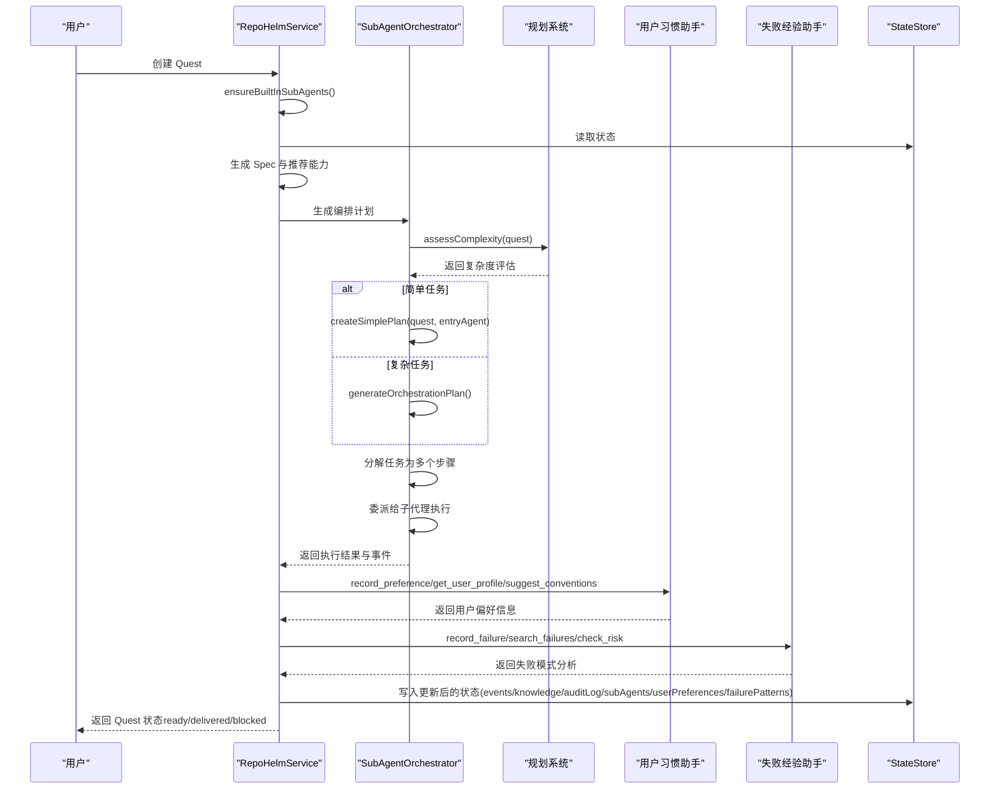

**图表来源**
- [packages/core/src/service.ts](file://packages/core/src/service.ts)
- [packages/core/src/orchestrator.ts](file://packages/core/src/orchestrator.ts)
- [packages/core/src/planning.ts](file://packages/core/src/planning.ts)
- [packages/core/src/git.ts](file://packages/core/src/git.ts)
- [packages/core/src/agent.ts](file://packages/core/src/agent.ts)
- [packages/core/src/store.ts](file://packages/core/src/store.ts)
- [packages/core/src/tools/habits.ts](file://packages/core/src/tools/habits.ts)
- [packages/core/src/tools/failure.ts](file://packages/core/src/tools/failure.ts)

## 详细组件分析

### RepoHelmService：业务逻辑与状态管理
- 状态初始化与迁移
  - bootstrap：若状态为空，创建演示工作区、项目与种子知识；若已有状态，确保知识文件存在并进行规范化；必要时从旧 JSON 迁移到 SQLite
  - normalizeState：对历史状态字段进行补齐与默认化，保证向后兼容
- **新增**：原子状态突变处理
  - _mutationQueue：串行化队列，防止并发写入冲突
  - mutateState：原子性读取-修改-写入操作，确保数据一致性
- 工作区与项目管理
  - createWorkspace/updateWorkspace：增删改工作区及其根目录、项目集合
  - createProject/updateProject：注册项目、生成项目摘要知识、更新健康状态
  - linkProjectToWorkspace/unlinkProjectFromWorkspace/removeProject：工作区与项目的关联/解绑与级联删除
- **新增**：子代理生命周期管理
  - createSubAgent/updateSubAgent/deleteSubAgent：创建、更新、删除子代理
  - listSubAgents/setEntrySubAgent/getEntrySubAgent：子代理列表管理与入口代理设置
  - updateSubAgentUsage：子代理使用统计更新
  - **新增**：invokeSystemAgent：直接调用系统代理（用户习惯助手、失败经验助手、知识库助手）
- **新增**：内置子代理种子
  - ensureBuiltInSubAgents：服务器启动时确保内置子代理存在
  - seedBuiltInSubAgents：提供 Supervisor、Spec Writer、Coder、Reviewer、用户习惯助手、失败经验助手六种预定义代理
- **新增**：知识库管理服务
  - getProjectKnowledge：获取项目知识库状态
  - syncProjectKnowledge：同步项目知识库索引
  - setProjectKnowledgeBranch：设置项目知识库分支
  - searchProjectKnowledge：搜索项目知识库内容
  - writeWikiPage：写入或更新项目维基页面
  - getKnowledgePages：按ID获取知识页
- **新增**：用户偏好管理服务
  - recordPreference：记录或更新用户偏好
  - getUserPreferences：获取用户偏好列表
  - suggestConventions：根据任务上下文生成用户偏好约束文本
  - deletePreference：删除用户偏好
- **新增**：失败模式分析服务
  - recordFailure：记录新的失败模式
  - searchFailures：搜索相似的失败模式
  - checkRisk：检查任务风险
  - updateFailure：更新失败模式状态
- Git 与工作树
  - listBranches：枚举仓库分支并识别默认分支
  - createQuest/runQuest/cleanupQuestWorktrees/retryQuest：创建/运行/清理/重试 Quest；为每个受影响项目创建 worktree；调用 Agent 后端；收集变更文件；生成记忆知识
  - deliverQuest：对已准备好的 worktree 执行验证、commit、PR handoff
- 引擎与模型
  - getEngine/updateEngine：读取/更新引擎配置（CLI/Provider 选择、模型映射、BYOK 提供商）
  - listProviders/testProvider/listProviderModels：列出/探测/缓存模型列表（带 TTL）
  - listLocalClis/testLocalCli：检测本地 CLI 并进行真实连通性测试
  - **新增**：createModelKit/updateModelKit/deleteModelKit/listModelKits：ModelKit 管理
  - **新增**：testAndSaveModelKit：测试模型配置并保存为 ModelKit
  - **新增**：enhanceRequirement：使用入口代理增强需求描述
- 安全与审计
  - getSecurityPolicy/updateSecurityPolicy：读取/更新安全策略（命令白名单、文件/网络作用域、secrets 策略、沙箱运行时）
  - evaluateCommandPermission：基于策略评估命令执行许可
  - listAuditLog/audit：查询审计日志与记录审计事件
- 知识库与能力
  - searchKnowledge：按工作区检索知识项
  - listCapabilities/acceptCapabilityRecommendation/dismissCapabilityRecommendation：能力推荐、接受/忽略
  - seedCapabilities/seedSecurityPolicy：内置能力与安全策略的种子数据
- 产品就绪度
  - getProductReadiness：生成里程碑、模板、依赖图与治理视图

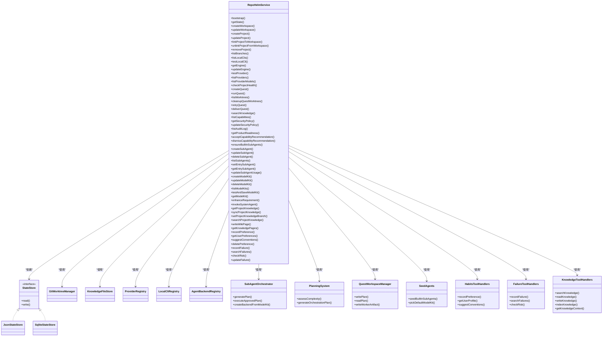

**图表来源**
- [packages/core/src/service.ts](file://packages/core/src/service.ts)
- [packages/core/src/store.ts](file://packages/core/src/store.ts)
- [packages/core/src/orchestrator.ts](file://packages/core/src/orchestrator.ts)
- [packages/core/src/planning.ts](file://packages/core/src/planning.ts)
- [packages/core/src/quest-workspace.ts](file://packages/core/src/quest-workspace.ts)
- [packages/core/src/seed-agents.ts](file://packages/core/src/seed-agents.ts)
- [packages/core/src/git.ts](file://packages/core/src/git.ts)
- [packages/core/src/knowledge.ts](file://packages/core/src/knowledge.ts)
- [packages/core/src/providers.ts](file://packages/core/src/providers.ts)
- [packages/core/src/cli.ts](file://packages/core/src/cli.ts)
- [packages/core/src/agent.ts](file://packages/core/src/agent.ts)
- [packages/core/src/tools/habits.ts](file://packages/core/src/tools/habits.ts)
- [packages/core/src/tools/failure.ts](file://packages/core/src/tools/failure.ts)
- [packages/core/src/tools/knowledge.ts](file://packages/core/src/tools/knowledge.ts)

**章节来源**
- [packages/core/src/service.ts](file://packages/core/src/service.ts)
- [packages/core/src/service.test.ts](file://packages/core/src/service.test.ts)

### StateStore 设计与实现
- 抽象接口 StateStore：定义 read/write
- JsonStateStore：以 JSON 文件形式持久化状态，路径为 .repohelm/state.json
- SqliteStateStore：以 SQLite 表 state 持久化状态，包含 id/payload/updated_at 字段；首次访问自动创建表；具备从旧 JSON 迁移的能力
- 迁移逻辑：读取旧 JSON 状态并写入 SQLite，确保平滑过渡

**章节来源**
- [packages/core/src/store.ts](file://packages/core/src/store.ts)

### 知识库管理服务
- **新增**：知识库工具集（tools/knowledge.ts）
  - SEARCH_KNOWLEDGE_TOOL：搜索项目知识库内容
  - READ_KNOWLEDGE_TOOL：读取特定知识页内容
  - WRITE_KNOWLEDGE_TOOL：创建或更新项目知识页
  - INDEX_KNOWLEDGE_TOOL：触发项目知识库索引
  - GET_KNOWLEDGE_CONTEXT_TOOL：获取任务相关的知识上下文
- **新增**：RepoHelmService 知识库方法
  - getProjectKnowledge：获取项目知识库状态和页面列表
  - syncProjectKnowledge：同步项目知识库索引，支持增量更新
  - setProjectKnowledgeBranch：设置项目知识库分支
  - searchProjectKnowledge：基于语义搜索项目知识库内容
  - writeWikiPage：写入或更新项目维基页面，同时持久化到文件系统
  - getKnowledgePages：按ID批量获取知识页

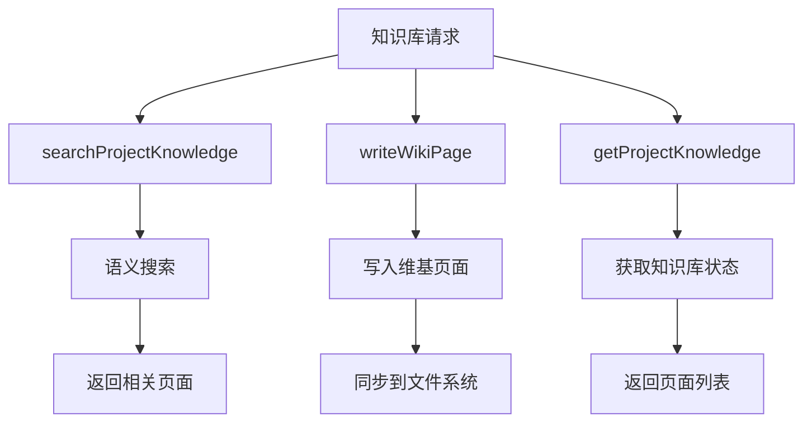

**图表来源**
- [packages/core/src/tools/knowledge.ts](file://packages/core/src/tools/knowledge.ts)
- [packages/core/src/service.ts](file://packages/core/src/service.ts)

**章节来源**
- [packages/core/src/tools/knowledge.ts](file://packages/core/src/tools/knowledge.ts)
- [packages/core/src/service.ts](file://packages/core/src/service.ts)

### 用户偏好跟踪服务
- **新增**：用户偏好工具集（tools/habits.ts）
  - RECORD_PREFERENCE_TOOL：记录或更新用户偏好
  - GET_USER_PROFILE_TOOL：获取用户偏好档案
  - SUGGEST_CONVENTIONS_TOOL：根据任务上下文生成约定建议
- **新增**：RepoHelmService 用户偏好方法
  - recordPreference：记录或更新用户偏好，支持同类别键去重和置信度更新
  - getUserPreferences：按分类和最低置信度过滤用户偏好
  - suggestConventions：生成用户偏好约束文本，供其他代理使用
  - deletePreference：删除指定用户偏好
- **新增**：内置子代理种子
  - 用户习惯助手：专门观察和建模用户偏好，提供偏好记录、查询和建议功能

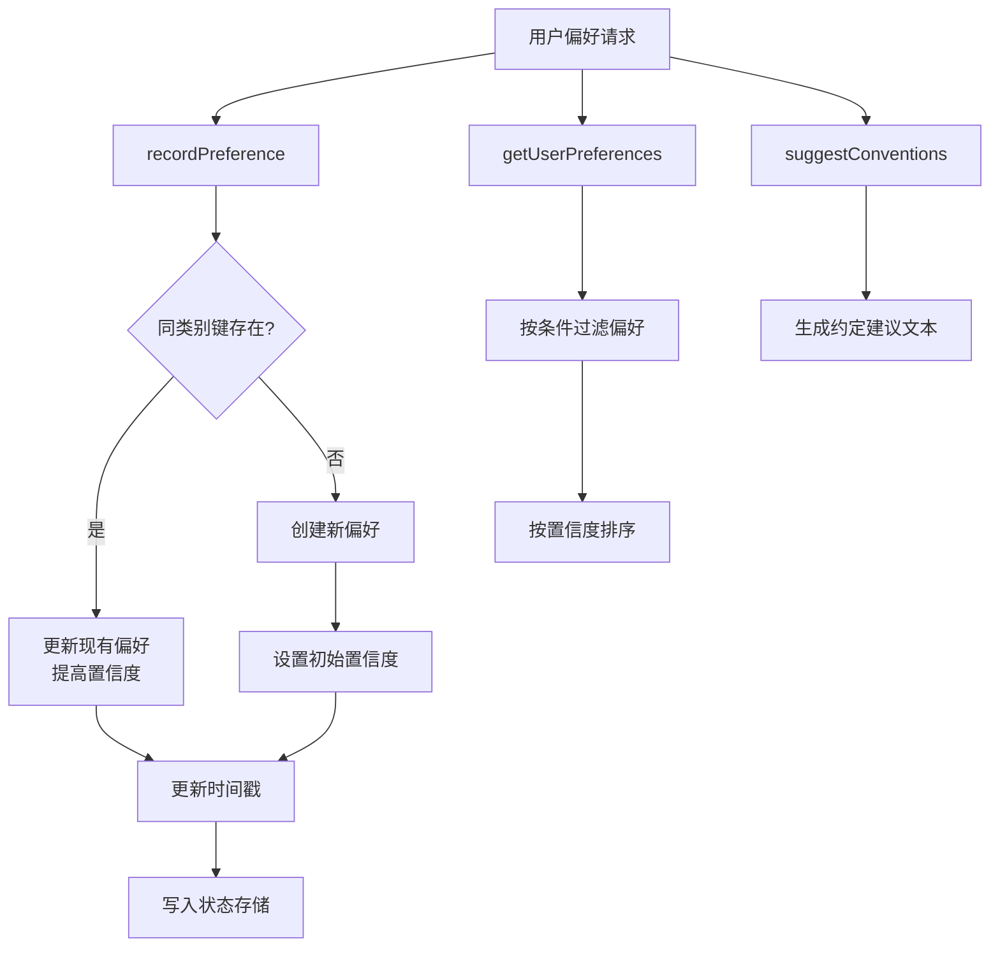

**图表来源**
- [packages/core/src/tools/habits.ts](file://packages/core/src/tools/habits.ts)
- [packages/core/src/service.ts](file://packages/core/src/service.ts)
- [packages/core/src/seed-agents.ts](file://packages/core/src/seed-agents.ts)

**章节来源**
- [packages/core/src/tools/habits.ts](file://packages/core/src/tools/habits.ts)
- [packages/core/src/service.ts](file://packages/core/src/service.ts)
- [packages/core/src/seed-agents.ts](file://packages/core/src/seed-agents.ts)

### 失败模式分析服务
- **新增**：失败模式工具集（tools/failure.ts）
  - RECORD_FAILURE_TOOL：记录失败模式，包含根因分析和缓解方案
  - SEARCH_FAILURES_TOOL：搜索相似失败模式
  - CHECK_RISK_TOOL：检查任务风险，基于已知失败模式提供警告
- **新增**：RepoHelmService 失败模式方法
  - recordFailure：记录新的失败模式，支持项目和Quest关联
  - searchFailures：基于关键词和信号搜索相似失败模式
  - checkRisk：检查任务风险，返回相关失败模式列表
  - updateFailure：更新失败模式状态（标记解决、调整严重性或缓解方案）
- **新增**：内置子代理种子
  - 失败经验助手：专门捕获和分析失败经验，提供风险检查和缓解建议

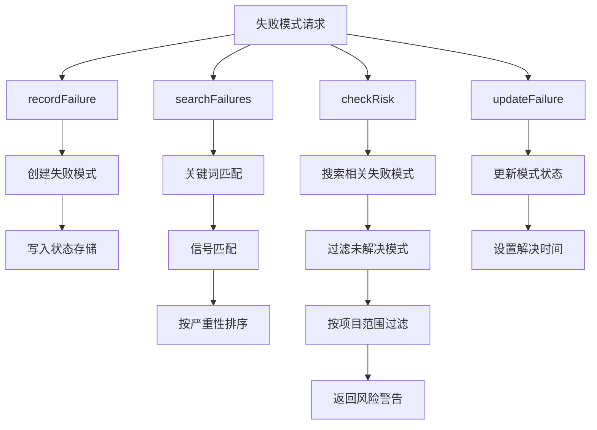

**图表来源**
- [packages/core/src/tools/failure.ts](file://packages/core/src/tools/failure.ts)
- [packages/core/src/service.ts](file://packages/core/src/service.ts)
- [packages/core/src/seed-agents.ts](file://packages/core/src/seed-agents.ts)

**章节来源**
- [packages/core/src/tools/failure.ts](file://packages/core/src/tools/failure.ts)
- [packages/core/src/service.ts](file://packages/core/src/service.ts)
- [packages/core/src/seed-agents.ts](file://packages/core/src/seed-agents.ts)

### 系统代理调用机制
- **新增**：invokeSystemAgent 方法
  - 支持三种系统角色：知识库助手（默认）、用户习惯助手、失败经验助手
  - 基于 systemRole 选择对应的工具规范和处理器
  - 限制最大迭代次数（8次）防止无限循环
  - 支持工具调用循环，自动处理工具输出
- **新增**：系统代理工具处理器
  - buildHabitsToolHandlers：处理用户偏好相关工具调用
  - buildFailureToolHandlers：处理失败模式相关工具调用
  - buildKnowledgeToolHandlers：处理知识库相关工具调用

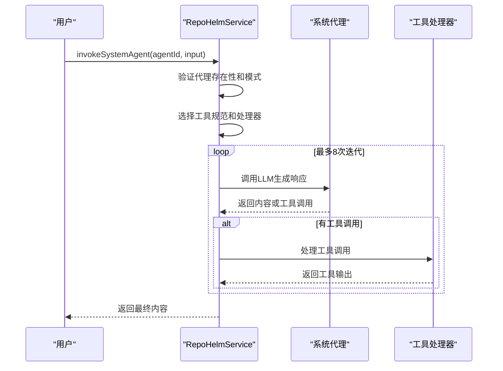

**图表来源**
- [packages/core/src/service.ts](file://packages/core/src/service.ts)
- [packages/core/src/tools/habits.ts](file://packages/core/src/tools/habits.ts)
- [packages/core/src/tools/failure.ts](file://packages/core/src/tools/failure.ts)
- [packages/core/src/tools/knowledge.ts](file://packages/core/src/tools/knowledge.ts)

**章节来源**
- [packages/core/src/service.ts](file://packages/core/src/service.ts)
- [packages/core/src/tools/habits.ts](file://packages/core/src/tools/habits.ts)
- [packages/core/src/tools/failure.ts](file://packages/core/src/tools/failure.ts)
- [packages/core/src/tools/knowledge.ts](file://packages/core/src/tools/knowledge.ts)

### 规划系统性能优化
- **新增**：QuestComplexity 评估接口
  - isSimple：判断任务是否为简单任务的标准
  - affectedProjectCount：受影响项目数量
  - requirementLength：需求文本长度
  - hasExplicitSteps：需求中是否包含显式步骤关键词
- **新增**：assessComplexity 函数实现
  - 单项目、短需求文本、无显式步骤的任务被视为简单任务
  - 支持中文步骤关键词："首先"、"然后"、"接着"、"最后"等
  - 简单任务阈值：单项目、需求长度小于200字符、无显式步骤
- **新增**：快速路径优化
  - 简单任务直接生成单步计划，避免 LLM 调用开销
  - 复杂任务使用标准规划流程，通过 generateOrchestrationPlan 生成详细计划
- **新增**：createSimplePlan 实现
  - 自动选择最佳编码代理（具备 coding 能力的代理）
  - 为目标项目生成单步执行计划
  - 包含目标项目 ID 信息，支持后续执行路由

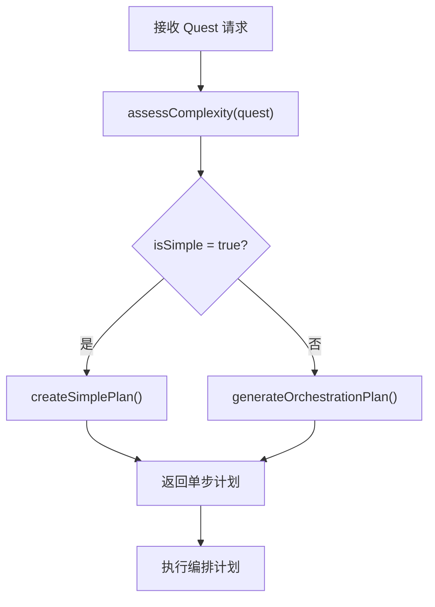

**图表来源**
- [packages/core/src/planning.ts](file://packages/core/src/planning.ts)
- [packages/core/src/orchestrator.ts](file://packages/core/src/orchestrator.ts)

**章节来源**
- [packages/core/src/planning.ts](file://packages/core/src/planning.ts)
- [packages/core/src/orchestrator.ts](file://packages/core/src/orchestrator.ts)

### 多代理编排架构
- **新增**：SubAgentOrchestrator 增强
  - 复杂度评估：通过 assessComplexity 判断任务复杂度，自动选择快速路径
  - 快速路径：简单任务直接生成单步计划，避免 LLM 调用
  - 标准路径：复杂任务使用 generateOrchestrationPlan 生成详细计划
  - 目标项目执行：增强 executeApprovedPlan 的目标项目路由能力
- **新增**：内置子代理种子
  - Supervisor：入口监督者，负责任务分解、委派和结果汇总
  - Spec Writer：规范编写者，生成轻量级规范和需求分解
  - Coder：编码者，实现代码和具体的文件级变更
  - Reviewer：审查者，审查计划和代码的质量、正确性和安全性
  - **新增**：用户习惯助手：观察并建模用户偏好，提供个性化约束
  - **新增**：失败经验助手：捕获失败经验，提供风险预警和缓解方案
- **新增**：子代理生命周期管理
  - 完整的 CRUD 操作：创建、更新、删除、查询子代理
  - 权限控制：支持工具访问控制和最大执行步数限制
  - 使用统计：记录子代理使用次数和最后使用时间
- **新增**：原子状态突变处理
  - _mutationQueue：串行化队列，确保状态修改的原子性
  - mutateState：包装状态修改操作，防止并发冲突

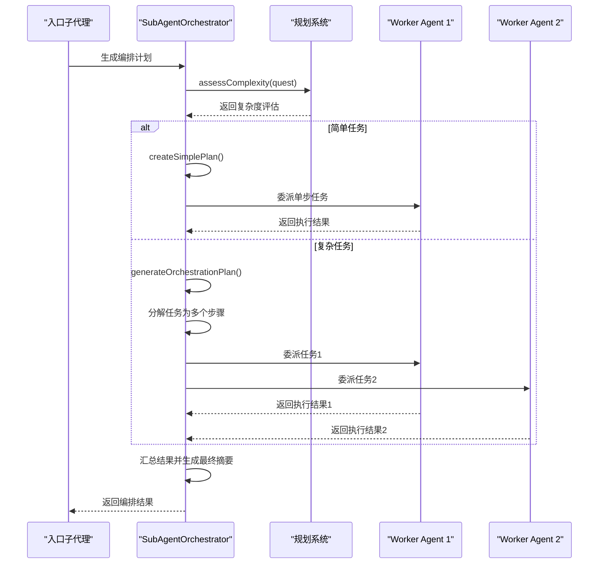

**图表来源**
- [packages/core/src/orchestrator.ts](file://packages/core/src/orchestrator.ts)
- [packages/core/src/planning.ts](file://packages/core/src/planning.ts)
- [packages/core/src/seed-agents.ts](file://packages/core/src/seed-agents.ts)
- [packages/core/src/service.ts](file://packages/core/src/service.ts)

**章节来源**
- [packages/core/src/orchestrator.ts](file://packages/core/src/orchestrator.ts)
- [packages/core/src/seed-agents.ts](file://packages/core/src/seed-agents.ts)
- [packages/core/src/service.ts](file://packages/core/src/service.ts)

### Quest 工作流编排
- 规划阶段
  - createQuest：根据需求生成轻量 Spec，检索相关知识，推荐能力，创建初始事件
  - **新增**：自动钩子：获取用户偏好和风险检查，注入到事件流中
- **新增**：智能规划阶段
  - runQuest：解析入口子代理，调用 assessComplexity 评估任务复杂度
  - 简单任务：直接调用 createSimplePlan 生成单步计划
  - 复杂任务：调用 generateOrchestrationPlan 生成详细计划
  - approvePlan：批准编排计划，创建工作树，执行已批准计划，收集变更文件
- 执行阶段
  - provisionQuestWorktrees：为受影响项目创建工作树，确保隔离执行环境
  - **新增**：executeApprovedPlan 增强
    - 支持目标项目路由：根据 step.targetProjectId 将任务定向到特定项目
    - 依赖关系管理：按依赖顺序执行步骤，支持复杂的多项目协作
    - 工具调用循环：限制最大迭代次数，防止无限循环
  - **新增**：自动钩子：成功时总结学习，失败时记录模式
- 交付阶段
  - deliverQuest：对已准备好的 worktree 执行验证、commit、PR handoff，更新状态为 delivered
- 清理与重试
  - cleanupQuestWorktrees：清理 worktree 与对应分支
  - retryQuest：清理后重试

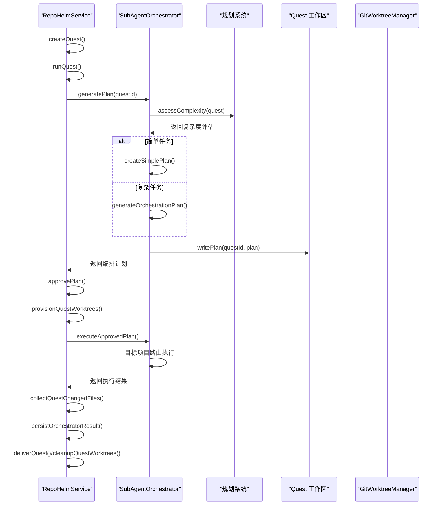

**图表来源**
- [packages/core/src/service.ts](file://packages/core/src/service.ts)
- [packages/core/src/orchestrator.ts](file://packages/core/src/orchestrator.ts)
- [packages/core/src/planning.ts](file://packages/core/src/planning.ts)
- [packages/core/src/quest-workspace.ts](file://packages/core/src/quest-workspace.ts)
- [packages/core/src/git.ts](file://packages/core/src/git.ts)
- [packages/core/src/providers.ts](file://packages/core/src/providers.ts)
- [packages/core/src/cli.ts](file://packages/core/src/cli.ts)
- [packages/core/src/agent.ts](file://packages/core/src/agent.ts)

**章节来源**
- [packages/core/src/service.ts](file://packages/core/src/service.ts)
- [packages/core/src/orchestrator.ts](file://packages/core/src/orchestrator.ts)
- [packages/core/src/planning.ts](file://packages/core/src/planning.ts)
- [packages/core/src/quest-workspace.ts](file://packages/core/src/quest-workspace.ts)
- [packages/core/src/git.ts](file://packages/core/src/git.ts)

### Quest 工作区管理
- **新增**：QuestWorkspaceManager
  - writePlan/readPlan：计划文件的持久化与读取，支持 Markdown 格式
  - writeWorkerArtifact：工件文件的存储，按步骤和代理名称命名
  - listArtifacts：工件文件列表的查询
  - 计划文件格式：包含 Quest ID、生成时间、摘要、步骤详情和备注
  - 工件文件命名：stepId-agentName.md，支持步骤级别的结果追踪

**章节来源**
- [packages/core/src/quest-workspace.ts](file://packages/core/src/quest-workspace.ts)

### 知识库与文件存储
- KnowledgeFileStore：将知识项渲染为 Markdown 文件，文件名包含标题与 ID，元数据通过 YAML front matter 表达
- RepoHelmService 在创建项目与 Quest 时写入知识文件，确保状态中的知识项与文件系统一致

**章节来源**
- [packages/core/src/knowledge.ts](file://packages/core/src/knowledge.ts)
- [packages/core/src/service.ts](file://packages/core/src/service.ts)

### Agent 后端与调度
- AgentBackendRegistry：聚合多种后端实现
  - MockAgentBackend：内置后端，用于 MVP 闭环验证
  - ExternalCliAgentBackend：通过环境变量配置外部 CLI 命令模板，在 worktree 中执行
  - OpenAICompatibleAgentBackend：通过 OpenAI 兼容接口调用 Provider，生成实现产物
- RepoHelmService 在 runQuest 中根据配置选择后端并评估命令权限

**章节来源**
- [packages/core/src/agent.ts](file://packages/core/src/agent.ts)
- [packages/core/src/service.ts](file://packages/core/src/service.ts)

### Provider 与 CLI 集成
- ProviderRegistry：统一模型提供商注册表，支持多厂商模型列表拉取与解析
- LocalCliRegistry：检测本地 CLI 可用性，支持实时模型拉取与回退策略，进行真实连通性测试

**章节来源**
- [packages/core/src/providers.ts](file://packages/core/src/providers.ts)
- [packages/core/src/cli.ts](file://packages/core/src/cli.ts)
- [packages/core/src/service.ts](file://packages/core/src/service.ts)

## 依赖关系分析
- RepoHelmService 对外依赖 StateStore、GitWorktreeManager、KnowledgeFileStore、ProviderRegistry、LocalCliRegistry、AgentBackendRegistry
- **新增**：SubAgentOrchestrator 依赖 RepoHelmService 提供的状态访问和工具调用能力
- **新增**：规划系统依赖 QuestComplexity 评估接口和 generateOrchestrationPlan
- **新增**：Quest 工作区管理依赖 QuestWorkspaceManager 进行文件持久化
- **新增**：内置子代理种子依赖 RepoHelmService 的子代理管理功能
- **新增**：知识库工具集、用户偏好工具集、失败模式工具集分别提供特定领域的工具方法
- **新增**：系统代理调用机制依赖对应的工具处理器和模型后端
- 各组件之间通过清晰的接口耦合，便于替换与扩展
- 类型定义集中于 types.ts，确保跨模块一致性

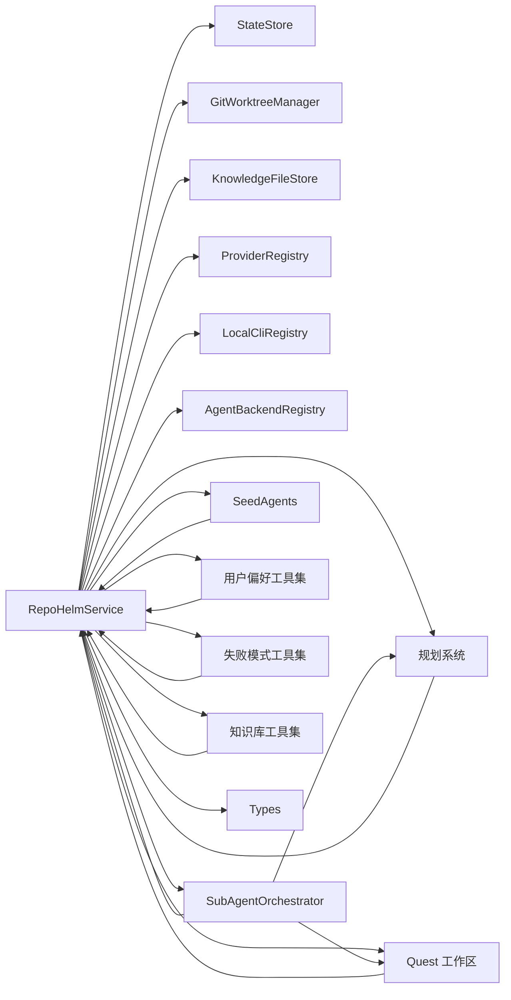

**图表来源**
- [packages/core/src/service.ts](file://packages/core/src/service.ts)
- [packages/core/src/types.ts](file://packages/core/src/types.ts)

**章节来源**
- [packages/core/src/service.ts](file://packages/core/src/service.ts)
- [packages/core/src/types.ts](file://packages/core/src/types.ts)

## 性能考量
- 状态持久化
  - SQLite 相比 JSON 更适合频繁写入与并发访问；注意磁盘 I/O 与 WAL/同步策略
  - 迁移逻辑仅在首次读取旧格式时触发，避免重复开销
  - **新增**：原子状态突变通过串行化队列避免并发写入冲突，提高数据一致性
- 模型列表缓存
  - ProviderRegistry 的模型列表带 TTL 缓存，减少对外部 API 的频繁调用
- Git 操作
  - worktree 创建/删除为重量级操作，应避免不必要的重复；清理与重试需谨慎
- CLI/Provider 调用
  - 外部 CLI 与 Provider 调用带有超时控制，建议合理设置超时参数
- 审计与日志
  - 审计日志与事件列表限制长度，避免无限增长导致性能下降
- **新增**：规划系统性能优化
  - QuestComplexity 评估：O(n) 时间复杂度，n 为需求文本长度
  - 快速路径：简单任务直接生成单步计划，避免 LLM 调用开销
  - 复杂度阈值：单项目、需求长度<200字符、无显式步骤
  - 工具调用循环限制：MAX_TOOL_LOOP_ITERATIONS=8，防止无限循环
  - 目标项目路由：按目标项目 ID 直接定位执行位置，避免全局搜索
- **新增**：知识库性能优化
  - 语义搜索：基于关键词和信号匹配，支持大规模知识库检索
  - 索引缓存：增量索引更新，避免重复扫描整个仓库
- **新增**：用户偏好性能优化
  - 置信度衰减：避免偏好过度累积影响决策质量
  - 最大示例数：限制每个偏好的示例数量，控制内存使用
- **新增**：失败模式性能优化
  - 关键词匹配：基于信号和关键词的快速匹配算法
  - 严重性排序：优先处理高严重性模式，提高风险响应效率

## 故障排查指南
- 状态读取失败或为空
  - 检查 .repohelm/state.sqlite 是否存在；如不存在，bootstrap 会自动生成
  - 若存在旧 .repohelm/state.json，SqliteStateStore 会自动迁移
  - **新增**：检查_mutateState队列是否阻塞，重启服务可清空队列
- Git worktree 创建失败
  - 检查仓库路径、默认分支与目标 worktree 路径是否冲突
  - 确认 Git 可用且具有相应权限
- Agent 后端被阻止
  - 检查安全策略中的命令白名单；确认后端命令模板已正确配置
- Provider 模型列表为空
  - 检查 API Key、Base URL 与网络连通性；必要时刷新缓存
- 交付失败
  - 检查验证命令返回、提交状态与 PR 创建条件；确认已启用 gh 且已认证
- **新增**：知识库问题
  - 检查知识库索引状态：确认 lastIndexedSha 和 status 字段正常
  - 验证知识库分支设置：确保 knowledgeBranch 配置正确
  - 确认文件系统权限：检查 .repohelm/knowledge 目录可写性
- **新增**：用户偏好问题
  - 检查偏好键唯一性：同类别下相同键会被合并更新
  - 验证置信度范围：确保 0.0-1.0 之间的有效值
  - 确认偏好示例数量：最多保留 5 个示例
- **新增**：失败模式问题
  - 检查失败模式分类有效性：确保使用预定义的分类枚举
  - 验证缓解方案完整性：每个记录的失败模式必须包含具体可行的缓解措施
  - 确认信号关键词：用于检测相似场景的关键字列表
- **新增**：系统代理问题
  - 检查代理模式：确保系统代理的 mode 属性设置为 "system"
  - 验证工具权限：确认代理的 allowedTools 列表包含所需工具
  - 确认模型配置：检查系统代理使用的 ModelKit 类型为 BYOK
- **新增**：规划系统问题
  - 检查 QuestComplexity 评估结果：确认需求文本长度、项目数量和步骤关键词
  - 验证快速路径是否正确触发：简单任务应直接生成单步计划
  - 检查规划系统日志：确认 generateOrchestrationPlan 执行状态
- **新增**：编排系统问题
  - 检查入口子代理是否已设置；确认子代理池中存在可用代理
  - 查看编排计划文件是否存在；检查子代理权限配置
  - 确认 ModelKit 配置正确，模型可用
  - 验证目标项目路由：检查 step.targetProjectId 是否正确
- **新增**：原子状态突变失败
  - 检查_mutationQueue队列状态，避免长时间阻塞
  - 确认并发操作不会同时修改同一状态字段

**章节来源**
- [packages/core/src/service.test.ts](file://packages/core/src/service.test.ts)
- [packages/core/src/orchestrator.test.ts](file://packages/core/src/orchestrator.test.ts)
- [packages/core/src/git.ts](file://packages/core/src/git.ts)
- [packages/core/src/providers.ts](file://packages/core/src/providers.ts)
- [packages/core/src/agent.ts](file://packages/core/src/agent.ts)
- [packages/core/src/orchestrator.ts](file://packages/core/src/orchestrator.ts)
- [packages/core/src/planning.ts](file://packages/core/src/planning.ts)
- [packages/core/src/tools/habits.ts](file://packages/core/src/tools/habits.ts)
- [packages/core/src/tools/failure.ts](file://packages/core/src/tools/failure.ts)
- [packages/core/src/tools/knowledge.ts](file://packages/core/src/tools/knowledge.ts)

## 结论
RepoHelm 核心服务模块以 RepoHelmService 为中心，围绕状态持久化、工作流编排、安全与审计、Git/Provider/CLI/Agent 集成构建了完整的 Quest 工作区原型。通过 SQLite 状态存储与规范化迁移、轻量 Spec 与能力推荐、多 Agent 后端调度与 worktree 隔离，实现了从需求到交付的闭环。

**新增**的功能进一步增强了系统的智能化水平：
- **知识库管理服务**：提供完整的知识搜索、读取、写入、索引和上下文获取能力
- **用户偏好跟踪服务**：记录和跟踪用户的编码风格、命名习惯、架构倾向和工作流偏好
- **失败模式分析服务**：捕获 Quest 执行中的失败经验，分析根因并提供缓解方案
- **系统代理调用机制**：通过 invokeSystemAgent 方法调用内置的用户习惯助手、失败经验助手和知识库助手
- **规划系统性能优化**：通过 QuestComplexity 评估和快速路径优化，显著提升简单任务的执行效率
- **智能复杂度评估**：支持中文步骤关键词识别，准确判断任务复杂度
- **单步计划生成**：简单任务直接生成单步计划，避免不必要的 LLM 调用
- **目标项目执行增强**：编排系统支持按目标项目路由执行，提升多项目协作效率
- 多代理编排架构支持 Supervisor-Worker 模式的任务委派和协作
- 原子状态突变处理确保并发环境下的数据一致性
- 内置子代理种子提供即插即用的智能代理能力，包括用户习惯助手和失败经验助手
- 完整的子代理生命周期管理支持动态代理配置和权限控制

测试用例覆盖了关键流程，保障了功能稳定性与可扩展性。

## 附录

### 使用模式与示例路径
- 初始化与读取状态
  - 示例路径：[packages/core/src/service.test.ts](file://packages/core/src/service.test.ts)
- 创建工作区与项目
  - 示例路径：[packages/core/src/service.test.ts](file://packages/core/src/service.test.ts)
- 创建 Quest 并运行
  - 示例路径：[packages/core/src/service.test.ts](file://packages/core/src/service.test.ts)
- **新增**：知识库管理
  - 示例路径：[packages/core/src/service.test.ts](file://packages/core/src/service.test.ts)
  - 知识库工具：[packages/core/src/tools/knowledge.ts](file://packages/core/src/tools/knowledge.ts)
- **新增**：用户偏好管理
  - 示例路径：[packages/core/src/service.test.ts](file://packages/core/src/service.test.ts)
  - 用户偏好工具：[packages/core/src/tools/habits.ts](file://packages/core/src/tools/habits.ts)
- **新增**：失败模式分析
  - 示例路径：[packages/core/src/service.test.ts](file://packages/core/src/service.test.ts)
  - 失败模式工具：[packages/core/src/tools/failure.ts](file://packages/core/src/tools/failure.ts)
- **新增**：系统代理调用
  - 示例路径：[packages/core/src/service.test.ts](file://packages/core/src/service.test.ts)
  - 系统代理 UI：[e2e/system-agents.spec.ts](file://e2e/system-agents.spec.ts)
- 交付与清理
  - 示例路径：[packages/core/src/service.test.ts](file://packages/core/src/service.test.ts)
- 安全策略与审计
  - 示例路径：[packages/core/src/service.test.ts](file://packages/core/src/service.test.ts)
- Provider 与 CLI 集成
  - 示例路径：[packages/core/src/service.test.ts](file://packages/core/src/service.test.ts)

### 关键 API 一览（示例路径）
- 状态管理
  - [packages/core/src/service.ts](file://packages/core/src/service.ts)
- Git 工作流
  - [packages/core/src/git.ts](file://packages/core/src/git.ts)
- 知识库
  - [packages/core/src/knowledge.ts](file://packages/core/src/knowledge.ts)
  - [packages/core/src/tools/knowledge.ts](file://packages/core/src/tools/knowledge.ts)
- Provider/CLI
  - [packages/core/src/providers.ts](file://packages/core/src/providers.ts)
  - [packages/core/src/cli.ts](file://packages/core/src/cli.ts)
- Agent 后端
  - [packages/core/src/agent.ts](file://packages/core/src/agent.ts)
- **新增**：规划系统
  - [packages/core/src/planning.ts](file://packages/core/src/planning.ts)
- **新增**：编排系统
  - [packages/core/src/orchestrator.ts](file://packages/core/src/orchestrator.ts)
- **新增**：Quest 工作区
  - [packages/core/src/quest-workspace.ts](file://packages/core/src/quest-workspace.ts)
- **新增**：子代理管理
  - [packages/core/src/service.ts](file://packages/core/src/service.ts)
- **新增**：用户偏好管理
  - [packages/core/src/service.ts](file://packages/core/src/service.ts)
  - [packages/core/src/tools/habits.ts](file://packages/core/src/tools/habits.ts)
- **新增**：失败模式分析
  - [packages/core/src/service.ts](file://packages/core/src/service.ts)
  - [packages/core/src/tools/failure.ts](file://packages/core/src/tools/failure.ts)
- **新增**：系统代理调用
  - [packages/core/src/service.ts](file://packages/core/src/service.ts)
- 类型定义
  - [packages/core/src/types.ts](file://packages/core/src/types.ts)
- **新增**：Web API
  - [apps/web/src/api.ts](file://apps/web/src/api.ts)
- **新增**：服务器端点
  - [apps/server/src/index.ts](file://apps/server/src/index.ts)
  - [apps/server/src/index.test.ts](file://apps/server/src/index.test.ts)