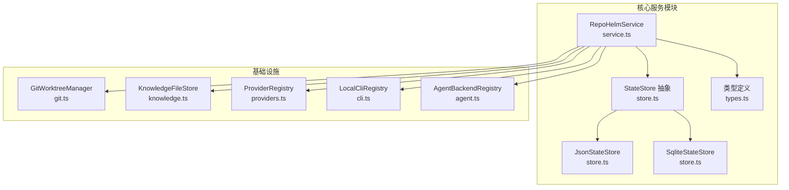
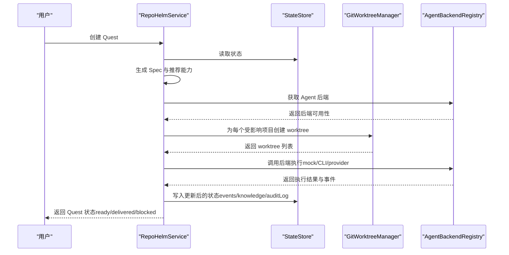
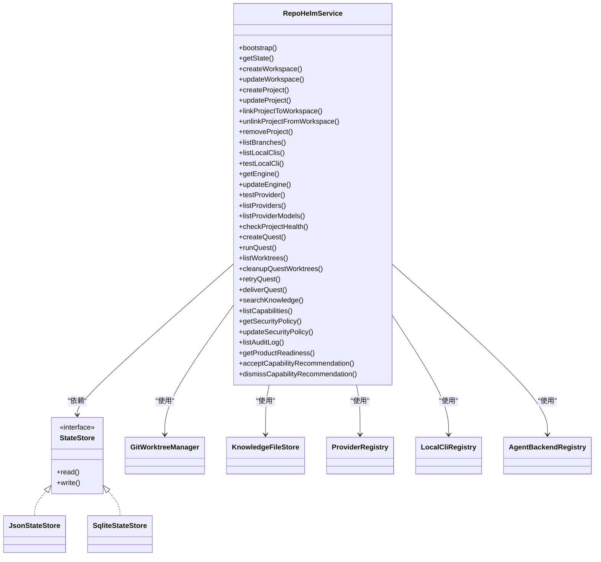
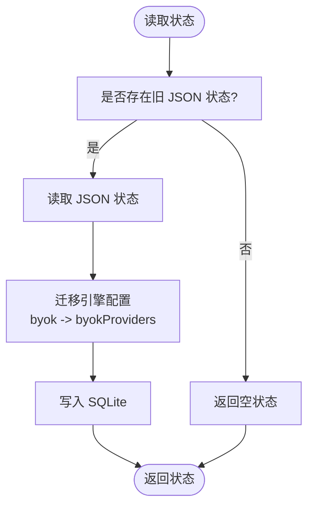
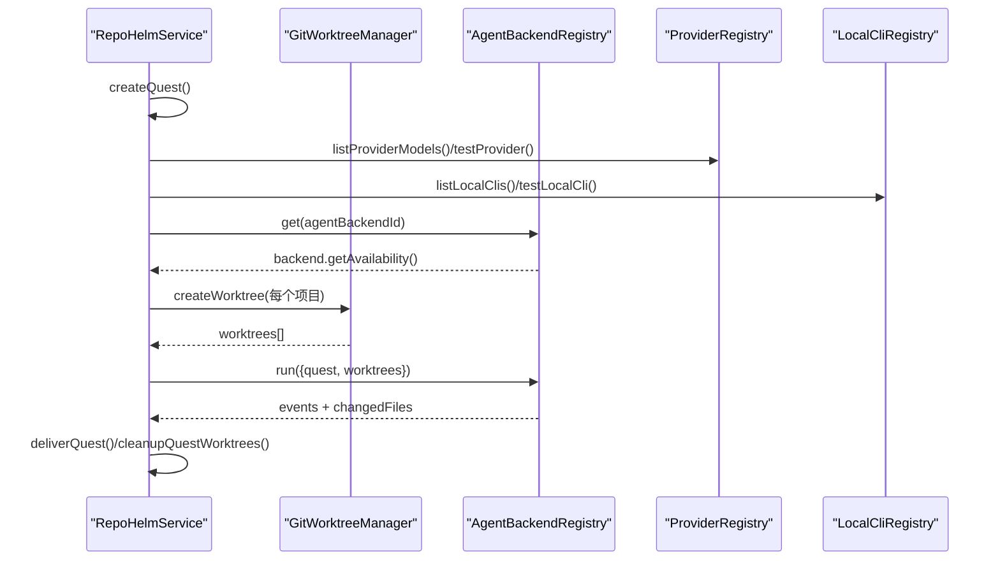
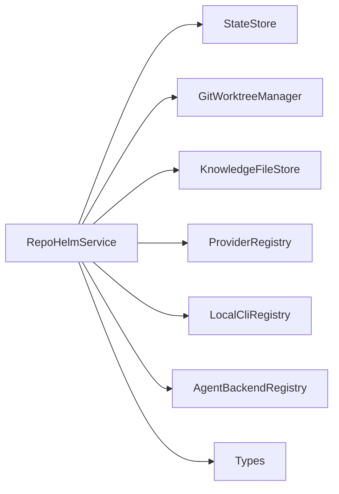

# 核心服务模块

<cite>
**本文档引用的文件**
- [packages/core/src/service.ts](file://packages/core/src/service.ts)
- [packages/core/src/store.ts](file://packages/core/src/store.ts)
- [packages/core/src/types.ts](file://packages/core/src/types.ts)
- [packages/core/src/git.ts](file://packages/core/src/git.ts)
- [packages/core/src/knowledge.ts](file://packages/core/src/knowledge.ts)
- [packages/core/src/providers.ts](file://packages/core/src/providers.ts)
- [packages/core/src/cli.ts](file://packages/core/src/cli.ts)
- [packages/core/src/agent.ts](file://packages/core/src/agent.ts)
- [packages/core/src/index.ts](file://packages/core/src/index.ts)
- [packages/core/src/service.test.ts](file://packages/core/src/service.test.ts)
- [README.md](file://README.md)
</cite>

## 目录
1. [简介](#简介)
2. [项目结构](#项目结构)
3. [核心组件](#核心组件)
4. [架构总览](#架构总览)
5. [详细组件分析](#详细组件分析)
6. [依赖关系分析](#依赖关系分析)
7. [性能考量](#性能考量)
8. [故障排查指南](#故障排查指南)
9. [结论](#结论)
10. [附录](#附录)

## 简介
本文件面向 RepoHelm 的核心服务模块，聚焦以下目标：
- 深入解析 RepoHelmService 的业务逻辑与状态管理机制
- 解释 StateStore 的设计与实现（含 SQLite 数据库与迁移）
- 详述 Quest 工作流的编排流程（Spec 生成、Agent 后端调度、工作树管理）
- 提供使用模式与代码示例路径
- 说明与其他组件的集成关系
- 给出常见问题与性能优化建议

RepoHelm 以“虚拟 workspace + 多项目 Quest + Spec 驱动 + worktree 隔离 + Agent 编排 + 知识库”为核心产品方向，核心服务模块负责状态持久化、工作流编排、安全策略与审计、以及与 Git、Provider、CLI、Agent 的集成。

## 项目结构
核心服务模块位于 packages/core，主要文件与职责如下：
- service.ts：RepoHelmService 主控制器，封装所有业务操作与工作流编排
- store.ts：StateStore 抽象与实现（JsonStateStore、SqliteStateStore）
- types.ts：统一的数据模型与类型定义
- git.ts：GitWorktreeManager，负责 Git 仓库健康检查、分支枚举、worktree 创建/删除、变更文件检测、验证/提交/PR 等
- knowledge.ts：知识库文件存储，将知识项渲染为 Markdown 文件
- providers.ts：Provider 注册表，统一拉取各模型提供商的模型列表
- cli.ts：本地 CLI 注册表，检测与测试本地 CLI，合并实时模型
- agent.ts：Agent 后端抽象与实现（Mock、External CLI、OpenAI-Compatible）
- index.ts：导出核心 API
- service.test.ts：覆盖核心业务流程的测试用例

图表来源
- [packages/core/src/service.ts](file://packages/core/src/service.ts)
- [packages/core/src/store.ts](file://packages/core/src/store.ts)
- [packages/core/src/git.ts](file://packages/core/src/git.ts)
- [packages/core/src/knowledge.ts](file://packages/core/src/knowledge.ts)
- [packages/core/src/providers.ts](file://packages/core/src/providers.ts)
- [packages/core/src/cli.ts](file://packages/core/src/cli.ts)
- [packages/core/src/agent.ts](file://packages/core/src/agent.ts)
- [packages/core/src/types.ts](file://packages/core/src/types.ts)

章节来源
- [packages/core/src/index.ts](file://packages/core/src/index.ts)
- [README.md](file://README.md)

## 核心组件
- RepoHelmService：统一的业务控制器，负责工作区/项目/知识/Quest 的生命周期管理、工作流编排、安全策略与审计、产品就绪度计算等
- StateStore：状态持久化抽象，提供 read/write 接口；默认使用 SQLite 存储，具备从旧 JSON 格式迁移的能力
- GitWorktreeManager：Git 仓库与 worktree 的管理器，负责健康检查、分支枚举、worktree 创建/删除、变更文件检测、验证/提交/PR
- KnowledgeFileStore：知识库文件存储，将知识项渲染为 Markdown 文件并写入文件系统
- ProviderRegistry：统一的模型提供商注册表，支持 OpenAI、Anthropic、Gemini、DeepSeek、OpenRouter 等
- LocalCliRegistry：本地 CLI 检测与测试，支持实时模型拉取与回退策略
- AgentBackendRegistry：Agent 后端抽象与实现，包含 Mock、External CLI、OpenAI-Compatible Provider

章节来源
- [packages/core/src/service.ts](file://packages/core/src/service.ts)
- [packages/core/src/store.ts](file://packages/core/src/store.ts)
- [packages/core/src/git.ts](file://packages/core/src/git.ts)
- [packages/core/src/knowledge.ts](file://packages/core/src/knowledge.ts)
- [packages/core/src/providers.ts](file://packages/core/src/providers.ts)
- [packages/core/src/cli.ts](file://packages/core/src/cli.ts)
- [packages/core/src/agent.ts](file://packages/core/src/agent.ts)

## 架构总览
RepoHelmService 作为核心协调者，围绕以下关键流程运作：
- 状态初始化与迁移：bootstrap 时读取/写入状态，必要时从旧 JSON 迁移到 SQLite
- 工作区与项目管理：创建/更新工作区与项目，维护健康状态
- 知识库管理：将知识项写入文件系统 Markdown，并在状态中保留元数据
- Quest 工作流：创建 Quest、生成轻量 Spec、调度 Agent 后端、创建/清理 worktree、验证/提交/PR
- 安全与审计：基于安全策略评估命令执行权限，记录审计日志
- 产品就绪度：根据工作区与项目关系生成里程碑、模板、依赖图与治理视图

图表来源
- [packages/core/src/service.ts](file://packages/core/src/service.ts)
- [packages/core/src/git.ts](file://packages/core/src/git.ts)
- [packages/core/src/agent.ts](file://packages/core/src/agent.ts)
- [packages/core/src/store.ts](file://packages/core/src/store.ts)

## 详细组件分析

### RepoHelmService：业务逻辑与状态管理
- 状态初始化与迁移
  - bootstrap：若状态为空，创建演示工作区、项目与种子知识；若已有状态，确保知识文件存在并进行规范化；必要时从旧 JSON 迁移到 SQLite
  - normalizeState：对历史状态字段进行补齐与默认化，保证向后兼容
- 工作区与项目管理
  - createWorkspace/updateWorkspace：增删改工作区及其根目录、项目集合
  - createProject/updateProject：注册项目、生成项目摘要知识、更新健康状态
  - linkProjectToWorkspace/unlinkProjectFromWorkspace/removeProject：工作区与项目的关联/解绑与级联删除
- Git 与工作树
  - listBranches：枚举仓库分支并识别默认分支
  - createQuest/runQuest/cleanupQuestWorktrees/retryQuest：创建/运行/清理/重试 Quest；为每个受影响项目创建 worktree；调用 Agent 后端；收集变更文件；生成记忆知识
  - deliverQuest：对已准备好的 worktree 执行验证、commit、PR handoff
- 引擎与模型
  - getEngine/updateEngine：读取/更新引擎配置（CLI/Provider 选择、模型映射、BYOK 提供商）
  - listProviders/testProvider/listProviderModels：列出/探测/缓存模型列表（带 TTL）
  - listLocalClis/testLocalCli：检测本地 CLI 并进行真实连通性测试
- 安全与审计
  - getSecurityPolicy/updateSecurityPolicy：读取/更新安全策略（命令白名单、文件/网络作用域、secrets 策略、沙箱运行时）
  - evaluateCommandPermission：基于策略评估命令执行许可
  - listAuditLog/audit：查询审计日志与记录审计事件
- 知识库与能力
  - searchKnowledge：按工作区检索知识项
  - listCapabilities/acceptCapabilityRecommendation/dismissCapabilityRecommendation：能力推荐、接受/忽略
  - seedCapabilities/seedSecurityPolicy：内置能力与安全策略的种子数据
- 产品就绪度
  - getProductReadiness：生成里程碑、模板、依赖图与治理视图

图表来源
- [packages/core/src/service.ts](file://packages/core/src/service.ts)
- [packages/core/src/store.ts](file://packages/core/src/store.ts)
- [packages/core/src/git.ts](file://packages/core/src/git.ts)
- [packages/core/src/knowledge.ts](file://packages/core/src/knowledge.ts)
- [packages/core/src/providers.ts](file://packages/core/src/providers.ts)
- [packages/core/src/cli.ts](file://packages/core/src/cli.ts)
- [packages/core/src/agent.ts](file://packages/core/src/agent.ts)

章节来源
- [packages/core/src/service.ts](file://packages/core/src/service.ts)
- [packages/core/src/service.test.ts](file://packages/core/src/service.test.ts)

### StateStore 设计与实现
- 抽象接口 StateStore：定义 read/write
- JsonStateStore：以 JSON 文件形式持久化状态，路径为 .repohelm/state.json
- SqliteStateStore：以 SQLite 表 state 持久化状态，包含 id/payload/updated_at 字段；首次访问自动创建表；具备从旧 JSON 迁移的能力
- 迁移逻辑：读取旧 JSON 状态并写入 SQLite，确保平滑过渡

图表来源
- [packages/core/src/store.ts](file://packages/core/src/store.ts)

章节来源
- [packages/core/src/store.ts](file://packages/core/src/store.ts)

### Quest 工作流编排
- 规划阶段
  - createQuest：根据需求生成轻量 Spec，检索相关知识，推荐能力，创建初始事件
- 执行阶段
  - runQuest：为受影响项目创建 worktree，评估 Agent 后端命令权限，调用后端执行，收集变更文件，生成验证与 Review 结果，记录事件与审计
- 交付阶段
  - deliverQuest：对已准备好的 worktree 执行验证、commit、PR handoff，更新状态为 delivered
- 清理与重试
  - cleanupQuestWorktrees：清理 worktree 与对应分支
  - retryQuest：清理后重试

图表来源
- [packages/core/src/service.ts](file://packages/core/src/service.ts)
- [packages/core/src/git.ts](file://packages/core/src/git.ts)
- [packages/core/src/providers.ts](file://packages/core/src/providers.ts)
- [packages/core/src/cli.ts](file://packages/core/src/cli.ts)
- [packages/core/src/agent.ts](file://packages/core/src/agent.ts)

章节来源
- [packages/core/src/service.ts](file://packages/core/src/service.ts)
- [packages/core/src/git.ts](file://packages/core/src/git.ts)
- [packages/core/src/agent.ts](file://packages/core/src/agent.ts)

### 知识库与文件存储
- KnowledgeFileStore：将知识项渲染为 Markdown 文件，文件名包含标题与 ID，元数据通过 YAML front matter 表达
- RepoHelmService 在创建项目与 Quest 时写入知识文件，确保状态中的知识项与文件系统一致

章节来源
- [packages/core/src/knowledge.ts](file://packages/core/src/knowledge.ts)
- [packages/core/src/service.ts](file://packages/core/src/service.ts)

### Agent 后端与调度
- AgentBackendRegistry：聚合多种后端实现
  - MockAgentBackend：内置后端，用于 MVP 闭环验证
  - ExternalCliAgentBackend：通过环境变量配置外部 CLI 命令模板，在 worktree 中执行
  - OpenAICompatibleAgentBackend：通过 OpenAI 兼容接口调用 Provider，生成实现产物
- RepoHelmService 在 runQuest 中根据配置选择后端并评估命令权限

章节来源
- [packages/core/src/agent.ts](file://packages/core/src/agent.ts)
- [packages/core/src/service.ts](file://packages/core/src/service.ts)

### Provider 与 CLI 集成
- ProviderRegistry：统一模型提供商注册表，支持多厂商模型列表拉取与解析
- LocalCliRegistry：检测本地 CLI 可用性，支持实时模型拉取与回退策略，进行真实连通性测试

章节来源
- [packages/core/src/providers.ts](file://packages/core/src/providers.ts)
- [packages/core/src/cli.ts](file://packages/core/src/cli.ts)
- [packages/core/src/service.ts](file://packages/core/src/service.ts)

## 依赖关系分析
- RepoHelmService 对外依赖 StateStore、GitWorktreeManager、KnowledgeFileStore、ProviderRegistry、LocalCliRegistry、AgentBackendRegistry
- 各组件之间通过清晰的接口耦合，便于替换与扩展
- 类型定义集中于 types.ts，确保跨模块一致性

图表来源
- [packages/core/src/service.ts](file://packages/core/src/service.ts)
- [packages/core/src/types.ts](file://packages/core/src/types.ts)

章节来源
- [packages/core/src/service.ts](file://packages/core/src/service.ts)
- [packages/core/src/types.ts](file://packages/core/src/types.ts)

## 性能考量
- 状态持久化
  - SQLite 相比 JSON 更适合频繁写入与并发访问；注意磁盘 I/O 与 WAL/同步策略
  - 迁移逻辑仅在首次读取旧格式时触发，避免重复开销
- 模型列表缓存
  - ProviderRegistry 的模型列表带 TTL 缓存，减少对外部 API 的频繁调用
- Git 操作
  - worktree 创建/删除为重量级操作，应避免不必要的重复；清理与重试需谨慎
- CLI/Provider 调用
  - 外部 CLI 与 Provider 调用带有超时控制，建议合理设置超时参数
- 审计与日志
  - 审计日志与事件列表限制长度，避免无限增长导致性能下降

[本节为通用指导，无需特定文件引用]

## 故障排查指南
- 状态读取失败或为空
  - 检查 .repohelm/state.sqlite 是否存在；如不存在，bootstrap 会自动生成
  - 若存在旧 .repohelm/state.json，SqliteStateStore 会自动迁移
- Git worktree 创建失败
  - 检查仓库路径、默认分支与目标 worktree 路径是否冲突
  - 确认 Git 可用且具有相应权限
- Agent 后端被阻止
  - 检查安全策略中的命令白名单；确认后端命令模板已正确配置
- Provider 模型列表为空
  - 检查 API Key、Base URL 与网络连通性；必要时刷新缓存
- 交付失败
  - 检查验证命令返回、提交状态与 PR 创建条件；确认已启用 gh 且已认证

章节来源
- [packages/core/src/service.test.ts](file://packages/core/src/service.test.ts)
- [packages/core/src/git.ts](file://packages/core/src/git.ts)
- [packages/core/src/providers.ts](file://packages/core/src/providers.ts)
- [packages/core/src/agent.ts](file://packages/core/src/agent.ts)

## 结论
RepoHelm 核心服务模块以 RepoHelmService 为中心，围绕状态持久化、工作流编排、安全与审计、Git/Provider/CLI/Agent 集成构建了完整的 Quest 工作区原型。通过 SQLite 状态存储与规范化迁移、轻量 Spec 与能力推荐、多 Agent 后端调度与 worktree 隔离，实现了从需求到交付的闭环。测试用例覆盖了关键流程，保障了功能稳定性与可扩展性。

[本节为总结性内容，无需特定文件引用]

## 附录

### 使用模式与示例路径
- 初始化与读取状态
  - 示例路径：[packages/core/src/service.test.ts](file://packages/core/src/service.test.ts)
- 创建工作区与项目
  - 示例路径：[packages/core/src/service.test.ts](file://packages/core/src/service.test.ts)
- 创建 Quest 并运行
  - 示例路径：[packages/core/src/service.test.ts](file://packages/core/src/service.test.ts)
- 交付与清理
  - 示例路径：[packages/core/src/service.test.ts](file://packages/core/src/service.test.ts)
- 安全策略与审计
  - 示例路径：[packages/core/src/service.test.ts](file://packages/core/src/service.test.ts)
- Provider 与 CLI 集成
  - 示例路径：[packages/core/src/service.test.ts](file://packages/core/src/service.test.ts)

### 关键 API 一览（示例路径）
- 状态管理
  - [packages/core/src/service.ts](file://packages/core/src/service.ts)
- Git 工作流
  - [packages/core/src/git.ts](file://packages/core/src/git.ts)
- 知识库
  - [packages/core/src/knowledge.ts](file://packages/core/src/knowledge.ts)
- Provider/CLI
  - [packages/core/src/providers.ts](file://packages/core/src/providers.ts)
  - [packages/core/src/cli.ts](file://packages/core/src/cli.ts)
- Agent 后端
  - [packages/core/src/agent.ts](file://packages/core/src/agent.ts)
- 类型定义
  - [packages/core/src/types.ts](file://packages/core/src/types.ts)