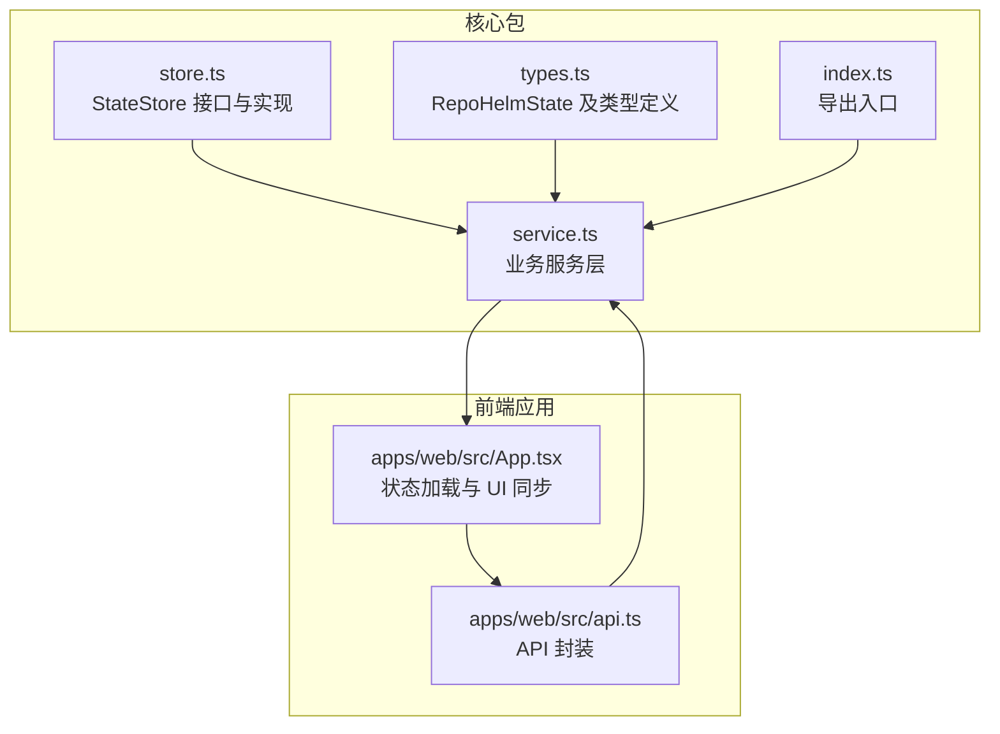
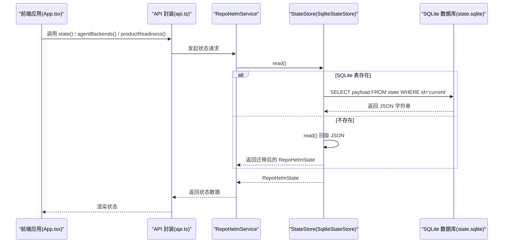
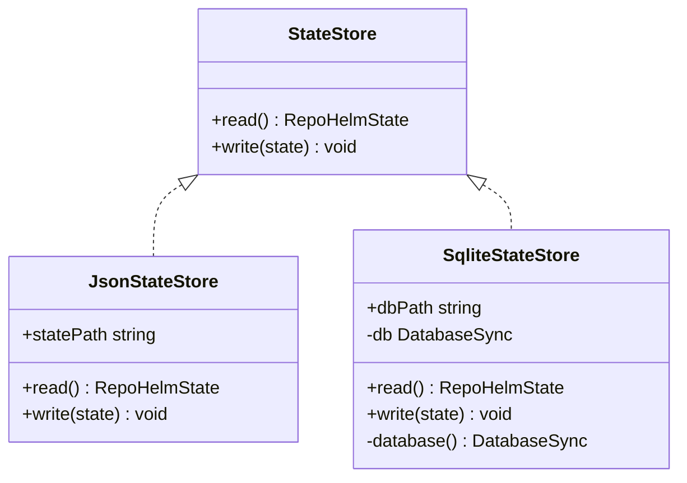
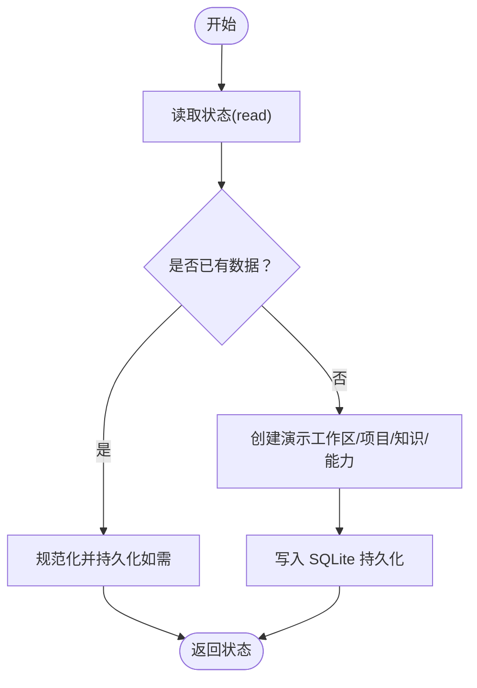
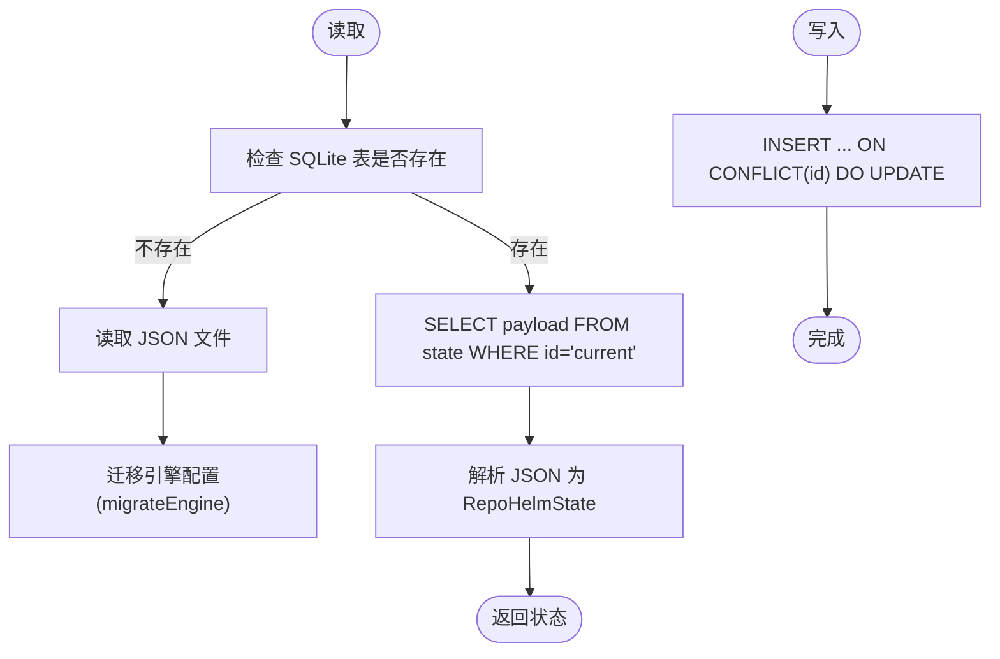
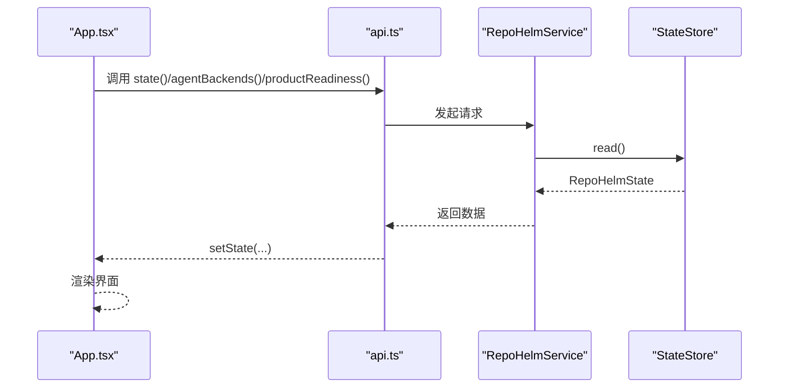
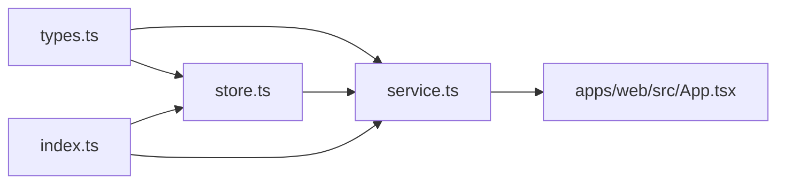

# 状态管理机制

<cite>
**本文引用的文件**
- [store.ts](file://packages/core/src/store.ts)
- [types.ts](file://packages/core/src/types.ts)
- [service.ts](file://packages/core/src/service.ts)
- [index.ts](file://packages/core/src/index.ts)
- [service.test.ts](file://packages/core/src/service.test.ts)
- [App.tsx](file://apps/web/src/App.tsx)
- [api.ts](file://apps/web/src/api.ts)
</cite>

## 目录
1. [简介](#简介)
2. [项目结构](#项目结构)
3. [核心组件](#核心组件)
4. [架构总览](#架构总览)
5. [详细组件分析](#详细组件分析)
6. [依赖关系分析](#依赖关系分析)
7. [性能考量](#性能考量)
8. [故障排查指南](#故障排查指南)
9. [结论](#结论)
10. [附录](#附录)

## 简介
本文件系统性阐述 RepoHelm 的状态管理机制，重点围绕 StateStore 抽象与实现（JsonStateStore、SqliteStateStore）、RepoHelmState 数据结构、状态生命周期（bootstrap 初始化）、状态读写与迁移、事务与并发控制、状态与 UI 同步及事件通知等主题展开。文档同时给出状态查询与修改的实践示例、一致性与性能优化策略，帮助开发者快速理解并正确使用状态管理模块。

## 项目结构
RepoHelm 的状态管理位于核心包 packages/core 下，主要文件如下：
- store.ts：定义 StateStore 接口与具体实现（JsonStateStore、SqliteStateStore），包含数据库初始化、读写与迁移逻辑
- types.ts：定义 RepoHelmState 及其子类型（Workspace、Project、Quest、AgentEvent、SecurityPolicy、EngineConfig 等）
- service.ts：业务服务层，封装状态读取、初始化、更新与持久化，负责状态生命周期管理
- index.ts：导出核心模块，便于上层调用
- service.test.ts：覆盖状态持久化、迁移、引擎配置更新等行为的测试
- apps/web/src/App.tsx：前端应用，负责加载状态并在 UI 中展示与交互
- apps/web/src/api.ts：前端 API 封装，与后端服务交互以获取状态

图表来源
- [store.ts:86-166](file://packages/core/src/store.ts#L86-L166)
- [types.ts:279-290](file://packages/core/src/types.ts#L279-L290)
- [service.ts:56-137](file://packages/core/src/service.ts#L56-L137)
- [index.ts:1-9](file://packages/core/src/index.ts#L1-L9)
- [App.tsx:136-148](file://apps/web/src/App.tsx#L136-L148)
- [api.ts](file://apps/web/src/api.ts)

章节来源
- [store.ts:1-166](file://packages/core/src/store.ts#L1-L166)
- [types.ts:1-334](file://packages/core/src/types.ts#L1-L334)
- [service.ts:1-1331](file://packages/core/src/service.ts#L1-L1331)
- [index.ts:1-9](file://packages/core/src/index.ts#L1-L9)

## 核心组件
- StateStore 接口：抽象状态读写能力，定义 read() 与 write(state) 方法
- JsonStateStore：基于文件系统的 JSON 存储，适用于早期或简单场景
- SqliteStateStore：基于 SQLite 的高性能存储，支持单行键值表持久化与自动迁移
- RepoHelmState：状态根对象，包含工作区、项目、任务、事件、知识、能力、安全策略、审计日志、引擎配置与模型缓存等字段
- RepoHelmService：状态生命周期与业务操作的协调者，负责 bootstrap 初始化、状态读取、更新与持久化

章节来源
- [store.ts:86-166](file://packages/core/src/store.ts#L86-L166)
- [types.ts:279-290](file://packages/core/src/types.ts#L279-L290)
- [service.ts:56-137](file://packages/core/src/service.ts#L56-L137)

## 架构总览
状态管理采用“接口抽象 + 多实现 + 业务编排”的分层设计：
- 接口层：StateStore 抽象
- 实现层：JsonStateStore（JSON 文件）与 SqliteStateStore（SQLite）
- 业务层：RepoHelmService 统一读取、初始化、更新与持久化
- 前端层：Web 应用通过 API 获取状态并驱动 UI

图表来源
- [service.ts:135-137](file://packages/core/src/service.ts#L135-L137)
- [store.ts:125-139](file://packages/core/src/store.ts#L125-L139)
- [App.tsx:136-148](file://apps/web/src/App.tsx#L136-L148)

## 详细组件分析

### StateStore 设计与实现
- 接口职责
  - read(): Promise<RepoHelmState>：读取当前状态
  - write(state: RepoHelmState): Promise<void>：写入状态
- JsonStateStore
  - 使用根目录下的 .repohelm/state.json 进行读写
  - 读取时进行引擎配置迁移（旧 byok 字段到新 byokProviders 格式）
  - 写入时确保目录存在并序列化为 JSON
- SqliteStateStore
  - 使用根目录下的 .repohelm/state.sqlite
  - 单表 state(id, payload, updated_at)，id 固定为 "current"
  - 读取优先从 SQLite 表获取；若为空则回退到旧版 JSON 并迁移
  - 写入使用 INSERT ... ON CONFLICT 更新，保证幂等
  - 首次访问时自动创建表并初始化连接

图表来源
- [store.ts:86-166](file://packages/core/src/store.ts#L86-L166)

章节来源
- [store.ts:86-166](file://packages/core/src/store.ts#L86-L166)

### RepoHelmState 数据结构与字段语义
RepoHelmState 是状态的根对象，字段含义如下：
- workspaces: Workspace[] —— 工作区列表
- projects: Project[] —— 项目列表
- quests: Quest[] —— 任务列表
- events: AgentEvent[] —— 事件列表
- knowledge: KnowledgeItem[] —— 知识条目
- capabilities: CapabilityDefinition[] —— 能力定义
- securityPolicy: SecurityPolicy —— 安全策略
- auditLog: AuditLogEntry[] —— 审计日志
- engine: EngineConfig —— 引擎配置（含 CLI/BYOK）
- modelCache: Record<string, ModelCacheEntry> —— 提供商模型缓存

字段作用与约束要点（节选）：
- securityPolicy：包含命令审批模式、允许命令列表、文件作用域、网络作用域、密钥策略、沙箱运行环境与更新时间
- engine：mode 支持 cli/byok；cliId 指定本地 CLI；cliModels 映射 CLI 到模型；byokProviders 以提供者维度隔离 API Key；activeByokProviderId 指定当前生效提供者；updatedAt 记录变更时间
- modelCache：按 providerId:baseUrl 键缓存模型列表，带 TTL 控制

章节来源
- [types.ts:279-290](file://packages/core/src/types.ts#L279-L290)
- [types.ts:135-143](file://packages/core/src/types.ts#L135-L143)
- [types.ts:262-269](file://packages/core/src/types.ts#L262-L269)
- [types.ts:229-234](file://packages/core/src/types.ts#L229-L234)

### 状态生命周期管理：bootstrap 初始化
- 读取现有状态：优先从 SQLite 表读取；若为空则回退到 JSON 文件并迁移
- 若状态为空且未初始化：
  - 创建演示工作区与项目
  - 写入种子知识项与能力
  - 写入 SQLite 持久化
- 返回最终状态，供上层使用

图表来源
- [service.ts:73-133](file://packages/core/src/service.ts#L73-L133)
- [store.ts:125-139](file://packages/core/src/store.ts#L125-L139)

章节来源
- [service.ts:73-133](file://packages/core/src/service.ts#L73-L133)

### 状态读写与数据迁移
- 读取流程
  - SqliteStateStore：优先查询 state 表 id='current' 的 payload；若无则回退 JsonStateStore 并迁移引擎配置
  - JsonStateStore：直接解析 JSON 并迁移引擎配置
- 写入流程
  - SqliteStateStore：INSERT ... ON CONFLICT(id) DO UPDATE，确保幂等
  - JsonStateStore：mkdir -> writeFile
- 引擎配置迁移
  - 旧 byok 字段映射到新 byokProviders，并根据 baseUrl 推断 providerId
  - 保留 activeByokProviderId 与 byokProviders 字段，删除旧 byok

图表来源
- [store.ts:125-148](file://packages/core/src/store.ts#L125-L148)
- [store.ts:37-84](file://packages/core/src/store.ts#L37-L84)

章节来源
- [store.ts:37-84](file://packages/core/src/store.ts#L37-L84)
- [store.ts:125-148](file://packages/core/src/store.ts#L125-L148)

### 状态更新机制与业务操作
- 通用更新模式
  - 读取当前状态 -> 构造新状态 -> 写入持久化
  - 大多数更新操作均遵循该模式，保证状态一致性
- 典型更新示例（路径引用）
  - 创建/更新工作区：[service.ts:143-177](file://packages/core/src/service.ts#L143-L177)
  - 创建/更新项目：[service.ts:179-231](file://packages/core/src/service.ts#L179-L231)
  - 引擎配置更新：[service.ts:364-389](file://packages/core/src/service.ts#L364-L389)
  - 安全策略更新：[service.ts:898-908](file://packages/core/src/service.ts#L898-L908)
  - 任务创建与运行：[service.ts:478-698](file://packages/core/src/service.ts#L478-L698)
  - 交付流程与审计日志：[service.ts:762-881](file://packages/core/src/service.ts#L762-L881)

章节来源
- [service.ts:143-231](file://packages/core/src/service.ts#L143-L231)
- [service.ts:364-389](file://packages/core/src/service.ts#L364-L389)
- [service.ts:478-698](file://packages/core/src/service.ts#L478-L698)
- [service.ts:762-881](file://packages/core/src/service.ts#L762-L881)

### 事务处理与并发访问控制
- 事务特性
  - SqliteStateStore 写入使用 INSERT ... ON CONFLICT(id) DO UPDATE，具备原子性与幂等性
  - 读取与写入之间无显式锁，但通过单行 id='current' 的写入策略降低冲突概率
- 并发控制
  - 未实现跨进程锁；建议在单实例场景下使用
  - 如需多实例或多进程并发，建议引入外部锁或改用分布式锁/队列
- 测试验证
  - 测试覆盖了 SQLite 持久化与旧 JSON 迁移，确保状态一致性

章节来源
- [store.ts:141-148](file://packages/core/src/store.ts#L141-L148)
- [service.test.ts:38-68](file://packages/core/src/service.test.ts#L38-L68)

### 状态与 UI 层的同步机制
- 前端加载
  - App.tsx 在挂载时并行拉取状态、代理后端列表与产品就绪度
  - 加载完成后设置选中工作区/任务并展开侧边栏
- 事件与知识联动
  - 依据选中任务过滤事件与变更文件，驱动 Inspector 面板
- API 封装
  - api.ts 对后端接口进行封装，前端通过 api.state() 等方法获取数据

图表来源
- [App.tsx:136-148](file://apps/web/src/App.tsx#L136-L148)
- [api.ts](file://apps/web/src/api.ts)

章节来源
- [App.tsx:136-148](file://apps/web/src/App.tsx#L136-L148)

### 状态变更的事件通知系统
- 事件生成
  - 任务创建、运行、验证、Review、交付等关键节点会生成 AgentEvent
  - 事件包含类型、标题、详情、来源 Agent 与时间戳
- 审计日志
  - 安全策略与命令执行权限评估产生审计条目，记录决策与细节
- UI 展示
  - 事件与审计日志在 Inspector 面板中呈现，辅助用户追踪状态演进

章节来源
- [service.ts:512-534](file://packages/core/src/service.ts#L512-L534)
- [service.ts:673-688](file://packages/core/src/service.ts#L673-L688)
- [service.ts:863-873](file://packages/core/src/service.ts#L863-L873)
- [service.ts:898-908](file://packages/core/src/service.ts#L898-L908)

## 依赖关系分析
- store.ts 依赖 types.ts 中的 RepoHelmState、EngineConfig 等类型
- service.ts 依赖 store.ts 的 StateStore 接口与具体实现
- index.ts 导出 store 与 types，便于上层统一导入
- 前端 App.tsx 通过 api.ts 间接依赖 service.ts

图表来源
- [store.ts:1-4](file://packages/core/src/store.ts#L1-L4)
- [types.ts:279-290](file://packages/core/src/types.ts#L279-L290)
- [service.ts:9-38](file://packages/core/src/service.ts#L9-L38)
- [index.ts:1-9](file://packages/core/src/index.ts#L1-L9)

章节来源
- [store.ts:1-4](file://packages/core/src/store.ts#L1-L4)
- [types.ts:279-290](file://packages/core/src/types.ts#L279-L290)
- [service.ts:9-38](file://packages/core/src/service.ts#L9-L38)
- [index.ts:1-9](file://packages/core/src/index.ts#L1-L9)

## 性能考量
- SQLite 优势
  - 单文件、无需额外服务，部署简单
  - ON CONFLICT 幂等写入，减少竞争条件
- 模型缓存
  - 提供商模型列表缓存（TTL），避免频繁网络请求
- I/O 优化
  - 仅在必要时写入，批量更新合并后再持久化
- 并发建议
  - 单实例使用无问题；多实例建议引入锁或队列
- 前端渲染
  - 使用 useMemo 与并行加载提升首屏性能

章节来源
- [service.ts:43-43](file://packages/core/src/service.ts#L43-L43)
- [service.ts:422-455](file://packages/core/src/service.ts#L422-L455)

## 故障排查指南
- 状态为空或未初始化
  - 检查 .repohelm/state.sqlite 是否存在；若不存在，确认是否已执行 bootstrap
  - 旧版 JSON 迁移：确认 .repohelm/state.json 是否存在且可读
- 引擎配置异常
  - 确认 byok 字段是否符合新格式；迁移逻辑会根据 baseUrl 推断 providerId
- 写入失败
  - 检查 .repohelm 目录权限；确保磁盘空间充足
- 并发冲突
  - 多实例同时写入可能导致覆盖；建议单实例或引入锁
- 前端不刷新
  - 确认 api.state() 是否被调用；检查网络请求与错误提示

章节来源
- [store.ts:125-148](file://packages/core/src/store.ts#L125-L148)
- [service.test.ts:38-68](file://packages/core/src/service.test.ts#L38-L68)

## 结论
RepoHelm 的状态管理以 StateStore 抽象为核心，结合 JsonStateStore 与 SqliteStateStore 实现了从文件到数据库的平滑演进。RepoHelmState 作为统一的数据载体，承载了工作区、项目、任务、事件、知识、能力、安全策略、审计日志与引擎配置等关键信息。通过 bootstrap 初始化、幂等写入与迁移机制，系统在保证一致性的同时兼顾了易用性与性能。前端通过 API 与服务层协作，实现了状态的实时同步与可视化展示。

## 附录
- 示例：创建任务并运行
  - 创建任务：[service.ts:478-542](file://packages/core/src/service.ts#L478-L542)
  - 运行任务：[service.ts:544-698](file://packages/core/src/service.ts#L544-L698)
- 示例：更新引擎配置
  - 更新引擎：[service.ts:364-389](file://packages/core/src/service.ts#L364-L389)
- 示例：持久化与迁移
  - SQLite 写入：[store.ts:141-148](file://packages/core/src/store.ts#L141-L148)
  - 旧 JSON 迁移：[store.ts:125-139](file://packages/core/src/store.ts#L125-L139)