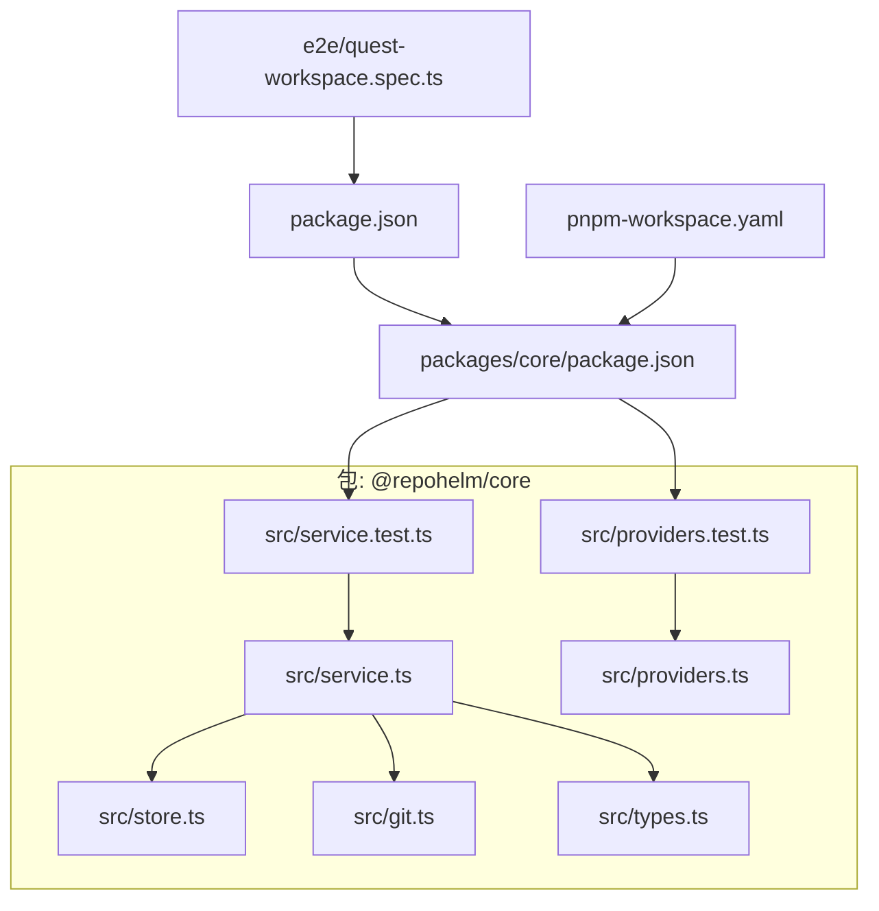
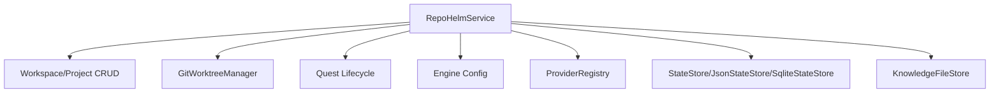
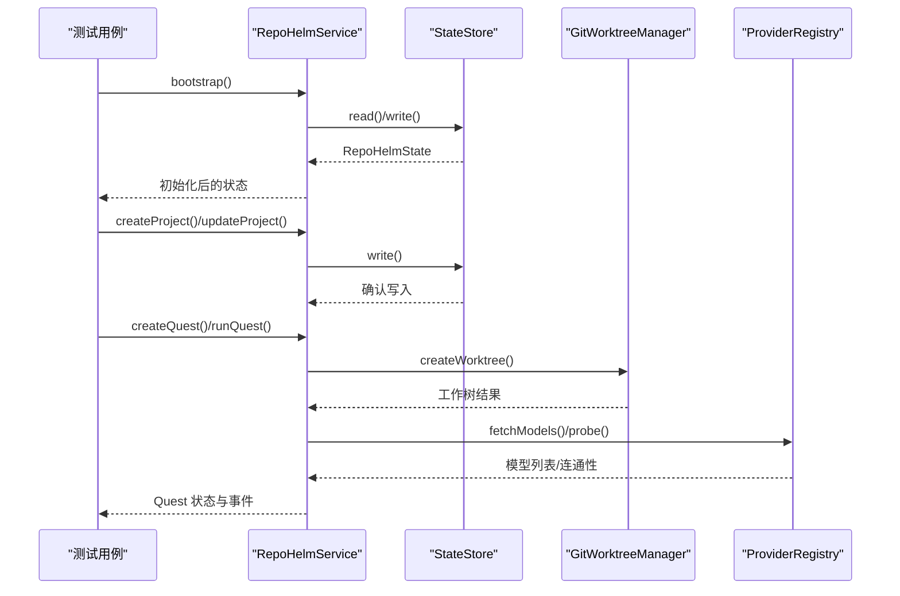
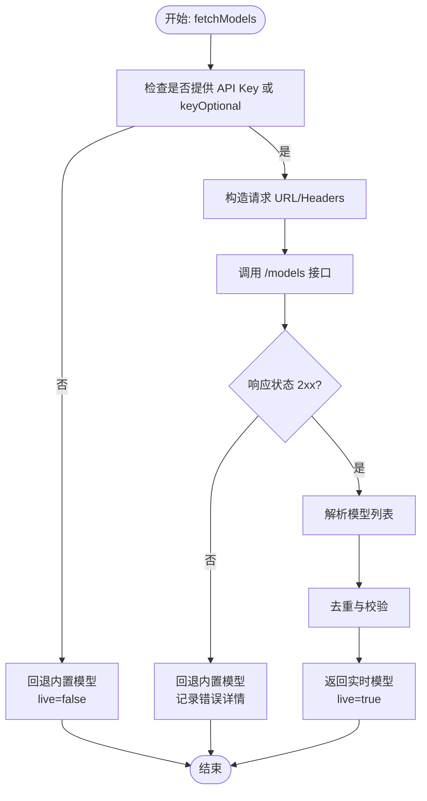
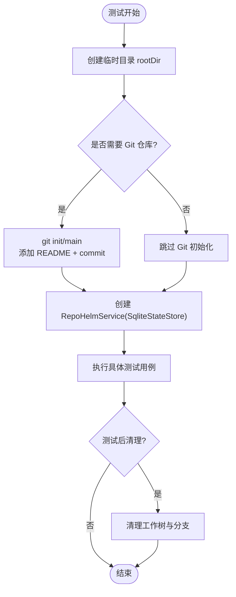
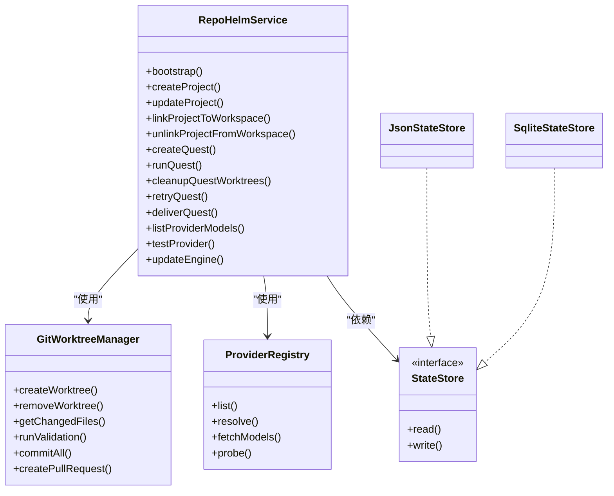

# 单元测试

<cite>
**本文引用的文件**   
- [packages/core/src/service.test.ts](file://packages/core/src/service.test.ts)
- [packages/core/src/providers.test.ts](file://packages/core/src/providers.test.ts)
- [packages/core/src/service.ts](file://packages/core/src/service.ts)
- [packages/core/src/store.ts](file://packages/core/src/store.ts)
- [packages/core/src/providers.ts](file://packages/core/src/providers.ts)
- [packages/core/src/git.ts](file://packages/core/src/git.ts)
- [packages/core/src/types.ts](file://packages/core/src/types.ts)
- [packages/core/package.json](file://packages/core/package.json)
- [package.json](file://package.json)
- [pnpm-workspace.yaml](file://pnpm-workspace.yaml)
- [e2e/quest-workspace.spec.ts](file://e2e/quest-workspace.spec.ts)
</cite>

## 目录
1. [简介](#简介)
2. [项目结构](#项目结构)
3. [核心组件](#核心组件)
4. [架构总览](#架构总览)
5. [详细组件分析](#详细组件分析)
6. [依赖分析](#依赖分析)
7. [性能考虑](#性能考虑)
8. [故障排查指南](#故障排查指南)
9. [结论](#结论)
10. [附录](#附录)

## 简介
本文件面向 RepoHelm 的单元测试体系，系统性阐述 Vitest 测试框架在本项目中的使用与配置，覆盖测试文件组织与命名约定、核心服务模块（RepoHelmService）的功能测试、测试数据准备与清理机制（临时目录、Git 仓库初始化、状态存储模拟）、断言模式与最佳实践、覆盖率监控与改进策略，以及可维护的测试代码与测试数据管理方法。同时结合端到端测试（Playwright）对工作区与 Quest 工作流进行集成验证。

## 项目结构
- 测试集中在 packages/core/src 下，采用“被测文件.test.ts”的命名约定，便于与源码一一对应。
- Vitest 在 @repohelm/core 包中通过脚本直接运行，根目录提供统一的测试入口与脚本。
- 端到端测试位于 e2e 目录，使用 Playwright 验证 UI 与后端交互。

**图表来源**
- [packages/core/src/service.test.ts:1-591](file://packages/core/src/service.test.ts#L1-L591)
- [packages/core/src/providers.test.ts:1-77](file://packages/core/src/providers.test.ts#L1-L77)
- [packages/core/src/service.ts:1-800](file://packages/core/src/service.ts#L1-L800)
- [packages/core/src/store.ts:1-166](file://packages/core/src/store.ts#L1-L166)
- [packages/core/src/providers.ts:1-304](file://packages/core/src/providers.ts#L1-L304)
- [packages/core/src/git.ts:1-343](file://packages/core/src/git.ts#L1-L343)
- [packages/core/src/types.ts:1-334](file://packages/core/src/types.ts#L1-L334)
- [packages/core/package.json:1-21](file://packages/core/package.json#L1-L21)
- [package.json:1-21](file://package.json#L1-L21)
- [pnpm-workspace.yaml:1-5](file://pnpm-workspace.yaml#L1-L5)
- [e2e/quest-workspace.spec.ts:1-198](file://e2e/quest-workspace.spec.ts#L1-L198)

**章节来源**
- [packages/core/package.json:11](file://packages/core/package.json#L11)
- [package.json:11-13](file://package.json#L11-L13)
- [pnpm-workspace.yaml:1-5](file://pnpm-workspace.yaml#L1-L5)

## 核心组件
- RepoHelmService：核心业务服务，负责工作区与项目管理、Git 工作树管理、Quest 工作流编排、引擎配置与 BYOK 提供商模型列表拉取、安全策略与审计日志、知识库持久化等。
- StateStore/JsonStateStore/SqliteStateStore：状态持久化抽象与实现，支持迁移旧 JSON 格式与 SQLite 存储。
- ProviderRegistry：提供商注册表，统一从各提供商的 /models 接口解析模型列表，支持密钥可选与回退内置模型。
- GitWorktreeManager：Git 工作树生命周期管理，包括创建、清理、变更检测、验证命令执行、提交与 PR 创建等。
- 类型系统：完整的领域模型与接口定义，确保测试断言的强类型保障。

**章节来源**
- [packages/core/src/service.ts:56-133](file://packages/core/src/service.ts#L56-L133)
- [packages/core/src/store.ts:86-165](file://packages/core/src/store.ts#L86-L165)
- [packages/core/src/providers.ts:163-303](file://packages/core/src/providers.ts#L163-L303)
- [packages/core/src/git.ts:33-342](file://packages/core/src/git.ts#L33-L342)
- [packages/core/src/types.ts:1-334](file://packages/core/src/types.ts#L1-L334)

## 架构总览
下图展示了 RepoHelmService 的关键流程：工作区与项目 CRUD、Git 工作树管理、Quest 生命周期、引擎配置与提供商模型列表、安全策略与审计日志、知识库持久化。

**图表来源**
- [packages/core/src/service.ts:56-760](file://packages/core/src/service.ts#L56-L760)
- [packages/core/src/git.ts:33-342](file://packages/core/src/git.ts#L33-L342)
- [packages/core/src/providers.ts:163-303](file://packages/core/src/providers.ts#L163-L303)
- [packages/core/src/store.ts:86-165](file://packages/core/src/store.ts#L86-L165)

## 详细组件分析

### 测试文件组织与命名约定
- 命名：被测模块以 .ts 结尾，对应的测试文件以 .test.ts 结尾，例如 service.test.ts、providers.test.ts。
- 组织：所有测试集中于 packages/core/src，便于与源码一一对应、便于 IDE 导航与自动补全。
- 运行：通过 @repohelm/core 包的 test 脚本直接运行 Vitest，根脚本提供统一入口。

**章节来源**
- [packages/core/package.json:11](file://packages/core/package.json#L11)
- [package.json:11-13](file://package.json#L11-L13)

### RepoHelmService 功能测试
- 引导与状态持久化：验证引导流程、SQLite 持久化、旧 JSON 到 SQLite 的迁移。
- 工作区与项目管理：创建、更新、链接/解绑项目至工作区、移除项目、健康检查。
- Git 分支与工作树：列出分支、创建/清理工作树、检测变更、执行验证命令。
- 引擎与 BYOK：切换引擎模式、更新 BYOK 提供商配置、迁移旧格式、按提供商标识与回退。
- Quest 工作流：创建 Quest、规划事件、运行 Agent 后台、清理与重试、交付与 PR 准备。
- 安全策略与审计：命令权限评估、阻断外部后台命令、记录审计日志。
- 知识库与产品就绪度：写入项目摘要、检索知识、生成产品就绪度报告。

**图表来源**
- [packages/core/src/service.test.ts:34-591](file://packages/core/src/service.test.ts#L34-L591)
- [packages/core/src/service.ts:73-760](file://packages/core/src/service.ts#L73-L760)
- [packages/core/src/git.ts:79-120](file://packages/core/src/git.ts#L79-L120)
- [packages/core/src/providers.ts:221-303](file://packages/core/src/providers.ts#L221-L303)

**章节来源**
- [packages/core/src/service.test.ts:34-591](file://packages/core/src/service.test.ts#L34-L591)

### ProviderRegistry 模型拉取测试
- 行为：针对不同提供商的响应形状解析模型；当未提供密钥时回退内置模型；根据 Base URL 推断提供商；对非 2xx 状态回退并记录详情。
- 断言：live 标记、模型 id 与标签、回退行为、主机推断。

**图表来源**
- [packages/core/src/providers.test.ts:19-76](file://packages/core/src/providers.test.ts#L19-L76)
- [packages/core/src/providers.ts:221-303](file://packages/core/src/providers.ts#L221-L303)

**章节来源**
- [packages/core/src/providers.test.ts:19-76](file://packages/core/src/providers.test.ts#L19-L76)

### 测试数据准备与清理机制
- 临时目录：使用临时目录作为根目录，避免污染本地环境。
- Git 仓库初始化：初始化仓库、创建初始提交、添加 README，确保后续测试具备真实 Git 上下文。
- 状态存储模拟：使用 SQLite 存储器进行持久化测试，验证迁移逻辑与二次读取一致性。
- 清理：在测试结束后清理工作树与分支，保证测试可重复性与环境干净。

**图表来源**
- [packages/core/src/service.test.ts:12-32](file://packages/core/src/service.test.ts#L12-L32)
- [packages/core/src/service.test.ts:55-68](file://packages/core/src/service.test.ts#L55-L68)
- [packages/core/src/git.ts:142-157](file://packages/core/src/git.ts#L142-L157)

**章节来源**
- [packages/core/src/service.test.ts:12-32](file://packages/core/src/service.test.ts#L12-L32)
- [packages/core/src/git.ts:142-157](file://packages/core/src/git.ts#L142-L157)

### 断言模式与最佳实践
- 状态断言：断言工作区/项目/知识/事件数量与字段，确保引导与更新流程正确。
- 文件系统断言：使用 access/readFile 确认文件存在与内容符合预期。
- Git 行为断言：断言工作树路径存在、分支名称、变更文件、健康状态。
- 安全策略断言：断言命令被允许/拒绝、审计日志记录、权限要求。
- 引擎与提供商断言：断言引擎模式切换、BYOK 配置合并、迁移前后一致性、模型列表 live 状态与详情。
- 端到端断言：通过 Playwright 断言 UI 交互、事件流、知识库检索、交付状态。

**章节来源**
- [packages/core/src/service.test.ts:34-591](file://packages/core/src/service.test.ts#L34-L591)
- [packages/core/src/providers.test.ts:19-76](file://packages/core/src/providers.test.ts#L19-L76)
- [e2e/quest-workspace.spec.ts:35-197](file://e2e/quest-workspace.spec.ts#L35-L197)

### 测试覆盖率监控与改进策略
- 监控：Vitest 支持基于源码的覆盖率统计，可在 @repohelm/core 包的测试脚本中启用覆盖率参数。
- 改进策略：
  - 针对分支与异常路径补充用例（如工作树创建失败、验证命令失败、安全策略拒绝）。
  - 对 ProviderRegistry 的解析与回退路径进行充分覆盖。
  - 对引擎配置的边界条件（空字符串、无效键）进行断言。
  - 对 Git 操作的错误场景（路径冲突、非 Git 目录、权限不足）进行模拟与断言。
  - 使用 Vitest 的快照测试辅助记录复杂对象结构，减少未来重构带来的回归风险。

[本节为通用指导，不直接分析具体文件，故无“章节来源”]

### 可维护的测试代码与测试数据管理
- 工具函数：将公共的测试辅助（创建服务、初始化 Git 仓库）抽取为独立函数，提升复用性与可读性。
- 环境变量：对外部命令与开关（如 REPOHELM_CODEX_COMMAND、REPOHELM_ENABLE_GH_PR）进行测试前后恢复，避免跨用例污染。
- 数据隔离：每个测试用例使用独立的临时目录，避免共享状态导致的不确定性。
- 类型驱动：利用 types.ts 中的强类型接口，确保测试断言的准确性与可维护性。

**章节来源**
- [packages/core/src/service.test.ts:12-32](file://packages/core/src/service.test.ts#L12-L32)
- [packages/core/src/service.ts:262-277](file://packages/core/src/service.ts#L262-L277)
- [packages/core/src/git.ts:222-249](file://packages/core/src/git.ts#L222-L249)

## 依赖分析
- RepoHelmService 依赖 GitWorktreeManager、ProviderRegistry、LocalCliRegistry、AgentBackendRegistry、KnowledgeFileStore 与 StateStore。
- ProviderRegistry 依赖网络请求与环境变量，测试中通过 vi.spyOn 模拟 fetch。
- Store 层支持 JSON 与 SQLite 两种实现，测试覆盖迁移与并发读写场景。

**图表来源**
- [packages/core/src/service.ts:56-760](file://packages/core/src/service.ts#L56-L760)
- [packages/core/src/git.ts:33-342](file://packages/core/src/git.ts#L33-L342)
- [packages/core/src/providers.ts:163-303](file://packages/core/src/providers.ts#L163-L303)
- [packages/core/src/store.ts:86-165](file://packages/core/src/store.ts#L86-L165)

**章节来源**
- [packages/core/src/service.ts:56-760](file://packages/core/src/service.ts#L56-L760)
- [packages/core/src/store.ts:86-165](file://packages/core/src/store.ts#L86-L165)

## 性能考虑
- 测试并发：Vitest 支持并行执行测试文件，合理拆分测试文件可提升整体执行效率。
- 外部依赖：ProviderRegistry 的网络请求与 Git 操作耗时较长，建议在测试中最小化真实网络调用次数，优先使用回退与缓存。
- 状态持久化：SQLite 写入在高频测试中可能成为瓶颈，可通过批量写入与事务优化减少 I/O。

[本节为通用指导，不直接分析具体文件，故无“章节来源”]

## 故障排查指南
- Git 相关失败：检查工作树路径是否存在、是否为 Git 目录、分支起点是否有效；参考 GitWorktreeManager 的错误格式化输出。
- 安全策略拒绝：核对 allowedCommands 与命令审批模式，确认命令是否在白名单内；查看审计日志条目。
- 引擎配置异常：确认 BYOK 提供商配置合并逻辑与迁移后的字段完整性；验证 activeByokProviderId 是否正确。
- 端到端失败：检查 Playwright 页面元素定位、API 状态查询与工作树清理逻辑。

**章节来源**
- [packages/core/src/git.ts:335-341](file://packages/core/src/git.ts#L335-L341)
- [packages/core/src/service.ts:591-615](file://packages/core/src/service.ts#L591-L615)
- [packages/core/src/store.ts:36-84](file://packages/core/src/store.ts#L36-L84)
- [e2e/quest-workspace.spec.ts:16-33](file://e2e/quest-workspace.spec.ts#L16-L33)

## 结论
本测试体系以 Vitest 为核心，围绕 RepoHelmService 的关键能力构建了全面的功能测试与部分集成测试。通过临时目录与 Git 初始化确保测试隔离，通过 ProviderRegistry 的模拟与回退保障网络依赖可控，通过 SQLite 与 JSON 的双存储实现验证状态迁移与持久化一致性。建议持续完善覆盖率、优化外部依赖与 I/O 性能，并保持测试数据与断言模式的一致性，以提升长期可维护性。

## 附录
- 测试运行：在 @repohelm/core 包中执行测试脚本，根脚本提供统一入口。
- 端到端：Playwright 测试验证 UI 与后端交互，确保工作区与 Quest 工作流在真实浏览器环境下稳定运行。

**章节来源**
- [packages/core/package.json:11](file://packages/core/package.json#L11)
- [package.json:11-13](file://package.json#L11-L13)
- [e2e/quest-workspace.spec.ts:35-197](file://e2e/quest-workspace.spec.ts#L35-L197)