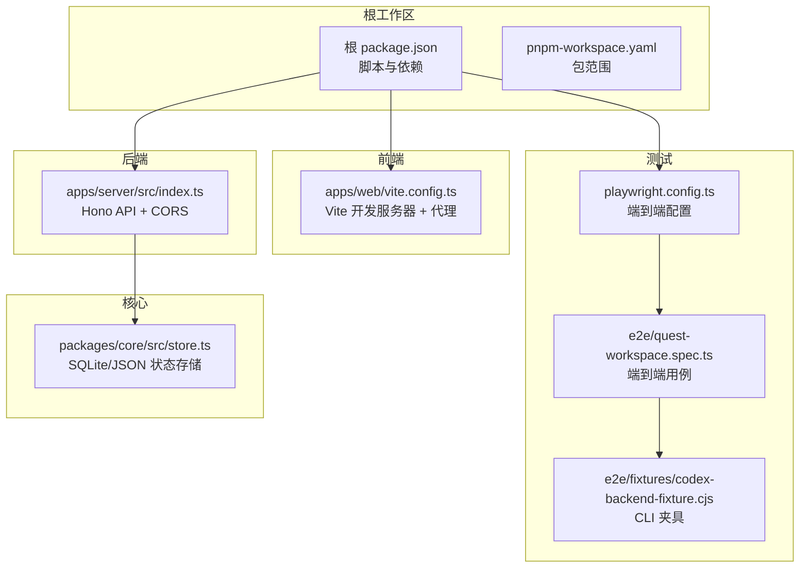
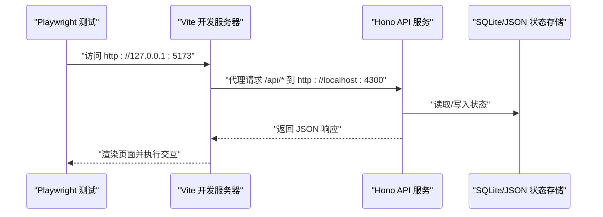
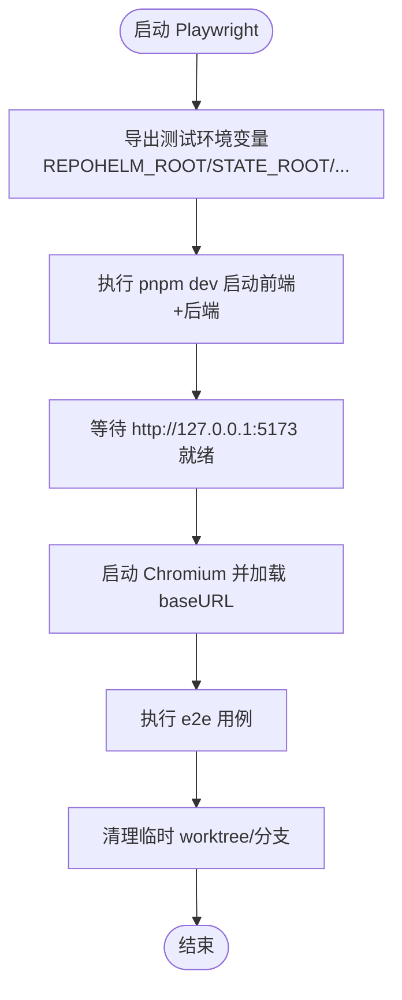
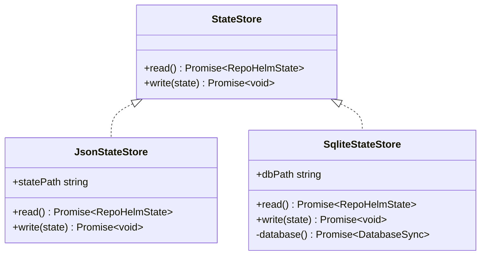
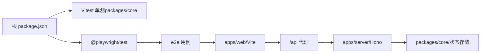

# 测试环境配置

<cite>
**本文引用的文件**
- [playwright.config.ts](file://playwright.config.ts)
- [package.json](file://package.json)
- [pnpm-workspace.yaml](file://pnpm-workspace.yaml)
- [apps/web/vite.config.ts](file://apps/web/vite.config.ts)
- [apps/server/src/index.ts](file://apps/server/src/index.ts)
- [e2e/quest-workspace.spec.ts](file://e2e/quest-workspace.spec.ts)
- [e2e/fixtures/codex-backend-fixture.cjs](file://e2e/fixtures/codex-backend-fixture.cjs)
- [packages/core/src/store.ts](file://packages/core/src/store.ts)
- [packages/core/package.json](file://packages/core/package.json)
- [README.md](file://README.md)
</cite>

## 目录
1. [简介](#简介)
2. [项目结构](#项目结构)
3. [核心组件](#核心组件)
4. [架构总览](#架构总览)
5. [详细组件分析](#详细组件分析)
6. [依赖关系分析](#依赖关系分析)
7. [性能考虑](#性能考虑)
8. [故障排除指南](#故障排除指南)
9. [结论](#结论)
10. [附录](#附录)

## 简介
本文件面向 RepoHelm 的测试环境配置，聚焦以下目标：
- 测试环境搭建与依赖安装、版本管理
- Playwright 端到端测试配置（浏览器、超时、并行、报告）
- 测试数据库与临时文件系统（.repohelm）隔离策略
- 测试环境变量设置与管理（含 CI/CD）
- 不同环境运行方式（本地、CI/CD、生产预览）
- 故障排除与性能调优

## 项目结构
RepoHelm 采用 pnpm workspace 组织多包结构，测试相关的关键位置如下：
- 根级脚本与依赖：根 package.json 提供统一的开发、构建、测试脚本与 Playwright 依赖
- 端到端测试：e2e 目录存放 Playwright 测试用例与夹具
- Web 前端：apps/web 使用 Vite 开发服务器，代理 API 到后端服务
- 服务端：apps/server 提供 Hono API，监听本地端口并处理 CORS
- 核心状态存储：packages/core 提供 SQLite/JSON 状态存储，用于 e2e 隔离

图表来源
- [playwright.config.ts:1-33](file://playwright.config.ts#L1-L33)
- [package.json:1-21](file://package.json#L1-L21)
- [pnpm-workspace.yaml:1-5](file://pnpm-workspace.yaml#L1-L5)
- [apps/web/vite.config.ts:1-16](file://apps/web/vite.config.ts#L1-L16)
- [apps/server/src/index.ts:1-366](file://apps/server/src/index.ts#L1-L366)
- [e2e/quest-workspace.spec.ts:1-198](file://e2e/quest-workspace.spec.ts#L1-L198)
- [e2e/fixtures/codex-backend-fixture.cjs:1-20](file://e2e/fixtures/codex-backend-fixture.cjs#L1-L20)
- [packages/core/src/store.ts:1-166](file://packages/core/src/store.ts#L1-L166)

章节来源
- [package.json:1-21](file://package.json#L1-L21)
- [pnpm-workspace.yaml:1-5](file://pnpm-workspace.yaml#L1-L5)

## 核心组件
- Playwright 端到端配置：集中于 playwright.config.ts，定义测试目录、超时、并行、报告、浏览器设备、webServer 启动命令与代理参数
- 根脚本与依赖：根 package.json 提供 dev、test、test:e2e、test:all 等脚本，统一管理 Playwright 版本
- 前端开发服务器：apps/web/vite.config.ts 设置本地端口与 API 代理，确保测试访问后端
- 后端服务：apps/server/src/index.ts 提供 API，监听本地端口，处理 CORS，读取 REPOHELM_* 环境变量
- 状态存储：packages/core/src/store.ts 提供 SQLite/JSON 存储，支持迁移与隔离
- 端到端用例：e2e/quest-workspace.spec.ts 验证工作流，清理临时 worktree 与分支
- CLI 夹具：e2e/fixtures/codex-backend-fixture.cjs 模拟外部 CLI 行为，输出产物

章节来源
- [playwright.config.ts:1-33](file://playwright.config.ts#L1-L33)
- [package.json:1-21](file://package.json#L1-L21)
- [apps/web/vite.config.ts:1-16](file://apps/web/vite.config.ts#L1-L16)
- [apps/server/src/index.ts:1-366](file://apps/server/src/index.ts#L1-L366)
- [packages/core/src/store.ts:1-166](file://packages/core/src/store.ts#L1-L166)
- [e2e/quest-workspace.spec.ts:1-198](file://e2e/quest-workspace.spec.ts#L1-L198)
- [e2e/fixtures/codex-backend-fixture.cjs:1-20](file://e2e/fixtures/codex-backend-fixture.cjs#L1-L20)

## 架构总览
下图展示了测试环境从 Playwright 到前端、后端与状态存储的整体交互。

图表来源
- [playwright.config.ts:19-25](file://playwright.config.ts#L19-L25)
- [apps/web/vite.config.ts:9-14](file://apps/web/vite.config.ts#L9-L14)
- [apps/server/src/index.ts:39-49](file://apps/server/src/index.ts#L39-L49)
- [packages/core/src/store.ts:117-166](file://packages/core/src/store.ts#L117-L166)

## 详细组件分析

### Playwright 端到端配置
- 测试目录与超时：testDir 指向 e2e；整体超时与 expect 超时分别配置
- 并行与报告：fullyParallel 启用完全并行；reporter 包含 list 与 HTML（不自动打开）
- 浏览器与代理：baseURL 固定；launchOptions 设置代理绕过参数；截图与 trace 策略
- webServer：启动命令导出多个 REPOHELM_* 变量，指定根目录、状态目录、Codex CLI 命令，然后执行 pnpm dev；等待 http://127.0.0.1:5173；超时较长以适应首次构建
- 项目：单项目 chromium，使用桌面 Chrome 设备

图表来源
- [playwright.config.ts:19-25](file://playwright.config.ts#L19-L25)
- [playwright.config.ts:11-18](file://playwright.config.ts#L11-L18)
- [e2e/quest-workspace.spec.ts:16-33](file://e2e/quest-workspace.spec.ts#L16-L33)

章节来源
- [playwright.config.ts:1-33](file://playwright.config.ts#L1-L33)

### 前端开发服务器与代理
- Vite 本地端口固定为 5173
- 通过 proxy 将 /api 请求转发至后端服务，默认端口来自 REPOHELM_PORT（默认 4300）

章节来源
- [apps/web/vite.config.ts:1-16](file://apps/web/vite.config.ts#L1-L16)

### 后端服务与环境变量
- CORS 允许前端地址 http://localhost:5173 与 http://127.0.0.1:5173
- 读取 REPOHELM_ROOT、REPOHELM_STATE_ROOT、REPOHELM_WORKTREE_ROOT、REPOHELM_KNOWLEDGE_ROOT、REPOHELM_PORT 等环境变量
- 默认端口 4300，若未显式设置则使用环境变量

章节来源
- [apps/server/src/index.ts:13-37](file://apps/server/src/index.ts#L13-L37)
- [apps/server/src/index.ts:42-49](file://apps/server/src/index.ts#L42-L49)

### 状态存储与隔离
- SQLite 状态存储：首次读取失败时回退到 JSON 存储；写入时持久化到 .repohelm/state.sqlite
- JSON 状态存储：读取 .repohelm/state.json，迁移后写入 SQLite
- e2e 隔离：Playwright 启动时将 REPOHELM_STATE_ROOT 指向 .repohelm/e2e，避免污染本地开发状态

图表来源
- [packages/core/src/store.ts:86-166](file://packages/core/src/store.ts#L86-L166)

章节来源
- [packages/core/src/store.ts:1-166](file://packages/core/src/store.ts#L1-L166)
- [playwright.config.ts:21](file://playwright.config.ts#L21)

### 端到端用例与清理
- 用例覆盖：设置、创建工作区、关联仓库、创建 Quest、运行、查看知识、交付、清理
- 清理逻辑：afterAll 中根据状态查询目标 Quest，删除对应 worktree 与分支，保证测试环境干净

章节来源
- [e2e/quest-workspace.spec.ts:1-198](file://e2e/quest-workspace.spec.ts#L1-L198)

### CLI 夹具
- 作用：模拟外部 CLI 后端行为，在 repohelm-quest-output 目录写入产物文件
- 触发：通过 REPOHELM_CODEX_COMMAND 指定，配合 Playwright 启动命令注入

章节来源
- [e2e/fixtures/codex-backend-fixture.cjs:1-20](file://e2e/fixtures/codex-backend-fixture.cjs#L1-L20)
- [playwright.config.ts:21](file://playwright.config.ts#L21)

## 依赖关系分析
- 根脚本依赖 Playwright：根 package.json 声明 @playwright/test，提供 test:e2e 脚本
- 工作区组织：pnpm-workspace.yaml 指定 apps/* 与 packages/* 为包范围
- 前后端联调：Vite 代理将 /api 请求转发到后端端口，Playwright 通过 baseURL 访问前端
- 状态存储：后端服务依赖核心包的状态存储实现

图表来源
- [package.json:15-19](file://package.json#L15-L19)
- [pnpm-workspace.yaml:1-5](file://pnpm-workspace.yaml#L1-L5)
- [apps/web/vite.config.ts:9-14](file://apps/web/vite.config.ts#L9-L14)
- [apps/server/src/index.ts:39-49](file://apps/server/src/index.ts#L39-L49)
- [packages/core/src/store.ts:117-166](file://packages/core/src/store.ts#L117-L166)

章节来源
- [package.json:1-21](file://package.json#L1-L21)
- [pnpm-workspace.yaml:1-5](file://pnpm-workspace.yaml#L1-L5)

## 性能考虑
- 并行执行：fullyParallel 启用，可提升吞吐；但需注意资源竞争与并发测试稳定性
- 超时设置：整体超时与 expect 超时合理分配，避免误判与资源占用
- webServer 启动：首次构建时间较长，已设置较长超时；建议在 CI 中缓存依赖与构建产物
- 代理与网络：launchOptions 设置代理绕过，减少不必要的代理开销
- 状态存储：SQLite 相比 JSON 更适合频繁读写；e2e 使用独立状态目录，避免 I/O 抖动

## 故障排除指南
- 测试无法启动或超时
  - 检查 webServer 命令是否正确导出 REPOHELM_* 变量并执行 pnpm dev
  - 确认端口 5173 可用，必要时调整 Vite 端口或停止占用进程
- 前端无法访问后端 API
  - 检查 Vite 代理配置是否指向后端端口（默认 4300），或通过 REPOHELM_PORT 覆盖
  - 确认后端 CORS 是否允许前端地址
- 状态污染或冲突
  - 确保 e2e 使用独立状态目录（REPOHELM_STATE_ROOT 指向 .repohelm/e2e）
  - 清理临时 worktree 与分支：用例 afterAll 已负责清理，如失败可手动执行清理逻辑
- 代理与网络问题
  - launchOptions 已设置代理绕过，如仍出现代理干扰，可在运行时显式清空代理环境变量
- CI/CD 环境差异
  - 使用 NO_PROXY/HTTP_PROXY 等环境变量确保测试网络行为一致
  - 如需并行加速，结合 CI 并行矩阵拆分测试套件

章节来源
- [playwright.config.ts:19-25](file://playwright.config.ts#L19-L25)
- [apps/web/vite.config.ts:9-14](file://apps/web/vite.config.ts#L9-L14)
- [apps/server/src/index.ts:42-49](file://apps/server/src/index.ts#L42-L49)
- [e2e/quest-workspace.spec.ts:16-33](file://e2e/quest-workspace.spec.ts#L16-L33)

## 结论
RepoHelm 的测试环境通过 Playwright 实现端到端覆盖，结合 Vite 代理与 Hono API，形成完整的本地开发与测试闭环。通过环境变量隔离状态存储与临时文件系统，确保测试稳定与可重复。建议在 CI/CD 中遵循本文提供的环境变量与并行策略，持续优化启动与清理流程，提升整体测试效率与可靠性。

## 附录

### 测试环境变量清单与用途
- REPOHELM_ROOT：测试状态根目录（通常指向仓库根）
- REPOHELM_STATE_ROOT：测试专用状态目录（e2e 使用 .repohelm/e2e）
- REPOHELM_WORKTREE_ROOT：工作树根目录（可选）
- REPOHELM_KNOWLEDGE_ROOT：知识库根目录（可选）
- REPOHELM_PORT：后端 API 端口（默认 4300）
- REPOHELM_CODEX_COMMAND：Codex CLI 后端命令（用于 e2e 夹具）
- NO_PROXY/HTTP_PROXY 等：控制代理绕过与网络行为

章节来源
- [playwright.config.ts:21](file://playwright.config.ts#L21)
- [apps/server/src/index.ts:13-37](file://apps/server/src/index.ts#L13-L37)
- [apps/web/vite.config.ts:5](file://apps/web/vite.config.ts#L5)

### 不同环境运行方式
- 本地开发
  - 使用根脚本启动：pnpm dev（同时启动前端与后端）
  - 运行单测：pnpm test（核心包 Vitest）
  - 运行 e2e：pnpm test:e2e（Playwright）
- CI/CD
  - 使用 NO_PROXY/HTTP_PROXY 等环境变量确保网络一致性
  - 可开启并行矩阵拆分 e2e 测试套件
  - 缓存 pnpm 依赖与构建产物以缩短流水线时间
- 生产预览环境
  - 保持与本地一致的环境变量与端口配置
  - 确保代理设置与 CORS 允许范围满足测试访问

章节来源
- [package.json:7-14](file://package.json#L7-L14)
- [README.md:79-86](file://README.md#L79-L86)