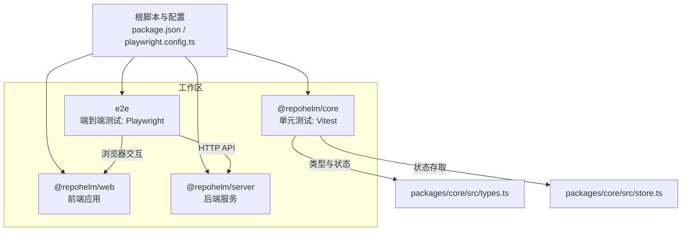
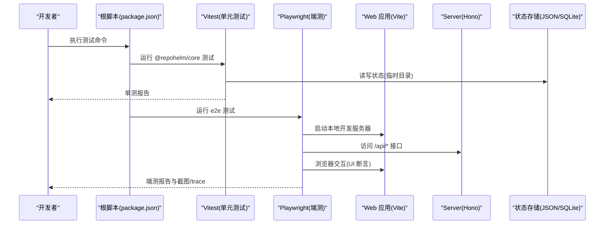
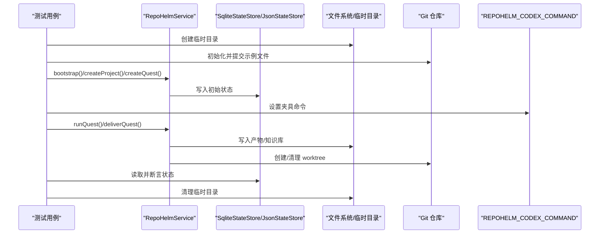
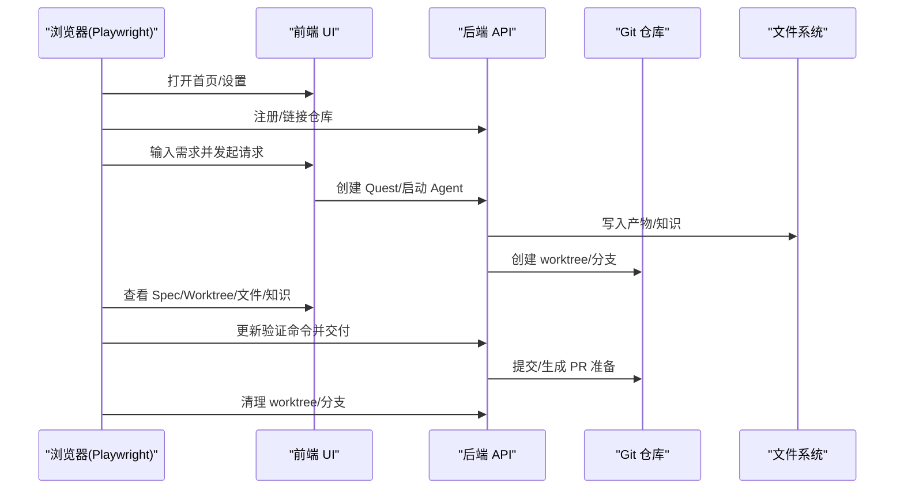
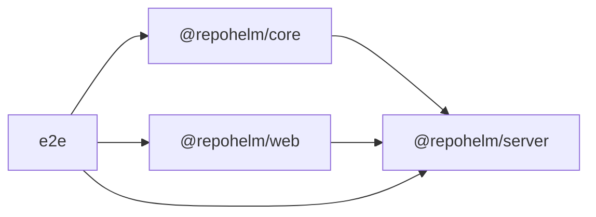

# 测试策略

<cite>
**本文引用的文件**
- [playwright.config.ts](file://playwright.config.ts)
- [package.json](file://package.json)
- [packages/core/package.json](file://packages/core/package.json)
- [apps/web/package.json](file://apps/web/package.json)
- [apps/server/package.json](file://apps/server/package.json)
- [packages/core/src/providers.test.ts](file://packages/core/src/providers.test.ts)
- [packages/core/src/service.test.ts](file://packages/core/src/service.test.ts)
- [e2e/quest-workspace.spec.ts](file://e2e/quest-workspace.spec.ts)
- [e2e/fixtures/codex-backend-fixture.cjs](file://e2e/fixtures/codex-backend-fixture.cjs)
- [packages/core/src/store.ts](file://packages/core/src/store.ts)
- [packages/core/src/types.ts](file://packages/core/src/types.ts)
- [tsconfig.base.json](file://tsconfig.base.json)
</cite>

## 目录
1. [引言](#引言)
2. [项目结构](#项目结构)
3. [核心组件](#核心组件)
4. [架构总览](#架构总览)
5. [详细组件分析](#详细组件分析)
6. [依赖关系分析](#依赖关系分析)
7. [性能考虑](#性能考虑)
8. [故障排除指南](#故障排除指南)
9. [结论](#结论)
10. [附录](#附录)

## 引言
本文件系统化阐述 RepoHelm 的测试策略与实践，覆盖单元测试（Vitest）与端到端测试（Playwright）两大体系，明确测试组织方式、用例设计原则、测试数据准备与清理、测试环境配置与管理、测试自动化与持续集成建议、调试与故障排除方法，以及性能与覆盖率的监控与改进策略。目标是帮助开发者在不深入源码的前提下理解测试架构，并高效开展本地与CI测试。

## 项目结构
RepoHelm 采用多包工作区（pnpm workspace）组织，测试分布在以下位置：
- 单元测试：位于 packages/core/src 下，使用 Vitest 运行。
- 端到端测试：位于 e2e 目录，使用 Playwright，包含浏览器交互与后端行为验证。
- 根级脚本：统一通过根 package.json 的 npm scripts 调用各包脚本，支持全链路类型检查、单元测试与端测执行。
- 类型与状态存储：types.ts 定义核心领域模型；store.ts 提供 JSON/SQLite 状态持久化与迁移逻辑，支撑服务层测试。

图表来源
- [playwright.config.ts:1-33](file://playwright.config.ts#L1-L33)
- [package.json:7-14](file://package.json#L7-L14)
- [packages/core/package.json:8-12](file://packages/core/package.json#L8-L12)
- [apps/web/package.json:6-10](file://apps/web/package.json#L6-L10)
- [apps/server/package.json:6-10](file://apps/server/package.json#L6-L10)

章节来源
- [package.json:1-21](file://package.json#L1-L21)
- [playwright.config.ts:1-33](file://playwright.config.ts#L1-L33)

## 核心组件
- 单元测试（Vitest）
  - 在 @repohelm/core 包中，通过 vitest run --dir src 执行，覆盖 providers 与 service 模块的关键逻辑。
  - 使用 mock/spy 技术对 fetch、子进程等外部依赖进行隔离，确保测试稳定与可重复。
- 端到端测试（Playwright）
  - 在 e2e 目录下，通过 playwright test 执行，自动启动本地开发服务器，访问前端页面并模拟用户操作。
  - 通过环境变量注入后端“夹具”（fixture），验证外部 CLI 行为与产物输出。
- 测试数据与清理
  - 服务层测试广泛使用临时目录与 Git 初始化，确保每次测试隔离且可清理。
  - 端测结束后通过 API 查询状态并清理 Git worktree 与分支，避免残留影响后续测试。
- 测试环境
  - 根脚本统一导出 NO_PROXY/HTTP_PROXY 等变量，保证测试期间网络代理不影响本地服务。
  - Playwright 配置了截图与 trace，便于失败时定位问题。

章节来源
- [packages/core/package.json:8-12](file://packages/core/package.json#L8-L12)
- [packages/core/src/providers.test.ts:1-77](file://packages/core/src/providers.test.ts#L1-L77)
- [packages/core/src/service.test.ts:1-591](file://packages/core/src/service.test.ts#L1-L591)
- [e2e/quest-workspace.spec.ts:1-198](file://e2e/quest-workspace.spec.ts#L1-L198)
- [e2e/fixtures/codex-backend-fixture.cjs:1-20](file://e2e/fixtures/codex-backend-fixture.cjs#L1-L20)
- [playwright.config.ts:19-25](file://playwright.config.ts#L19-L25)
- [package.json:12-12](file://package.json#L12-L12)

## 架构总览
下图展示了测试栈的整体流程：根脚本触发测试，Vitest 执行单元测试，Playwright 启动本地 Web 服务并驱动浏览器，调用后端 API 与前端 UI，最终断言结果与副作用。

图表来源
- [package.json:11-13](file://package.json#L11-L13)
- [playwright.config.ts:19-25](file://playwright.config.ts#L19-L25)
- [apps/web/package.json:7-8](file://apps/web/package.json#L7-L8)
- [apps/server/package.json:7-9](file://apps/server/package.json#L7-L9)
- [packages/core/src/store.ts:91-166](file://packages/core/src/store.ts#L91-L166)

## 详细组件分析

### 单元测试：ProviderRegistry 与模型解析
- 目标：验证不同供应商（OpenAI、Anthropic、Gemini、OpenRouter、DeepSeek 兼容）的模型列表解析、显示名映射、前缀处理与回退逻辑。
- 关键点：
  - 使用 vi.spyOn 对全局 fetch 进行一次性 mock，确保单测隔离。
  - 针对无 API Key 场景，验证 fallback 模式与 live=false。
  - 针对非 2xx 响应，验证错误详情与回退行为。
  - 支持从 base URL 推断供应商（resolve）。
- 设计原则：
  - 每个断言聚焦单一行为，参数化输入最小化。
  - 使用真实响应结构与字段映射，避免过度抽象导致的误判。

图表来源
- [packages/core/src/providers.test.ts:6-17](file://packages/core/src/providers.test.ts#L6-L17)
- [packages/core/src/providers.test.ts:19-76](file://packages/core/src/providers.test.ts#L19-L76)

章节来源
- [packages/core/src/providers.test.ts:1-77](file://packages/core/src/providers.test.ts#L1-L77)

### 单元测试：RepoHelmService 与状态持久化
- 目标：验证服务层核心业务流，包括引导、状态持久化与迁移、项目健康检查、工作树管理、任务执行与交付、权限与审计日志等。
- 关键点：
  - 使用临时目录与 mkdtemp 创建隔离环境，Git 初始化与提交确保真实仓库场景。
  - SQLite 与 JSON 存储之间的迁移逻辑被显式断言。
  - 通过环境变量注入 Codex CLI 夹具，验证外部命令执行与产物输出。
  - 安全策略限制未允许命令，审计日志记录决策。
- 设计原则：
  - 每个用例独立初始化，避免跨用例污染。
  - 对副作用（文件系统、Git、网络）进行最小化与可控的模拟或清理。

图表来源
- [packages/core/src/service.test.ts:12-32](file://packages/core/src/service.test.ts#L12-L32)
- [packages/core/src/service.test.ts:55-68](file://packages/core/src/service.test.ts#L55-L68)
- [packages/core/src/service.test.ts:402-440](file://packages/core/src/service.test.ts#L402-L440)
- [packages/core/src/store.ts:91-166](file://packages/core/src/store.ts#L91-L166)

章节来源
- [packages/core/src/service.test.ts:1-591](file://packages/core/src/service.test.ts#L1-L591)
- [packages/core/src/store.ts:1-166](file://packages/core/src/store.ts#L1-166)

### 端到端测试：工作空间与 Quest 生命周期
- 目标：从浏览器 UI 触发一个完整的 Quest 生命周期，验证 UI 交互、Agent 规划、工作树创建、验证、审查、交付与知识沉淀。
- 关键点：
  - 打开设置页，注册全局仓库并链接到工作空间，配置 worktree 根目录。
  - 在 Composer 输入需求，选择 Agent Backend 与执行模式，发起请求。
  - 断言 UI 展示的 Spec、验收标准、能力推荐、Worktree 状态、变更文件与知识中心内容。
  - 交付阶段调用后端 API 将验证命令指向本地可用命令，确保可确定性。
  - 结束后通过 API 查询状态并清理 Git worktree 与分支。
- 设计原则：
  - 用例命名包含时间戳，避免并发冲突。
  - 通过 API 注入夹具命令，使外部 CLI 行为可预测。
  - 断言覆盖 UI、事件流、产物与审计日志。

图表来源
- [e2e/quest-workspace.spec.ts:35-197](file://e2e/quest-workspace.spec.ts#L35-L197)
- [e2e/fixtures/codex-backend-fixture.cjs:1-20](file://e2e/fixtures/codex-backend-fixture.cjs#L1-L20)
- [playwright.config.ts:19-25](file://playwright.config.ts#L19-L25)

章节来源
- [e2e/quest-workspace.spec.ts:1-198](file://e2e/quest-workspace.spec.ts#L1-L198)
- [e2e/fixtures/codex-backend-fixture.cjs:1-20](file://e2e/fixtures/codex-backend-fixture.cjs#L1-L20)

### 测试数据准备与清理机制
- 单元测试
  - 临时目录：使用 mkdtemp 创建隔离根目录，避免共享状态。
  - Git 仓库：初始化 main 分支与示例提交，模拟真实仓库。
  - 状态存储：先写入旧格式 JSON，再由 SQLite Store 自动迁移，断言迁移结果。
- 端到端测试
  - 通过 API 查询当前状态，定位目标 Quest 的 worktree 并强制移除，同时删除对应分支。
  - 清理过程在 test.afterAll 中执行，确保即使测试失败也能回收资源。

章节来源
- [packages/core/src/service.test.ts:12-32](file://packages/core/src/service.test.ts#L12-L32)
- [packages/core/src/service.test.ts:251-305](file://packages/core/src/service.test.ts#L251-L305)
- [e2e/quest-workspace.spec.ts:16-33](file://e2e/quest-workspace.spec.ts#L16-L33)

### 测试环境配置与管理
- 根脚本
  - 统一导出 NO_PROXY/HTTP_PROXY 等变量，避免代理干扰本地服务。
  - 提供 dev、build、typecheck、test、test:e2e、test-all 等脚本。
- Playwright
  - 自动启动本地开发服务器，设置 baseURL、超时、截图与 trace。
  - 通过 webServer.command 注入 REPOHELM_ROOT、REPOHELM_STATE_ROOT、REPOHELM_CODEX_COMMAND 等环境变量。
- Vitest
  - 在 @repohelm/core 包内运行，直接覆盖 src 目录下的测试文件。

章节来源
- [package.json:7-14](file://package.json#L7-L14)
- [playwright.config.ts:19-25](file://playwright.config.ts#L19-L25)
- [packages/core/package.json:8-12](file://packages/core/package.json#L8-L12)

### 测试用例设计原则与覆盖范围
- 原则
  - 单一职责：每个用例只验证一个行为或边界条件。
  - 可重复：使用临时目录与 mock，避免外部状态耦合。
  - 可观测：断言 UI 文本、事件数量、产物文件、审计日志等多维度指标。
  - 可维护：用例命名清晰，步骤分层，失败时能快速定位。
- 覆盖范围
  - 单元：Provider 解析、引擎配置、状态迁移、工作树生命周期、安全策略与审计。
  - 端测：UI 交互、Agent 规划与执行、交付闭环、知识沉淀与搜索。

章节来源
- [packages/core/src/providers.test.ts:19-76](file://packages/core/src/providers.test.ts#L19-L76)
- [packages/core/src/service.test.ts:34-591](file://packages/core/src/service.test.ts#L34-L591)
- [e2e/quest-workspace.spec.ts:35-197](file://e2e/quest-workspace.spec.ts#L35-L197)

### 性能测试与负载测试
- 当前现状
  - 代码库未提供专用的性能或负载测试脚本或工具配置。
- 建议
  - 单元测试层面：对热点函数（如模型解析、状态写入）增加基准测试（benchmark），使用 Vitest 的 benchmark 能力或独立基准工具。
  - 端到端层面：对关键 UI 路径（如创建 Quest、交付）录制 trace，结合浏览器性能面板分析瓶颈。
  - 负载建议：在 CI 中按需开启，区分常规测试与压力测试作业，避免阻塞主流水线。

[本节为通用指导，无需列出章节来源]

### 测试覆盖率监控与改进策略
- 当前现状
  - 代码库未见覆盖率配置（如 vitest 或 playwright 的覆盖率选项）。
- 建议
  - Vitest：在 @repohelm/core 的测试配置中启用覆盖率收集，关注语句、分支、函数与行覆盖率，优先补齐关键分支与异常路径。
  - Playwright：对关键 UI 路径与 API 调用进行覆盖率统计，结合 trace 定位未覆盖的交互分支。
  - 改进策略：以覆盖率阈值为抓手，逐步提升关键模块的覆盖度；对高风险路径（安全策略、状态迁移、外部命令执行）重点保障。

[本节为通用指导，无需列出章节来源]

## 依赖关系分析
- 包间依赖
  - @repohelm/server 依赖 @repohelm/core 的领域模型与服务接口。
  - @repohelm/web 作为前端应用，与 @repohelm/server 通过本地开发服务器通信。
  - e2e 通过 Playwright 与 @repohelm/web、@repohelm/server 协作。
- 测试依赖
  - Vitest 仅在 @repohelm/core 内部运行，隔离其他包。
  - Playwright 依赖本地开发服务器与夹具脚本，确保端测稳定性。

图表来源
- [apps/server/package.json:12-12](file://apps/server/package.json#L12-L12)
- [apps/web/package.json:6-10](file://apps/web/package.json#L6-L10)
- [playwright.config.ts:19-25](file://playwright.config.ts#L19-L25)

章节来源
- [apps/server/package.json:1-22](file://apps/server/package.json#L1-L22)
- [apps/web/package.json:1-34](file://apps/web/package.json#L1-L34)
- [playwright.config.ts:1-33](file://playwright.config.ts#L1-L33)

## 性能考虑
- 单元测试
  - 使用临时目录与 SQLite 内存数据库替代磁盘 IO，缩短测试时长。
  - 对外部依赖（fetch、子进程）进行精准 mock，避免真实网络与 I/O。
- 端到端测试
  - 通过 webServer 复用本地开发服务器，减少冷启动时间。
  - 控制测试并发与超时，避免浏览器实例过多导致资源争用。
- 数据与状态
  - 服务层测试尽量复用初始化逻辑，减少重复 Git 操作。
  - 端测结束后统一清理，防止后续测试受历史状态影响。

[本节为通用指导，无需列出章节来源]

## 故障排除指南
- Playwright 测试失败
  - 检查截图与 trace 文件，定位 UI 不一致或元素不可见问题。
  - 确认本地开发服务器已启动且 baseURL 正确。
  - 核对 NO_PROXY/HTTP_PROXY 环境变量是否正确传递。
- 单元测试失败
  - 关注 mock 是否被正确恢复（afterEach 中 restoreAllMocks）。
  - 检查临时目录权限与 Git 初始化是否成功。
- 外部命令被拒绝
  - 检查安全策略中的命令白名单与沙箱运行时配置。
  - 确认夹具命令是否符合 allowlist。
- 状态不一致
  - 确认 SQLite 与 JSON 存储迁移逻辑是否生效。
  - 核对 REPOHELM_STATE_ROOT 是否指向预期目录。

章节来源
- [playwright.config.ts:11-18](file://playwright.config.ts#L11-L18)
- [packages/core/src/providers.test.ts:15-17](file://packages/core/src/providers.test.ts#L15-L17)
- [packages/core/src/service.test.ts:442-475](file://packages/core/src/service.test.ts#L442-L475)
- [packages/core/src/store.ts:36-84](file://packages/core/src/store.ts#L36-L84)

## 结论
RepoHelm 的测试策略以 Vitest 为核心进行单元测试，以 Playwright 为核心进行端到端测试，配合严格的测试数据准备与清理机制，形成了从服务层到 UI 的完整验证闭环。建议在现有基础上引入覆盖率与性能基准，完善 CI 中的分层测试策略，持续提升测试质量与效率。

## 附录
- 测试命令速查
  - 类型检查：pnpm typecheck
  - 单元测试：pnpm test
  - 端到端测试：pnpm test:e2e
  - 全链路测试：pnpm test:all
- 关键配置参考
  - Playwright：测试目录、超时、截图、trace、webServer、项目设备
  - Vitest：测试目录与运行参数
  - TypeScript：基础编译选项

章节来源
- [package.json:7-14](file://package.json#L7-L14)
- [playwright.config.ts:4-32](file://playwright.config.ts#L4-L32)
- [packages/core/package.json:8-12](file://packages/core/package.json#L8-L12)
- [tsconfig.base.json:2-12](file://tsconfig.base.json#L2-L12)