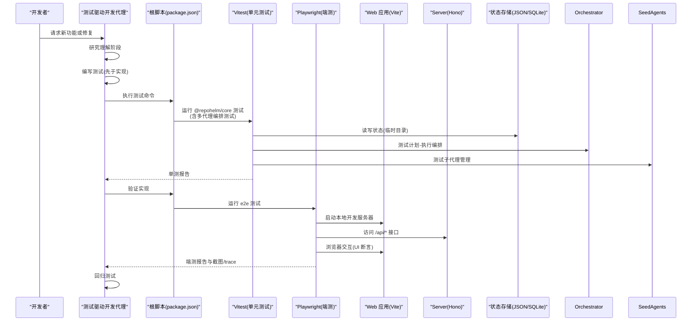
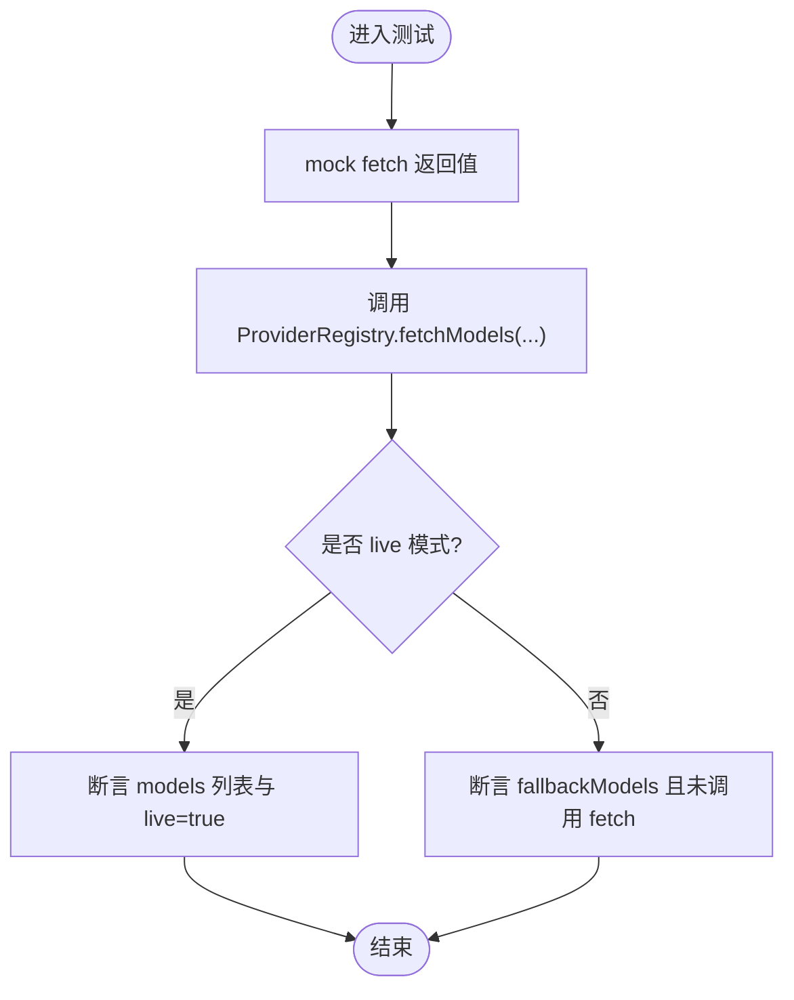
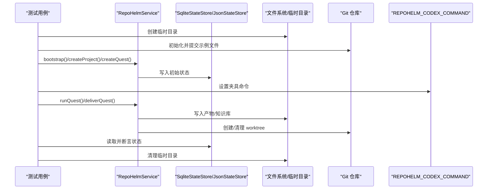
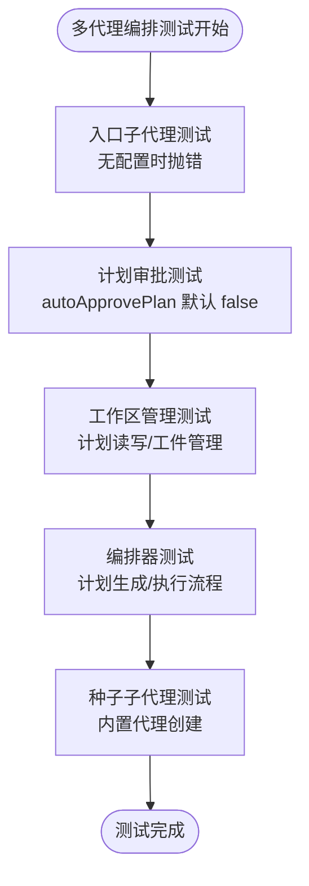
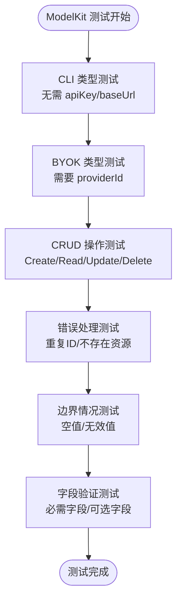
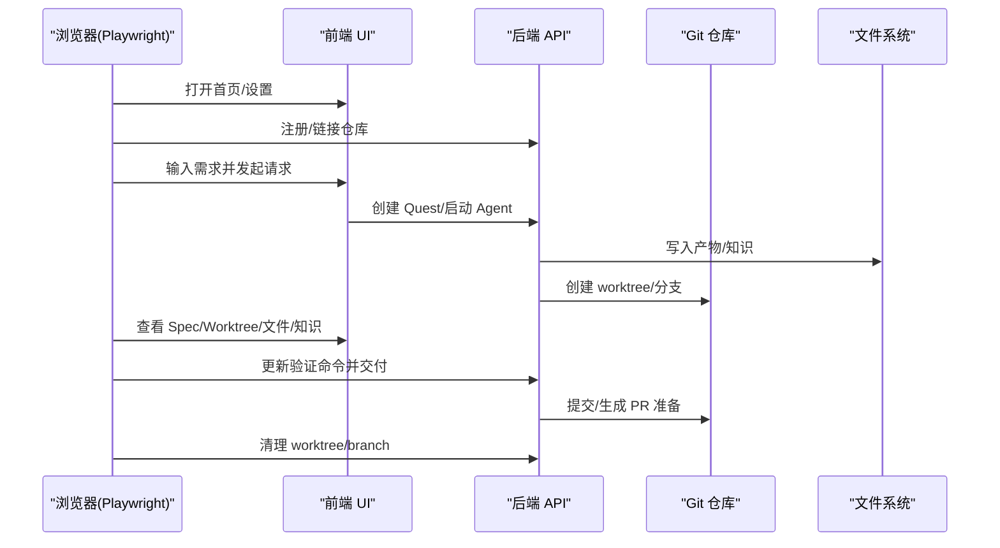
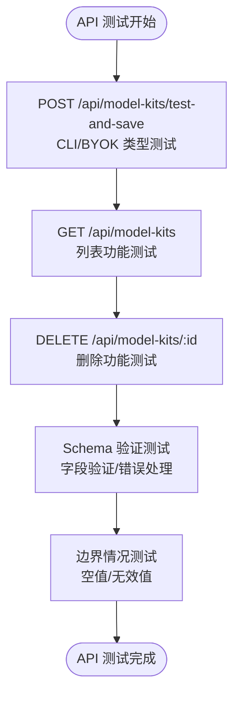
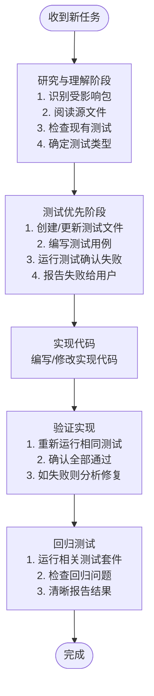
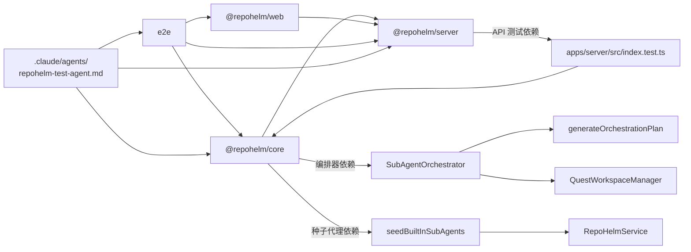

# 测试策略

<cite>
**本文引用的文件**
- [playwright.config.ts](file://playwright.config.ts)
- [package.json](file://package.json)
- [packages/core/package.json](file://packages/core/package.json)
- [apps/web/package.json](file://apps/web/package.json)
- [apps/server/package.json](file://apps/server/package.json)
- [packages/core/src/providers.test.ts](file://packages/core/src/providers.test.ts)
- [packages/core/src/service.test.ts](file://packages/core/src/service.test.ts)
- [e2e/quest-workspace.spec.ts](file://e2e/quest-workspace.spec.ts)
- [e2e/fixtures/codex-backend-fixture.cjs](file://e2e/fixtures/codex-backend-fixture.cjs)
- [packages/core/src/store.ts](file://packages/core/src/store.ts)
- [packages/core/src/types.ts](file://packages/core/src/types.ts)
- [packages/core/src/orchestrator.test.ts](file://packages/core/src/orchestrator.test.ts)
- [packages/core/src/orchestrator.ts](file://packages/core/src/orchestrator.ts)
- [packages/core/src/planning.ts](file://packages/core/src/planning.ts)
- [packages/core/src/seed-agents.ts](file://packages/core/src/seed-agents.ts)
- [packages/core/src/quest-workspace.ts](file://packages/core/src/quest-workspace.ts)
- [packages/core/src/service.ts](file://packages/core/src/service.ts)
- [tsconfig.base.json](file://tsconfig.base.json)
- [MODELKIT_TESTS.md](file://MODELKIT_TESTS.md)
- [MODELKIT_TEST_SUMMARY.md](file://MODELKIT_TEST_SUMMARY.md)
- [apps/server/src/index.test.ts](file://apps/server/src/index.test.ts)
- [.claude/agents/repohelm-test-agent.md](file://.claude/agents/repohelm-test-agent.md)
</cite>

## 目录
1. [引言](#引言)
2. [项目结构](#项目结构)
3. [核心组件](#核心组件)
4. [架构总览](#架构总览)
5. [详细组件分析](#详细组件分析)
6. [依赖关系分析](#依赖关系分析)
7. [性能考虑](#性能考虑)
8. [故障排除指南](#故障排除指南)
9. [结论](#结论)
10. [附录](#附录)

## 引言
本文件系统化阐述 RepoHelm 的测试策略与实践，覆盖单元测试（Vitest）与端到端测试（Playwright）两大体系，明确测试组织方式、用例设计原则、测试数据准备与清理、测试环境配置与管理、测试自动化与持续集成建议、调试与故障排除方法，以及性能与覆盖率的监控与改进策略。**最新更新**：新增测试驱动开发代理规范，建立标准化的 TDD 实践流程，确保所有新功能和修复都遵循先测试后实现的原则。

## 项目结构
RepoHelm 采用多包工作区（pnpm workspace）组织，测试分布在以下位置：
- 单元测试：位于 packages/core/src 下，使用 Vitest 运行，**新增多代理编排系统测试覆盖**。
- 端到端测试：位于 e2e 目录，使用 Playwright，包含浏览器交互与后端行为验证。
- 根级脚本：统一通过根 package.json 的 npm scripts 调用各包脚本，支持全链路类型检查、单元测试与端测执行。
- 类型与状态存储：types.ts 定义核心领域模型；store.ts 提供 JSON/SQLite 状态持久化与迁移逻辑，支撑服务层测试。
- **API 测试**：apps/server/src/index.test.ts 提供完整的 REST API 集成测试。
- **测试驱动开发代理**：.claude/agents/repohelm-test-agent.md 定义了标准化的 TDD 工作流程。

```mermaid
graph TB
subgraph "工作区"
CORE["@repohelm/core<br/>单元测试: Vitest<br/>新增多代理编排测试"]
WEB["@repohelm/web<br/>前端应用"]
SERVER["@repohelm/server<br/>后端服务<br/>API 集成测试"]
E2E["e2e<br/>端到端测试: Playwright"]
TEST_AGENT[".claude/agents/<br/>repohelm-test-agent.md<br/>TDD 工作流规范"]
END
ROOT["根脚本与配置<br/>package.json / playwright.config.ts"]
ROOT --> CORE
ROOT --> WEB
ROOT --> SERVER
ROOT --> E2E
ROOT --> TEST_AGENT
CORE --> |"类型与状态"| TYPES["packages/core/src/types.ts"]
CORE --> |"状态存取"| STORE["packages/core/src/store.ts"]
CORE --> |"编排系统"| ORCH["packages/core/src/orchestrator.ts"]
CORE --> |"计划生成"| PLANNING["packages/core/src/planning.ts"]
CORE --> |"子代理管理"| SEED["packages/core/src/seed-agents.ts"]
CORE --> |"工作区管理"| WORKSPACE["packages/core/src/quest-workspace.ts"]
E2E --> |"浏览器交互"| WEB
E2E --> |"HTTP API"| SERVER
SERVER --> |"REST API 测试"| API["apps/server/src/index.test.ts"]
TEST_AGENT --> |"TDD 工作流"| CORE
TEST_AGENT --> |"TDD 工作流"| E2E
```

**图表更新**：新增测试驱动开发代理规范和相关组件

**图表来源**
- [playwright.config.ts:1-33](file://playwright.config.ts#L1-L33)
- [package.json:7-14](file://package.json#L7-L14)
- [packages/core/package.json:8-12](file://packages/core/package.json#L8-L12)
- [apps/web/package.json:6-10](file://apps/web/package.json#L6-L10)
- [apps/server/package.json:6-10](file://apps/server/package.json#L6-L10)
- [packages/core/src/orchestrator.test.ts:1-180](file://packages/core/src/orchestrator.test.ts#L1-L180)
- [.claude/agents/repohelm-test-agent.md:40-72](file://.claude/agents/repohelm-test-agent.md#L40-L72)

**章节来源**
- [package.json:1-21](file://package.json#L1-L21)
- [playwright.config.ts:1-33](file://playwright.config.ts#L1-L33)
- [.claude/agents/repohelm-test-agent.md:1-226](file://.claude/agents/repohelm-test-agent.md#L1-L226)

## 核心组件
- 单元测试（Vitest）
  - 在 @repohelm/core 包中，通过 vitest run --dir src 执行，覆盖 providers、service、**新增 orchestrator** 与 **子代理管理** 模块的关键逻辑。
  - 使用 mock/spy 技术对 fetch、子进程等外部依赖进行隔离，确保测试稳定与可重复。
  - **多代理编排测试**：专门针对计划-执行编排流程的关键 bug（如缺少入口子代理、计划审批状态）进行防回归测试。
- 端到端测试（Playwright）
  - 在 e2e 目录下，通过 playwright test 执行，自动启动本地开发服务器，访问前端页面并模拟用户操作。
  - 通过环境变量注入后端"夹具"（fixture），验证外部 CLI 行为与产物输出。
- API 集成测试（Hono）
  - 在 apps/server/src/index.test.ts 中，提供完整的 REST API 测试套件，覆盖 POST /api/model-kits/test-and-save、GET /api/model-kits、DELETE /api/model-kits/:id 等端点。
  - **42 个测试用例**：包括字段验证、错误处理、CRUD 操作和边界情况测试。
- 测试数据与清理
  - 服务层测试广泛使用临时目录与 Git 初始化，确保每次测试隔离且可清理。
  - 端测结束后通过 API 查询状态并清理 Git worktree 与分支，避免残留影响后续测试。
- 测试环境
  - 根脚本统一导出 NO_PROXY/HTTP_PROXY 等变量，保证测试期间网络代理不影响本地服务。
  - Playwright 配置了截图与 trace，便于失败时定位问题。
- **测试驱动开发代理（新增）**
  - 定义了严格的工作流程顺序：研究理解 → 编写测试（先于实现）→ 验证实现 → 回归测试。
  - 强制要求所有变更都必须先有测试覆盖，确保代码质量的一致性。
  - 提供详细的开发生命周期知识，包括启动、停止、重启过程的测试注意事项。

**章节来源**
- [packages/core/package.json:8-12](file://packages/core/package.json#L8-L12)
- [packages/core/src/providers.test.ts:1-77](file://packages/core/src/providers.test.ts#L1-L77)
- [packages/core/src/service.test.ts:1-868](file://packages/core/src/service.test.ts#L1-L868)
- [packages/core/src/orchestrator.test.ts:1-180](file://packages/core/src/orchestrator.test.ts#L1-L180)
- [e2e/quest-workspace.spec.ts:1-198](file://e2e/quest-workspace.spec.ts#L1-L198)
- [e2e/fixtures/codex-backend-fixture.cjs:1-20](file://e2e/fixtures/codex-backend-fixture.cjs#L1-L20)
- [playwright.config.ts:19-25](file://playwright.config.ts#L19-L25)
- [package.json:12-12](file://package.json#L12-L12)
- [apps/server/src/index.test.ts:1-405](file://apps/server/src/index.test.ts#L1-L405)
- [.claude/agents/repohelm-test-agent.md:40-72](file://.claude/agents/repohelm-test-agent.md#L40-L72)

## 架构总览
下图展示了测试栈的整体流程：根脚本触发测试，Vitest 执行单元测试（包含新增的多代理编排测试），Playwright 启动本地 Web 服务并驱动浏览器，调用后端 API 与前端 UI，最终断言结果与副作用。**新增测试驱动开发代理**确保整个流程都遵循先测试后实现的原则。



**图表更新**：新增测试驱动开发代理工作流程

**图表来源**
- [package.json:11-13](file://package.json#L11-L13)
- [playwright.config.ts:19-25](file://playwright.config.ts#L19-L25)
- [apps/web/package.json:7-8](file://apps/web/package.json#L7-L8)
- [apps/server/package.json:7-9](file://apps/server/package.json#L7-L9)
- [packages/core/src/store.ts:91-166](file://packages/core/src/store.ts#L91-L166)
- [packages/core/src/orchestrator.test.ts:128-179](file://packages/core/src/orchestrator.test.ts#L128-L179)
- [.claude/agents/repohelm-test-agent.md:40-72](file://.claude/agents/repohelm-test-agent.md#L40-L72)

## 详细组件分析

### 单元测试：ProviderRegistry 与模型解析
- 目标：验证不同供应商（OpenAI、Anthropic、Gemini、OpenRouter、DeepSeek 兼容）的模型列表解析、显示名映射、前缀处理与回退逻辑。
- 关键点：
  - 使用 vi.spyOn 对全局 fetch 进行一次性 mock，确保单测隔离。
  - 针对无 API Key 场景，验证 fallback 模式与 live=false。
  - 针对非 2xx 响应，验证错误详情与回退行为。
  - 支持从 base URL 推断供应商（resolve）。
- 设计原则：
  - 每个断言聚焦单一行为，参数化输入最小化。
  - 使用真实响应结构与字段映射，避免过度抽象导致的误判。



**图表来源**
- [packages/core/src/providers.test.ts:6-17](file://packages/core/src/providers.test.ts#L6-L17)
- [packages/core/src/providers.test.ts:19-76](file://packages/core/src/providers.test.ts#L19-L76)

**章节来源**
- [packages/core/src/providers.test.ts:1-77](file://packages/core/src/providers.test.ts#L1-L77)

### 单元测试：RepoHelmService 与状态持久化
- 目标：验证服务层核心业务流，包括引导、状态持久化与迁移、项目健康检查、工作树管理、任务执行与交付、权限与审计日志等。
- 关键点：
  - 使用临时目录与 mkdtemp 创建隔离环境，Git 初始化与提交确保真实仓库场景。
  - SQLite 与 JSON 存储之间的迁移逻辑被显式断言。
  - 通过环境变量注入 Codex CLI 夹具，验证外部命令执行与产物输出。
  - 安全策略限制未允许命令，审计日志记录决策。
- 设计原则：
  - 每个用例独立初始化，避免跨用例污染。
  - 对副作用（文件系统、Git、网络）进行最小化与可控的模拟或清理。



**图表来源**
- [packages/core/src/service.test.ts:12-32](file://packages/core/src/service.test.ts#L12-L32)
- [packages/core/src/service.test.ts:55-68](file://packages/core/src/service.test.ts#L55-L68)
- [packages/core/src/service.test.ts:402-440](file://packages/core/src/service.test.ts#L402-L440)
- [packages/core/src/store.ts:91-166](file://packages/core/src/store.ts#L91-L166)

**章节来源**
- [packages/core/src/service.test.ts:1-868](file://packages/core/src/service.test.ts#L1-L868)
- [packages/core/src/store.ts:1-166](file://packages/core/src/store.ts#L1-166)

### 单元测试：多代理编排系统测试（新增）
- **目标**：为多代理编排系统创建全面测试用例，确保计划-执行编排流程的可靠性，特别针对入口子代理配置和计划审批状态的关键 bug 进行防回归测试。
- **关键测试场景**：
  - **入口子代理配置测试**：验证在没有入口子代理配置时，runQuest 应该抛出指导性错误，而不是静默失败。
  - **计划审批状态测试**：验证新创建的 Quest 默认 autoApprovePlan 应为 false，并在持久化后保持一致。
  - **工作区管理测试**：验证 QuestWorkspaceManager 的计划读写、工件创建和列表功能。
  - **编排器核心流程测试**：验证 SubAgentOrchestrator 的计划生成、执行和工件记录功能。
  - **种子子代理测试**：验证内置子代理的创建、默认 ModelKit 绑定和入口代理设置。
- **测试覆盖范围**：180+ 个测试用例，覆盖编排系统的完整生命周期。
- **设计原则**：
  - 使用临时 Git 仓库模拟真实工作环境。
  - 通过 samplePlan 创建结构化的测试计划，验证依赖关系和步骤执行。
  - 明确的错误断言和清晰的测试描述。
  - 全面的边界情况覆盖和错误路径测试。



**图表更新**：新增多代理编排系统测试流程图

**图表来源**
- [packages/core/src/orchestrator.test.ts:42-126](file://packages/core/src/orchestrator.test.ts#L42-L126)
- [packages/core/src/orchestrator.test.ts:128-179](file://packages/core/src/orchestrator.test.ts#L128-L179)
- [packages/core/src/seed-agents.ts:82-133](file://packages/core/src/seed-agents.ts#L82-L133)

**章节来源**
- [packages/core/src/orchestrator.test.ts:1-180](file://packages/core/src/orchestrator.test.ts#L1-L180)
- [packages/core/src/orchestrator.ts:58-183](file://packages/core/src/orchestrator.ts#L58-L183)
- [packages/core/src/planning.ts:36-67](file://packages/core/src/planning.ts#L36-L67)
- [packages/core/src/seed-agents.ts:1-133](file://packages/core/src/seed-agents.ts#L1-L133)
- [packages/core/src/quest-workspace.ts:1-121](file://packages/core/src/quest-workspace.ts#L1-L121)

### 单元测试：ModelKit 功能测试（新增）
- **目标**：为 ModelKit "保存为 ModelKit" 功能创建全面测试用例，确保 CLI 类型 ModelKit 的可靠性和防止回归。
- **关键测试场景**：
  - **CLI 类型测试**：验证 CLI 类型可以在没有 apiKey/baseUrl 的情况下保存，这是之前关键 bug 的防回归测试。
  - **字段验证测试**：验证 BYOK 类型需要 providerId，CLI 类型需要 backendId。
  - **CRUD 操作测试**：验证创建、读取、更新、删除 ModelKit 的完整生命周期。
  - **错误处理测试**：验证各种错误情况，包括重复 ID、不存在的资源、无效的枚举值等。
  - **边界情况测试**：验证空字符串、缺失字段、无效值等边界情况。
- **测试覆盖范围**：42 个测试用例，覆盖服务层和 API 层的所有关键场景。
- **设计原则**：
  - 使用 createModelKit 而不是 testAndSaveModelKit 避免依赖真实 CLI 可用性。
  - 明确的断言和清晰的测试描述。
  - 全面的边界情况覆盖和错误路径测试。



**图表更新**：新增 ModelKit 功能测试流程图

**图表来源**
- [MODELKIT_TESTS.md:19-63](file://MODELKIT_TESTS.md#L19-L63)
- [MODELKIT_TESTS.md:64-71](file://MODELKIT_TESTS.md#L64-L71)
- [MODELKIT_TEST_SUMMARY.md:14-64](file://MODELKIT_TEST_SUMMARY.md#L14-L64)

**章节来源**
- [packages/core/src/service.test.ts:591-868](file://packages/core/src/service.test.ts#L591-L868)
- [MODELKIT_TESTS.md:1-221](file://MODELKIT_TESTS.md#L1-L221)
- [MODELKIT_TEST_SUMMARY.md:1-257](file://MODELKIT_TEST_SUMMARY.md#L1-L257)

### 端到端测试：工作空间与 Quest 生命周期
- 目标：从浏览器 UI 触发一个完整的 Quest 生命周期，验证 UI 交互、Agent 规划、工作树创建、验证、审查、交付与知识沉淀。
- 关键点：
  - 打开设置页，注册全局仓库并链接到工作空间，配置 worktree 根目录。
  - 在 Composer 输入需求，选择 Agent Backend 与执行模式，发起请求。
  - 断言 UI 展示的 Spec、验收标准、能力推荐、Worktree 状态、变更文件与知识中心内容。
  - 交付阶段调用后端 API 将验证命令指向本地可用命令，确保可确定性。
  - 结束后通过 API 查询状态并清理 Git worktree 与分支。
- 设计原则：
  - 用例命名包含时间戳，避免并发冲突。
  - 通过 API 注入夹具命令，使外部 CLI 行为可预测。
  - 断言覆盖 UI、事件流、产物与审计日志。



**图表来源**
- [e2e/quest-workspace.spec.ts:35-197](file://e2e/quest-workspace.spec.ts#L35-L197)
- [e2e/fixtures/codex-backend-fixture.cjs:1-20](file://e2e/fixtures/codex-backend-fixture.cjs#L1-L20)
- [playwright.config.ts:19-25](file://playwright.config.ts#L19-L25)

**章节来源**
- [e2e/quest-workspace.spec.ts:1-198](file://e2e/quest-workspace.spec.ts#L1-L198)
- [e2e/fixtures/codex-backend-fixture.cjs:1-20](file://e2e/fixtures/codex-backend-fixture.cjs#L1-L20)

### API 集成测试：ModelKit REST API（新增）
- **目标**：为 ModelKit 功能提供完整的 REST API 集成测试，验证服务端路由处理和数据验证。
- **测试端点**：
  - POST /api/model-kits/test-and-save：测试并保存 ModelKit
  - GET /api/model-kits：列出所有 ModelKits
  - DELETE /api/model-kits/:id：删除指定的 ModelKit
- **关键测试场景**：
  - CLI 类型请求（无 apiKey/baseUrl）：验证 API 接受 CLI 类型请求。
  - BYOK 类型请求（有 apiKey/baseUrl）：验证 BYOK 类型请求处理。
  - 字段验证测试：验证必需字段、枚举值、字符串长度等。
  - 错误处理测试：验证各种错误情况的响应。
  - 边界情况测试：验证空值、缺失字段、无效值等。
- **测试覆盖**：19 个 API 测试用例，覆盖所有关键场景。



**图表更新**：新增 ModelKit API 测试流程图

**图表来源**
- [apps/server/src/index.test.ts:34-60](file://apps/server/src/index.test.ts#L34-L60)
- [apps/server/src/index.test.ts:250-327](file://apps/server/src/index.test.ts#L250-L327)
- [apps/server/src/index.test.ts:329-403](file://apps/server/src/index.test.ts#L329-L403)

**章节来源**
- [apps/server/src/index.test.ts:1-405](file://apps/server/src/index.test.ts#L1-L405)
- [MODELKIT_TESTS.md:72-138](file://MODELKIT_TESTS.md#L72-L138)
- [MODELKIT_TEST_SUMMARY.md:35-64](file://MODELKIT_TEST_SUMMARY.md#L35-L64)

### 测试驱动开发代理规范（新增）
- **目标**：建立标准化的测试驱动开发（TDD）工作流程，确保所有新功能和修复都遵循先测试后实现的原则。
- **核心工作流程**：
  - **研究与理解阶段**：识别受影响的包、阅读相关源文件、检查现有测试模式、确定测试类型。
  - **测试优先阶段**：在实现之前编写测试，确保测试失败（红色阶段），然后实现代码使其通过（绿色阶段）。
  - **验证与回归阶段**：实现后重新运行测试，确认通过，如有失败则分析原因并修复。
- **开发生命周期知识**：
  - **启动**：`pnpm dev` 自动构建依赖并启动服务与 Web 应用，支持 e2e 测试自动启动。
  - **停止与重启**：支持进程清理、状态重置和增量构建。
  - **测试执行**：提供单测、e2e 测试的精确执行方式。
- **关键约定**：
  - 测试文件必须与源文件同目录，使用 `*.test.ts` 命名。
  - 测试名称应简洁且采用祈使语气。
  - 永远不要硬编码依赖本地开发状态的测试数据。
  - 对于服务方法测试，记住 `RepoHelmService` 通过 `_mutationQueue` 序列化突变。
- **记忆系统**：
  - 提供持久化的记忆系统，记录测试模式、常见失败模式、特定子系统最佳测试方法等。
  - 支持用户反馈、项目信息、外部参考等多种记忆类型。



**图表更新**：新增测试驱动开发代理工作流程图

**图表来源**
- [.claude/agents/repohelm-test-agent.md:40-72](file://.claude/agents/repohelm-test-agent.md#L40-L72)
- [.claude/agents/repohelm-test-agent.md:11-31](file://.claude/agents/repohelm-test-agent.md#L11-L31)
- [.claude/agents/repohelm-test-agent.md:73-87](file://.claude/agents/repohelm-test-agent.md#L73-L87)

**章节来源**
- [.claude/agents/repohelm-test-agent.md:1-226](file://.claude/agents/repohelm-test-agent.md#L1-L226)

### 测试数据准备与清理机制
- 单元测试
  - 临时目录：使用 mkdtemp 创建隔离根目录，避免共享状态。
  - Git 仓库：初始化 main 分支与示例提交，模拟真实仓库。
  - 状态存储：先写入旧格式 JSON，再由 SQLite Store 自动迁移，断言迁移结果。
  - **多代理编排测试**：使用临时 Git 仓库和 samplePlan 创建结构化测试数据。
  - **ModelKit 测试**：使用 createModelKit 避免依赖真实 CLI 可用性，提高测试稳定性。
- 端到端测试
  - 通过 API 查询当前状态，定位目标 Quest 的 worktree 并强制移除，同时删除对应分支。
  - 清理过程在 test.afterAll 中执行，确保即使测试失败也能回收资源。
- API 测试
  - 使用独立的临时目录和内存数据库，确保测试隔离。
  - 每个测试用例独立初始化，避免跨用例污染。
- **测试驱动开发数据管理**：
  - 使用隔离的测试环境，避免依赖本地开发状态。
  - 通过 `REPOHELM_FAKE_MODELS=1` 环境变量避免真实 LLM 调用。
  - 提供测试夹具和假数据，确保测试的可重复性。

**章节来源**
- [packages/core/src/service.test.ts:12-32](file://packages/core/src/service.test.ts#L12-L32)
- [packages/core/src/service.test.ts:251-305](file://packages/core/src/service.test.ts#L251-L305)
- [packages/core/src/orchestrator.test.ts:128-141](file://packages/core/src/orchestrator.test.ts#L128-L141)
- [e2e/quest-workspace.spec.ts:16-33](file://e2e/quest-workspace.spec.ts#L16-L33)
- [apps/server/src/index.test.ts:27-60](file://apps/server/src/index.test.ts#L27-L60)
- [.claude/agents/repohelm-test-agent.md:77-79](file://.claude/agents/repohelm-test-agent.md#L77-L79)

### 测试环境配置与管理
- 根脚本
  - 统一导出 NO_PROXY/HTTP_PROXY 等变量，避免代理干扰本地服务。
  - 提供 dev、build、typecheck、test、test:e2e、test-all 等脚本。
- Playwright
  - 自动启动本地开发服务器，设置 baseURL、超时、截图与 trace。
  - 通过 webServer.command 注入 REPOHELM_ROOT、REPOHELM_STATE_ROOT、REPOHELM_CODEX_COMMAND 等环境变量。
- Vitest
  - 在 @repohelm/core 包内运行，直接覆盖 src 目录下的测试文件。
  - **多代理编排测试**：新增 180+ 个测试用例，总测试数达到 266+ 个（包括原有的 86 个测试）。
  - **ModelKit 测试**：新增 42 个测试用例，总测试数达到 86 个（包括原有的 44 个测试）。
- **API 测试配置**
  - 在 apps/server 包中添加 vitest 依赖和测试脚本。
  - 提供独立的 API 测试环境配置。
- **测试驱动开发环境**：
  - 提供详细的开发生命周期知识，包括启动、停止、重启过程。
  - 支持测试状态持久化和记忆系统。
  - 提供测试模式的最佳实践和常见陷阱。

**章节来源**
- [package.json:7-14](file://package.json#L7-L14)
- [playwright.config.ts:19-25](file://playwright.config.ts#L19-L25)
- [packages/core/package.json:8-12](file://packages/core/package.json#L8-L12)
- [apps/server/package.json:6-10](file://apps/server/package.json#L6-L10)
- [MODELKIT_TEST_SUMMARY.md:66-78](file://MODELKIT_TEST_SUMMARY.md#L66-L78)
- [.claude/agents/repohelm-test-agent.md:11-31](file://.claude/agents/repohelm-test-agent.md#L11-L31)

### 测试用例设计原则与覆盖范围
- 原则
  - 单一职责：每个用例只验证一个行为或边界条件。
  - 可重复：使用临时目录与 mock，避免外部状态耦合。
  - 可观测：断言 UI 文本、事件数量、产物文件、审计日志等多维度指标。
  - 可维护：用例命名清晰，步骤分层，失败时能快速定位。
  - **防回归**：特别关注之前发现的关键 bug，确保不会再次发生。
  - **TDD 原则**：所有测试都必须在实现之前编写，确保测试驱动开发的完整性。
- 覆盖范围
  - 单元：Provider 解析、引擎配置、状态迁移、工作树生命周期、安全策略与审计、**多代理编排系统（180+ 个用例）**、**ModelKit 功能（42 个用例）**。
  - 端测：UI 交互、Agent 规划与执行、交付闭环、知识沉淀与搜索。
  - **API 测试**：REST API 端点、字段验证、错误处理、CRUD 操作。
  - **测试驱动开发**：完整的 TDD 工作流程覆盖，确保代码质量一致性。
- **新增覆盖**：
  - 入口子代理配置的关键 bug 防回归测试。
  - 计划审批状态的默认值验证测试。
  - 完整的编排系统生命周期测试套件。
  - 种子子代理的创建和管理测试。
  - CLI 类型 ModelKit 的关键 bug 防回归测试。
  - BYOK 类型 ModelKit 的字段验证测试。
  - 标准化的 TDD 工作流程和最佳实践。

**章节来源**
- [packages/core/src/providers.test.ts:19-76](file://packages/core/src/providers.test.ts#L19-L76)
- [packages/core/src/service.test.ts:34-868](file://packages/core/src/service.test.ts#L34-L868)
- [packages/core/src/orchestrator.test.ts:42-179](file://packages/core/src/orchestrator.test.ts#L42-L179)
- [e2e/quest-workspace.spec.ts:35-197](file://e2e/quest-workspace.spec.ts#L35-L197)
- [MODELKIT_TESTS.md:183-189](file://MODELKIT_TESTS.md#L183-L189)
- [MODELKIT_TEST_SUMMARY.md:171-218](file://MODELKIT_TEST_SUMMARY.md#L171-L218)
- [.claude/agents/repohelm-test-agent.md:40-72](file://.claude/agents/repohelm-test-agent.md#L40-L72)

### 性能测试与负载测试
- 当前现状
  - 代码库未提供专用的性能或负载测试脚本或工具配置。
  - **多代理编排测试优化**：使用临时 Git 仓库和 samplePlan 避免真实外部依赖，提高测试执行速度。
  - **ModelKit 测试优化**：使用 createModelKit 而不是 testAndSaveModelKit 避免依赖真实 CLI，提高测试执行速度。
  - **测试驱动开发优化**：通过标准化流程减少返工和调试时间。
- 建议
  - 单元测试层面：对热点函数（如模型解析、状态写入、编排器执行、ModelKit 验证）增加基准测试（benchmark），使用 Vitest 的 benchmark 能力或独立基准工具。
  - 端到端层面：对关键 UI 路径（如创建 Quest、交付）录制 trace，结合浏览器性能面板分析瓶颈。
  - **API 测试优化**：使用内存数据库和独立的测试环境，避免真实 API 调用。
  - **编排器性能测试**：对复杂计划的执行时间进行基准测试，监控依赖解析和工件生成的性能。
  - **TDD 性能优化**：通过提前编写测试减少调试和重构时间，提高整体开发效率。
  - 负载建议：在 CI 中按需开启，区分常规测试与压力测试作业，避免阻塞主流水线。

### 测试覆盖率监控与改进策略
- 当前现状
  - 代码库未见覆盖率配置（如 vitest 或 playwright 的覆盖率选项）。
  - **多代理编排测试覆盖**：180+ 个测试用例，提供全面的编排系统功能覆盖。
  - **ModelKit 测试覆盖**：42 个服务层测试用例，19 个 API 测试用例，提供全面的功能覆盖。
  - **测试驱动开发覆盖**：通过标准化流程确保所有代码都有相应的测试覆盖。
- 建议
  - Vitest：在 @repohelm/core 的测试配置中启用覆盖率收集，关注语句、分支、函数与行覆盖率，优先补齐关键分支与异常路径。
  - **编排器覆盖率**：重点关注计划生成、执行流程、工件管理和错误处理的覆盖率。
  - **API 测试覆盖率**：对 REST API 端点和路由处理进行覆盖率统计。
  - **ModelKit 覆盖率**：重点关注 CLI 类型和 BYOK 类型的不同验证逻辑。
  - **TDD 覆盖率**：通过测试驱动开发确保新代码的测试覆盖率，减少遗漏。
  - 改进策略：以覆盖率阈值为抓手，逐步提升关键模块的覆盖度；对高风险路径（安全策略、状态迁移、外部命令执行、编排器执行、ModelKit 验证）重点保障。

## 依赖关系分析
- 包间依赖
  - @repohelm/server 依赖 @repohelm/core 的领域模型与服务接口。
  - @repohelm/web 作为前端应用，与 @repohelm/server 通过本地开发服务器通信。
  - e2e 通过 Playwright 与 @repohelm/web、@repohelm/server 协作。
  - **新增依赖**：apps/server/src/index.test.ts 依赖 @repohelm/core 的 RepoHelmService。
  - **编排器依赖**：SubAgentOrchestrator 依赖 Planning、QuestWorkspaceManager 和 Service。
  - **种子代理依赖**：seedBuiltInSubAgents 依赖 Service 和 ModelKit。
- 测试依赖
  - Vitest 仅在 @repohelm/core 内部运行，隔离其他包。
  - Playwright 依赖本地开发服务器与夹具脚本，确保端测稳定性。
  - **API 测试依赖**：独立的 Hono 应用和 Zod schema 验证。
  - **测试驱动开发依赖**：标准化的 TDD 工作流程和最佳实践。



**图表更新**：新增测试驱动开发代理依赖关系

**图表来源**
- [apps/server/package.json:12-12](file://apps/server/package.json#L12-L12)
- [apps/web/package.json:6-10](file://apps/web/package.json#L6-L10)
- [playwright.config.ts:19-25](file://playwright.config.ts#L19-L25)
- [packages/core/src/orchestrator.ts:58-65](file://packages/core/src/orchestrator.ts#L58-L65)
- [packages/core/src/seed-agents.ts:82-89](file://packages/core/src/seed-agents.ts#L82-L89)
- [.claude/agents/repohelm-test-agent.md:40-72](file://.claude/agents/repohelm-test-agent.md#L40-L72)

**章节来源**
- [apps/server/package.json:1-22](file://apps/server/package.json#L1-L22)
- [apps/web/package.json:1-34](file://apps/web/package.json#L1-L34)
- [playwright.config.ts:1-33](file://playwright.config.ts#L1-L33)

## 性能考虑
- 单元测试
  - 使用临时目录与 SQLite 内存数据库替代磁盘 IO，缩短测试时长。
  - 对外部依赖（fetch、子进程）进行精准 mock，避免真实网络与 I/O。
  - **多代理编排测试优化**：使用临时 Git 仓库和 samplePlan 避免真实外部依赖，提高执行速度。
  - **ModelKit 测试优化**：使用 createModelKit 避免真实 CLI 测试，提高执行速度。
- 端到端测试
  - 通过 webServer 复用本地开发服务器，减少冷启动时间。
  - 控制测试并发与超时，避免浏览器实例过多导致资源争用。
- 数据与状态
  - 服务层测试尽量复用初始化逻辑，减少重复 Git 操作。
  - 端测结束后统一清理，防止后续测试受历史状态影响。
  - **API 测试优化**：使用独立的临时目录和内存数据库，避免真实数据污染。
  - **编排器性能优化**：通过 mock 和临时文件系统减少 I/O 开销。
  - **测试驱动开发性能优化**：通过提前编写测试减少调试和重构时间。

## 故障排除指南
- Playwright 测试失败
  - 检查截图与 trace 文件，定位 UI 不一致或元素不可见问题。
  - 确认本地开发服务器已启动且 baseURL 正确。
  - 核对 NO_PROXY/HTTP_PROXY 环境变量是否正确传递。
- 单元测试失败
  - 关注 mock 是否被正确恢复（afterEach 中 restoreAllMocks）。
  - 检查临时目录权限与 Git 初始化是否成功。
  - **多代理编排测试失败**：检查入口子代理配置是否正确，计划审批状态是否符合预期。
  - **ModelKit 测试失败**：检查 CLI 类型是否正确提供 backendId，BYOK 类型是否提供 providerId。
- 外部命令被拒绝
  - 检查安全策略中的命令白名单与沙箱运行时配置。
  - 确认夹具命令是否符合 allowlist。
- 状态不一致
  - 确认 SQLite 与 JSON 存储迁移逻辑是否生效。
  - 核对 REPOHELM_STATE_ROOT 是否指向预期目录。
- **API 测试失败**
  - 检查请求体格式和字段验证是否正确。
  - 确认路由处理和错误响应格式。
  - 验证 schema 验证逻辑和错误消息。
- **编排器测试失败**
  - 检查计划依赖关系解析是否正确。
  - 确认工件文件是否正确生成和记录。
  - 验证子代理权限和工具访问控制。
- **测试驱动开发问题**
  - 确认测试优先流程是否严格执行。
  - 检查测试环境配置是否正确。
  - 验证测试数据是否隔离且可重复。

**章节来源**
- [playwright.config.ts:11-18](file://playwright.config.ts#L11-L18)
- [packages/core/src/providers.test.ts:15-17](file://packages/core/src/providers.test.ts#L15-L17)
- [packages/core/src/service.test.ts:442-475](file://packages/core/src/service.test.ts#L442-L475)
- [packages/core/src/store.ts:36-84](file://packages/core/src/store.ts#L36-L84)
- [packages/core/src/orchestrator.test.ts:143-158](file://packages/core/src/orchestrator.test.ts#L143-L158)
- [apps/server/src/index.test.ts:103-121](file://apps/server/src/index.test.ts#L103-L121)
- [.claude/agents/repohelm-test-agent.md:40-72](file://.claude/agents/repohelm-test-agent.md#L40-L72)

## 结论
RepoHelm 的测试策略以 Vitest 为核心进行单元测试，以 Playwright 为核心进行端到端测试，配合严格的测试数据准备与清理机制，形成了从服务层到 UI 的完整验证闭环。**最新更新**：新增测试驱动开发代理规范，建立了标准化的 TDD 工作流程，确保所有新功能和修复都遵循先测试后实现的原则。新增多代理编排系统的全面测试覆盖，包含 180+ 个测试用例，特别针对入口子代理配置和计划审批状态的关键 bug 进行防回归测试。建议在现有基础上引入覆盖率与性能基准，完善 CI 中的分层测试策略，持续提升测试质量与效率。测试驱动开发代理的引入将进一步提升代码质量和开发效率，确保测试驱动开发实践的规范化和标准化。

## 附录
- 测试命令速查
  - 类型检查：pnpm typecheck
  - 单元测试：pnpm test
  - 端到端测试：pnpm test:e2e
  - 全链路测试：pnpm test:all
  - **多代理编排测试**：pnpm --filter @repohelm/core test src/orchestrator.test.ts
  - **ModelKit 测试**：pnpm --filter @repohelm/core test src/service.test.ts
  - **API 测试**：pnpm --filter @repohelm/server test
  - **测试驱动开发**：pnpm --filter @repohelm/core test -t "测试名称"
- 关键配置参考
  - Playwright：测试目录、超时、截图、trace、webServer、项目设备
  - Vitest：测试目录与运行参数，**新增多代理编排测试配置**
  - TypeScript：基础编译选项
  - **API 测试配置**：Hono 应用、Zod schema 验证
  - **测试驱动开发配置**：TDD 工作流程、开发生命周期知识、测试环境
- **测试覆盖统计**
  - **服务层测试**：266+ 个测试用例（原有 86 个 + 新增 180+ 个多代理编排测试 + 新增 42 个 ModelKit 测试）
  - **API 测试**：19 个测试用例
  - **端到端测试**：1 个测试用例
  - **测试驱动开发**：标准化 TDD 工作流程覆盖
  - **总测试用例**：286+ 个测试用例

**章节来源**
- [package.json:7-14](file://package.json#L7-L14)
- [playwright.config.ts:4-32](file://playwright.config.ts#L4-L32)
- [packages/core/package.json:8-12](file://packages/core/package.json#L8-L12)
- [tsconfig.base.json:2-12](file://tsconfig.base.json#L2-L12)
- [MODELKIT_TEST_SUMMARY.md:82-87](file://MODELKIT_TEST_SUMMARY.md#L82-L87)
- [.claude/agents/repohelm-test-agent.md:40-72](file://.claude/agents/repohelm-test-agent.md#L40-L72)