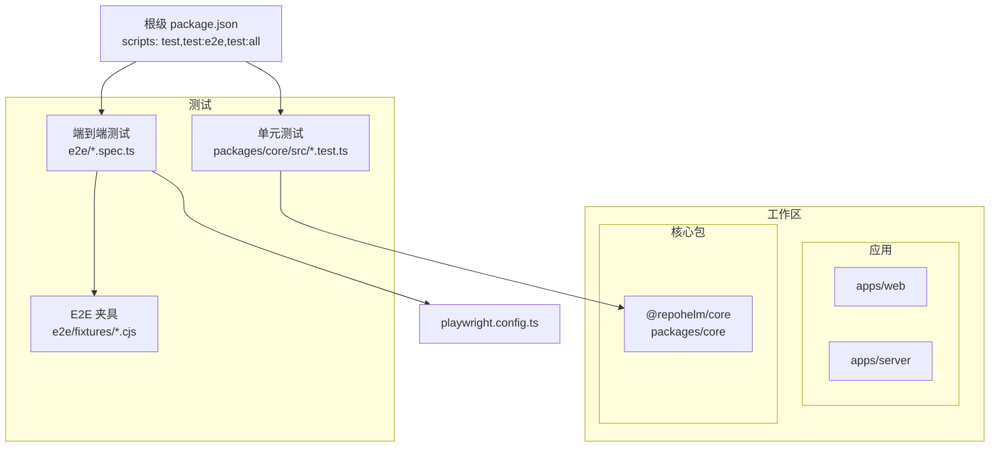
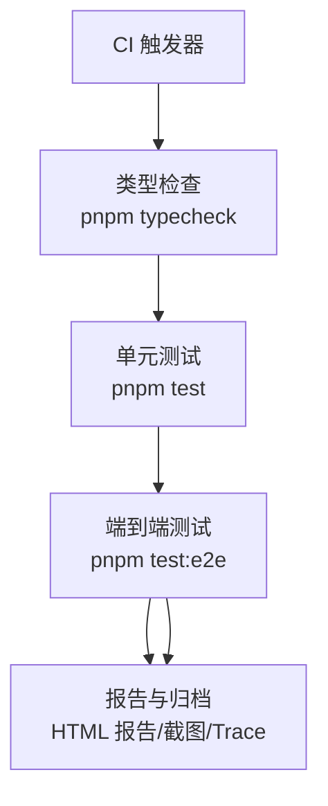
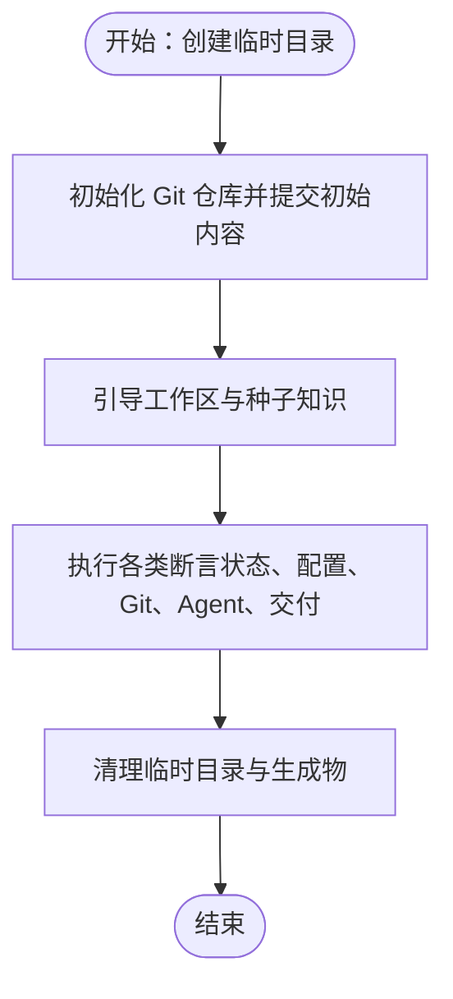
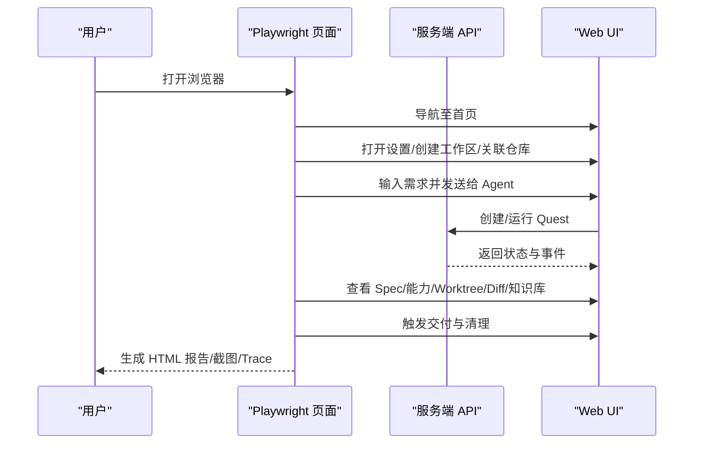
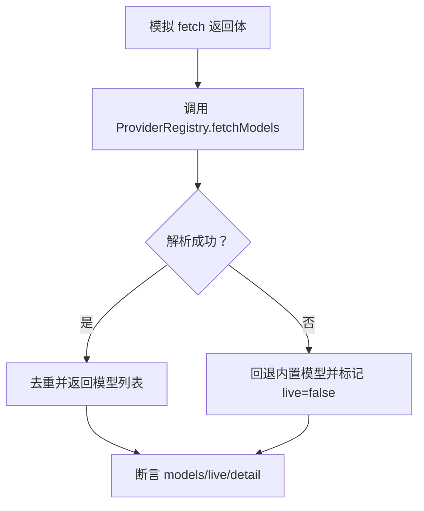
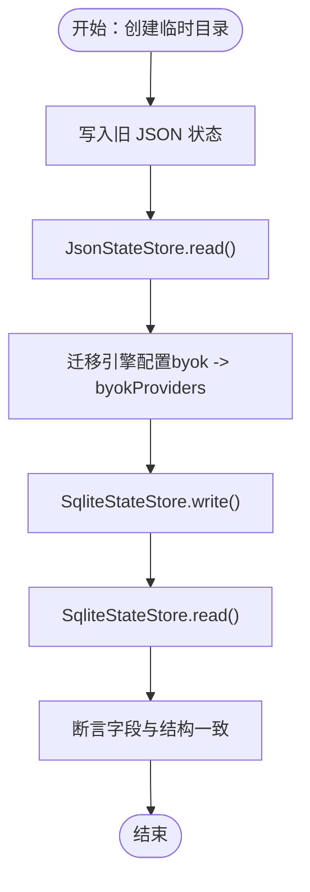
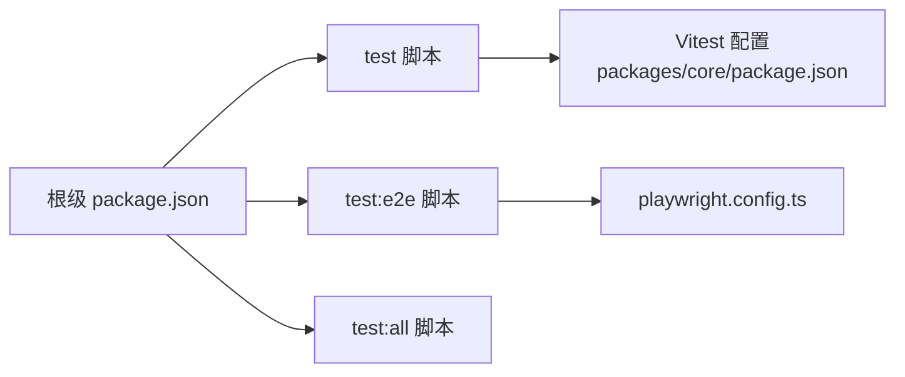

# 测试自动化

<cite>
**本文档引用的文件**
- [README.md](file://README.md)
- [package.json](file://package.json)
- [pnpm-workspace.yaml](file://pnpm-workspace.yaml)
- [playwright.config.ts](file://playwright.config.ts)
- [packages/core/package.json](file://packages/core/package.json)
- [packages/core/src/service.test.ts](file://packages/core/src/service.test.ts)
- [packages/core/src/providers.test.ts](file://packages/core/src/providers.test.ts)
- [packages/core/src/store.ts](file://packages/core/src/store.ts)
- [packages/core/src/service.ts](file://packages/core/src/service.ts)
- [packages/core/src/providers.ts](file://packages/core/src/providers.ts)
- [e2e/quest-workspace.spec.ts](file://e2e/quest-workspace.spec.ts)
- [e2e/fixtures/codex-backend-fixture.cjs](file://e2e/fixtures/codex-backend-fixture.cjs)
</cite>

## 目录
1. [简介](#简介)
2. [项目结构](#项目结构)
3. [核心组件](#核心组件)
4. [架构总览](#架构总览)
5. [详细组件分析](#详细组件分析)
6. [依赖关系分析](#依赖关系分析)
7. [性能考量](#性能考量)
8. [故障排查指南](#故障排查指南)
9. [结论](#结论)
10. [附录](#附录)

## 简介
本文件面向 RepoHelm 的测试自动化体系，系统阐述单元测试与端到端（E2E）测试的实施策略、持续集成与持续部署中的测试流程、测试脚本组织与参数配置、测试报告生成与分析方法（覆盖率与性能指标）、失败处理与通知机制（日志与调试信息）、测试数据管理与版本控制策略，以及测试质量与稳定性的监控方法。文档同时给出最佳实践与改进建议，帮助团队在 CI/CD 中稳定高效地运行测试。

## 项目结构
RepoHelm 采用 pnpm 工作区组织，核心测试位于 packages/core，E2E 测试位于 e2e 目录。根级 package.json 提供统一的测试脚本入口，Playwright 配置负责浏览器端到端测试的生命周期与报告输出。

图表来源
- [pnpm-workspace.yaml:1-5](file://pnpm-workspace.yaml#L1-L5)
- [package.json:7-13](file://package.json#L7-L13)
- [playwright.config.ts:1-33](file://playwright.config.ts#L1-L33)

章节来源
- [pnpm-workspace.yaml:1-5](file://pnpm-workspace.yaml#L1-L5)
- [package.json:7-13](file://package.json#L7-L13)
- [README.md:52-86](file://README.md#L52-L86)

## 核心组件
- 单元测试（Vitest）
  - 覆盖核心业务逻辑：工作区引导、状态持久化（SQLite/JSON 迁移）、项目健康检查、Git worktree 生命周期、Quest 创建与执行、交付流程、安全策略与审计、引擎配置（BYOK）等。
  - 关键测试文件：packages/core/src/service.test.ts、packages/core/src/providers.test.ts。
- 端到端测试（Playwright）
  - 覆盖 UI 主流程：从设置、创建工作区、关联仓库、创建 Quest、执行 Agent、查看知识库与 diff、交付与清理、安全审计与产品就绪度。
  - 关键测试文件：e2e/quest-workspace.spec.ts；夹具：e2e/fixtures/codex-backend-fixture.cjs。
- 测试配置与脚本
  - 根级 package.json 提供 test、test:e2e、test:all 统一脚本；playwright.config.ts 配置超时、并行、报告器、Web 服务器启动与代理参数。

章节来源
- [packages/core/src/service.test.ts:1-591](file://packages/core/src/service.test.ts#L1-L591)
- [packages/core/src/providers.test.ts:1-77](file://packages/core/src/providers.test.ts#L1-L77)
- [e2e/quest-workspace.spec.ts:1-198](file://e2e/quest-workspace.spec.ts#L1-L198)
- [e2e/fixtures/codex-backend-fixture.cjs:1-20](file://e2e/fixtures/codex-backend-fixture.cjs#L1-L20)
- [package.json:7-13](file://package.json#L7-L13)
- [playwright.config.ts:1-33](file://playwright.config.ts#L1-L33)

## 架构总览
测试自动化在 RepoHelm 中分为两条主线：
- 单元测试（Vitest）：对核心服务层进行快速、可重复的断言，确保业务规则与状态一致性。
- 端到端测试（Playwright）：以浏览器视角验证完整工作流，包括 UI 交互、Agent 执行、安全策略与交付。

图表来源
- [package.json:11-13](file://package.json#L11-L13)
- [playwright.config.ts:10-18](file://playwright.config.ts#L10-L18)

## 详细组件分析

### 单元测试（Vitest）分析
- 测试范围
  - 工作区引导与状态迁移：验证 SQLite 与旧 JSON 状态的双向迁移、知识文件落盘与存在性校验。
  - 项目与工作区配置：更新工作区与项目配置、健康检查、默认分支与校验命令。
  - Git 与 Worktree：创建/删除 worktree、分支命名、基线分支、清理与重试。
  - Agent 与引擎：内置与外部 CLI 后端、安全策略审批、审计日志、BYOK 引擎配置与密钥隔离。
  - Quest 生命周期：创建、执行（含 mock 与真实 CLI 后端）、验证、Review、交付、清理与重试。
  - Provider 模型列表：OpenAI、Anthropic、Gemini、DeepSeek、OpenRouter、兼容接口解析与回退。
- 断言与夹具
  - 使用临时目录与 Git 初始化夹具，确保测试隔离与可重复。
  - 通过环境变量注入外部 CLI 行为，验证安全策略与审计决策。
- 报告与覆盖率
  - Vitest 默认报告器输出测试结果；可通过配置生成覆盖率报告（建议在 CI 中开启）。

图表来源
- [packages/core/src/service.test.ts:12-32](file://packages/core/src/service.test.ts#L12-L32)

章节来源
- [packages/core/src/service.test.ts:34-591](file://packages/core/src/service.test.ts#L34-L591)
- [packages/core/src/providers.test.ts:1-77](file://packages/core/src/providers.test.ts#L1-L77)
- [packages/core/package.json:8-12](file://packages/core/package.json#L8-L12)

### 端到端测试（Playwright）分析
- 测试场景
  - 设置与仓库管理：添加全局仓库、链接到工作区、健康检查、工作树根目录配置。
  - 创建与执行 Quest：填写需求、选择 Agent 后端、查看 Spec 与能力推荐、执行与 Review、查看知识库与 diff。
  - 交付与清理：修改验证命令、触发交付、清理 worktree 与分支。
  - 安全与产品就绪度：查看安全策略与审计、产品里程碑与治理状态。
- 夹具与外部后端
  - 使用 e2e/fixtures/codex-backend-fixture.cjs 注入外部 CLI 行为，验证产物写入与审计记录。
- 报告与调试
  - Playwright HTML 报告、失败截图、Trace 保留策略，便于定位问题。

图表来源
- [e2e/quest-workspace.spec.ts:35-198](file://e2e/quest-workspace.spec.ts#L35-L198)
- [playwright.config.ts:19-25](file://playwright.config.ts#L19-L25)

章节来源
- [e2e/quest-workspace.spec.ts:1-198](file://e2e/quest-workspace.spec.ts#L1-L198)
- [e2e/fixtures/codex-backend-fixture.cjs:1-20](file://e2e/fixtures/codex-backend-fixture.cjs#L1-L20)
- [playwright.config.ts:1-33](file://playwright.config.ts#L1-L33)

### Provider 模型列表测试分析
- 目标
  - 验证不同 Provider 的模型列表解析、回退策略、免鉴权场景与错误回退。
- 方法
  - 使用 Vitest spy 模拟 fetch，构造不同响应体与状态码，断言模型列表与 live 标记。
- 关键点
  - OpenAI 形状、Anthropic display_name、Gemini 过滤非聊天模型、OpenRouter 免 key 场景、401 等非 2xx 回退。

图表来源
- [packages/core/src/providers.test.ts:6-76](file://packages/core/src/providers.test.ts#L6-L76)
- [packages/core/src/providers.ts:221-302](file://packages/core/src/providers.ts#L221-L302)

章节来源
- [packages/core/src/providers.test.ts:1-77](file://packages/core/src/providers.test.ts#L1-L77)
- [packages/core/src/providers.ts:1-304](file://packages/core/src/providers.ts#L1-L304)

### 状态存储与迁移测试分析
- 目标
  - 验证 JsonStateStore 与 SqliteStateStore 的读写、空状态初始化、旧 JSON 到 SQLite 的迁移、引擎配置格式迁移。
- 方法
  - 通过临时目录创建旧 JSON 状态，加载后自动迁移并写入 SQLite，再次读取验证字段完整性。
- 关键点
  - byok 旧字段到 byokProviders 新结构的映射与 activeByokProviderId 的推断。

图表来源
- [packages/core/src/store.ts:98-139](file://packages/core/src/store.ts#L98-L139)
- [packages/core/src/service.test.ts:55-68](file://packages/core/src/service.test.ts#L55-L68)

章节来源
- [packages/core/src/store.ts:1-166](file://packages/core/src/store.ts#L1-L166)
- [packages/core/src/service.test.ts:55-68](file://packages/core/src/service.test.ts#L55-L68)

## 依赖关系分析
- 工作区与包
  - pnpm-workspace.yaml 声明 apps/* 与 packages/* 为工作区成员，统一管理依赖与脚本。
- 根级脚本与工具链
  - package.json 定义 test、test:e2e、test:all；Vitest 与 Playwright 分别驱动单元与端到端测试。
- 测试配置耦合
  - playwright.config.ts 与根级脚本协同：test:e2e 通过环境变量与命令启动 dev 服务，确保 E2E 在受控状态目录下运行。

图表来源
- [package.json:7-13](file://package.json#L7-L13)
- [playwright.config.ts:1-33](file://playwright.config.ts#L1-L33)
- [packages/core/package.json:8-12](file://packages/core/package.json#L8-L12)

章节来源
- [pnpm-workspace.yaml:1-5](file://pnpm-workspace.yaml#L1-L5)
- [package.json:7-13](file://package.json#L7-L13)
- [playwright.config.ts:1-33](file://playwright.config.ts#L1-L33)
- [packages/core/package.json:8-12](file://packages/core/package.json#L8-L12)

## 性能考量
- 测试并行与隔离
  - Playwright fullyParallel 与 Vitest 并行执行提升吞吐；临时目录与 Git 初始化确保测试隔离。
- 超时与资源
  - Playwright 默认超时与 expect 超时合理设置；E2E Web 服务器启动超时需兼顾冷启动成本。
- 报告与产物
  - HTML 报告、截图与 Trace 有助于快速定位问题，但会增加磁盘与存储压力，建议在 CI 中按需裁剪。

章节来源
- [playwright.config.ts:5-8](file://playwright.config.ts#L5-L8)
- [playwright.config.ts:9-18](file://playwright.config.ts#L9-L18)
- [playwright.config.ts:24-25](file://playwright.config.ts#L24-L25)

## 故障排查指南
- 常见问题与定位
  - E2E 无法连接：检查 playwright.config.ts 中 baseURL、代理参数与 webServer 命令；确认 .repohelm/e2e 独立状态目录未被污染。
  - 外部 CLI 被阻断：检查安全策略 allowlist 与审计日志；验证 REPOHELM_CODEX_COMMAND 等环境变量是否正确注入。
  - Git 仓库问题：验证项目健康检查与 worktree 创建/删除流程；确认基线分支与路径有效性。
- 日志与调试
  - Playwright：启用 screenshot 与 trace，失败时自动保留；HTML 报告包含步骤与快照。
  - 服务端：审计日志记录命令审批决策与拒绝原因；可在 UI 或 API 中查询。
- 数据清理
  - E2E afterAll 清理 worktree 与分支，避免残留影响后续测试。

章节来源
- [playwright.config.ts:11-18](file://playwright.config.ts#L11-L18)
- [e2e/quest-workspace.spec.ts:16-33](file://e2e/quest-workspace.spec.ts#L16-L33)
- [packages/core/src/service.ts:591-615](file://packages/core/src/service.ts#L591-L615)

## 结论
RepoHelm 的测试自动化以 Vitest 与 Playwright 为核心，结合工作区脚本与配置，形成从类型检查、单元测试到端到端验证的完整流水线。通过状态迁移、安全策略与审计、外部后端夹具等设计，测试覆盖了关键业务闭环。建议在 CI 中进一步完善覆盖率统计、报告归档与告警联动，持续提升测试质量与稳定性。

## 附录

### 测试命令与参数配置
- 常用命令
  - 类型检查：pnpm typecheck
  - 单元测试：pnpm test
  - 端到端测试：pnpm test:e2e
  - 全量测试：pnpm test:all
- 参数与环境
  - E2E 独立状态目录：REPOHELM_STATE_ROOT=$PWD/.repohelm/e2e
  - 外部 CLI 夹具：REPOHELM_CODEX_COMMAND 指向 e2e/fixtures/codex-backend-fixture.cjs
  - 代理绕过：NO_PROXY、no_proxy、HTTP_PROXY、HTTPS_PROXY 等清空

章节来源
- [README.md:52-86](file://README.md#L52-L86)
- [package.json:11-13](file://package.json#L11-L13)
- [playwright.config.ts:20-21](file://playwright.config.ts#L20-L21)

### 测试报告生成与分析
- 单元测试
  - Vitest 默认输出；建议在 CI 中启用覆盖率（如 Istanbul/V8），并上传到覆盖率平台。
- 端到端测试
  - Playwright HTML 报告（reporter: [["html", { open: "never" }]]），失败截图与 Trace 保留策略。
- 性能指标
  - 可基于 Playwright 报告中的时间线与步骤耗时评估端到端性能；结合 Vitest 的测试用例耗时评估单元性能。

章节来源
- [playwright.config.ts:10-18](file://playwright.config.ts#L10-L18)
- [packages/core/package.json:11-11](file://packages/core/package.json#L11-L11)

### 测试失败处理与通知机制
- 失败处理
  - E2E afterAll 清理 worktree 与分支；单元测试使用临时目录隔离。
- 通知与日志
  - 建议在 CI 中将 HTML 报告、截图、Trace 作为工件归档；审计日志与错误信息在 UI/API 中可见。
- 调试信息
  - Playwright trace viewer；服务端审计日志；外部 CLI 输出与产物文件。

章节来源
- [e2e/quest-workspace.spec.ts:16-33](file://e2e/quest-workspace.spec.ts#L16-L33)
- [playwright.config.ts:16-17](file://playwright.config.ts#L16-L17)

### 测试数据管理与版本控制
- 状态存储
  - JsonStateStore 与 SqliteStateStore 双写双读，支持旧 JSON 到 SQLite 的平滑迁移。
- 夹具与外部输入
  - E2E 夹具通过环境变量注入外部 CLI 行为，保证可重复与可控。
- 版本控制
  - 测试数据（如知识文件）通过源文件落盘与元数据管理，确保状态可恢复。

章节来源
- [packages/core/src/store.ts:98-148](file://packages/core/src/store.ts#L98-L148)
- [packages/core/src/service.test.ts:55-68](file://packages/core/src/service.test.ts#L55-L68)
- [e2e/fixtures/codex-backend-fixture.cjs:1-20](file://e2e/fixtures/codex-backend-fixture.cjs#L1-L20)

### 测试质量与稳定性监控
- 质量指标
  - 测试通过率、覆盖率、端到端主路径成功率、失败率与平均修复时间。
- 稳定性策略
  - 临时目录与 Git 初始化夹具；代理与网络参数隔离；失败截图与 Trace 保留。
- 改进建议
  - 引入覆盖率阈值门禁；对关键路径增加重试与降级策略；完善失败邮件/IM 通知。

章节来源
- [playwright.config.ts:16-17](file://playwright.config.ts#L16-L17)
- [packages/core/src/providers.test.ts:1-77](file://packages/core/src/providers.test.ts#L1-L77)