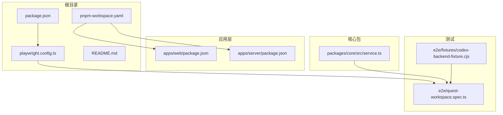
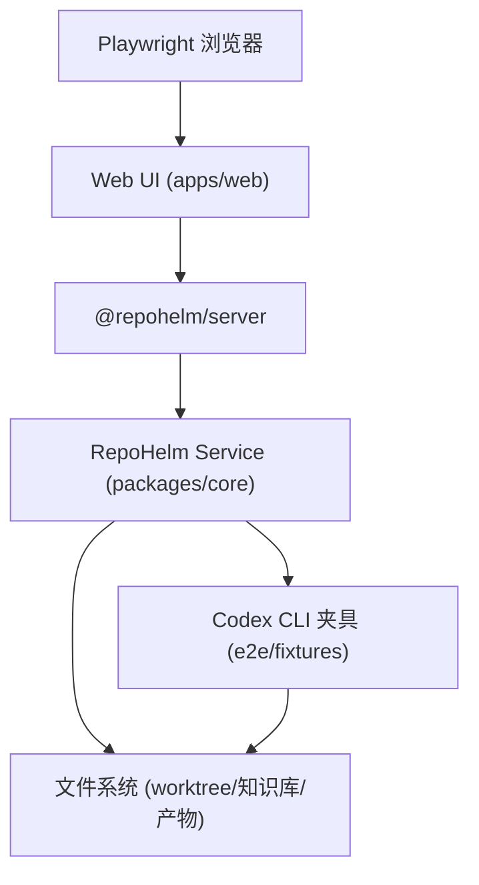
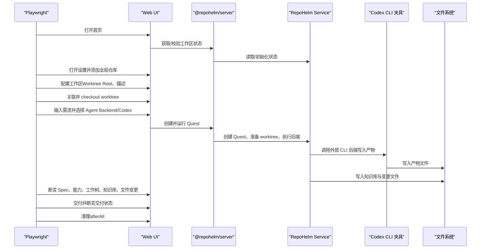
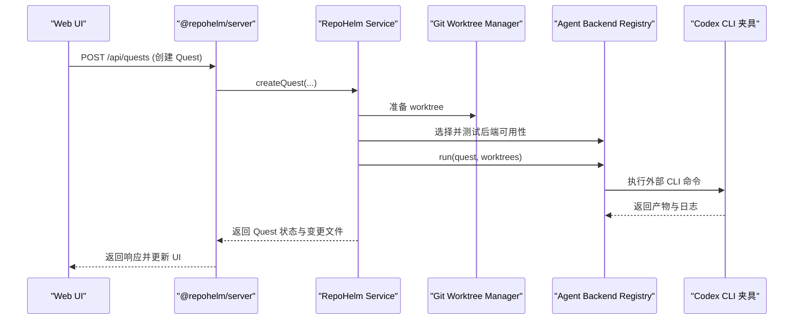
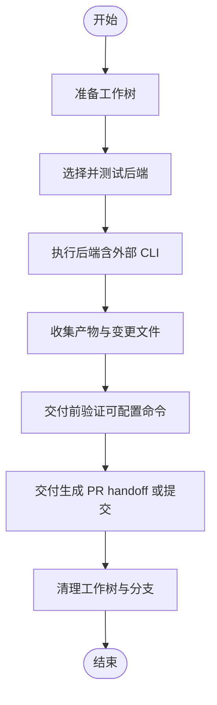
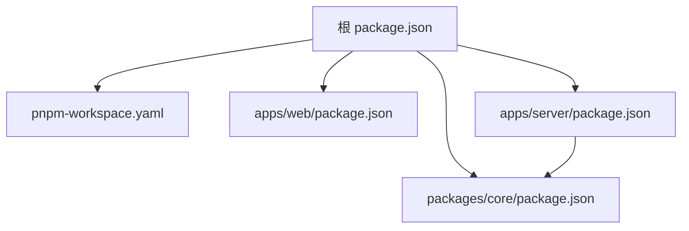

# 端到端测试

<cite>
**本文引用的文件**
- [playwright.config.ts](file://playwright.config.ts)
- [package.json](file://package.json)
- [e2e/quest-workspace.spec.ts](file://e2e/quest-workspace.spec.ts)
- [e2e/fixtures/codex-backend-fixture.cjs](file://e2e/fixtures/codex-backend-fixture.cjs)
- [README.md](file://README.md)
- [pnpm-workspace.yaml](file://pnpm-workspace.yaml)
- [apps/server/package.json](file://apps/server/package.json)
- [apps/web/package.json](file://apps/web/package.json)
- [packages/core/src/service.ts](file://packages/core/src/service.ts)
- [packages/core/src/service.test.ts](file://packages/core/src/service.test.ts)
- [apps/web/src/App.tsx](file://apps/web/src/App.tsx)
</cite>

## 目录
1. [简介](#简介)
2. [项目结构](#项目结构)
3. [核心组件](#核心组件)
4. [架构总览](#架构总览)
5. [详细组件分析](#详细组件分析)
6. [依赖关系分析](#依赖关系分析)
7. [性能考虑](#性能考虑)
8. [故障排除指南](#故障排除指南)
9. [结论](#结论)
10. [附录](#附录)

## 简介
本文件面向 RepoHelm 的端到端测试体系，重点围绕 Playwright 浏览器测试框架的配置与使用、Quest 工作区测试场景的完整实现（从工作区创建到 Quest 执行与交付）、测试夹具（Fixture）的使用与配置（尤其是 Codex 后端测试夹具）、测试数据准备与清理机制（环境隔离与状态重置）、测试用例设计模式与最佳实践、调试与故障排除策略，以及测试性能优化与并行执行策略进行系统化说明。本文所有技术细节均基于仓库现有源码进行分析与总结。

## 项目结构
RepoHelm 采用 monorepo 结构，前端 Web 应用与后端服务分别位于 apps/web 与 apps/server，核心业务逻辑位于 packages/core。端到端测试位于 e2e 目录，包含测试规范文件与测试夹具。

图表来源
- [playwright.config.ts:1-33](file://playwright.config.ts#L1-L33)
- [package.json:1-21](file://package.json#L1-L21)
- [pnpm-workspace.yaml:1-5](file://pnpm-workspace.yaml#L1-L5)
- [apps/web/package.json:1-34](file://apps/web/package.json#L1-L34)
- [apps/server/package.json:1-22](file://apps/server/package.json#L1-L22)
- [packages/core/src/service.ts:1-200](file://packages/core/src/service.ts#L1-L200)
- [e2e/quest-workspace.spec.ts:1-198](file://e2e/quest-workspace.spec.ts#L1-L198)
- [e2e/fixtures/codex-backend-fixture.cjs:1-20](file://e2e/fixtures/codex-backend-fixture.cjs#L1-L20)

章节来源
- [playwright.config.ts:1-33](file://playwright.config.ts#L1-L33)
- [package.json:1-21](file://package.json#L1-L21)
- [pnpm-workspace.yaml:1-5](file://pnpm-workspace.yaml#L1-L5)
- [README.md:1-100](file://README.md#L1-L100)

## 核心组件
- Playwright 测试配置与生命周期：通过 playwright.config.ts 统一配置测试目录、超时、并行度、报告器、浏览器参数、Web 服务器启动命令等；通过 webServer 字段在测试前启动本地开发服务，确保端到端环境就绪。
- 测试规范文件：e2e/quest-workspace.spec.ts 实现完整的 Quest 工作区测试场景，覆盖 UI 创建工作区、配置工作区、创建并运行 Quest、能力推荐确认、知识库检索、工作树状态与变更文件展示、交付与清理等全流程。
- 测试夹具：e2e/fixtures/codex-backend-fixture.cjs 作为外部 CLI 后端夹具，在 Quest 执行阶段写入产物文件，模拟真实后端行为，便于验证 CLI 后端集成。
- 核心服务：packages/core/src/service.ts 提供工作区、项目、Quest、工作树、知识库、Agent 后端等核心业务逻辑，测试通过浏览器 UI 触发这些逻辑并断言其结果。
- Web 应用：apps/web/src/App.tsx 提供前端交互入口，测试通过 Playwright 控制页面元素触发 API 调用，驱动后端服务执行相应流程。
- 包管理与脚本：package.json 定义了开发、构建、类型检查与端到端测试脚本；pnpm-workspace.yaml 管理 monorepo 包范围。

章节来源
- [playwright.config.ts:1-33](file://playwright.config.ts#L1-L33)
- [e2e/quest-workspace.spec.ts:1-198](file://e2e/quest-workspace.spec.ts#L1-L198)
- [e2e/fixtures/codex-backend-fixture.cjs:1-20](file://e2e/fixtures/codex-backend-fixture.cjs#L1-L20)
- [packages/core/src/service.ts:1-200](file://packages/core/src/service.ts#L1-L200)
- [apps/web/src/App.tsx:181-277](file://apps/web/src/App.tsx#L181-L277)
- [package.json:1-21](file://package.json#L1-L21)
- [pnpm-workspace.yaml:1-5](file://pnpm-workspace.yaml#L1-L5)

## 架构总览
下图展示了端到端测试的整体架构：Playwright 控制浏览器，通过 UI 触发前端 API 调用，后端服务处理请求并执行业务逻辑，同时可能调用外部 CLI 后端夹具生成产物，最终在 UI 中呈现执行结果与状态。

图表来源
- [playwright.config.ts:19-25](file://playwright.config.ts#L19-L25)
- [apps/web/src/App.tsx:217-247](file://apps/web/src/App.tsx#L217-L247)
- [packages/core/src/service.ts:56-71](file://packages/core/src/service.ts#L56-L71)
- [e2e/fixtures/codex-backend-fixture.cjs:1-20](file://e2e/fixtures/codex-backend-fixture.cjs#L1-L20)

## 详细组件分析

### Playwright 测试配置与环境设置
- 测试目录与超时：testDir 指向 e2e；整体超时与 expect 断言超时可按需调整。
- 并行与报告：fullyParallel 开启完全并行；reporter 配置 list 与 HTML 报告（不自动打开）。
- 浏览器与代理：baseURL 指向本地前端服务；launchOptions 设置代理参数以避免代理影响。
- Web 服务器：webServer 在测试前启动本地开发服务，清理 e2e 状态目录，设置 REPOHELM_ROOT、REPOHELM_STATE_ROOT、REPOHELM_CODEX_COMMAND 等环境变量，确保测试环境隔离与可控。

章节来源
- [playwright.config.ts:1-33](file://playwright.config.ts#L1-L33)

### Quest 工作区测试场景实现
该测试场景覆盖从 UI 创建工作区、配置工作区、创建并运行 Quest、能力推荐确认、知识库检索、工作树状态与变更文件展示、交付与清理的完整闭环。

图表来源
- [e2e/quest-workspace.spec.ts:35-197](file://e2e/quest-workspace.spec.ts#L35-L197)
- [apps/web/src/App.tsx:217-247](file://apps/web/src/App.tsx#L217-L247)
- [packages/core/src/service.ts:56-71](file://packages/core/src/service.ts#L56-L71)
- [e2e/fixtures/codex-backend-fixture.cjs:1-20](file://e2e/fixtures/codex-backend-fixture.cjs#L1-L20)

章节来源
- [e2e/quest-workspace.spec.ts:1-198](file://e2e/quest-workspace.spec.ts#L1-L198)

### 测试夹具：Codex 后端测试夹具
- 作用：在 Quest 执行阶段写入产物文件，模拟真实后端行为，便于验证 CLI 后端集成与产物输出。
- 行为：创建输出目录，写入 Markdown 文件，内容包含 Quest 标题等信息，并打印日志提示夹具已写入产物。
- 集成：通过环境变量 REPOHELM_CODEX_COMMAND 指向该夹具脚本，使后端执行时使用该脚本作为 CLI 后端。

章节来源
- [e2e/fixtures/codex-backend-fixture.cjs:1-20](file://e2e/fixtures/codex-backend-fixture.cjs#L1-L20)
- [playwright.config.ts:20-21](file://playwright.config.ts#L20-L21)

### 测试数据准备与清理机制
- 环境隔离：webServer 启动前清理 e2e 状态目录，确保测试不污染本地开发状态；设置 REPOHELM_STATE_ROOT 指向独立目录。
- 状态重置：test.afterAll 通过 API 查询当前状态，定位本次测试创建的 Quest，对已创建的工作树执行强制移除与分支删除，保证测试结束后环境干净。
- 项目与工作树清理：遍历目标 Quest 的工作树，若状态为 created，则在对应项目路径下执行 git worktree remove 与 git branch -D，确保工作树与分支被彻底清理。

章节来源
- [playwright.config.ts:19-25](file://playwright.config.ts#L19-L25)
- [e2e/quest-workspace.spec.ts:16-33](file://e2e/quest-workspace.spec.ts#L16-L33)

### 测试用例设计模式与最佳实践
- 可重复性：使用时间戳生成唯一 Quest 标题，避免并发或多轮测试互相干扰。
- 断言粒度：对 UI 元素可见性、文本内容、标签页切换、工作树状态、知识库检索结果、产物文件存在性等进行分层断言。
- 状态驱动：通过 API 查询后端状态，结合前端断言，确保 UI 与后端状态一致。
- 最小化依赖：仅在必要时访问外部资源（如 git），并在 afterAll 中清理，降低测试脆弱性。
- 可维护性：将测试标题与 slug 生成逻辑集中，便于后续扩展与维护。

章节来源
- [e2e/quest-workspace.spec.ts:7-14](file://e2e/quest-workspace.spec.ts#L7-L14)
- [e2e/quest-workspace.spec.ts:16-33](file://e2e/quest-workspace.spec.ts#L16-L33)

### API/服务组件调用流程
以下序列图展示了前端通过 API 创建并运行 Quest 的调用链路，以及后端服务如何协调工作树与外部 CLI 后端。

图表来源
- [apps/web/src/App.tsx:217-247](file://apps/web/src/App.tsx#L217-L247)
- [packages/core/src/service.ts:56-71](file://packages/core/src/service.ts#L56-L71)
- [packages/core/src/service.ts:589-636](file://packages/core/src/service.ts#L589-L636)
- [e2e/fixtures/codex-backend-fixture.cjs:1-20](file://e2e/fixtures/codex-backend-fixture.cjs#L1-L20)

章节来源
- [apps/web/src/App.tsx:217-247](file://apps/web/src/App.tsx#L217-L247)
- [packages/core/src/service.ts:56-71](file://packages/core/src/service.ts#L56-L71)
- [packages/core/src/service.ts:589-636](file://packages/core/src/service.ts#L589-L636)

### 复杂逻辑组件：工作树与交付流程

图表来源
- [packages/core/src/service.ts:589-636](file://packages/core/src/service.ts#L589-L636)
- [e2e/quest-workspace.spec.ts:149-164](file://e2e/quest-workspace.spec.ts#L149-L164)

章节来源
- [packages/core/src/service.ts:589-636](file://packages/core/src/service.ts#L589-L636)
- [e2e/quest-workspace.spec.ts:149-164](file://e2e/quest-workspace.spec.ts#L149-L164)

## 依赖关系分析
- 包管理：pnpm-workspace.yaml 定义了 apps/* 与 packages/* 的包范围，统一管理 monorepo。
- 前后端依赖：apps/server 依赖 @repohelm/core；apps/web 依赖 React 生态与 Vite；根 package.json 提供开发、构建、测试脚本。
- 测试依赖：@playwright/test 作为测试框架；concurrently 用于并行启动前后端服务。

图表来源
- [pnpm-workspace.yaml:1-5](file://pnpm-workspace.yaml#L1-L5)
- [apps/web/package.json:1-34](file://apps/web/package.json#L1-L34)
- [apps/server/package.json:1-22](file://apps/server/package.json#L1-L22)
- [package.json:1-21](file://package.json#L1-L21)

章节来源
- [pnpm-workspace.yaml:1-5](file://pnpm-workspace.yaml#L1-L5)
- [apps/web/package.json:1-34](file://apps/web/package.json#L1-L34)
- [apps/server/package.json:1-22](file://apps/server/package.json#L1-L22)
- [package.json:1-21](file://package.json#L1-L21)

## 性能考虑
- 并行执行：fullyParallel 已开启，建议在 CI 中合理分配 worker 数量，避免资源争用。
- 服务器启动：webServer 在测试前启动，避免每个测试用例重复启动，提高整体效率。
- 截图与追踪：仅在失败时截图与保留 trace，减少磁盘占用与报告体积。
- 环境变量：通过 NO_PROXY/HTTP_PROXY 等变量避免代理带来的网络延迟。
- 产物最小化：测试中仅断言必要产物与状态，避免冗余等待与 IO。

章节来源
- [playwright.config.ts:9-18](file://playwright.config.ts#L9-L18)
- [playwright.config.ts:19-25](file://playwright.config.ts#L19-L25)

## 故障排除指南
- 测试无法启动或页面空白
  - 检查 webServer 命令是否正确导出环境变量并启动 pnpm dev。
  - 确认本地 5173 端口未被占用。
- 代理导致网络异常
  - 确认 launchOptions 中的代理参数已生效，必要时在 CI 中显式设置 NO_PROXY。
- 交付失败或验证命令报错
  - 检查测试中对项目验证命令的临时修改是否生效。
  - 确认工作树路径与权限正确，避免在清理阶段因权限不足导致失败。
- 夹具未写入产物
  - 确认 REPOHELM_CODEX_COMMAND 指向正确的夹具脚本路径。
  - 检查夹具脚本的输出目录与文件名是否符合预期。
- 状态不一致或 UI 与后端不同步
  - 使用 afterAll 清理工作树与分支，避免残留状态影响后续测试。
  - 在关键步骤后主动刷新或等待状态更新后再断言。

章节来源
- [playwright.config.ts:19-25](file://playwright.config.ts#L19-L25)
- [e2e/quest-workspace.spec.ts:16-33](file://e2e/quest-workspace.spec.ts#L16-L33)
- [e2e/fixtures/codex-backend-fixture.cjs:1-20](file://e2e/fixtures/codex-backend-fixture.cjs#L1-L20)

## 结论
RepoHelm 的端到端测试体系以 Playwright 为核心，结合 UI 驱动与后端服务，实现了从工作区创建到 Quest 执行与交付的完整闭环验证。通过独立的状态目录、严格的清理机制与外部 CLI 夹具，测试具备良好的隔离性与可重复性。建议在 CI 中进一步优化并行度与资源分配，并持续完善断言粒度与错误恢复策略，以提升测试稳定性与可维护性。

## 附录
- 测试脚本与命令
  - 开发与构建：参见根 package.json 的 dev、build、typecheck。
  - 端到端测试：通过 test:e2e 脚本运行 Playwright 测试。
  - 全量测试：test:all 依次执行类型检查、单元测试与端到端测试。
- 文档与背景
  - README 对测试目的、范围与边界有明确说明，可作为测试设计参考。

章节来源
- [package.json:7-13](file://package.json#L7-L13)
- [README.md:79-85](file://README.md#L79-L85)