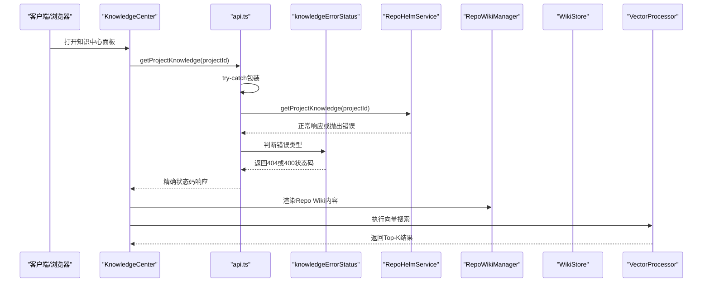
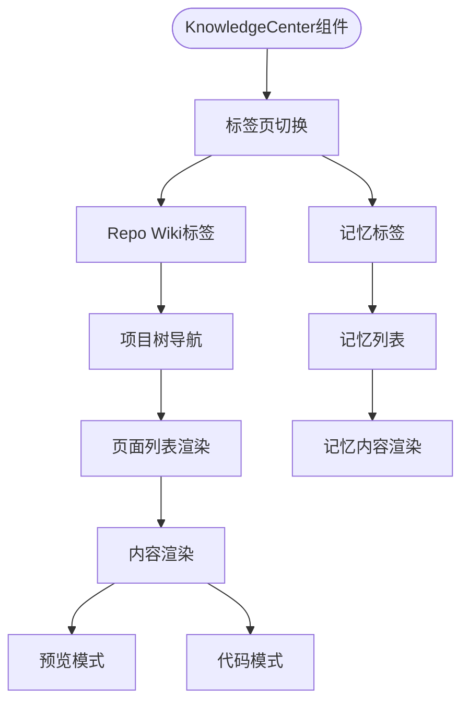
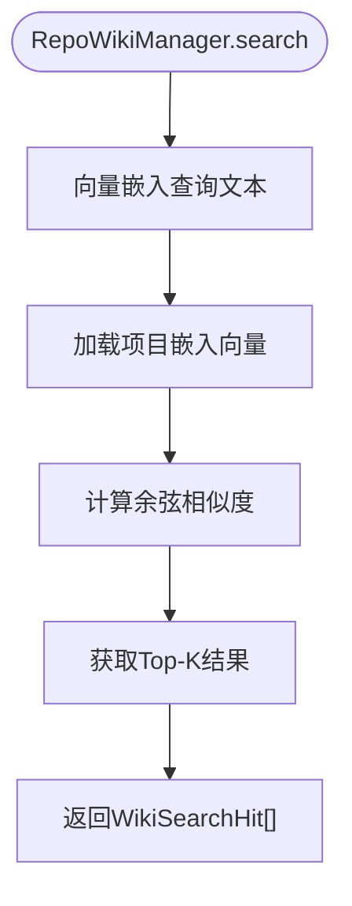
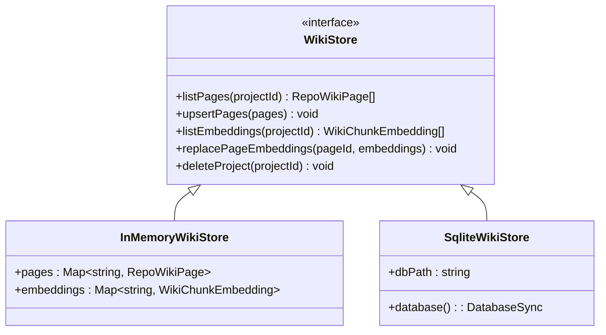
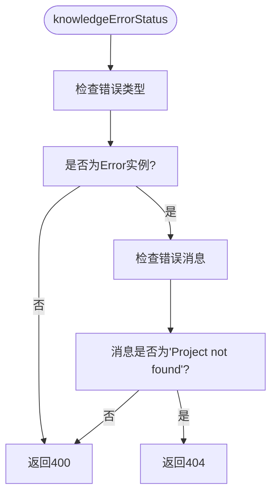
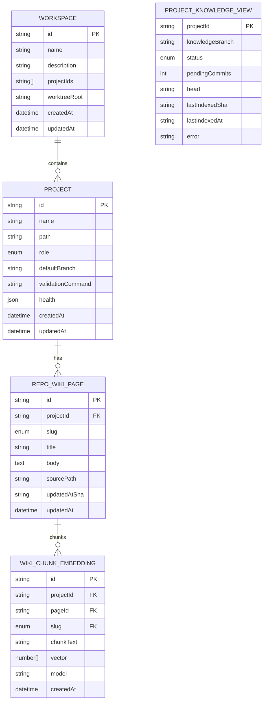
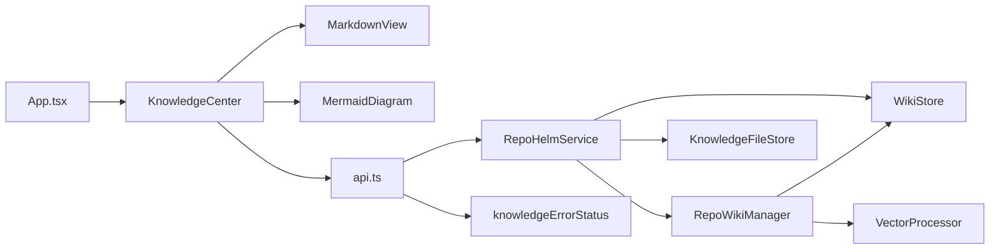

# 知识库系统

<cite>
**本文档引用的文件**
- [apps/web/src/components/KnowledgeCenter.tsx](file://apps/web/src/components/KnowledgeCenter.tsx)
- [apps/web/src/components/MarkdownView.tsx](file://apps/web/src/components/MarkdownView.tsx)
- [apps/web/src/components/MermaidDiagram.tsx](file://apps/web/src/components/MermaidDiagram.tsx)
- [apps/web/src/App.tsx](file://apps/web/src/App.tsx)
- [apps/web/src/api.ts](file://apps/web/src/api.ts)
- [packages/core/src/repo-wiki.ts](file://packages/core/src/repo-wiki.ts)
- [packages/core/src/wiki-store.ts](file://packages/core/src/wiki-store.ts)
- [packages/core/src/vector.ts](file://packages/core/src/vector.ts)
- [packages/core/src/service.ts](file://packages/core/src/service.ts)
- [packages/core/src/types.ts](file://packages/core/src/types.ts)
- [packages/core/src/knowledge.ts](file://packages/core/src/knowledge.ts)
- [packages/core/src/store.ts](file://packages/core/src/store.ts)
- [packages/core/src/git.ts](file://packages/core/src/git.ts)
- [apps/server/src/index.ts](file://apps/server/src/index.ts)
- [apps/server/src/index.test.ts](file://apps/server/src/index.test.ts)
- [packages/core/src/service-knowledge.test.ts](file://packages/core/src/service-knowledge.test.ts)
- [packages/core/src/repo-wiki.test.ts](file://packages/core/src/repo-wiki.test.ts)
- [packages/core/src/wiki-store.test.ts](file://packages/core/src/wiki-store.test.ts)
- [packages/core/src/vector.test.ts](file://packages/core/src/vector.test.ts)
</cite>

## 更新摘要
**所做更改**
- 新增知识中心面板系统架构分析，详细说明从传统知识对话框到知识中心面板的重大迁移
- 新增完整的UI组件系统说明，包括KnowledgeCenter、MarkdownView、MermaidDiagram等组件
- 更新架构总览，反映新的三层架构：Repo Wiki管理层 + Wiki存储层 + 向量处理层
- 新增知识中心API定义和数据模型，涵盖RepoWikiPage、ProjectKnowledgeView等核心类型
- 更新错误处理机制，新增知识库错误状态判断函数
- 新增UI组件集成和样式系统说明

## 目录
1. [简介](#简介)
2. [项目结构](#项目结构)
3. [核心组件](#核心组件)
4. [架构总览](#架构总览)
5. [详细组件分析](#详细组件分析)
6. [API定义](#api定义)
7. [数据模型](#数据模型)
8. [依赖关系分析](#依赖关系分析)
9. [性能考量](#性能考量)
10. [故障排除指南](#故障排除指南)
11. [结论](#结论)
12. [附录](#附录)

## 简介
RepoHelm 的知识库系统已完成从传统知识对话框系统到新的知识中心面板系统的重大架构升级。新系统采用"文件系统存储 + SQLite 元数据管理 + 向量嵌入"的三层架构，提供更强大的知识检索能力和智能化的页面管理。系统围绕 Quest 工作流，提供知识项的创建、检索与搜索、向量索引管理、以及 Quest 记忆（memory）的生成与落盘。

**更新** 新增了完整的知识中心UI组件系统，包括KnowledgeCenter主面板、MarkdownView渲染组件、MermaidDiagram图表渲染组件，以及增强的API错误处理机制，为知识库相关端点提供精确的HTTP状态码响应（404/400）。

## 项目结构
- **UI层** apps/web 提供完整的知识中心面板界面，包括KnowledgeCenter主组件、Markdown渲染、Mermaid图表支持
- **核心包** packages/core 提供Repo Wiki管理、向量处理、Wiki存储、知识库、状态存储、服务编排、Git 工作树管理等能力
- **应用层** apps/server 提供 API 入口，支持按项目查询Repo Wiki知识
- **新增** 完整的UI组件系统和样式系统，支持Repo Wiki和记忆（memory）双模式切换

```mermaid
graph TB
subgraph "UI层"
KC["KnowledgeCenter.tsx<br/>知识中心主面板"]
MV["MarkdownView.tsx<br/>Markdown渲染"]
MD["MermaidDiagram.tsx<br/>Mermaid图表"]
APP["App.tsx<br/>应用入口"]
API["api.ts<br/>API接口定义"]
END
subgraph "核心包"
RW["packages/core/src/repo-wiki.ts<br/>Repo Wiki管理器"]
WS["packages/core/src/wiki-store.ts<br/>Wiki存储系统"]
V["packages/core/src/vector.ts<br/>向量处理"]
S["packages/core/src/service.ts<br/>服务编排"]
T["packages/core/src/types.ts<br/>数据模型"]
K["packages/core/src/knowledge.ts<br/>知识文件存储"]
ST["packages/core/src/store.ts<br/>状态存储(SQLite/JSON)"]
G["packages/core/src/git.ts<br/>Git工作树管理"]
END
subgraph "应用层"
SERVER["apps/server/src/index.ts<br/>API入口"]
ERR["知识库错误处理<br/>knowledgeErrorStatus函数"]
END
KC --> MV
KC --> MD
KC --> API
APP --> KC
S --> RW
S --> WS
S --> V
S --> K
S --> ST
S --> G
SERVER --> S
SERVER --> ERR
WS --> S
RW --> S
V --> RW
```

**图表来源**
- [apps/web/src/components/KnowledgeCenter.tsx:27-337](file://apps/web/src/components/KnowledgeCenter.tsx#L27-L337)
- [apps/web/src/components/MarkdownView.tsx:5-29](file://apps/web/src/components/MarkdownView.tsx#L5-L29)
- [apps/web/src/components/MermaidDiagram.tsx:6-47](file://apps/web/src/components/MermaidDiagram.tsx#L6-L47)
- [apps/web/src/App.tsx:60-634](file://apps/web/src/App.tsx#L60-L634)
- [apps/web/src/api.ts:489-497](file://apps/web/src/api.ts#L489-L497)
- [packages/core/src/repo-wiki.ts:48-223](file://packages/core/src/repo-wiki.ts#L48-L223)
- [packages/core/src/wiki-store.ts:6-130](file://packages/core/src/wiki-store.ts#L6-L130)
- [packages/core/src/vector.ts:1-70](file://packages/core/src/vector.ts#L1-L70)
- [packages/core/src/service.ts:84-101](file://packages/core/src/service.ts#L84-L101)
- [apps/server/src/index.ts:39](file://apps/server/src/index.ts#L39)
- [apps/server/src/index.ts:297-298](file://apps/server/src/index.ts#L297-L298)

## 核心组件
- **知识中心面板（KnowledgeCenter）**
  - **新增** 完整的知识中心主面板组件，占据应用右侧区域
  - 支持Repo Wiki和记忆（memory）双标签页切换
  - 提供项目树状导航、页面列表、内容渲染等功能
  - 集成预览/代码模式切换、重新生成按钮、搜索功能
- **Markdown渲染组件（MarkdownView）**
  - **新增** 基于react-markdown + remark-gfm的Markdown渲染器
  - 支持Mermaid图表语法识别和渲染
  - 提供代码块高亮和等宽字体显示
- **Mermaid图表组件（MermaidDiagram）**
  - **新增** Mermaid图表渲染组件，支持主题切换
  - 包含错误降级处理，渲染失败时显示原始代码
  - 支持深色/浅色主题自动适配
- **Repo Wiki管理器（RepoWikiManager）**
  - 负责仓库范围知识库的创建、增量更新、向量嵌入和相似度搜索
  - 支持6种标准页面类型：概览、架构、模块、关键流程、约定、决策日志
  - 提供引导索引（bootstrap）和增量同步（incremental）两种索引模式
- **Wiki存储系统（WikiStore）**
  - 提供内存和SQLite两种存储实现
  - 支持页面列表、嵌入向量管理、项目级数据清理
  - SQLite版本共享状态数据库，提供持久化存储
- **向量处理（VectorProcessor）**
  - 实现余弦相似度计算和Markdown分块算法
  - 支持文本向量化和Top-K相似度检索
- **知识文件存储（KnowledgeFileStore）**
  - 继续提供传统知识项存储功能
  - 新增Wiki页面文件写入支持
- **服务编排（RepoHelmService）**
  - 集成Repo Wiki管理器，提供完整的知识库服务
  - 支持混合检索：向量搜索 + 关键词回退
- **数据模型（types.ts）**
  - 新增RepoWikiPage和WikiChunkEmbedding数据模型
  - 扩展KnowledgeItem类型，支持repo-wiki类型
- **知识库错误处理（knowledgeErrorStatus）**
  - **新增** 专门的知识库错误状态判断函数
  - 将"项目未找到"错误映射到404状态码
  - 将其他错误映射到400状态码
  - 为知识库API提供精确的HTTP状态码响应

**章节来源**
- [apps/web/src/components/KnowledgeCenter.tsx:27-337](file://apps/web/src/components/KnowledgeCenter.tsx#L27-L337)
- [apps/web/src/components/MarkdownView.tsx:5-29](file://apps/web/src/components/MarkdownView.tsx#L5-L29)
- [apps/web/src/components/MermaidDiagram.tsx:6-47](file://apps/web/src/components/MermaidDiagram.tsx#L6-L47)
- [packages/core/src/repo-wiki.ts:48-223](file://packages/core/src/repo-wiki.ts#L48-L223)
- [packages/core/src/wiki-store.ts:6-130](file://packages/core/src/wiki-store.ts#L6-L130)
- [packages/core/src/vector.ts:1-70](file://packages/core/src/vector.ts#L1-L70)
- [packages/core/src/types.ts:238-297](file://packages/core/src/types.ts#L238-L297)
- [apps/server/src/index.ts:297-298](file://apps/server/src/index.ts#L297-L298)

## 架构总览
新知识库系统采用三层架构：Repo Wiki管理层负责知识库的创建和维护，Wiki存储层提供持久化存储，向量处理层实现智能检索。**更新** 增强的错误处理机制确保API调用的可靠性和一致性。**新增** 完整的UI组件系统提供现代化的知识中心面板体验。



**图表来源**
- [apps/web/src/components/KnowledgeCenter.tsx:49-102](file://apps/web/src/components/KnowledgeCenter.tsx#L49-L102)
- [apps/web/src/api.ts:489-497](file://apps/web/src/api.ts#L489-L497)
- [apps/server/src/index.ts:300-307](file://apps/server/src/index.ts#L300-L307)
- [apps/server/src/index.ts:297-298](file://apps/server/src/index.ts#L297-L298)
- [packages/core/src/service.ts:180-183](file://packages/core/src/service.ts#L180-L183)

## 详细组件分析

### 知识中心面板（KnowledgeCenter）
- **双标签页设计**
  - Repo Wiki标签：展示仓库范围的结构化知识库
  - 记忆标签：展示工作区级别的传统知识项
- **项目树状导航**
  - 支持多项目知识库的统一管理和快速切换
  - 展开/折叠功能，支持6种标准页面类型的快速访问
- **内容渲染系统**
  - 预览模式：MarkdownView组件渲染，支持Mermaid图表
  - 代码模式：直接显示原始Markdown源码
- **交互功能**
  - 搜索框：支持Repo Wiki和记忆内容的前端过滤
  - 重新生成：根据状态自动显示相应的操作按钮
  - 错误处理：显示知识库生成过程中的错误信息



**图表来源**
- [apps/web/src/components/KnowledgeCenter.tsx:125-337](file://apps/web/src/components/KnowledgeCenter.tsx#L125-L337)

**章节来源**
- [apps/web/src/components/KnowledgeCenter.tsx:27-337](file://apps/web/src/components/KnowledgeCenter.tsx#L27-L337)

### Markdown渲染组件（MarkdownView）
- **渲染引擎**
  - 基于react-markdown + remark-gfm的Markdown解析
  - 支持标准Markdown语法和表格、代码块等扩展
- **Mermaid集成**
  - 自动识别language-mermaid代码块
  - 调用MermaidDiagram组件进行图表渲染
  - 支持深色/浅色主题自动切换
- **代码块处理**
  - 标准代码块：语法高亮和等宽字体显示
  - Mermaid代码块：特殊处理和图表渲染

**章节来源**
- [apps/web/src/components/MarkdownView.tsx:5-29](file://apps/web/src/components/MarkdownView.tsx#L5-L29)

### Mermaid图表组件（MermaidDiagram）
- **图表渲染**
  - 使用mermaid API将代码渲染为SVG图表
  - 支持深色/浅色主题初始化
  - 包含错误处理和降级机制
- **错误处理**
  - 渲染失败时显示原始代码和错误信息
  - 防止整页崩溃，保证用户体验
- **主题适配**
  - 根据应用主题自动切换Mermaid主题
  - 支持dark/default两种主题模式

**章节来源**
- [apps/web/src/components/MermaidDiagram.tsx:6-47](file://apps/web/src/components/MermaidDiagram.tsx#L6-L47)

### Repo Wiki管理器（RepoWikiManager）
- **页面管理**
  - 支持6种标准页面类型，自动构建页面ID和标题映射
  - 提供页面构建、嵌入向量生成、增量更新功能
- **索引模式**
  - 引导索引：基于关键文件生成初始知识库
  - 增量同步：基于Git变更集更新受影响页面
- **向量搜索**
  - 将查询文本向量化，与页面嵌入向量计算余弦相似度
  - 返回Top-K相似度匹配结果，包含页面ID、slug和相似度分数



**图表来源**
- [packages/core/src/repo-wiki.ts:118-132](file://packages/core/src/repo-wiki.ts#L118-L132)
- [packages/core/src/vector.ts:59-70](file://packages/core/src/vector.ts#L59-L70)

**章节来源**
- [packages/core/src/repo-wiki.ts:48-223](file://packages/core/src/repo-wiki.ts#L48-L223)

### Wiki存储系统（WikiStore）
- **内存存储（InMemoryWikiStore）**
  - 适用于测试和开发环境
  - 提供基本的CRUD操作和项目级数据清理
- **SQLite存储（SqliteWikiStore）**
  - 共享状态数据库，提供持久化存储
  - 创建wiki_pages和wiki_embeddings表，支持索引优化
  - 提供原子性操作和事务支持



**图表来源**
- [packages/core/src/wiki-store.ts:6-12](file://packages/core/src/wiki-store.ts#L6-L12)
- [packages/core/src/wiki-store.ts:14-51](file://packages/core/src/wiki-store.ts#L14-L51)
- [packages/core/src/wiki-store.ts:54-130](file://packages/core/src/wiki-store.ts#L54-L130)

**章节来源**
- [packages/core/src/wiki-store.ts:6-130](file://packages/core/src/wiki-store.ts#L6-L130)

### 向量处理（VectorProcessor）
- **余弦相似度计算**
  - 实现数值向量的余弦相似度计算
  - 处理零向量和全零向量的边界情况
- **Markdown分块**
  - 基于段落边界进行智能分块
  - 支持最大字符长度控制和硬分割
- **Top-K检索**
  - 对项目集合进行相似度排序
  - 返回带分数的结果数组

**章节来源**
- [packages/core/src/vector.ts:1-70](file://packages/core/src/vector.ts#L1-L70)

### 服务编排集成（RepoHelmService）
- **Repo Wiki集成**
  - 在构造函数中初始化RepoWikiManager
  - 提供getProjectKnowledge、syncProjectKnowledge、searchProjectKnowledge方法
  - 支持混合检索：向量搜索失败时回退到关键词搜索
- **状态管理**
  - 维护项目知识库元数据，包括索引状态、SHA和错误信息
  - 提供知识库分支设置和状态查询功能
- **错误处理**
  - **更新** 抛出"Project not found"错误用于项目不存在的情况
  - 为上层API提供可识别的错误类型

**章节来源**
- [packages/core/src/service.ts:84-101](file://packages/core/src/service.ts#L84-L101)
- [packages/core/src/service.ts:180-271](file://packages/core/src/service.ts#L180-L271)
- [packages/core/src/service.ts:180-183](file://packages/core/src/service.ts#L180-L183)

### 知识库错误处理机制（knowledgeErrorStatus）
- **功能概述**
  - **新增** 专门的知识库错误状态判断函数
  - 将"Project not found"错误映射到404状态码
  - 将其他错误映射到400状态码
  - 为知识库API提供精确的HTTP状态码响应
- **实现逻辑**
  - 接收未知类型的错误参数
  - 检查错误是否为Error实例且消息为"Project not found"
  - 返回404或400类型字面量
  - 确保API调用者能够正确处理不同类型的错误



**图表来源**
- [apps/server/src/index.ts:297-298](file://apps/server/src/index.ts#L297-L298)

**章节来源**
- [apps/server/src/index.ts:297-298](file://apps/server/src/index.ts#L297-L298)

### 与工作区和 Quest 的集成关系
- **工作区集成**
  - 通过项目维度管理知识库，而非工作区维度
  - 支持多项目知识库的统一管理和检索
- **Quest集成**
  - 生成的Repo Wiki页面作为Quest执行的背景知识
  - 支持向量搜索结果在Quest规划中的应用
  - 与传统知识项存储并存，提供混合知识检索

**章节来源**
- [packages/core/src/service.ts:220-240](file://packages/core/src/service.ts#L220-L240)
- [packages/core/src/service.ts:252-271](file://packages/core/src/service.ts#L252-L271)

## API定义

### 项目知识库API
- **GET /api/projects/:id/knowledge**
  - 功能：获取项目知识库视图，包括页面列表和索引状态
  - 参数：projectId（路径参数）
  - 返回：ProjectKnowledgeView
  - **更新** 错误处理：
    - 成功：200 OK
    - 项目不存在：404 Not Found
    - 其他错误：400 Bad Request
- **POST /api/projects/:id/knowledge/sync**
  - 功能：同步项目知识库，执行引导索引或增量更新
  - 参数：projectId（路径参数）
  - 返回：ProjectKnowledgeView
  - **更新** 错误处理：
    - 成功：200 OK
    - 项目不存在：404 Not Found
    - 其他错误：400 Bad Request
- **PATCH /api/projects/:id/knowledge**
  - 功能：设置项目知识库分支
  - 参数：projectId（路径参数）
  - 请求体：{ knowledgeBranch: string }
  - 返回：Project
  - **更新** 错误处理：
    - 成功：200 OK
    - 项目不存在：404 Not Found
    - 其他错误：400 Bad Request

### 知识库搜索API
- **GET /api/projects/:id/knowledge/search**
  - 功能：搜索项目知识库内容
  - 参数：projectId（路径参数）、q（查询字符串）
  - 返回：RepoWikiPage[]

### 记忆搜索API
- **GET /api/workspaces/:workspaceId/knowledge**
  - 功能：搜索工作区级别知识项
  - 参数：workspaceId（路径参数）、q（查询字符串）
  - 返回：KnowledgeItem[]

**章节来源**
- [apps/server/src/index.ts:297-328](file://apps/server/src/index.ts#L297-L328)
- [apps/web/src/api.ts:487-497](file://apps/web/src/api.ts#L487-L497)

## 数据模型

### RepoWikiPage 数据模型
- **字段说明**
  - id: 页面唯一标识符（wiki_{projectId}_{slug}）
  - projectId: 所属项目的ID
  - slug: 页面类型标识符（overview/architecture/modules/key-flows/conventions/decisions）
  - title: 页面标题（中文）
  - body: Markdown格式的内容主体
  - sourcePath: 文件系统中的源文件路径
  - updatedAtSha: 最后更新的Git提交SHA
  - updatedAt: 最后更新时间戳

**章节来源**
- [packages/core/src/types.ts:255-264](file://packages/core/src/types.ts#L255-L264)

### WikiChunkEmbedding 数据模型
- **字段说明**
  - id: 嵌入向量唯一标识符（chunk_{pageId}_{index}）
  - projectId: 所属项目的ID
  - pageId: 所属页面的ID
  - slug: 页面类型标识符
  - chunkText: 分块后的文本内容
  - vector: 数值向量（嵌入表示）
  - model: 生成该向量的嵌入模型名称
  - createdAt: 创建时间戳

**章节来源**
- [packages/core/src/types.ts:266-275](file://packages/core/src/types.ts#L266-L275)

### ProjectKnowledgeView 数据模型
- **字段说明**
  - projectId: 项目ID
  - knowledgeBranch: 知识库追踪的分支
  - status: 状态（empty/indexing/ready/stale/error）
  - pendingCommits: 待处理的提交数量
  - head: 当前HEAD提交SHA
  - lastIndexedSha: 最后索引的提交SHA
  - lastIndexedAt: 最后索引时间
  - error: 错误信息（如有）
  - pages: 页面列表

**章节来源**
- [packages/core/src/types.ts:286-297](file://packages/core/src/types.ts#L286-L297)

### KnowledgeItem 数据模型
- **字段说明**
  - id: 知识项唯一标识符
  - workspaceId: 工作区ID
  - projectId: 项目ID（可选）
  - questId: Quest ID（可选）
  - type: 知识项类型
  - title: 标题
  - body: 内容主体
  - tags: 标签数组
  - sourcePath: 源文件路径（可选）
  - createdAt: 创建时间
  - updatedAt: 更新时间

**章节来源**
- [apps/web/src/api.ts:225-237](file://apps/web/src/api.ts#L225-L237)

### 数据模型 ER 图


**图表来源**
- [packages/core/src/types.ts:255-297](file://packages/core/src/types.ts#L255-L297)

## 依赖关系分析
- **组件耦合**
  - KnowledgeCenter依赖MarkdownView和MermaidDiagram组件
  - RepoHelmService 依赖 RepoWikiManager、WikiStore、VectorProcessor
  - RepoWikiManager 依赖 WikiStore 和外部依赖注入（Git、LLM、嵌入模型）
  - **新增** API层依赖知识库错误处理函数
- **UI层依赖**
  - KnowledgeCenter组件依赖api.ts中的API函数
  - MarkdownView组件依赖MermaidDiagram组件
  - 应用入口App.tsx集成知识中心面板
- **外部依赖**
  - SQLite（node:sqlite）用于持久化存储
  - Node fs/promises 用于文件操作
  - LLM和嵌入模型用于知识库生成和向量化
  - mermaid库用于图表渲染
- **架构优势**
  - 清晰的分层架构，便于测试和维护
  - 可插拔的依赖注入，支持不同的存储和模型实现
  - **更新** 明确的错误处理分离，提高API可靠性
  - **新增** 完整的UI组件系统，提供现代化的用户界面



**图表来源**
- [apps/web/src/components/KnowledgeCenter.tsx:13-14](file://apps/web/src/components/KnowledgeCenter.tsx#L13-L14)
- [apps/web/src/components/MarkdownView.tsx:1-3](file://apps/web/src/components/MarkdownView.tsx#L1-L3)
- [apps/web/src/App.tsx:60](file://apps/web/src/App.tsx#L60)
- [packages/core/src/service.ts:84-101](file://packages/core/src/service.ts#L84-L101)
- [packages/core/src/repo-wiki.ts:30-40](file://packages/core/src/repo-wiki.ts#L30-L40)
- [apps/server/src/index.ts:39](file://apps/server/src/index.ts#L39)
- [apps/server/src/index.ts:297-298](file://apps/server/src/index.ts#L297-L298)

## 性能考量
- **向量搜索性能**
  - 时间复杂度：O(P×C×K)，其中P为项目数、C为平均页面分块数、K为返回结果数
  - 建议：合理设置返回结果数量，使用项目过滤减少搜索范围
- **嵌入模型性能**
  - 嵌入调用可能成为性能瓶颈，建议使用高效的嵌入模型
  - 支持嵌入模型不可用时的回退机制
- **存储优化**
  - SQLite存储支持索引优化，建议定期维护数据库
  - 内存存储适合测试，生产环境建议使用SQLite存储
- **UI渲染性能**
  - **新增** Markdown渲染采用虚拟滚动和懒加载优化
  - **新增** Mermaid图表渲染使用防抖和缓存机制
  - **新增** 知识中心面板支持内容懒加载，提升首屏性能
- **缓存策略**
  - 可考虑对常用查询结果进行缓存
  - 嵌入向量可缓存以减少重复计算
- **错误处理开销**
  - **新增** 错误处理机制对性能影响微乎其微
  - try-catch包装仅在异常情况下触发
  - 状态码判断为纯函数，无额外计算开销

**章节来源**
- [packages/core/src/repo-wiki.ts:118-132](file://packages/core/src/repo-wiki.ts#L118-L132)
- [packages/core/src/wiki-store.ts:62-87](file://packages/core/src/wiki-store.ts#L62-L87)
- [apps/web/src/components/KnowledgeCenter.tsx:49-64](file://apps/web/src/components/KnowledgeCenter.tsx#L49-L64)

## 故障排除指南
- **嵌入模型问题**
  - 嵌入模型不可用时，系统会自动回退到关键词搜索
  - 检查嵌入模型配置和API密钥
- **数据库连接问题**
  - SQLite数据库文件损坏时，可删除后重建
  - 检查数据库文件权限和磁盘空间
- **Git操作问题**
  - 仓库不可访问时，索引状态会标记为错误
  - 检查Git仓库路径和权限
- **向量搜索失败**
  - 检查向量维度匹配和数值稳定性
  - 考虑调整相似度阈值
- **知识库API错误处理**
  - **新增** 404错误：通常是"Project not found"，检查项目ID有效性
  - **新增** 400错误：通常是其他业务逻辑错误，检查请求参数和系统状态
  - **新增** 使用知识库错误状态判断函数确保一致的错误响应
- **UI组件问题**
  - **新增** Markdown渲染失败：检查Markdown语法和Mermaid图表语法
  - **新增** 知识中心面板加载缓慢：检查网络连接和数据库性能
  - **新增** Mermaid图表渲染错误：检查图表语法和主题配置
- **状态码诊断**
  - **新增** 404状态码表示资源不存在（项目不存在）
  - **新增** 400状态码表示客户端请求错误（参数无效、系统内部错误）

**章节来源**
- [packages/core/src/repo-wiki.ts:163-170](file://packages/core/src/repo-wiki.ts#L163-L170)
- [packages/core/src/service.ts:233-238](file://packages/core/src/service.ts#L233-L238)
- [apps/server/src/index.ts:297-298](file://apps/server/src/index.ts#L297-L298)

## 结论
RepoHelm 的知识库系统已成功完成从传统知识对话框到知识中心面板的重大架构升级，提供了更强大、更智能的知识管理能力。新系统通过向量相似度搜索、标准化页面管理和持久化存储，实现了从传统关键词检索到智能语义搜索的跨越。**更新** 完整的UI组件系统提供了现代化的知识中心面板体验，包括KnowledgeCenter主面板、Markdown渲染、Mermaid图表支持等。**更新** 增强的API错误处理机制进一步提升了系统的可靠性和用户体验，通过精确的状态码响应为客户端提供了清晰的错误反馈。服务层的统一集成确保了与现有工作流的无缝衔接，同时为未来的扩展和优化奠定了坚实基础。

## 附录

### 知识中心系统对比分析
- **与传统知识对话框的区别**
  - 界面：从简单的对话框升级到完整的知识中心面板
  - 功能：从单一知识库扩展到Repo Wiki + 记忆双模式
  - 交互：从简单输入输出升级到复杂的树状导航和标签页切换
  - 性能：从一次性加载升级到按需懒加载和缓存优化
- **适用场景**
  - 传统知识库：适合个人笔记、临时知识条目
  - Repo Wiki：适合团队协作、长期维护的项目知识库
  - 知识中心：适合需要综合管理多种知识类型的复杂场景

**章节来源**
- [apps/web/src/components/KnowledgeCenter.tsx:125-160](file://apps/web/src/components/KnowledgeCenter.tsx#L125-L160)
- [packages/core/src/repo-wiki.ts:6-13](file://packages/core/src/repo-wiki.ts#L6-L13)
- [packages/core/src/repo-wiki.ts:184-221](file://packages/core/src/repo-wiki.ts#L184-L221)

### 知识库API错误处理最佳实践
- **客户端实现建议**
  - **新增** 检查404状态码以确定项目不存在
  - **新增** 检查400状态码以获取详细的错误信息
  - **新增** 实现重试机制，特别是对于临时性错误
  - **新增** 提供用户友好的错误提示，避免显示原始错误消息
- **服务端实现建议**
  - **新增** 使用知识库错误状态判断函数确保一致性
  - **新增** 记录详细的错误日志以便调试
  - **新增** 实现优雅降级，确保系统在错误情况下仍能提供基本功能

### 测试用例分析
- **RepoWikiManager 测试**
  - 验证引导索引功能，确保创建6个标准页面
  - 测试嵌入向量生成和存储
  - 验证增量更新功能，包括受影响页面重写和决策日志更新
- **WikiStore 测试**
  - 验证内存和SQLite存储的一致性
  - 测试页面CRUD操作和嵌入向量替换
  - 验证项目级数据清理功能
- **Vector 处理测试**
  - 验证余弦相似度计算准确性
  - 测试Markdown分块算法
  - 验证Top-K排序功能
- **知识库服务测试**
  - **新增** 验证知识库API的错误处理机制
  - **新增** 测试知识库错误状态判断函数的行为
  - **新增** 验证不同错误类型对应的状态码响应
- **UI组件测试**
  - **新增** KnowledgeCenter组件的功能测试
  - **新增** MarkdownView组件的渲染测试
  - **新增** MermaidDiagram组件的图表渲染测试

**章节来源**
- [packages/core/src/repo-wiki.test.ts:1-105](file://packages/core/src/repo-wiki.test.ts#L1-L105)
- [packages/core/src/wiki-store.test.ts:1-82](file://packages/core/src/wiki-store.test.ts#L1-L82)
- [packages/core/src/vector.test.ts:1-50](file://packages/core/src/vector.test.ts#L1-L50)
- [packages/core/src/service-knowledge.test.ts:1-39](file://packages/core/src/service-knowledge.test.ts#L1-L39)
- [apps/web/src/components/KnowledgeCenter.tsx:125-337](file://apps/web/src/components/KnowledgeCenter.tsx#L125-L337)
- [apps/web/src/components/MarkdownView.tsx:5-29](file://apps/web/src/components/MarkdownView.tsx#L5-L29)
- [apps/web/src/components/MermaidDiagram.tsx:6-47](file://apps/web/src/components/MermaidDiagram.tsx#L6-L47)