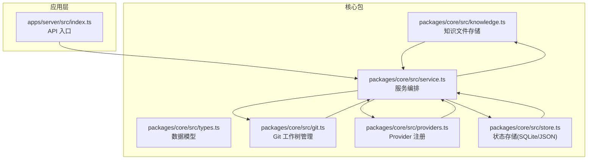
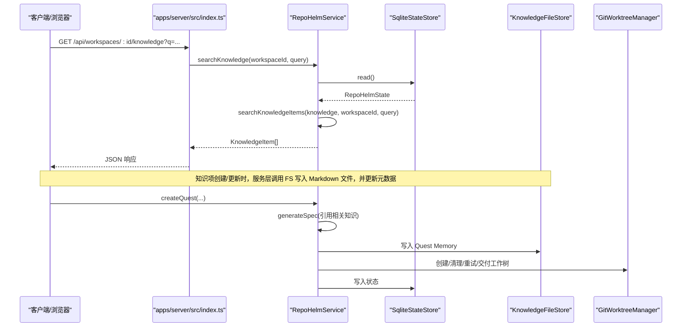
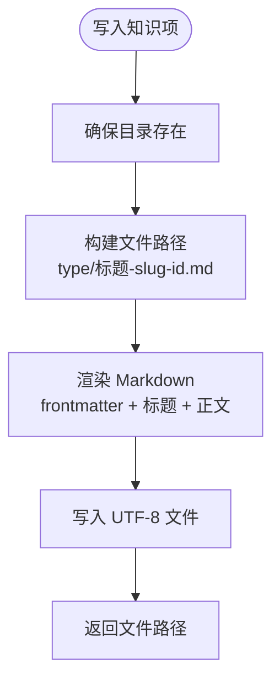
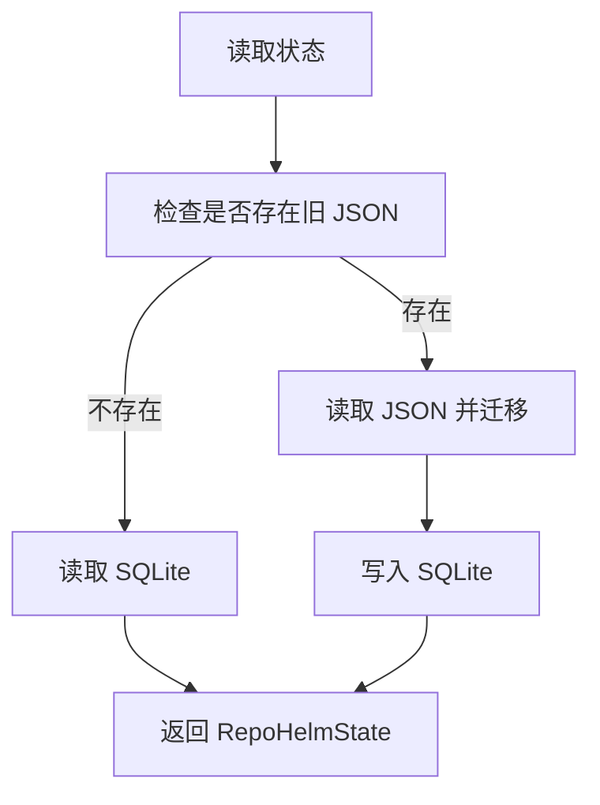
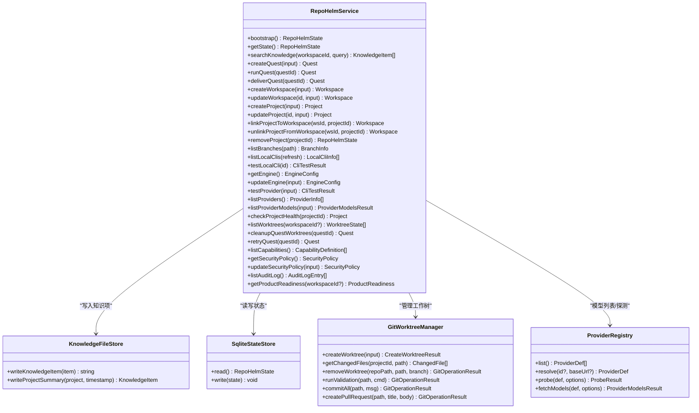
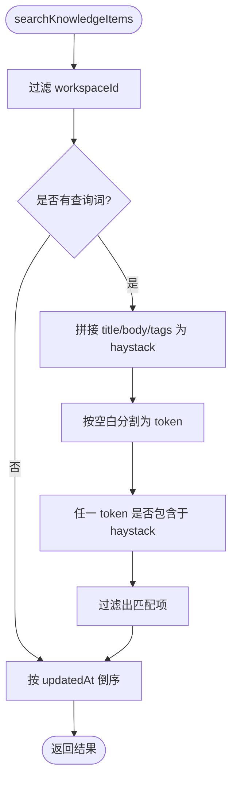
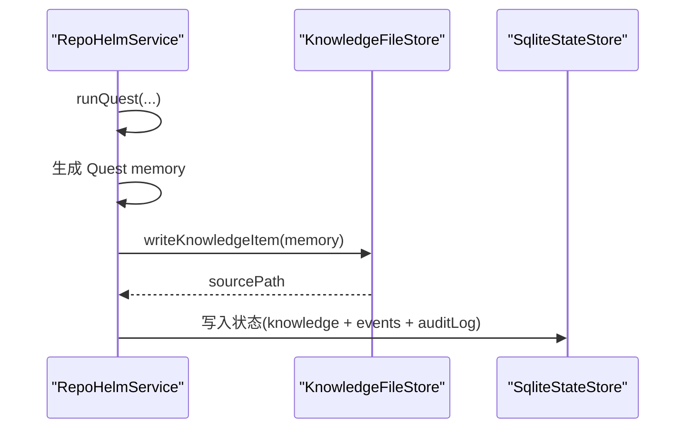
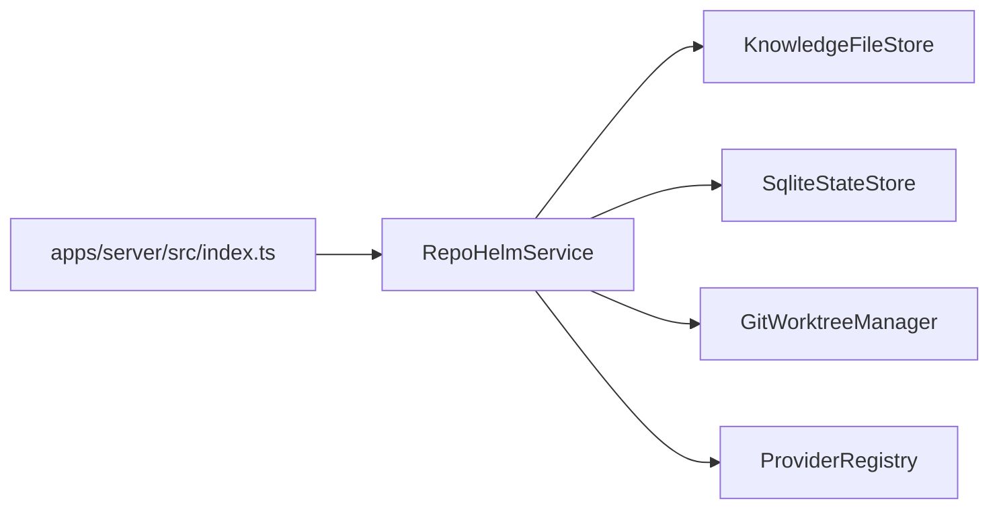
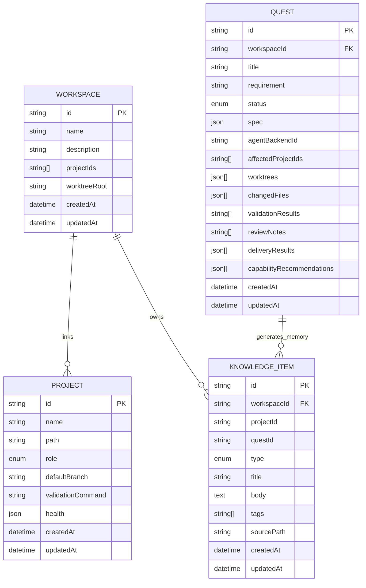

# 知识库系统

<cite>
**本文档引用的文件**
- [packages/core/src/knowledge.ts](file://packages/core/src/knowledge.ts)
- [packages/core/src/store.ts](file://packages/core/src/store.ts)
- [packages/core/src/service.ts](file://packages/core/src/service.ts)
- [packages/core/src/types.ts](file://packages/core/src/types.ts)
- [packages/core/src/git.ts](file://packages/core/src/git.ts)
- [packages/core/src/providers.ts](file://packages/core/src/providers.ts)
- [apps/server/src/index.ts](file://apps/server/src/index.ts)
- [README.md](file://README.md)
- [MILESTONES.md](file://MILESTONES.md)
</cite>

## 目录
1. [简介](#简介)
2. [项目结构](#项目结构)
3. [核心组件](#核心组件)
4. [架构总览](#架构总览)
5. [详细组件分析](#详细组件分析)
6. [依赖关系分析](#依赖关系分析)
7. [性能考量](#性能考量)
8. [故障排除指南](#故障排除指南)
9. [结论](#结论)
10. [附录](#附录)

## 简介
RepoHelm 的知识库系统将“文件系统存储 + SQLite 元数据管理”相结合，形成第一代知识库方案。知识项以 Markdown 文件形式落地到文件系统，同时在 SQLite 中维护结构化元数据（如 workspaceId、projectId、questId、tags、createdAt/updatedAt 等）。系统围绕 Quest 工作流，提供知识项的创建、检索与搜索、以及 Quest 记忆（memory）的生成与落盘。本文档将深入解析其架构、数据模型、CRUD 与检索机制、与工作区和 Quest 的集成关系，并给出性能优化、扩展性与定制化建议及故障排除指南。

## 项目结构
- 核心包 packages/core 提供知识库、状态存储、服务编排、Git 工作树管理、Provider 注册等能力。
- 应用层 apps/server 提供 API 入口，支持按 workspace 查询知识。
- 文档 MILESTONES.md 记录了知识库演进与实现边界。

图表来源
- [packages/core/src/knowledge.ts:1-68](file://packages/core/src/knowledge.ts#L1-L68)
- [packages/core/src/service.ts:56-71](file://packages/core/src/service.ts#L56-L71)
- [packages/core/src/store.ts:86-166](file://packages/core/src/store.ts#L86-L166)
- [packages/core/src/git.ts:33-343](file://packages/core/src/git.ts#L33-L343)
- [packages/core/src/providers.ts:163-304](file://packages/core/src/providers.ts#L163-L304)
- [apps/server/src/index.ts:215](file://apps/server/src/index.ts#L215)

章节来源
- [README.md:1-100](file://README.md#L1-L100)
- [MILESTONES.md:178-206](file://MILESTONES.md#L178-L206)

## 核心组件
- 知识文件存储（KnowledgeFileStore）
  - 将知识项渲染为 Markdown 文件，写入根目录下的按类型分组的子目录，文件名包含标题 slug 与唯一 id，便于人类可读与检索。
- 状态存储（JsonStateStore / SqliteStateStore）
  - 默认使用 SQLite 存储结构化状态；若检测到旧 JSON 文件则进行迁移，确保向后兼容。
- 服务编排（RepoHelmService）
  - 负责知识项的创建、检索、搜索、与 Quest 的集成（创建/运行/记忆落盘）、工作区与项目的 CRUD、Git 工作树生命周期管理、Provider 模型列表缓存与探测、安全策略与审计等。
- 数据模型（types.ts）
  - 定义 Workspace、Project、Quest、KnowledgeItem、SecurityPolicy、EngineConfig 等核心实体与字段。
- Git 工作树管理（GitWorktreeManager）
  - 提供创建/删除工作树、变更文件读取、验证命令执行、提交与 PR 创建等能力。
- Provider 注册（ProviderRegistry）
  - 统一管理不同模型提供商的发现、探测与模型列表拉取。

章节来源
- [packages/core/src/knowledge.ts:12-68](file://packages/core/src/knowledge.ts#L12-L68)
- [packages/core/src/store.ts:91-166](file://packages/core/src/store.ts#L91-L166)
- [packages/core/src/service.ts:56-71](file://packages/core/src/service.ts#L56-L71)
- [packages/core/src/types.ts:193-205](file://packages/core/src/types.ts#L193-L205)
- [packages/core/src/git.ts:33-343](file://packages/core/src/git.ts#L33-L343)
- [packages/core/src/providers.ts:163-304](file://packages/core/src/providers.ts#L163-L304)

## 架构总览
知识库系统围绕 RepoHelmService 展开，服务层负责：
- 知识项的创建与落盘（Markdown 文件 + 元数据）
- 知识检索与搜索（按 workspaceId 过滤 + 关键词匹配）
- 与 Quest 的深度集成（Spec 背景引用、能力推荐、运行后记忆落盘）
- 与工作区/项目的 CRUD、Git 工作树生命周期、Provider 模型缓存、安全策略与审计

图表来源
- [apps/server/src/index.ts:215](file://apps/server/src/index.ts#L215)
- [packages/core/src/service.ts:883-886](file://packages/core/src/service.ts#L883-L886)
- [packages/core/src/service.ts:1061-1076](file://packages/core/src/service.ts#L1061-L1076)
- [packages/core/src/knowledge.ts:15-43](file://packages/core/src/knowledge.ts#L15-L43)
- [packages/core/src/git.ts:79-120](file://packages/core/src/git.ts#L79-L120)

## 详细组件分析

### 知识文件存储（KnowledgeFileStore）
- 文件组织
  - 按知识项类型（type）在根目录下创建子目录，文件名为“标题 slug-id.md”，保证可读性与去重。
- 渲染格式
  - 采用 YAML 风格的头部（frontmatter），包含 id、workspaceId、projectId、questId、type、title、tags、createdAt、updatedAt 等元信息，正文为 # 标题 + body。
- 写入流程
  - 确保目录存在，写入 UTF-8 文件，返回文件路径以便后续引用。

图表来源
- [packages/core/src/knowledge.ts:15-43](file://packages/core/src/knowledge.ts#L15-L43)
- [packages/core/src/knowledge.ts:45-66](file://packages/core/src/knowledge.ts#L45-L66)

章节来源
- [packages/core/src/knowledge.ts:12-68](file://packages/core/src/knowledge.ts#L12-L68)

### 状态存储（JsonStateStore / SqliteStateStore）
- 默认持久化
  - 使用 SQLite 表 state 存储序列化后的 RepoHelmState，包含 id、payload、updated_at。
- 迁移策略
  - 若检测到旧的 JSON 文件（state.json），优先读取并迁移至 SQLite；若无旧文件则初始化空状态。
- 引擎配置迁移
  - 对旧版 byok 字段进行迁移，映射到新的 byokProviders 结构，保留 activeByokProviderId。

图表来源
- [packages/core/src/store.ts:125-139](file://packages/core/src/store.ts#L125-L139)
- [packages/core/src/store.ts:37-84](file://packages/core/src/store.ts#L37-L84)

章节来源
- [packages/core/src/store.ts:91-166](file://packages/core/src/store.ts#L91-L166)
- [packages/core/src/store.ts:6-25](file://packages/core/src/store.ts#L6-L25)

### 服务编排（RepoHelmService）
- 知识项创建与项目摘要
  - bootstrap 阶段写入种子知识与项目摘要；createProject/updateProject 时自动生成对应 Project summary。
- 知识检索与搜索
  - searchKnowledgeItems 基于 workspaceId 过滤，再对 title/body/tags 进行关键词匹配（空查询返回全部），最后按 updatedAt 倒序。
- 与 Quest 的集成
  - createQuest 时根据需求与相关知识生成 Spec 背景；runQuest 后写入 Quest memory；deliverQuest 后更新状态与审计日志。
- 工作区/项目 CRUD
  - createWorkspace/updateWorkspace/linkProjectToWorkspace/unlinkProjectFromWorkspace/removeProject 等，维护工作区与项目的关联、工作树状态。
- Git 工作树生命周期
  - createWorktree/getChangedFiles/removeWorktree/runValidation/commitAll/createPullRequest 等，贯穿 Quest 的执行、验证、交付阶段。
- Provider 模型缓存
  - listProviderModels 支持 TTL 缓存（6 小时），避免频繁请求真实接口。
- 安全策略与审计
  - evaluateCommandPermission 实现命令 allowlist 检查；audit 记录审计事件；updateSecurityPolicy 更新策略并写入审计日志。

图表来源
- [packages/core/src/service.ts:56-71](file://packages/core/src/service.ts#L56-L71)
- [packages/core/src/knowledge.ts:12-43](file://packages/core/src/knowledge.ts#L12-L43)
- [packages/core/src/store.ts:117-166](file://packages/core/src/store.ts#L117-L166)
- [packages/core/src/git.ts:33-343](file://packages/core/src/git.ts#L33-L343)
- [packages/core/src/providers.ts:163-304](file://packages/core/src/providers.ts#L163-L304)

章节来源
- [packages/core/src/service.ts:73-133](file://packages/core/src/service.ts#L73-L133)
- [packages/core/src/service.ts:478-698](file://packages/core/src/service.ts#L478-L698)
- [packages/core/src/service.ts:883-1076](file://packages/core/src/service.ts#L883-L1076)
- [packages/core/src/service.ts:1078-1129](file://packages/core/src/service.ts#L1078-L1129)

### 数据模型定义与字段说明
- Workspace
  - id、name、description、projectIds、worktrees、worktreeRoot、createdAt、updatedAt
- Project
  - id、name、path、role、defaultBranch、validationCommand、health、createdAt、updatedAt
- Quest
  - id、workspaceId、title、requirement、status、spec、agentBackendId、affectedProjectIds、worktrees、changedFiles、validationResults、reviewNotes、deliveryResults、capabilityRecommendations、agentSummary、createdAt、updatedAt
- KnowledgeItem
  - id、workspaceId、projectId、questId、type、title、body、tags、sourcePath、createdAt、updatedAt
- SecurityPolicy
  - commandApprovalMode、allowedCommands、fileScopes、networkScopes、secretsPolicy、sandboxRuntime、updatedAt
- EngineConfig
  - mode、cliId、cliModels、byokProviders、activeByokProviderId、updatedAt

章节来源
- [packages/core/src/types.ts:36-57](file://packages/core/src/types.ts#L36-L57)
- [packages/core/src/types.ts:47-57](file://packages/core/src/types.ts#L47-L57)
- [packages/core/src/types.ts:173-191](file://packages/core/src/types.ts#L173-L191)
- [packages/core/src/types.ts:193-205](file://packages/core/src/types.ts#L193-L205)
- [packages/core/src/types.ts:135-143](file://packages/core/src/types.ts#L135-L143)
- [packages/core/src/types.ts:262-278](file://packages/core/src/types.ts#L262-L278)

### 知识检索与搜索机制
- 过滤条件
  - 仅返回属于指定 workspaceId 的知识项。
- 匹配策略
  - 对 title、body、tags 的拼接文本进行小写化与空白分割，逐 token 检查是否出现在文本中。
- 排序规则
  - 按 updatedAt 倒序，最近更新的排在前面。
- 限制
  - 最终返回最多 20 条（searchKnowledge），searchKnowledgeItems 本身不限制数量，由上层调用方控制。

图表来源
- [packages/core/src/service.ts:1061-1076](file://packages/core/src/service.ts#L1061-L1076)

章节来源
- [packages/core/src/service.ts:883-886](file://packages/core/src/service.ts#L883-L886)
- [packages/core/src/service.ts:1061-1076](file://packages/core/src/service.ts#L1061-L1076)

### 项目摘要生成算法
- 触发时机
  - bootstrap 阶段写入产品方向 seed knowledge 与 Repo summary；createProject/updateProject 时自动生成对应 Project summary。
- 摘要内容
  - 包含仓库名称、路径、默认分支等基本信息，标签包含 repo、summary。
- 写入流程
  - 生成 KnowledgeItem 后调用 KnowledgeFileStore.writeProjectSummary，返回带 sourcePath 的知识项。

章节来源
- [packages/core/src/service.ts:105-122](file://packages/core/src/service.ts#L105-L122)
- [packages/core/src/service.ts:194-199](file://packages/core/src/service.ts#L194-L199)
- [packages/core/src/service.ts:227-229](file://packages/core/src/service.ts#L227-L229)
- [packages/core/src/knowledge.ts:23-43](file://packages/core/src/knowledge.ts#L23-L43)

### Quest 记忆管理功能
- 触发时机
  - runQuest 结束后，服务层生成一条 Quest memory 知识项，写入 Markdown 文件并更新状态。
- 内容要点
  - 记录需求、Spec 生成、工作树创建数量、变更文件数量等关键事实。
- 事件与审计
  - 写入 memory 后产生相应 Agent 事件，并记录审计日志。

图表来源
- [packages/core/src/service.ts:657-696](file://packages/core/src/service.ts#L657-L696)
- [packages/core/src/knowledge.ts:15-21](file://packages/core/src/knowledge.ts#L15-L21)

章节来源
- [packages/core/src/service.ts:657-696](file://packages/core/src/service.ts#L657-L696)

### CRUD 操作示例与使用模式
- 工作区 CRUD
  - 创建：createWorkspace
  - 更新：updateWorkspace
  - 删除：removeProject 会级联清理工作区中的项目与工作树
- 项目 CRUD
  - 创建：createProject（自动写入 Project summary）
  - 更新：updateProject（自动更新 Project summary）
  - 删除：removeProject（级联清理）
- 知识项 CRUD
  - 创建：通过 KnowledgeFileStore.writeKnowledgeItem 或服务层写入（如 Project summary、Quest memory）
  - 搜索：searchKnowledge（按 workspaceId + 关键词）
  - 同步修复：ensureKnowledgeFiles（当 sourcePath 缺失或文件丢失时补写）

章节来源
- [packages/core/src/service.ts:143-177](file://packages/core/src/service.ts#L143-L177)
- [packages/core/src/service.ts:179-231](file://packages/core/src/service.ts#L179-L231)
- [packages/core/src/service.ts:1078-1098](file://packages/core/src/service.ts#L1078-L1098)
- [packages/core/src/knowledge.ts:15-43](file://packages/core/src/knowledge.ts#L15-L43)

### 与工作区和 Quest 的集成关系
- 工作区
  - linkProjectToWorkspace 会为项目创建隔离的工作树（worktree），并更新工作区状态。
  - unlinkProjectFromWorkspace 会清理工作树与分支。
- Quest
  - createQuest 会检索相关知识并写入事件；runQuest 会创建/清理/重试工作树；deliverQuest 会执行验证、提交与 PR handoff，并更新状态与审计日志。

章节来源
- [packages/core/src/service.ts:233-303](file://packages/core/src/service.ts#L233-L303)
- [packages/core/src/service.ts:478-698](file://packages/core/src/service.ts#L478-L698)
- [packages/core/src/service.ts:713-755](file://packages/core/src/service.ts#L713-L755)

## 依赖关系分析
- 组件耦合
  - RepoHelmService 依赖 KnowledgeFileStore、SqliteStateStore、GitWorktreeManager、ProviderRegistry，形成高内聚的服务层。
- 外部依赖
  - SQLite（node:sqlite）用于状态持久化；Node fs/promises 与 child_process 用于文件与 Git 操作；fetch 用于 Provider 模型探测。
- 可能的循环依赖
  - 代码结构清晰，未发现直接循环依赖；各模块职责单一，通过接口与类型解耦。

图表来源
- [packages/core/src/service.ts:56-71](file://packages/core/src/service.ts#L56-L71)
- [apps/server/src/index.ts:215](file://apps/server/src/index.ts#L215)

章节来源
- [packages/core/src/service.ts:56-71](file://packages/core/src/service.ts#L56-L71)
- [packages/core/src/git.ts:33-343](file://packages/core/src/git.ts#L33-L343)
- [packages/core/src/providers.ts:163-304](file://packages/core/src/providers.ts#L163-L304)

## 性能考量
- 知识检索
  - searchKnowledgeItems 对每个知识项进行字符串匹配，时间复杂度近似 O(N*(T+K))，其中 N 为知识项数量，T 为 title/body/tags 总长度，K 为 token 数量。建议：
    - 控制单次查询 token 数量，避免过多空格导致的 token 泛滥。
    - 对高频查询场景考虑建立索引或缓存（见扩展性建议）。
- Provider 模型缓存
  - listProviderModels 使用 6 小时 TTL 缓存，减少对外部 API 的压力；支持 refresh 强制刷新。
- 状态存储
  - SQLite 默认持久化，具备较好的并发与可靠性；对于大规模知识项，建议定期归档旧知识或拆分存储。

章节来源
- [packages/core/src/service.ts:422-455](file://packages/core/src/service.ts#L422-L455)
- [packages/core/src/service.ts:1061-1076](file://packages/core/src/service.ts#L1061-L1076)

## 故障排除指南
- 知识文件丢失
  - ensureKnowledgeFiles 会在启动时检测并补写 Markdown 文件，确保元数据与文件一致。
- 旧 JSON 状态迁移
  - 若存在旧 state.json，SqliteStateStore.read 会自动迁移；若无旧文件则初始化空状态。
- Git 工作树异常
  - createWorktree/removeWorktree 返回状态与 note，可根据 note 诊断路径冲突、非 Git 目录等问题。
- Provider 模型探测失败
  - testProvider/probe 返回详细错误信息，检查 baseUrl、apiKey、网络连通性与权限。
- 安全策略阻断
  - evaluateCommandPermission 返回命中 allowlist 或拒绝原因，检查 allowedCommands 与命令首词。

章节来源
- [packages/core/src/service.ts:1078-1098](file://packages/core/src/service.ts#L1078-L1098)
- [packages/core/src/store.ts:125-139](file://packages/core/src/store.ts#L125-L139)
- [packages/core/src/git.ts:79-120](file://packages/core/src/git.ts#L79-L120)
- [packages/core/src/providers.ts:207-219](file://packages/core/src/providers.ts#L207-L219)
- [packages/core/src/service.ts:1257-1278](file://packages/core/src/service.ts#L1257-L1278)

## 结论
RepoHelm 的知识库系统采用“文件系统 + SQLite 元数据”的组合方案，既满足人类可读与检索，又保证结构化数据的持久化与迁移能力。服务层围绕 Quest 工作流，实现了知识项的创建、检索、搜索与 Quest 记忆落盘，同时提供工作区/项目管理、Git 工作树生命周期、Provider 模型缓存与安全策略等功能。未来可在检索性能、向量索引、团队共享与自动导入等方面进一步扩展。

## 附录

### API 定义（与知识库相关）
- GET /api/workspaces/:id/knowledge?q=...
  - 功能：按 workspaceId 查询知识项，支持关键词过滤
  - 参数：workspaceId（路径参数）、q（查询词）
  - 返回：KnowledgeItem[]（最多 20 条）

章节来源
- [apps/server/src/index.ts:215](file://apps/server/src/index.ts#L215)

### 数据模型 ER 图

图表来源
- [packages/core/src/types.ts:36-57](file://packages/core/src/types.ts#L36-L57)
- [packages/core/src/types.ts:47-57](file://packages/core/src/types.ts#L47-L57)
- [packages/core/src/types.ts:173-191](file://packages/core/src/types.ts#L173-L191)
- [packages/core/src/types.ts:193-205](file://packages/core/src/types.ts#L193-L205)