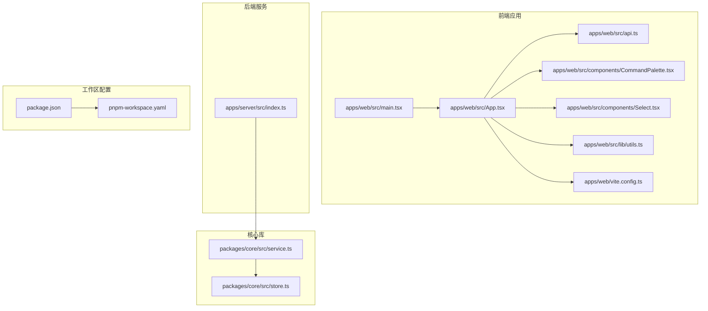
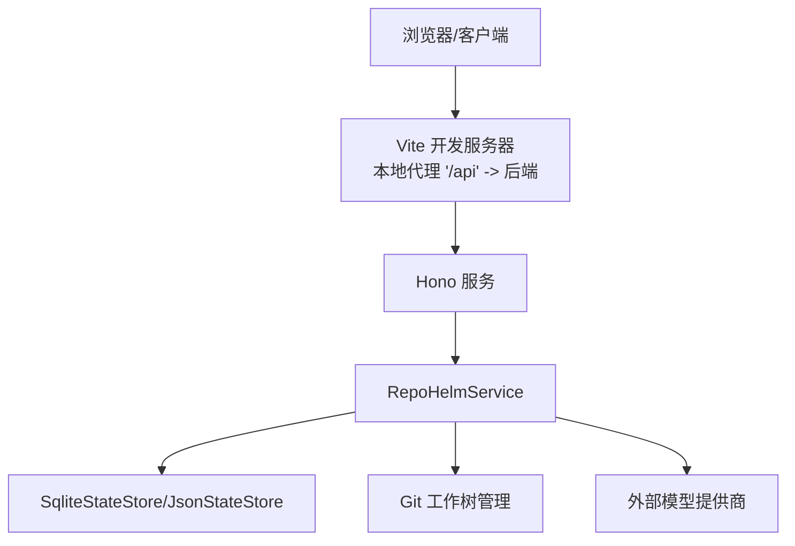
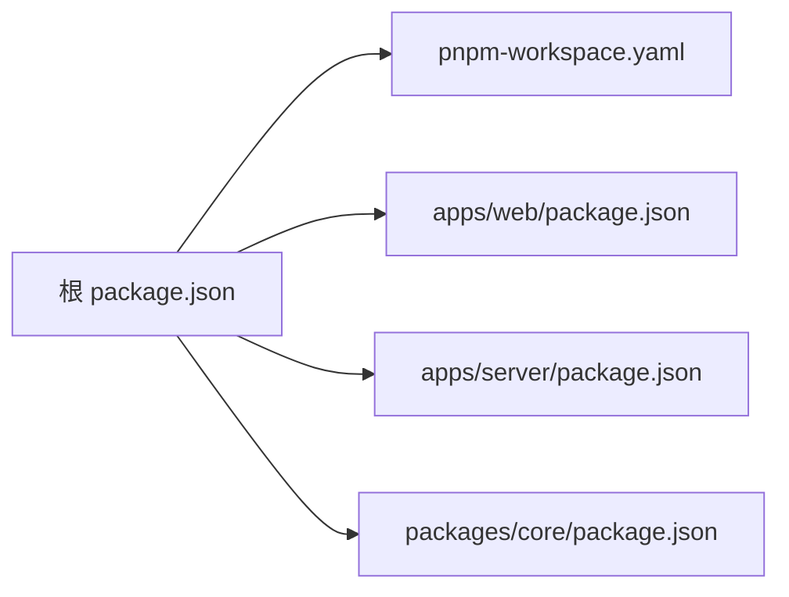
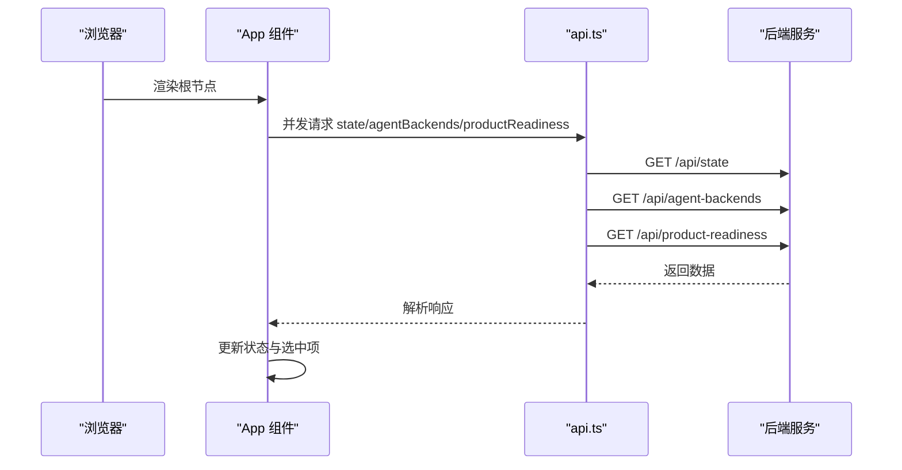

# 性能优化

<cite>
**本文档引用的文件**
- [apps/web/vite.config.ts](file://apps/web/vite.config.ts)
- [apps/web/package.json](file://apps/web/package.json)
- [apps/web/src/main.tsx](file://apps/web/src/main.tsx)
- [apps/web/src/App.tsx](file://apps/web/src/App.tsx)
- [apps/web/src/api.ts](file://apps/web/src/api.ts)
- [apps/web/src/components/CommandPalette.tsx](file://apps/web/src/components/CommandPalette.tsx)
- [apps/web/src/components/Select.tsx](file://apps/web/src/components/Select.tsx)
- [apps/web/src/lib/utils.ts](file://apps/web/src/lib/utils.ts)
- [apps/server/src/index.ts](file://apps/server/src/index.ts)
- [packages/core/src/service.ts](file://packages/core/src/service.ts)
- [packages/core/src/store.ts](file://packages/core/src/store.ts)
- [package.json](file://package.json)
- [pnpm-workspace.yaml](file://pnpm-workspace.yaml)
</cite>

## 目录
1. [简介](#简介)
2. [项目结构](#项目结构)
3. [核心组件](#核心组件)
4. [架构总览](#架构总览)
5. [详细组件分析](#详细组件分析)
6. [依赖分析](#依赖分析)
7. [性能考虑](#性能考虑)
8. [故障排查指南](#故障排查指南)
9. [结论](#结论)
10. [附录](#附录)

## 简介
本文件面向 RepoHelm 的性能优化，覆盖前端与后端两部分。前端侧重点在构建与运行时性能（打包体积、按需加载、缓存策略、网络请求优化），后端侧重点在数据库访问、缓存命中、并发与 I/O、进程间通信与代理配置。同时给出内存使用与垃圾回收建议、CDN 与静态资源策略、性能监控与基准测试方法、瓶颈定位与负载压力测试方案，以及最佳实践与注意事项。

## 项目结构
RepoHelm 采用多包工作区（pnpm workspace）组织，前端位于 apps/web，后端位于 apps/server，核心业务逻辑与持久化位于 packages/core。开发脚本通过 concurrently 同时启动前后端服务；生产构建分别对 core、server、web 进行打包。

**图示来源**
- [apps/web/src/main.tsx:1-13](file://apps/web/src/main.tsx#L1-L13)
- [apps/web/src/App.tsx:1-800](file://apps/web/src/App.tsx#L1-L800)
- [apps/web/src/api.ts:1-423](file://apps/web/src/api.ts#L1-L423)
- [apps/web/src/components/CommandPalette.tsx:1-101](file://apps/web/src/components/CommandPalette.tsx#L1-L101)
- [apps/web/src/components/Select.tsx:1-69](file://apps/web/src/components/Select.tsx#L1-L69)
- [apps/web/src/lib/utils.ts:1-8](file://apps/web/src/lib/utils.ts#L1-L8)
- [apps/web/vite.config.ts:1-16](file://apps/web/vite.config.ts#L1-L16)
- [apps/server/src/index.ts:1-366](file://apps/server/src/index.ts#L1-L366)
- [packages/core/src/service.ts:1-800](file://packages/core/src/service.ts#L1-L800)
- [packages/core/src/store.ts:1-166](file://packages/core/src/store.ts#L1-L166)
- [pnpm-workspace.yaml:1-5](file://pnpm-workspace.yaml#L1-L5)
- [package.json:1-21](file://package.json#L1-L21)

**章节来源**
- [pnpm-workspace.yaml:1-5](file://pnpm-workspace.yaml#L1-L5)
- [package.json:1-21](file://package.json#L1-L21)

## 核心组件
- 前端应用入口与渲染：负责根节点挂载与全局样式注入。
- 应用主界面：初始化状态、并发拉取初始数据、管理主题与布局尺寸、处理交互事件。
- API 封装：统一请求封装、错误处理与路径拼接。
- 组件层：命令面板、下拉选择等 UI 组件。
- 后端服务：Hono 路由、CORS、日志中间件、代理转发、业务接口。
- 核心服务：状态持久化、引擎配置、模型列表缓存、工作树管理、Quest 生命周期。
- 存储层：JSON/SQLite 两种状态存储实现，含迁移与写入优化。

**章节来源**
- [apps/web/src/main.tsx:1-13](file://apps/web/src/main.tsx#L1-L13)
- [apps/web/src/App.tsx:136-152](file://apps/web/src/App.tsx#L136-L152)
- [apps/web/src/api.ts:276-289](file://apps/web/src/api.ts#L276-L289)
- [apps/server/src/index.ts:39-49](file://apps/server/src/index.ts#L39-L49)
- [packages/core/src/service.ts:43-45](file://packages/core/src/service.ts#L43-L45)
- [packages/core/src/store.ts:91-114](file://packages/core/src/store.ts#L91-L114)

## 架构总览
前端通过 Vite 开发服务器提供本地调试与热更新，生产构建产出静态资源；后端基于 Hono 提供 REST API，内部使用 SQLite 存储状态，支持模型列表缓存与并发工作树操作。开发脚本通过 concurrently 并行启动前后端，便于联调。

**图示来源**
- [apps/web/vite.config.ts:9-14](file://apps/web/vite.config.ts#L9-L14)
- [apps/server/src/index.ts:39-49](file://apps/server/src/index.ts#L39-L49)
- [packages/core/src/service.ts:56-71](file://packages/core/src/service.ts#L56-L71)
- [packages/core/src/store.ts:117-165](file://packages/core/src/store.ts#L117-L165)

## 详细组件分析

### 前端性能优化策略
- 代码分割与懒加载
  - 将大型组件按路由或视图拆分，结合动态导入实现按需加载，减少首屏 JS 体积。
  - 对非关键路径组件（如设置、知识中心对话框）采用延迟加载，避免阻塞首屏渲染。
- 资源压缩与构建优化
  - 使用 Vite 默认的 Rollup 打包链路，启用最小化与 Tree-shaking；确保生产构建开启压缩与资源内联策略。
  - CSS 通过 Tailwind 生成，建议配合 Purge/Minify 在生产环境移除未使用样式。
- 网络请求优化
  - API 封装统一处理错误与重试策略，避免重复请求；对高频接口进行去抖/节流。
  - 利用浏览器缓存与 ETag/Last-Modified（如后端支持）降低重复请求成本。
- 交互与渲染优化
  - 使用 React.memo/useMemo/useCallback 减少不必要重渲染；对长列表使用虚拟滚动。
  - 控制并发请求数量，避免同时发起过多请求导致主线程阻塞。
- 本地存储与偏好
  - UI 偏好（如列宽、主题）使用 localStorage 缓存，避免每次渲染计算开销。

**章节来源**
- [apps/web/src/App.tsx:136-152](file://apps/web/src/App.tsx#L136-L152)
- [apps/web/src/api.ts:276-289](file://apps/web/src/api.ts#L276-L289)
- [apps/web/src/components/CommandPalette.tsx:29-40](file://apps/web/src/components/CommandPalette.tsx#L29-L40)
- [apps/web/src/lib/utils.ts:4-7](file://apps/web/src/lib/utils.ts#L4-L7)
- [apps/web/vite.config.ts:1-16](file://apps/web/vite.config.ts#L1-L16)

### 后端性能优化策略
- 数据库查询与存储
  - 使用 SQLite 作为状态存储，具备低开销与高可用特性；写入采用事务式批量更新，减少磁盘 IO。
  - 引擎配置与模型缓存以 TTL 管理，避免频繁外部请求；缓存键包含 provider 与 baseUrl，保证一致性。
- 缓存策略
  - 模型列表缓存（TTL 6 小时），支持强制刷新；外部请求失败时回退至缓存结果。
- 并发处理
  - 多项目工作树创建采用 Promise.all 并行执行，缩短整体等待时间；对失败分支进行降级处理。
  - 安全策略与权限评估在执行前完成，避免无效 I/O。
- 进程间通信与代理
  - 开发环境通过 Vite 代理将 /api 请求转发至后端，减少跨域与 CORS 复杂度。
  - 生产部署建议将前端静态资源托管于 CDN，后端 API 保持内网直连或反向代理。

**章节来源**
- [packages/core/src/service.ts:43-45](file://packages/core/src/service.ts#L43-L45)
- [packages/core/src/service.ts:422-455](file://packages/core/src/service.ts#L422-L455)
- [packages/core/src/service.ts:557-586](file://packages/core/src/service.ts#L557-L586)
- [packages/core/src/store.ts:117-165](file://packages/core/src/store.ts#L117-L165)
- [apps/web/vite.config.ts:9-14](file://apps/web/vite.config.ts#L9-L14)
- [apps/server/src/index.ts:39-49](file://apps/server/src/index.ts#L39-L49)

### 内存使用与垃圾回收配置
- Node.js 运行参数
  - 通过环境变量设置堆大小上限与 GC 行为，平衡吞吐与延迟。
  - 在容器或云平台部署时，结合 CPU/内存配额限制，避免 OOM。
- 前端内存管理
  - 避免闭包持有大对象；及时清理事件监听与定时器；对图片/视频等大资源使用懒加载与释放策略。
- 缓存与内存占用
  - 合理设置模型缓存 TTL，定期清理过期条目；对日志与审计记录进行轮转与压缩。

**章节来源**
- [apps/server/src/index.ts:36-37](file://apps/server/src/index.ts#L36-L37)

### 网络请求优化与 CDN 配置
- 前端静态资源
  - 生产构建产物上传至 CDN，启用缓存头与压缩；对 HTML 设置较短缓存，CSS/JS 设置长期缓存并带内容指纹。
- API 请求
  - 后端启用 CORS 与日志中间件，开发环境通过 Vite 代理简化跨域；生产环境建议使用反向代理统一处理缓存与限流。
- 外部模型请求
  - 模型列表请求带缓存与 TTL，支持强制刷新；鉴权信息通过安全通道传递，避免泄露。

**章节来源**
- [apps/web/vite.config.ts:9-14](file://apps/web/vite.config.ts#L9-L14)
- [apps/server/src/index.ts:42-49](file://apps/server/src/index.ts#L42-L49)
- [packages/core/src/service.ts:422-455](file://packages/core/src/service.ts#L422-L455)

### 性能监控指标与基准测试
- 指标建议
  - 前端：首屏时间（FCP/LCP）、交互时间（FID/CLS）、网络请求数与体积、内存峰值、CPU 占用。
  - 后端：请求延迟分布（P50/P90/P99）、错误率、并发连接数、数据库查询耗时、缓存命中率。
- 基准测试
  - 前端：使用 Lighthouse 或 WebPageTest 对关键页面进行自动化评测；对交互密集场景做手动回归。
  - 后端：使用 wrk/Artillery 对核心接口进行并发压测，观察延迟与错误率变化。

**章节来源**
- [apps/web/src/App.tsx:136-152](file://apps/web/src/App.tsx#L136-L152)
- [apps/web/src/api.ts:276-289](file://apps/web/src/api.ts#L276-L289)

### 性能瓶颈识别与解决策略
- 前端
  - 使用浏览器性能面板定位长任务与重绘；检查网络瀑布图识别慢请求与重复请求。
  - 优化点：拆分大组件、启用懒加载、减少不必要的状态提升、合并与去重请求。
- 后端
  - 分析慢查询与锁竞争；检查模型请求与工作树创建的并发度；评估缓存命中与失效策略。
  - 优化点：增加索引、减少 N+1 查询、引入连接池、优化外部 API 调用顺序。

**章节来源**
- [packages/core/src/service.ts:557-586](file://packages/core/src/service.ts#L557-L586)
- [packages/core/src/service.ts:422-455](file://packages/core/src/service.ts#L422-L455)

### 负载测试与压力测试
- 场景设计
  - 前端：模拟多用户同时创建 Quest、查看 Diff、切换 Workspace 的并发场景。
  - 后端：模拟多项目并行工作树创建、模型列表刷新、状态读写等高负载场景。
- 工具与方法
  - 前端：WebPageTest、Lighthouse、Chrome DevTools Performance。
  - 后端：wrk、Artillery、JMeter；对数据库与外部 API 做独立压测。
- 观察指标
  - 延迟分布、吞吐量、错误率、资源使用率（CPU/内存/IO）。

**章节来源**
- [apps/web/src/App.tsx:136-152](file://apps/web/src/App.tsx#L136-L152)
- [apps/web/src/api.ts:276-289](file://apps/web/src/api.ts#L276-L289)

### 最佳实践与注意事项
- 前端
  - 优先采用按需加载与代码分割；合理设置缓存与压缩策略；避免在渲染路径中执行昂贵计算。
- 后端
  - 使用连接池与超时控制；对外部依赖做熔断与降级；对关键路径加监控告警。
- 全栈
  - 明确开发/测试/生产的差异化配置；对敏感信息（API Key）严格管控；定期复盘性能回归。

**章节来源**
- [apps/web/vite.config.ts:1-16](file://apps/web/vite.config.ts#L1-L16)
- [apps/server/src/index.ts:39-49](file://apps/server/src/index.ts#L39-L49)
- [packages/core/src/service.ts:422-455](file://packages/core/src/service.ts#L422-L455)

## 依赖分析
- 包管理与工作区
  - pnpm workspace 管理多包依赖，统一安装与链接，减少重复依赖。
- 前端依赖
  - React、Tailwind、Radix UI、Lucide 等 UI 与工具库；Vite 作为构建与开发工具。
- 后端依赖
  - Hono 作为轻量 Web 框架，提供路由、中间件与服务器；Zod 用于输入校验。
- 核心库
  - 业务服务与状态存储，提供模型缓存、工作树管理与持久化能力。

**图示来源**
- [package.json:1-21](file://package.json#L1-L21)
- [pnpm-workspace.yaml:1-5](file://pnpm-workspace.yaml#L1-L5)
- [apps/web/package.json:1-34](file://apps/web/package.json#L1-L34)

**章节来源**
- [package.json:1-21](file://package.json#L1-L21)
- [pnpm-workspace.yaml:1-5](file://pnpm-workspace.yaml#L1-L5)
- [apps/web/package.json:1-34](file://apps/web/package.json#L1-L34)

## 性能考虑
- 构建与运行时
  - 前端生产构建应启用压缩与资源内联；按需加载与缓存策略降低首屏体积。
  - 后端生产部署建议使用反向代理与 CDN，减少直接暴露 Node 服务的风险。
- 数据与缓存
  - 模型列表缓存与 TTL 策略显著降低外部依赖压力；状态存储采用 SQLite，兼顾性能与可靠性。
- 并发与 I/O
  - 多项目工作树创建采用并行策略；对失败分支进行降级处理，保障系统稳定性。
- 网络与代理
  - 开发环境通过 Vite 代理简化跨域；生产环境建议统一由反向代理处理缓存与限流。

**章节来源**
- [apps/web/vite.config.ts:1-16](file://apps/web/vite.config.ts#L1-L16)
- [apps/server/src/index.ts:39-49](file://apps/server/src/index.ts#L39-L49)
- [packages/core/src/service.ts:422-455](file://packages/core/src/service.ts#L422-L455)
- [packages/core/src/service.ts:557-586](file://packages/core/src/service.ts#L557-L586)
- [packages/core/src/store.ts:117-165](file://packages/core/src/store.ts#L117-L165)

## 故障排查指南
- 前端
  - 首屏卡顿：检查是否存在大组件未拆分、是否在渲染路径中执行昂贵计算、是否有过多并发请求。
  - 网络错误：确认代理配置与 CORS 设置；检查 API 返回体中的错误信息。
- 后端
  - 响应缓慢：检查数据库查询与外部 API 调用；查看缓存命中率与 TTL 是否合理。
  - 运行异常：查看日志中间件输出与错误处理器返回的错误详情。

**章节来源**
- [apps/web/src/api.ts:276-289](file://apps/web/src/api.ts#L276-L289)
- [apps/server/src/index.ts:353-361](file://apps/server/src/index.ts#L353-L361)

## 结论
RepoHelm 的性能优化应从前端构建与运行时、后端数据库与缓存、并发与 I/O、网络与 CDN 四个维度协同推进。通过合理的代码分割、懒加载、缓存策略与并发控制，结合监控与基准测试，能够持续提升用户体验与系统稳定性。部署层面建议采用 CDN 与反向代理，强化安全与性能双保障。

## 附录
- 关键流程时序（前端并发初始化）

**图示来源**
- [apps/web/src/App.tsx:136-152](file://apps/web/src/App.tsx#L136-L152)
- [apps/web/src/api.ts:291-328](file://apps/web/src/api.ts#L291-L328)