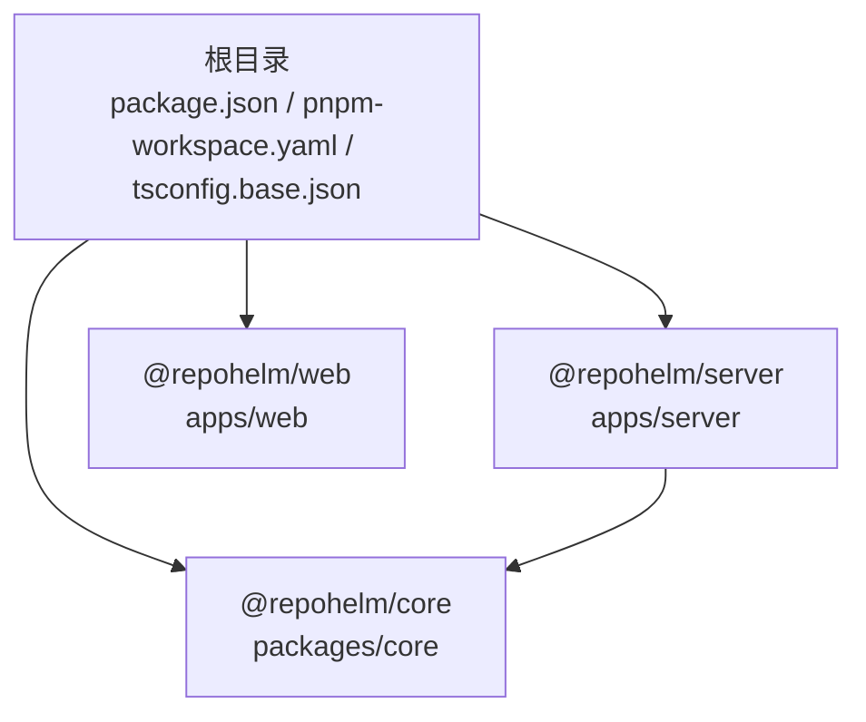
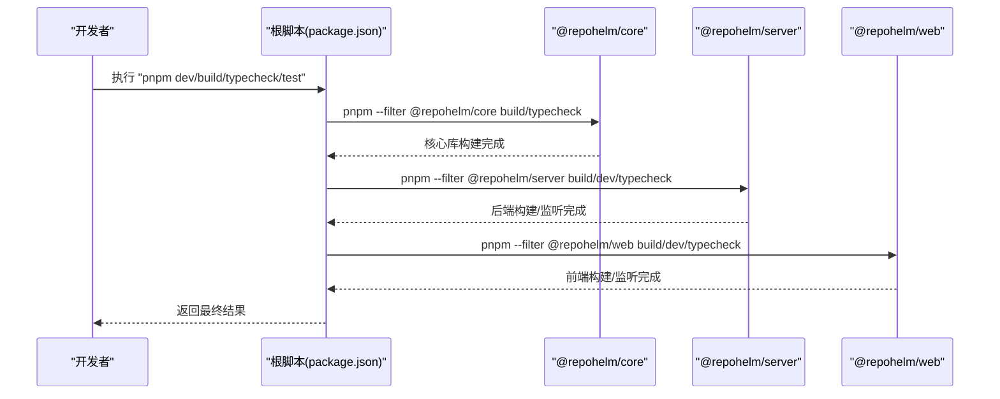
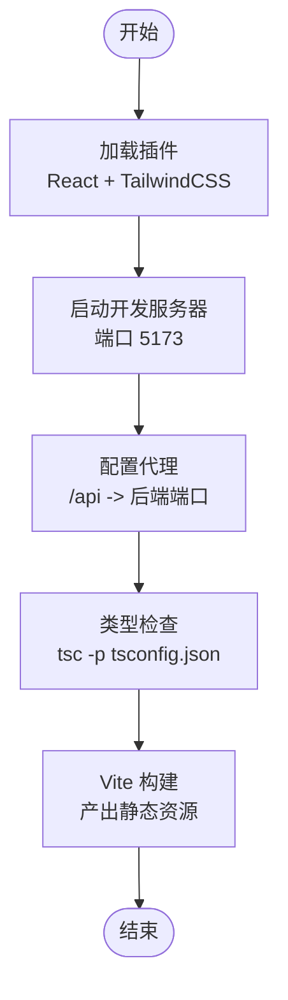
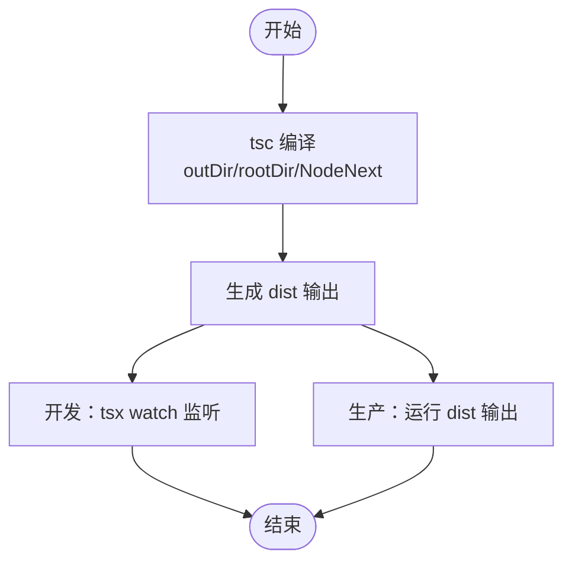
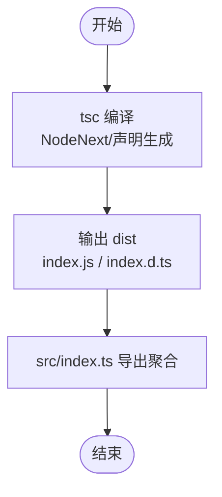
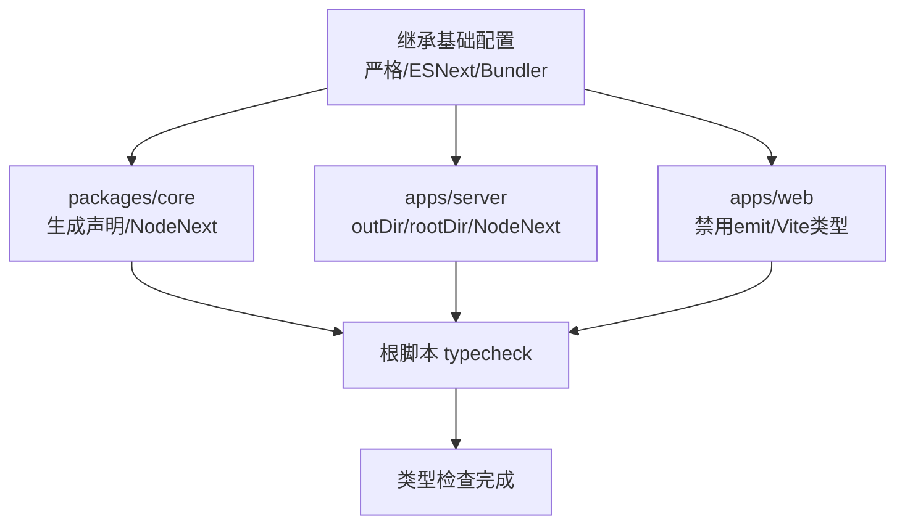
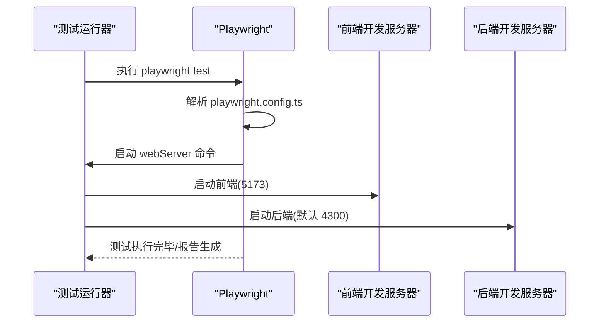
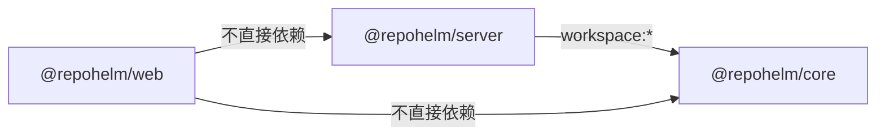

# 构建配置

<cite>
**本文引用的文件**
- [package.json](file://package.json)
- [pnpm-workspace.yaml](file://pnpm-workspace.yaml)
- [tsconfig.base.json](file://tsconfig.base.json)
- [apps/web/vite.config.ts](file://apps/web/vite.config.ts)
- [apps/web/package.json](file://apps/web/package.json)
- [apps/web/tsconfig.json](file://apps/web/tsconfig.json)
- [apps/server/package.json](file://apps/server/package.json)
- [apps/server/tsconfig.json](file://apps/server/tsconfig.json)
- [packages/core/package.json](file://packages/core/package.json)
- [packages/core/tsconfig.json](file://packages/core/tsconfig.json)
- [packages/core/src/index.ts](file://packages/core/src/index.ts)
- [apps/server/src/index.ts](file://apps/server/src/index.ts)
- [playwright.config.ts](file://playwright.config.ts)
</cite>

## 目录
1. [简介](#简介)
2. [项目结构](#项目结构)
3. [核心组件](#核心组件)
4. [架构总览](#架构总览)
5. [详细组件分析](#详细组件分析)
6. [依赖关系分析](#依赖关系分析)
7. [性能考量](#性能考量)
8. [故障排查指南](#故障排查指南)
9. [结论](#结论)
10. [附录](#附录)

## 简介
本文件系统性梳理 RepoHelm 的 monorepo 构建配置与流程，覆盖前端 Vite 构建、后端打包、pnpm workspace 构建顺序与依赖管理、TypeScript 编译与类型检查、构建产物目录结构、常见问题与解决方案以及性能优化最佳实践。目标是帮助开发者在本地与 CI 环境中稳定高效地完成构建。

## 项目结构
RepoHelm 采用 pnpm workspace 组织多包（packages）与应用（apps），通过统一的根脚本与各子包独立的编译配置实现清晰的构建边界与复用。

- 根级配置
  - 根 package.json 提供统一的开发、构建、类型检查与测试脚本入口，使用 pnpm filter 对子包进行定向执行。
  - pnpm-workspace.yaml 声明工作区范围，包含 apps 与 packages 下的所有包。
  - tsconfig.base.json 定义全项目共享的基础编译选项，确保前后端一致的严格类型约束。

- 包与应用
  - packages/core：核心库，提供服务、Git、Agent、Provider 等能力，导出类型与运行时模块，具备独立的构建与测试配置。
  - apps/server：后端服务，基于 Hono 框架，使用 NodeNext 模块与解析策略，面向生产环境打包。
  - apps/web：前端应用，基于 Vite + React，内置 TailwindCSS 支持与代理配置，面向浏览器运行。

图表来源
- [package.json:1-21](file://package.json#L1-L21)
- [pnpm-workspace.yaml:1-5](file://pnpm-workspace.yaml#L1-L5)
- [packages/core/package.json:1-21](file://packages/core/package.json#L1-L21)
- [apps/server/package.json:1-22](file://apps/server/package.json#L1-L22)
- [apps/web/package.json:1-34](file://apps/web/package.json#L1-L34)

章节来源
- [package.json:1-21](file://package.json#L1-L21)
- [pnpm-workspace.yaml:1-5](file://pnpm-workspace.yaml#L1-L5)
- [tsconfig.base.json:1-14](file://tsconfig.base.json#L1-L14)

## 核心组件
- 根脚本与构建顺序
  - 开发模式：先构建核心库，再并行启动后端与前端开发服务器。
  - 生产构建：按顺序构建核心库、后端与前端，保证依赖先行。
  - 类型检查：分别对核心库、后端与前端执行 tsc 类型检查。
  - 测试：核心库使用 Vitest 执行单元测试；端到端测试通过 Playwright 配置启动完整开发环境后运行。

- pnpm workspace 构建顺序与依赖管理
  - 通过 pnpm filter 精确控制执行范围，避免不必要的重复构建。
  - packages/core 作为 apps/server 的 workspace:* 依赖，确保本地开发时直接引用源码而非预构建产物。
  - apps/web 与 apps/server 各自维护独立的依赖与脚本，互不耦合。

- TypeScript 编译与类型检查
  - 全局基础配置：严格模式、ESNext 模块、Bundler 解析等。
  - packages/core：启用声明生成，输出 dist，模块与解析策略适配 NodeNext。
  - apps/server：指定 outDir 与 rootDir，模块与解析策略 NodeNext。
  - apps/web：禁用 emit，使用 Vite 类型，扩展全局类型声明。

- 前端 Vite 构建与代理
  - 插件：React 与 TailwindCSS。
  - 代理：将 /api 前缀转发至后端服务端口，默认 4300，可通过环境变量调整。

- 后端打包与运行
  - 使用 tsc -p tsconfig.json 进行编译，输出到 dist。
  - 开发使用 tsx watch 监听热更新；生产环境由部署层负责运行 dist 输出。

章节来源
- [package.json:7-14](file://package.json#L7-L14)
- [pnpm-workspace.yaml:1-5](file://pnpm-workspace.yaml#L1-L5)
- [packages/core/package.json:8-12](file://packages/core/package.json#L8-L12)
- [packages/core/tsconfig.json:1-13](file://packages/core/tsconfig.json#L1-L13)
- [apps/server/package.json:6-10](file://apps/server/package.json#L6-L10)
- [apps/server/tsconfig.json:1-12](file://apps/server/tsconfig.json#L1-L12)
- [apps/web/package.json:6-10](file://apps/web/package.json#L6-L10)
- [apps/web/tsconfig.json:1-11](file://apps/web/tsconfig.json#L1-L11)
- [apps/web/vite.config.ts:1-16](file://apps/web/vite.config.ts#L1-L16)

## 架构总览
下图展示从根脚本到各子包的构建调用链，体现 monorepo 的构建顺序与依赖关系。

图表来源
- [package.json:8-13](file://package.json#L8-L13)
- [packages/core/package.json:8-12](file://packages/core/package.json#L8-L12)
- [apps/server/package.json:6-10](file://apps/server/package.json#L6-L10)
- [apps/web/package.json:6-10](file://apps/web/package.json#L6-L10)

## 详细组件分析

### 前端 Vite 构建配置
- 插件体系
  - React：启用 JSX 转换与组件开发体验。
  - TailwindCSS：集成样式工具链。
- 本地开发
  - 服务器端口默认 5173。
  - 代理规则将 /api 请求转发至后端端口，默认 4300，可通过环境变量覆盖。
- 构建产物
  - 通过 tsc -p tsconfig.json 进行类型检查，随后 vite build 产出静态资源。

图表来源
- [apps/web/vite.config.ts:1-16](file://apps/web/vite.config.ts#L1-L16)
- [apps/web/package.json:6-10](file://apps/web/package.json#L6-L10)
- [apps/web/tsconfig.json:1-11](file://apps/web/tsconfig.json#L1-L11)

章节来源
- [apps/web/vite.config.ts:1-16](file://apps/web/vite.config.ts#L1-L16)
- [apps/web/package.json:6-10](file://apps/web/package.json#L6-L10)
- [apps/web/tsconfig.json:1-11](file://apps/web/tsconfig.json#L1-L11)

### 后端打包与运行
- 编译配置
  - outDir 与 rootDir 明确输出与输入目录。
  - 模块与解析策略采用 NodeNext，适配 ESM 与现代 Node 运行时。
- 开发与生产
  - 开发：tsx watch 监听源码变化，自动重启。
  - 生产：tsc -p tsconfig.json 生成 dist，交由部署层运行。

图表来源
- [apps/server/package.json:6-10](file://apps/server/package.json#L6-L10)
- [apps/server/tsconfig.json:1-12](file://apps/server/tsconfig.json#L1-L12)

章节来源
- [apps/server/package.json:6-10](file://apps/server/package.json#L6-L10)
- [apps/server/tsconfig.json:1-12](file://apps/server/tsconfig.json#L1-L12)

### 核心库构建与导出
- 构建目标
  - 生成声明文件与运行时入口，输出至 dist。
  - 通过 src/index.ts 统一导出模块，便于上层消费。
- 类型与测试
  - 启用声明生成，便于 apps/server 以 workspace:* 方式直接引用源码。

图表来源
- [packages/core/package.json:8-12](file://packages/core/package.json#L8-L12)
- [packages/core/tsconfig.json:1-13](file://packages/core/tsconfig.json#L1-L13)
- [packages/core/src/index.ts:1-9](file://packages/core/src/index.ts#L1-L9)

章节来源
- [packages/core/package.json:8-12](file://packages/core/package.json#L8-L12)
- [packages/core/tsconfig.json:1-13](file://packages/core/tsconfig.json#L1-L13)
- [packages/core/src/index.ts:1-9](file://packages/core/src/index.ts#L1-L9)

### TypeScript 编译与类型检查流程
- 基础配置
  - 继承 tsconfig.base.json，启用严格模式、ESNext 模块与 Bundler 解析。
- 各包差异
  - packages/core：生成声明文件，模块与解析策略 NodeNext。
  - apps/server：指定 outDir 与 rootDir，模块与解析策略 NodeNext。
  - apps/web：禁用 emit，引入 Vite 类型，扩展全局类型声明。
- 执行策略
  - 根脚本分别对三者执行 typecheck，确保类型安全。

图表来源
- [tsconfig.base.json:1-14](file://tsconfig.base.json#L1-L14)
- [packages/core/tsconfig.json:1-13](file://packages/core/tsconfig.json#L1-L13)
- [apps/server/tsconfig.json:1-12](file://apps/server/tsconfig.json#L1-L12)
- [apps/web/tsconfig.json:1-11](file://apps/web/tsconfig.json#L1-L11)
- [package.json:10-10](file://package.json#L10-L10)

章节来源
- [tsconfig.base.json:1-14](file://tsconfig.base.json#L1-L14)
- [packages/core/tsconfig.json:1-13](file://packages/core/tsconfig.json#L1-L13)
- [apps/server/tsconfig.json:1-12](file://apps/server/tsconfig.json#L1-L12)
- [apps/web/tsconfig.json:1-11](file://apps/web/tsconfig.json#L1-L11)
- [package.json:10-10](file://package.json#L10-L10)

### 端到端测试与 Playwright 集成
- 测试环境
  - 通过 webServer 在 120 秒超时内启动完整开发环境（根目录、状态目录、代理与后端命令注入）。
  - 使用 Chromium 设备，开启并行与 HTML 报告。
- 运行方式
  - 通过根脚本 test:e2e 或直接运行 Playwright 命令，自动拉起前端与后端服务并执行 e2e 测试。

图表来源
- [playwright.config.ts:1-33](file://playwright.config.ts#L1-L33)
- [package.json:12-12](file://package.json#L12-L12)

章节来源
- [playwright.config.ts:1-33](file://playwright.config.ts#L1-L33)
- [package.json:12-12](file://package.json#L12-L12)

## 依赖关系分析
- 依赖拓扑
  - apps/server 依赖 @repohelm/core（workspace:*）。
  - apps/web 与 apps/server 独立，互不直接依赖。
- 构建耦合
  - 根脚本强制先构建核心库，再构建后端与前端，确保上层应用始终消费最新核心能力。
- 外部依赖
  - 前端：React、Vite、TailwindCSS、@vitejs/plugin-react 等。
  - 后端：Hono、@hono/node-server、tsx、zod 等。

图表来源
- [apps/server/package.json:11-16](file://apps/server/package.json#L11-L16)
- [apps/web/package.json:1-34](file://apps/web/package.json#L1-L34)
- [package.json:8-13](file://package.json#L8-L13)

章节来源
- [apps/server/package.json:11-16](file://apps/server/package.json#L11-L16)
- [apps/web/package.json:1-34](file://apps/web/package.json#L1-L34)
- [package.json:8-13](file://package.json#L8-L13)

## 性能考量
- 并行与顺序
  - 开发模式使用并发启动后端与前端，缩短等待时间。
  - 生产构建按核心库 → 后端 → 前端顺序执行，避免运行时依赖缺失。
- 类型检查
  - 分包执行 typecheck，减少单次检查规模；可在 CI 中按需裁剪。
- Vite 构建
  - 利用插件生态与代理机制，减少跨域与二次编译成本。
- 缓存与增量
  - 通过 pnpm workspace 的本地链接与 tsc 的增量编译提升速度；建议在 CI 中缓存 node_modules 与 .tsbuildinfo。
- 端到端测试
  - webServer 复用现有开发环境，避免重复构建；合理设置超时与并行度。

[本节为通用指导，无需列出具体文件来源]

## 故障排查指南
- 端口冲突
  - 前端默认端口 5173，后端默认端口 4300；若冲突，请设置环境变量覆盖后端端口，前端代理会自动跟随。
  - 参考：前端代理配置与后端监听端口定义。

- 类型检查失败
  - 分别在 packages/core、apps/server、apps/web 执行 typecheck，定位具体包的问题。
  - 确认 tsconfig.base.json 的严格选项与各包扩展是否一致。

- 依赖未更新
  - 确保先执行核心库构建，再执行后端与前端构建，避免运行时引用陈旧产物。
  - 若使用本地 workspace:* 依赖，请确认 pnpm-lock.yaml 与 pnpm-workspace.yaml 配置正确。

- 端到端测试无法启动
  - 检查 webServer 命令中的环境变量（REPOHELM_ROOT、REPOHELM_STATE_ROOT 等）是否指向正确路径。
  - 确认代理与端口配置未被系统代理干扰。

- Vite 构建报错
  - 确认 apps/web 的 tsconfig.json 未 emit，且已通过 tsc -p 先做类型检查。
  - 检查插件版本兼容性与 Node 版本。

章节来源
- [apps/web/vite.config.ts:5-14](file://apps/web/vite.config.ts#L5-L14)
- [apps/server/src/index.ts:36-37](file://apps/server/src/index.ts#L36-L37)
- [playwright.config.ts:19-25](file://playwright.config.ts#L19-L25)
- [apps/web/tsconfig.json:4-6](file://apps/web/tsconfig.json#L4-L6)
- [package.json:10-10](file://package.json#L10-L10)

## 结论
RepoHelm 的构建体系以 pnpm workspace 为核心，结合根脚本与各包独立的编译配置，实现了清晰的 monorepo 构建流程。前端通过 Vite 快速迭代，后端通过 tsc 稳定打包，核心库提供统一的类型与能力出口。配合严格的 TypeScript 配置与端到端测试，能够在本地与 CI 中高效、可靠地完成构建与验证。

[本节为总结性内容，无需列出具体文件来源]

## 附录
- 构建产物目录结构（约定）
  - packages/core：dist 目录包含 index.js 与 index.d.ts。
  - apps/server：dist 目录包含编译后的 Node 代码。
  - apps/web：Vite 构建产物位于默认输出目录（通常为 dist），由 Vite 配置决定。
- 环境变量
  - REPOHELM_PORT：后端服务端口（前端代理将 /api 转发至该端口）。
  - REPOHELM_ROOT、REPOHELM_STATE_ROOT：端到端测试与运行时根目录与状态目录。
  - NO_PROXY、HTTP_PROXY 等：端到端测试中用于绕过系统代理。

章节来源
- [apps/web/vite.config.ts:5-14](file://apps/web/vite.config.ts#L5-L14)
- [playwright.config.ts:19-25](file://playwright.config.ts#L19-L25)
- [packages/core/tsconfig.json:3-8](file://packages/core/tsconfig.json#L3-L8)
- [apps/server/tsconfig.json:3-8](file://apps/server/tsconfig.json#L3-L8)
- [apps/web/tsconfig.json:3-6](file://apps/web/tsconfig.json#L3-L6)