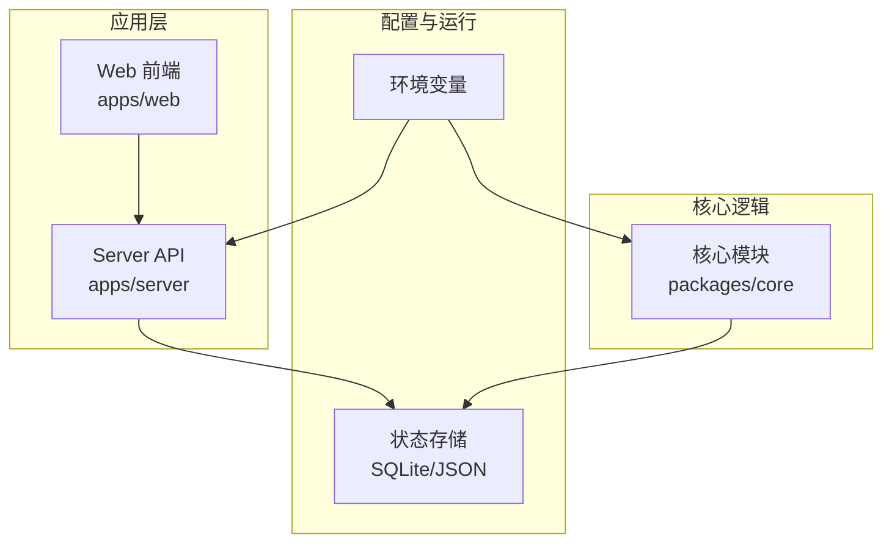
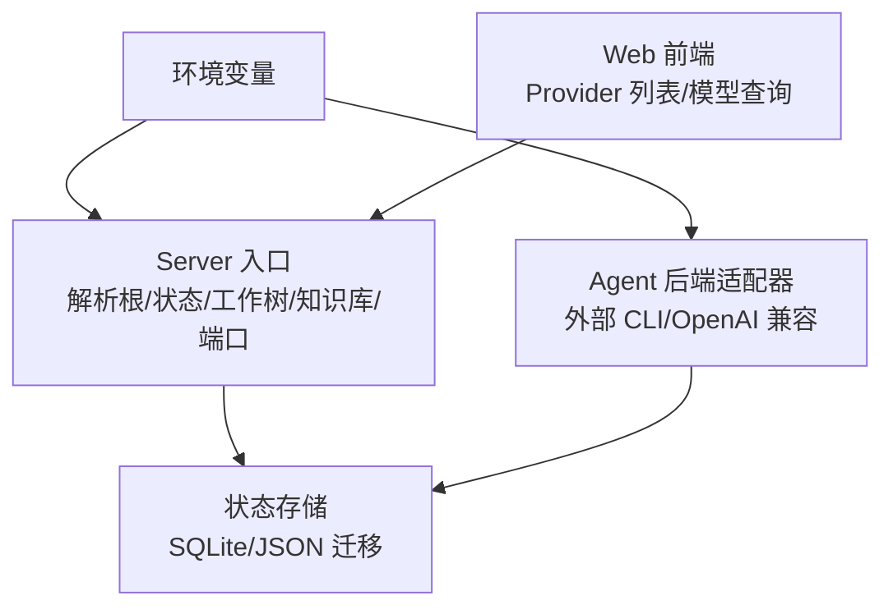
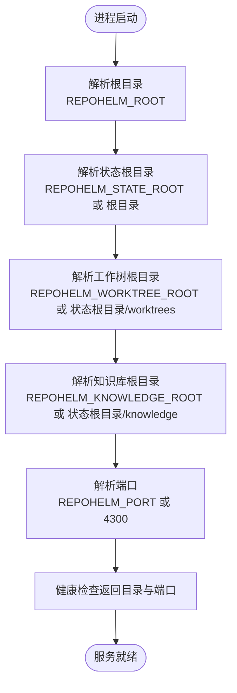
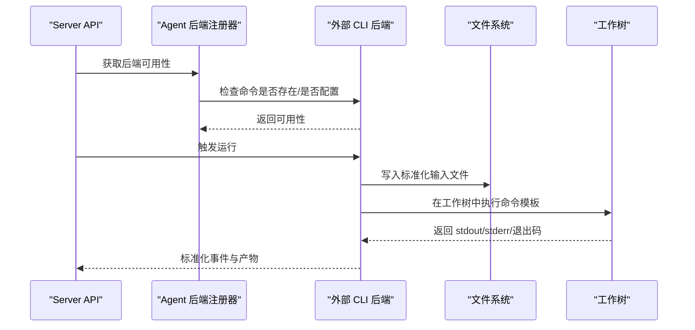
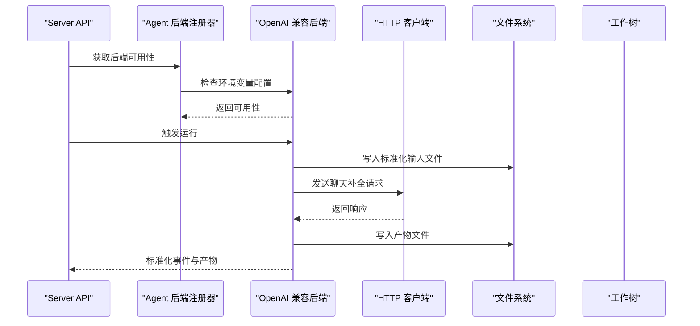
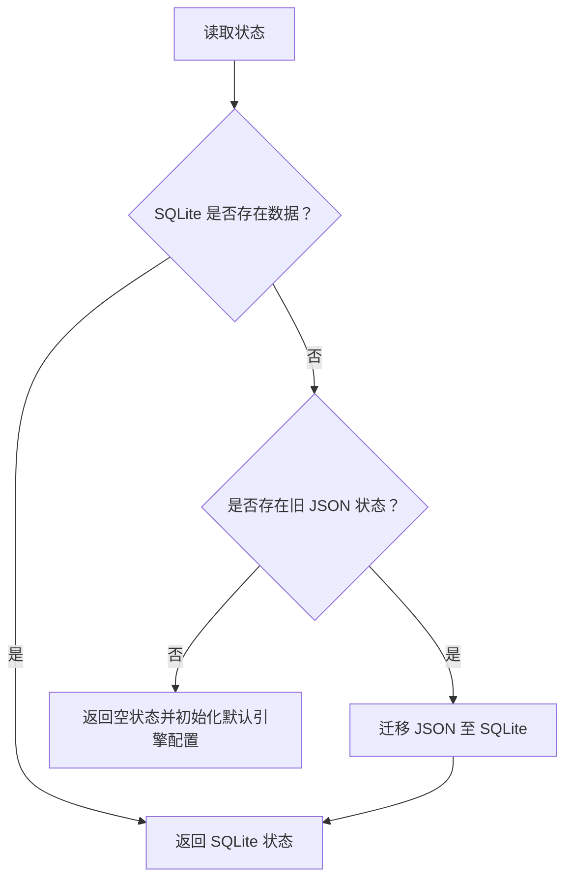
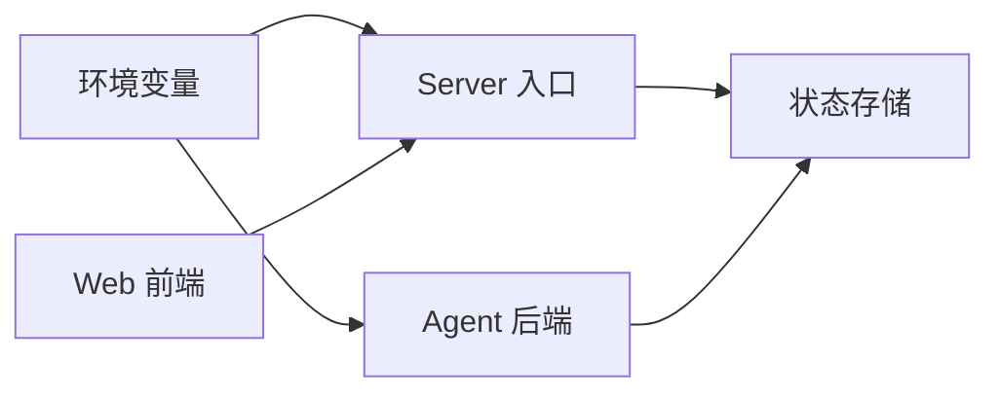

# 环境变量配置

<cite>
**本文引用的文件**
- [README.md](file://README.md)
- [package.json](file://package.json)
- [playwright.config.ts](file://playwright.config.ts)
- [apps/server/src/index.ts](file://apps/server/src/index.ts)
- [packages/core/src/agent.ts](file://packages/core/src/agent.ts)
- [packages/core/src/store.ts](file://packages/core/src/store.ts)
- [apps/web/src/api.ts](file://apps/web/src/api.ts)
- [apps/web/src/App.tsx](file://apps/web/src/App.tsx)
</cite>

## 目录
1. [简介](#简介)
2. [项目结构](#项目结构)
3. [核心组件](#核心组件)
4. [架构总览](#架构总览)
5. [详细组件分析](#详细组件分析)
6. [依赖关系分析](#依赖关系分析)
7. [性能考量](#性能考量)
8. [故障排查指南](#故障排查指南)
9. [结论](#结论)
10. [附录](#附录)

## 简介
本文件面向 RepoHelm 的环境变量配置，系统性说明以下内容：
- 所有与运行、存储、代理、外部后端、模型提供方相关的环境变量及其用途与配置方法
- 开发环境与生产环境的配置差异与建议
- 敏感信息（如 API Key）的安全管理与存储建议
- 环境变量的验证与默认值策略
- 配置模板与示例
- 环境切换与多环境部署的配置方法

## 项目结构
RepoHelm 采用多包工作区结构，前端 Web 应用与后端 API 分离，核心业务逻辑位于 packages/core。环境变量主要影响：
- 服务根目录与状态目录解析
- 存储位置（SQLite）
- 知识库与工作树目录
- API 端口
- 外部 Agent 后端命令模板
- OpenAI 兼容提供方的 Base URL、模型与 API Key
- 代理与测试环境的网络代理变量

图表来源
- [apps/server/src/index.ts:13-37](file://apps/server/src/index.ts#L13-L37)
- [packages/core/src/agent.ts:117-259](file://packages/core/src/agent.ts#L117-L259)
- [packages/core/src/store.ts:117-165](file://packages/core/src/store.ts#L117-L165)

章节来源
- [apps/server/src/index.ts:13-37](file://apps/server/src/index.ts#L13-L37)
- [packages/core/src/agent.ts:117-259](file://packages/core/src/agent.ts#L117-L259)
- [packages/core/src/store.ts:117-165](file://packages/core/src/store.ts#L117-L165)

## 核心组件
本节对与环境变量直接相关的组件进行梳理，明确其职责与依赖。

- 服务器入口与环境解析
  - 解析根目录、状态目录、工作树目录、知识库目录、端口
  - 提供健康检查端点，返回当前解析的目录与端口
- Agent 后端适配器
  - 外部 CLI 后端：Codex、Claude Code、OpenCode
  - OpenAI 兼容后端：Base URL、模型、API Key
  - 统一通过环境变量注入命令模板与凭据
- 状态存储
  - 默认使用 SQLite；支持从旧 JSON 迁移
- Web 前端
  - 提供 Provider 列表与模型查询接口，支持 BYOK Provider 配置

章节来源
- [apps/server/src/index.ts:13-37](file://apps/server/src/index.ts#L13-L37)
- [apps/server/src/index.ts:114-123](file://apps/server/src/index.ts#L114-L123)
- [packages/core/src/agent.ts:117-259](file://packages/core/src/agent.ts#L117-L259)
- [packages/core/src/agent.ts:261-393](file://packages/core/src/agent.ts#L261-L393)
- [packages/core/src/store.ts:117-165](file://packages/core/src/store.ts#L117-L165)
- [apps/web/src/api.ts:235-306](file://apps/web/src/api.ts#L235-L306)

## 架构总览
下图展示了环境变量在系统中的作用范围与流向。

图表来源
- [apps/server/src/index.ts:13-37](file://apps/server/src/index.ts#L13-L37)
- [packages/core/src/agent.ts:117-259](file://packages/core/src/agent.ts#L117-L259)
- [packages/core/src/store.ts:117-165](file://packages/core/src/store.ts#L117-L165)
- [apps/web/src/api.ts:291-306](file://apps/web/src/api.ts#L291-L306)

## 详细组件分析

### 服务器入口与目录解析
- 根目录解析优先使用环境变量，否则根据当前工作目录推断
- 状态根目录、工作树根目录、知识库根目录均可通过环境变量覆盖
- API 端口可通过环境变量设置，默认 4300
- 健康检查接口返回当前解析的目录与端口，便于验证配置

图表来源
- [apps/server/src/index.ts:13-37](file://apps/server/src/index.ts#L13-L37)
- [apps/server/src/index.ts:114-123](file://apps/server/src/index.ts#L114-L123)

章节来源
- [apps/server/src/index.ts:13-37](file://apps/server/src/index.ts#L13-L37)
- [apps/server/src/index.ts:114-123](file://apps/server/src/index.ts#L114-L123)

### 外部 CLI Agent 后端（Codex/Claude/OpenCode）
- 可通过环境变量注入命令模板，用于在 Quest worktree 中执行外部 CLI
- 支持超时时间配置
- 运行时会向子进程注入标准化输入文件路径与 Quest 上下文

图表来源
- [packages/core/src/agent.ts:117-259](file://packages/core/src/agent.ts#L117-L259)
- [packages/core/src/agent.ts:413-431](file://packages/core/src/agent.ts#L413-L431)

章节来源
- [packages/core/src/agent.ts:117-259](file://packages/core/src/agent.ts#L117-L259)
- [packages/core/src/agent.ts:413-431](file://packages/core/src/agent.ts#L413-L431)

### OpenAI 兼容 Agent 后端
- 通过环境变量提供 Base URL、模型与 API Key
- 运行时构造聊天补全请求，将产物写入工作树

图表来源
- [packages/core/src/agent.ts:261-393](file://packages/core/src/agent.ts#L261-L393)
- [packages/core/src/agent.ts:413-431](file://packages/core/src/agent.ts#L413-L431)

章节来源
- [packages/core/src/agent.ts:261-393](file://packages/core/src/agent.ts#L261-L393)
- [packages/core/src/agent.ts:413-431](file://packages/core/src/agent.ts#L413-L431)

### 状态存储与迁移
- 默认使用 SQLite 存储状态，首次访问会创建数据库与表
- 若检测到旧 JSON 状态文件，会自动迁移至 SQLite
- 默认引擎配置包含 BYOK Provider 字段与活动 Provider 标识

图表来源
- [packages/core/src/store.ts:125-139](file://packages/core/src/store.ts#L125-L139)
- [packages/core/src/store.ts:36-84](file://packages/core/src/store.ts#L36-L84)

章节来源
- [packages/core/src/store.ts:117-165](file://packages/core/src/store.ts#L117-L165)
- [packages/core/src/store.ts:36-84](file://packages/core/src/store.ts#L36-L84)

### Web 前端与 Provider 配置
- 前端提供 Provider 列表与模型查询接口，支持传入 Base URL 与 API Key 进行测试
- 默认提供多个知名 Provider 的选项，便于快速配置

章节来源
- [apps/web/src/api.ts:235-306](file://apps/web/src/api.ts#L235-L306)
- [apps/web/src/App.tsx:1587-1608](file://apps/web/src/App.tsx#L1587-L1608)

## 依赖关系分析
- 服务器入口依赖环境变量解析目录与端口
- Agent 后端依赖环境变量注入命令模板与凭据
- 状态存储依赖根目录与状态目录
- Web 前端依赖服务器提供的健康检查与 Provider 接口

图表来源
- [apps/server/src/index.ts:13-37](file://apps/server/src/index.ts#L13-L37)
- [packages/core/src/agent.ts:117-259](file://packages/core/src/agent.ts#L117-L259)
- [packages/core/src/store.ts:117-165](file://packages/core/src/store.ts#L117-L165)
- [apps/web/src/api.ts:291-306](file://apps/web/src/api.ts#L291-L306)

章节来源
- [apps/server/src/index.ts:13-37](file://apps/server/src/index.ts#L13-L37)
- [packages/core/src/agent.ts:117-259](file://packages/core/src/agent.ts#L117-L259)
- [packages/core/src/store.ts:117-165](file://packages/core/src/store.ts#L117-L165)
- [apps/web/src/api.ts:291-306](file://apps/web/src/api.ts#L291-L306)

## 性能考量
- 环境变量解析发生在进程启动阶段，开销极低
- 代理与网络相关变量（如测试脚本中的代理清空）仅在特定场景生效，不影响生产流量
- 通过合理设置目录与端口，避免不必要的磁盘与网络 IO

## 故障排查指南
- 健康检查失败
  - 检查服务器端口与目录解析是否正确
  - 参考健康检查接口返回的目录与端口信息
- Agent 后端不可用
  - 确认外部 CLI 命令模板已配置
  - 确认 OpenAI 兼容后端的 Base URL、模型与 API Key 已配置
- 状态读取异常
  - 检查状态根目录权限
  - 如存在旧 JSON，确认迁移是否成功

章节来源
- [apps/server/src/index.ts:114-123](file://apps/server/src/index.ts#L114-L123)
- [packages/core/src/agent.ts:117-259](file://packages/core/src/agent.ts#L117-L259)
- [packages/core/src/store.ts:125-139](file://packages/core/src/store.ts#L125-L139)

## 结论
RepoHelm 的环境变量体系围绕“目录解析、存储位置、代理与外部后端配置”展开。通过统一的环境变量机制，可在不同环境中灵活切换，并结合默认值与校验逻辑确保系统稳定运行。建议在生产环境采用密钥管理与最小权限原则，配合严格的凭据轮换与审计策略，保障系统安全。

## 附录

### 环境变量清单与用途
- 目录与端口
  - REPOHELM_ROOT：服务根目录（优先级最高）
  - REPOHELM_STATE_ROOT：状态根目录（默认等于根目录）
  - REPOHELM_WORKTREE_ROOT：工作树根目录（默认在状态根目录下）
  - REPOHELM_KNOWLEDGE_ROOT：知识库根目录（默认在状态根目录下）
  - REPOHELM_PORT：API 端口（默认 4300）
- 外部 CLI 后端
  - REPOHELM_CODEX_COMMAND：Codex CLI 命令模板
  - REPOHELM_CLAUDE_COMMAND：Claude Code CLI 命令模板
  - REPOHELM_OPENCODE_COMMAND：OpenCode CLI 命令模板
  - REPOHELM_AGENT_TIMEOUT_MS：外部 CLI 执行超时（毫秒）
  - REPOHELM_AGENT_INPUT：标准化输入文件路径（由运行时注入）
- OpenAI 兼容后端
  - REPOHELM_OPENAI_BASE_URL：提供方 Base URL
  - REPOHELM_OPENAI_MODEL：模型名称
  - REPOHELM_OPENAI_API_KEY：API Key
  - REPOHELM_ENABLE_GH_PR：是否启用 GitHub PR 创建（配合 gh 工具）
- 测试与代理
  - NO_PROXY/no_proxy：测试期间清空代理以绕过网络限制
  - HTTP_PROXY/HTTPS_PROXY/http_proxy/https_proxy：代理变量（测试中清空）

章节来源
- [apps/server/src/index.ts:13-37](file://apps/server/src/index.ts#L13-L37)
- [packages/core/src/agent.ts:117-259](file://packages/core/src/agent.ts#L117-L259)
- [packages/core/src/agent.ts:261-393](file://packages/core/src/agent.ts#L261-L393)
- [README.md:62-77](file://README.md#L62-L77)
- [playwright.config.ts:20-21](file://playwright.config.ts#L20-L21)

### 开发环境与生产环境配置差异
- 开发环境
  - 使用默认端口与本地目录，便于快速启动
  - 可通过环境变量覆盖默认行为
  - 测试脚本中显式清空代理变量，避免本地代理干扰
- 生产环境
  - 明确设置根目录与状态目录，确保隔离与持久化
  - 严格管理凭据，避免明文写入配置文件
  - 通过反向代理或容器编排暴露服务，不直接暴露默认端口

章节来源
- [apps/server/src/index.ts:13-37](file://apps/server/src/index.ts#L13-L37)
- [playwright.config.ts:20-21](file://playwright.config.ts#L20-L21)

### 环境变量验证与默认值
- 目录解析
  - 优先使用环境变量；若未设置，则根据当前工作目录推断
- 端口
  - 默认 4300，可通过环境变量覆盖
- 外部 CLI 后端
  - 通过命令模板存在与否判断可用性
  - 运行时注入标准化输入文件路径与 Quest 上下文
- OpenAI 兼容后端
  - 通过 Base URL、模型与 API Key 是否齐全判断可用性
- 状态存储
  - 首次访问自动创建 SQLite 表；如存在旧 JSON，自动迁移

章节来源
- [apps/server/src/index.ts:13-37](file://apps/server/src/index.ts#L13-L37)
- [packages/core/src/agent.ts:117-259](file://packages/core/src/agent.ts#L117-L259)
- [packages/core/src/agent.ts:261-393](file://packages/core/src/agent.ts#L261-L393)
- [packages/core/src/store.ts:117-165](file://packages/core/src/store.ts#L117-L165)

### 敏感信息加密与存储建议
- 凭据管理
  - 使用密钥管理服务（如平台提供的密钥保管箱）存储 API Key
  - 避免将敏感信息提交到版本控制系统
- 最小权限
  - 为不同环境分配最小必要权限
  - 对外网访问与文件系统操作实施白名单策略
- 审计与轮换
  - 记录凭据变更与访问日志
  - 定期轮换 API Key，缩短泄露窗口

### 配置模板与示例
- 示例模板（仅列出键名，不包含具体值）
  - 目录与端口
    - REPOHELM_ROOT=
    - REPOHELM_STATE_ROOT=
    - REPOHELM_WORKTREE_ROOT=
    - REPOHELM_KNOWLEDGE_ROOT=
    - REPOHELM_PORT=
  - 外部 CLI 后端
    - REPOHELM_CODEX_COMMAND=
    - REPOHELM_CLAUDE_COMMAND=
    - REPOHELM_OPENCODE_COMMAND=
    - REPOHELM_AGENT_TIMEOUT_MS=
  - OpenAI 兼容后端
    - REPOHELM_OPENAI_BASE_URL=
    - REPOHELM_OPENAI_MODEL=
    - REPOHELM_OPENAI_API_KEY=
    - REPOHELM_ENABLE_GH_PR=

章节来源
- [README.md:62-77](file://README.md#L62-L77)

### 环境切换与多环境部署
- 多环境隔离
  - 通过不同状态根目录实现数据隔离
  - 通过不同端口区分开发/预发布/生产
- 部署方式
  - 容器化部署时，通过环境变量注入配置
  - 反向代理统一暴露服务，隐藏默认端口
- 测试环境
  - 测试脚本中显式清空代理变量，确保测试稳定性

章节来源
- [apps/server/src/index.ts:13-37](file://apps/server/src/index.ts#L13-L37)
- [playwright.config.ts:20-21](file://playwright.config.ts#L20-L21)