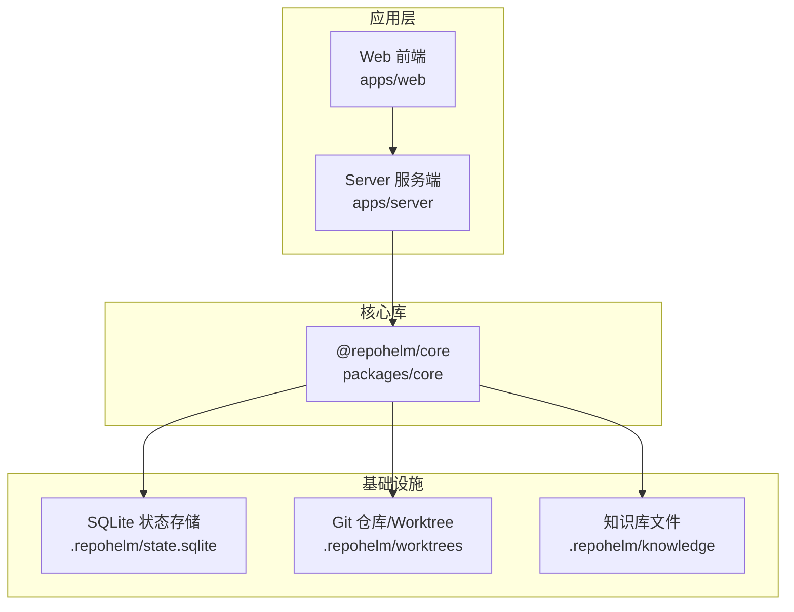
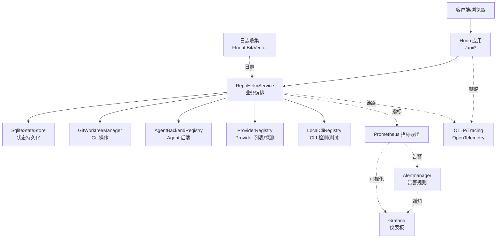
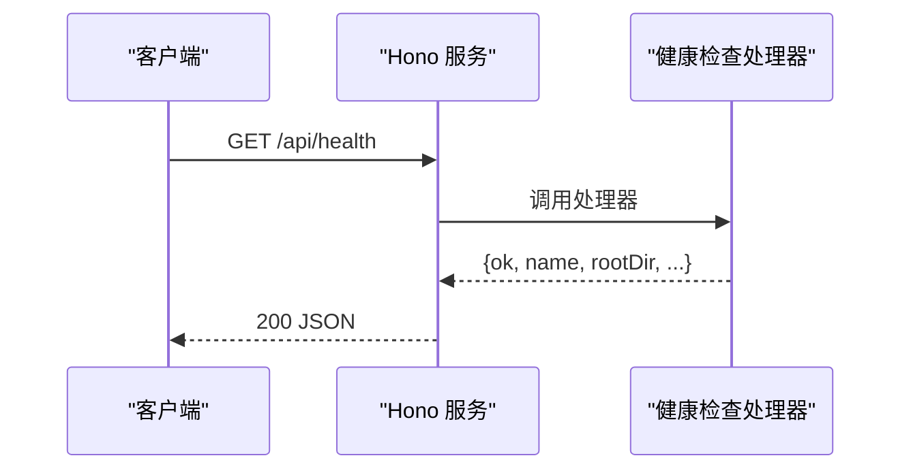
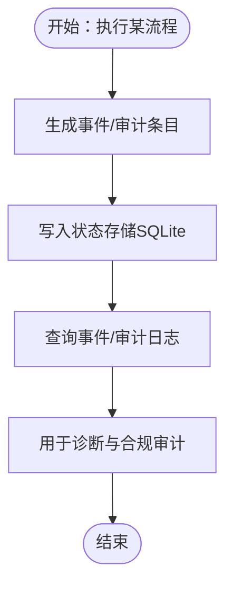
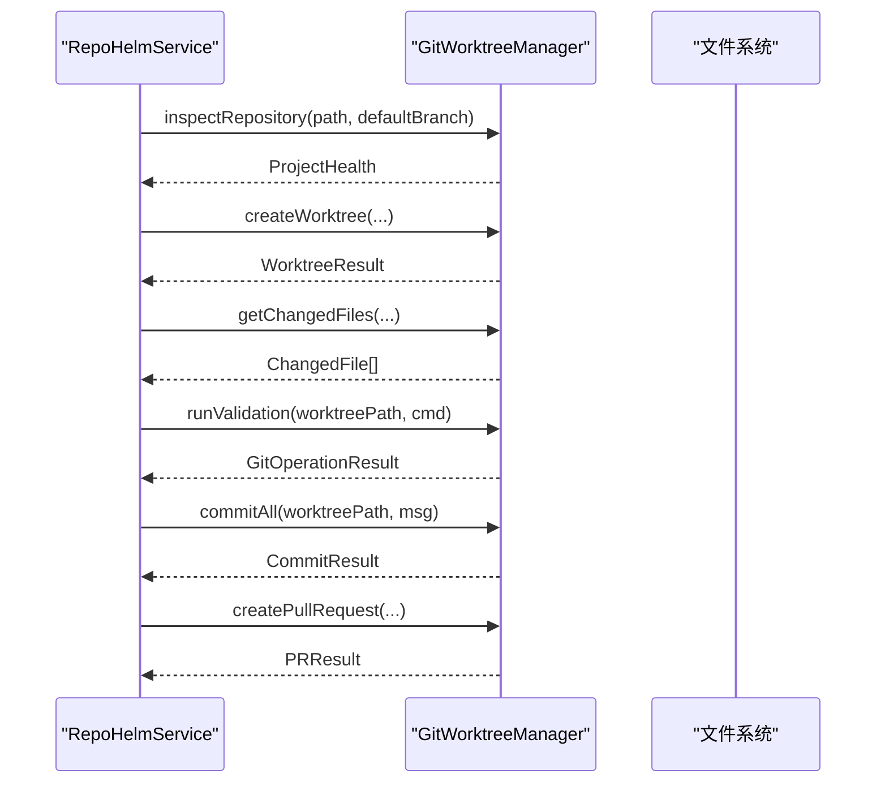
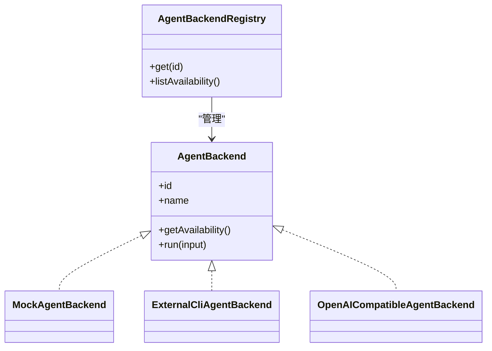
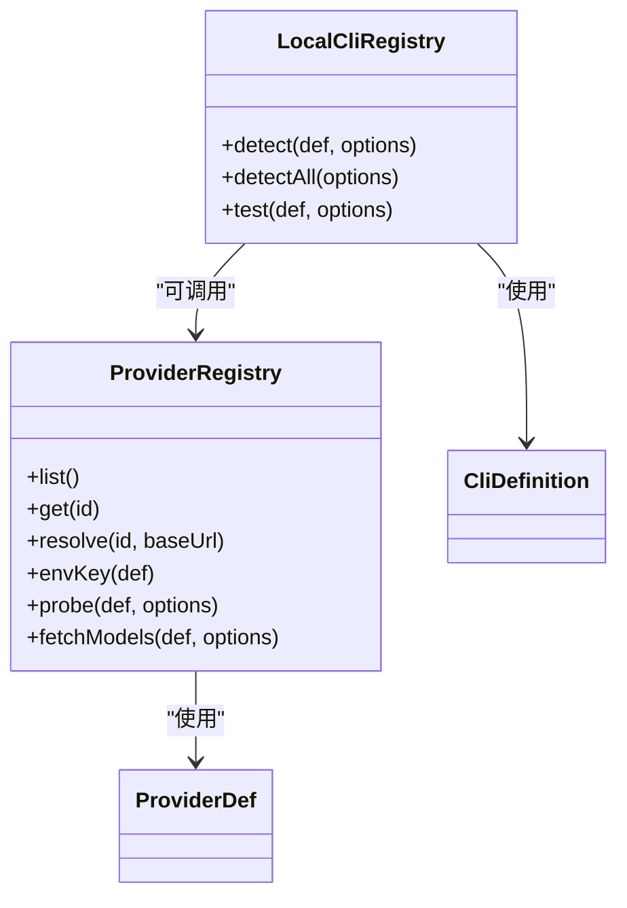
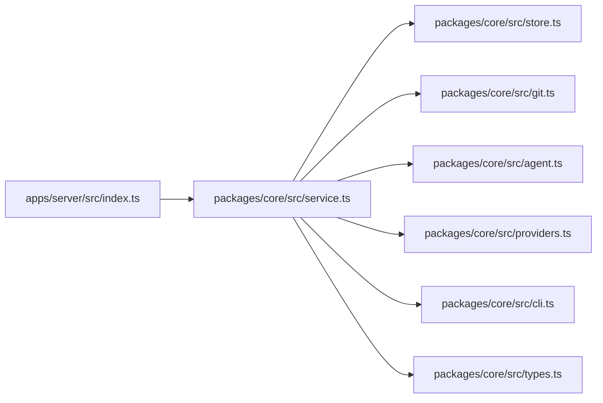

# 监控和告警

<cite>
**本文引用的文件**
- [apps/server/src/index.ts](file://apps/server/src/index.ts)
- [packages/core/src/service.ts](file://packages/core/src/service.ts)
- [packages/core/src/store.ts](file://packages/core/src/store.ts)
- [packages/core/src/types.ts](file://packages/core/src/types.ts)
- [packages/core/src/git.ts](file://packages/core/src/git.ts)
- [packages/core/src/agent.ts](file://packages/core/src/agent.ts)
- [packages/core/src/providers.ts](file://packages/core/src/providers.ts)
- [packages/core/src/cli.ts](file://packages/core/src/cli.ts)
- [README.md](file://README.md)
- [package.json](file://package.json)
- [apps/server/package.json](file://apps/server/package.json)
- [apps/web/package.json](file://apps/web/package.json)
- [packages/core/package.json](file://packages/core/package.json)
</cite>

## 目录
1. [简介](#简介)
2. [项目结构](#项目结构)
3. [核心组件](#核心组件)
4. [架构总览](#架构总览)
5. [组件详解](#组件详解)
6. [依赖关系分析](#依赖关系分析)
7. [性能与可观测性建议](#性能与可观测性建议)
8. [日志与错误追踪](#日志与错误追踪)
9. [告警规则与通知渠道](#告警规则与通知渠道)
10. [分布式追踪与链路监控](#分布式追踪与链路监控)
11. [监控仪表板与可视化](#监控仪表板与可视化)
12. [监控数据存储与查询](#监控数据存储与查询)
13. [扩展与自定义指标](#扩展与自定义指标)
14. [维护与故障排查](#维护与故障排查)
15. [结论](#结论)

## 简介
本文件面向 RepoHelm 的监控与告警体系，基于现有代码实现与配置，给出可落地的监控实践指南。当前仓库未内置 Prometheus/Grafana/OpenTelemetry 等监控栈，但通过现有服务端点、状态存储与事件机制，可快速扩展出健康检查、性能指标、错误追踪、日志采集、告警规则与通知、链路追踪以及可视化仪表板。

## 项目结构
RepoHelm 采用多包工作区（pnpm workspace）组织，核心服务位于 apps/server，业务逻辑位于 packages/core，前端位于 apps/web。服务端通过 Hono 提供 REST API，核心业务逻辑封装在 RepoHelmService 中，状态持久化通过 SQLite 存储。

图示来源
- [apps/server/src/index.ts:1-366](file://apps/server/src/index.ts#L1-L366)
- [packages/core/src/service.ts:1-1331](file://packages/core/src/service.ts#L1-L1331)
- [packages/core/src/store.ts:117-166](file://packages/core/src/store.ts#L117-L166)

章节来源
- [README.md:1-100](file://README.md#L1-L100)
- [package.json:1-21](file://package.json#L1-L21)
- [apps/server/package.json:1-22](file://apps/server/package.json#L1-L22)
- [apps/web/package.json:1-34](file://apps/web/package.json#L1-L34)
- [packages/core/package.json:1-21](file://packages/core/package.json#L1-L21)

## 核心组件
- 服务端 API（Hono）：提供健康检查、状态查询、Quest 生命周期管理、Agent 后端与 Provider/CLI 管理等接口。
- 业务服务（RepoHelmService）：编排工作区、项目、Quest、Worktree、Agent 后端与 Provider/CLI，记录事件与审计日志。
- 状态存储（SqliteStateStore/JsonStateStore）：持久化全局状态、引擎配置、模型缓存、审计日志等。
- Git 工作树管理（GitWorktreeManager）：创建/删除 worktree、变更检测、验证命令执行、提交与 PR 创建。
- Agent 后端注册表：内置 Mock 与多种外部 CLI、OpenAI 兼容 Provider 的后端实现。
- Provider 注册表：统一管理多家大模型提供商的模型列表拉取与探测。
- CLI 注册表：检测本地 CLI、模型枚举、真实连通性测试。

章节来源
- [apps/server/src/index.ts:114-123](file://apps/server/src/index.ts#L114-L123)
- [packages/core/src/service.ts:56-71](file://packages/core/src/service.ts#L56-L71)
- [packages/core/src/store.ts:117-166](file://packages/core/src/store.ts#L117-L166)
- [packages/core/src/git.ts:33-343](file://packages/core/src/git.ts#L33-L343)
- [packages/core/src/agent.ts:395-411](file://packages/core/src/agent.ts#L395-L411)
- [packages/core/src/providers.ts:163-304](file://packages/core/src/providers.ts#L163-L304)
- [packages/core/src/cli.ts:112-368](file://packages/core/src/cli.ts#L112-L368)

## 架构总览
下图展示 RepoHelm 的监控与告警扩展视图：在现有 API 与服务层之上，增加指标采集、日志聚合、告警规则与通知、链路追踪与可视化面板。

图示来源
- [apps/server/src/index.ts:1-366](file://apps/server/src/index.ts#L1-L366)
- [packages/core/src/service.ts:1-1331](file://packages/core/src/service.ts#L1-L1331)
- [packages/core/src/git.ts:1-343](file://packages/core/src/git.ts#L1-L343)
- [packages/core/src/agent.ts:1-436](file://packages/core/src/agent.ts#L1-L436)
- [packages/core/src/providers.ts:1-304](file://packages/core/src/providers.ts#L1-L304)
- [packages/core/src/cli.ts:1-368](file://packages/core/src/cli.ts#L1-L368)

## 组件详解

### 健康检查与状态端点
- 健康检查：/api/health 返回服务基本信息与关键路径。
- 状态查询：/api/state 返回全局状态，便于诊断与审计。
- 错误处理：全局 onError 捕获异常并返回统一格式。

图示来源
- [apps/server/src/index.ts:114-123](file://apps/server/src/index.ts#L114-L123)
- [apps/server/src/index.ts:353-361](file://apps/server/src/index.ts#L353-L361)

章节来源
- [apps/server/src/index.ts:114-123](file://apps/server/src/index.ts#L114-L123)
- [apps/server/src/index.ts:353-361](file://apps/server/src/index.ts#L353-L361)

### 事件与审计日志
- 事件记录：服务在关键流程（创建 Quest、生成 Spec、Agent 执行、Worktree 创建、验证与 Review、知识库更新）写入事件数组。
- 审计日志：对命令执行、文件操作、网络访问、Secrets、能力安装等进行审计决策记录。
- 状态存储：事件与审计日志持久化至 SQLite，便于查询与回溯。

图示来源
- [packages/core/src/service.ts:512-534](file://packages/core/src/service.ts#L512-L534)
- [packages/core/src/service.ts:673-688](file://packages/core/src/service.ts#L673-L688)
- [packages/core/src/store.ts:117-166](file://packages/core/src/store.ts#L117-L166)
- [packages/core/src/types.ts:89-97](file://packages/core/src/types.ts#L89-L97)
- [packages/core/src/types.ts:145-152](file://packages/core/src/types.ts#L145-L152)

章节来源
- [packages/core/src/service.ts:512-534](file://packages/core/src/service.ts#L512-L534)
- [packages/core/src/service.ts:673-688](file://packages/core/src/service.ts#L673-L688)
- [packages/core/src/store.ts:117-166](file://packages/core/src/store.ts#L117-L166)
- [packages/core/src/types.ts:89-97](file://packages/core/src/types.ts#L89-L97)
- [packages/core/src/types.ts:145-152](file://packages/core/src/types.ts#L145-L152)

### Git 操作与交付链路
- 仓库健康检查：检查路径是否存在、是否为 Git 仓库、当前分支与默认分支一致性。
- Worktree 创建/清理：隔离工作区，支持失败回滚与复用。
- 变更检测：统计新增/修改/删除/重命名/未跟踪文件，生成 diff。
- 验证命令：在 worktree 执行自定义验证脚本，支持超时与输出捕获。
- 提交与 PR：自动提交变更并可选创建 PR（受环境变量控制）。

图示来源
- [packages/core/src/service.ts:457-476](file://packages/core/src/service.ts#L457-L476)
- [packages/core/src/service.ts:557-586](file://packages/core/src/service.ts#L557-L586)
- [packages/core/src/git.ts:34-61](file://packages/core/src/git.ts#L34-L61)
- [packages/core/src/git.ts:79-120](file://packages/core/src/git.ts#L79-L120)
- [packages/core/src/git.ts:122-140](file://packages/core/src/git.ts#L122-L140)
- [packages/core/src/git.ts:159-187](file://packages/core/src/git.ts#L159-L187)
- [packages/core/src/git.ts:189-220](file://packages/core/src/git.ts#L189-L220)
- [packages/core/src/git.ts:222-249](file://packages/core/src/git.ts#L222-L249)

章节来源
- [packages/core/src/service.ts:457-476](file://packages/core/src/service.ts#L457-L476)
- [packages/core/src/service.ts:557-586](file://packages/core/src/service.ts#L557-L586)
- [packages/core/src/git.ts:34-61](file://packages/core/src/git.ts#L34-L61)
- [packages/core/src/git.ts:79-120](file://packages/core/src/git.ts#L79-L120)
- [packages/core/src/git.ts:122-140](file://packages/core/src/git.ts#L122-L140)
- [packages/core/src/git.ts:159-187](file://packages/core/src/git.ts#L159-L187)
- [packages/core/src/git.ts:189-220](file://packages/core/src/git.ts#L189-L220)
- [packages/core/src/git.ts:222-249](file://packages/core/src/git.ts#L222-L249)

### Agent 后端与 Provider/CLI
- 后端类型：Mock、外部 CLI（Codex/Claude/OpenCode）、OpenAI 兼容 Provider。
- 可用性检测：检测二进制是否存在、命令模板是否配置、Provider/CLI 是否可真实调用。
- 事件标准化：采集 stdout/stderr、退出码、diff 与产物事件，统一写入事件流。

图示来源
- [packages/core/src/agent.ts:41-46](file://packages/core/src/agent.ts#L41-L46)
- [packages/core/src/agent.ts:48-115](file://packages/core/src/agent.ts#L48-L115)
- [packages/core/src/agent.ts:117-259](file://packages/core/src/agent.ts#L117-L259)
- [packages/core/src/agent.ts:261-393](file://packages/core/src/agent.ts#L261-L393)
- [packages/core/src/agent.ts:395-411](file://packages/core/src/agent.ts#L395-L411)

章节来源
- [packages/core/src/agent.ts:41-46](file://packages/core/src/agent.ts#L41-L46)
- [packages/core/src/agent.ts:48-115](file://packages/core/src/agent.ts#L48-L115)
- [packages/core/src/agent.ts:117-259](file://packages/core/src/agent.ts#L117-L259)
- [packages/core/src/agent.ts:261-393](file://packages/core/src/agent.ts#L261-L393)
- [packages/core/src/agent.ts:395-411](file://packages/core/src/agent.ts#L395-L411)

### Provider 与 CLI 管理
- Provider：统一管理多家模型提供商，支持真实连通性探测与模型列表拉取。
- CLI：检测本地 CLI、列出实时模型、执行真实连通性测试，支持超时与错误提示。

图示来源
- [packages/core/src/providers.ts:163-304](file://packages/core/src/providers.ts#L163-L304)
- [packages/core/src/cli.ts:112-368](file://packages/core/src/cli.ts#L112-L368)

章节来源
- [packages/core/src/providers.ts:163-304](file://packages/core/src/providers.ts#L163-L304)
- [packages/core/src/cli.ts:112-368](file://packages/core/src/cli.ts#L112-L368)

## 依赖关系分析
- 服务端依赖核心库：RepoHelmService 依赖 GitWorktreeManager、AgentBackendRegistry、ProviderRegistry、LocalCliRegistry、KnowledgeFileStore 与状态存储。
- 状态存储：SqliteStateStore 与 JsonStateStore 提供持久化能力，支持迁移与并发写入。
- 类型定义：统一的领域模型与事件/审计类型，确保可观测数据结构一致。

图示来源
- [apps/server/src/index.ts:1-366](file://apps/server/src/index.ts#L1-L366)
- [packages/core/src/service.ts:1-1331](file://packages/core/src/service.ts#L1-L1331)
- [packages/core/src/store.ts:1-166](file://packages/core/src/store.ts#L1-L166)
- [packages/core/src/git.ts:1-343](file://packages/core/src/git.ts#L1-L343)
- [packages/core/src/agent.ts:1-436](file://packages/core/src/agent.ts#L1-L436)
- [packages/core/src/providers.ts:1-304](file://packages/core/src/providers.ts#L1-L304)
- [packages/core/src/cli.ts:1-368](file://packages/core/src/cli.ts#L1-L368)
- [packages/core/src/types.ts:1-334](file://packages/core/src/types.ts#L1-L334)

章节来源
- [apps/server/src/index.ts:1-366](file://apps/server/src/index.ts#L1-L366)
- [packages/core/src/service.ts:1-1331](file://packages/core/src/service.ts#L1-L1331)
- [packages/core/src/store.ts:1-166](file://packages/core/src/store.ts#L1-L166)
- [packages/core/src/git.ts:1-343](file://packages/core/src/git.ts#L1-L343)
- [packages/core/src/agent.ts:1-436](file://packages/core/src/agent.ts#L1-L436)
- [packages/core/src/providers.ts:1-304](file://packages/core/src/providers.ts#L1-L304)
- [packages/core/src/cli.ts:1-368](file://packages/core/src/cli.ts#L1-L368)
- [packages/core/src/types.ts:1-334](file://packages/core/src/types.ts#L1-L334)

## 性能与可观测性建议
- 指标采集
  - HTTP 请求指标：延迟、速率、错误率、状态码分布。
  - 业务指标：Quest 创建/执行/清理耗时、Worktree 成功率、Agent 后端成功率、Provider/CLI 可用性。
  - 存储指标：SQLite 写入耗时、事件/审计日志数量增长趋势。
- 日志分级
  - 服务端：使用结构化日志记录请求上下文、响应时间、错误堆栈。
  - 业务：在关键事件处输出结构化字段（如 questId、worktreePath、status）。
- 资源监控
  - CPU/内存/磁盘 IO：结合容器/进程监控工具，关注 Git 操作与 Agent 执行高峰期。
- 超时与重试
  - Git 操作与外部 CLI/Provider 调用应设置合理超时与指数退避。
- 缓存与去重
  - Provider 模型列表缓存（已实现 TTL），避免频繁拉取。

章节来源
- [packages/core/src/git.ts:167-174](file://packages/core/src/git.ts#L167-L174)
- [packages/core/src/providers.ts:43-43](file://packages/core/src/providers.ts#L43-L43)
- [packages/core/src/providers.ts:221-302](file://packages/core/src/providers.ts#L221-L302)

## 日志与错误追踪
- 服务端错误处理：全局 onError 捕获异常并返回统一错误体，便于日志聚合与告警。
- 事件与审计：事件数组与审计日志提供可追溯的闭环证据，适合接入 SIEM 或审计平台。
- 日志采集建议
  - 使用 Fluent Bit/Vector 收集 stdout/stderr 与结构化日志。
  - 对关键事件（如 Agent 执行、Worktree 创建、验证失败）打标签与索引。
  - 保留至少 30 天的日志轮转策略，敏感信息脱敏。

章节来源
- [apps/server/src/index.ts:353-361](file://apps/server/src/index.ts#L353-L361)
- [packages/core/src/service.ts:673-688](file://packages/core/src/service.ts#L673-L688)
- [packages/core/src/types.ts:89-97](file://packages/core/src/types.ts#L89-L97)
- [packages/core/src/types.ts:145-152](file://packages/core/src/types.ts#L145-L152)

## 告警规则与通知渠道
- 健康检查失败：/api/health 连续失败触发告警。
- 业务失败阈值：
  - Agent 后端执行失败率 > 5%（窗口 15 分钟）
  - Worktree 创建失败率 > 3%
  - Provider/CLI 可用性 < 95%
  - 验证命令超时比例 > 10%
- 通知渠道：邮件、Slack、Webhook（可对接企业 IM 平台）。
- 告警收敛：同类型告警在 5 分钟内合并上报，避免风暴。

章节来源
- [apps/server/src/index.ts:114-123](file://apps/server/src/index.ts#L114-L123)
- [packages/core/src/agent.ts:144-221](file://packages/core/src/agent.ts#L144-L221)
- [packages/core/src/git.ts:159-187](file://packages/core/src/git.ts#L159-L187)

## 分布式追踪与链路监控
- 链路标识：在请求入口注入 trace_id，贯穿 /api/state、/api/quests/:id/run、/api/quests/:id/deliver 等关键路径。
- 采样策略：生产环境采用 1% 采样，开发/预发 100%。
- 追踪数据：Span 名称包含资源类型（HTTP、Git、Agent、Provider、CLI），标注 status、error、duration。
- 可视化：Grafana Loki + Tempo 组合，或使用 OpenTelemetry Collector 导出到 Jaeger/Zipkin。

章节来源
- [apps/server/src/index.ts:1-366](file://apps/server/src/index.ts#L1-L366)
- [packages/core/src/service.ts:544-698](file://packages/core/src/service.ts#L544-L698)
- [packages/core/src/git.ts:301-310](file://packages/core/src/git.ts#L301-L310)
- [packages/core/src/agent.ts:223-249](file://packages/core/src/agent.ts#L223-L249)

## 监控仪表板与可视化
- 仪表板建议
  - 实时健康看板：/api/health、/api/state、/api/agent-backends、/api/providers
  - 业务看板：Quest 创建/执行/交付时序图、Worktree 成功/失败趋势、变更文件数分布
  - 审计看板：命令执行/文件操作/网络访问/Secrets/能力安装的决策分布
- 图表类型：时序折线、分布直方图、热力图、拓扑图（依赖关系）。
- 数据源：Prometheus + Grafana；日志与追踪分别接入 Loki/Tempo。

章节来源
- [apps/server/src/index.ts:130-187](file://apps/server/src/index.ts#L130-L187)
- [packages/core/src/service.ts:139-141](file://packages/core/src/service.ts#L139-L141)
- [packages/core/src/service.ts:150-176](file://packages/core/src/service.ts#L150-L176)
- [packages/core/src/types.ts:173-191](file://packages/core/src/types.ts#L173-L191)

## 监控数据存储与查询
- 状态存储：SQLite 表 state，键值 payload 存放完整状态；支持并发写入与迁移。
- 查询建议
  - 事件与审计：按 questId/workspaceId/time 范围过滤，支持分页与排序。
  - 模型缓存：按 providerId/baseUrl 维度查询最近一次拉取时间与模型数。
- 备份策略：每日快照备份 .repohelm/state.sqlite，保留 30 天。

章节来源
- [packages/core/src/store.ts:117-166](file://packages/core/src/store.ts#L117-L166)
- [packages/core/src/service.ts:422-455](file://packages/core/src/service.ts#L422-L455)
- [packages/core/src/types.ts:229-234](file://packages/core/src/types.ts#L229-L234)

## 扩展与自定义指标
- 新增指标
  - 在服务端路由中埋点（如 /api/quests/:id/run 前后记录耗时）。
  - 在 RepoHelmService 关键方法（如 runQuest、deliverQuest）前后打点。
- 新增事件
  - 在业务流程中追加事件类型（如 “custom.metric.collected”），便于审计与可视化。
- 新增 Provider/CLI
  - 在 PROVIDER_DEFINITIONS/CLI_DEFINITIONS 中扩展定义，保持与现有解析与探测逻辑一致。

章节来源
- [apps/server/src/index.ts:317-341](file://apps/server/src/index.ts#L317-L341)
- [packages/core/src/service.ts:544-698](file://packages/core/src/service.ts#L544-L698)
- [packages/core/src/providers.ts:79-161](file://packages/core/src/providers.ts#L79-L161)
- [packages/core/src/cli.ts:43-110](file://packages/core/src/cli.ts#L43-L110)

## 维护与故障排查
- 常见问题
  - /api/health 返回失败：检查服务端端口占用、根目录与状态目录权限。
  - Worktree 创建失败：检查 Git 版本、仓库路径、磁盘空间与权限。
  - Agent 后端不可用：检查外部 CLI 是否安装、命令模板是否配置、Provider/CLI 可用性探测。
- 故障排查步骤
  - 1) 访问 /api/health 与 /api/state 获取基础信息。
  - 2) 查看最近事件与审计日志，定位失败环节。
  - 3) 检查 Git 操作日志与外部 CLI/Provider 的超时与错误输出。
  - 4) 回滚到上一个稳定状态（若使用 SQLite 快照）。
- 运维建议
  - 定期巡检：端口/磁盘/内存/CPU、Git/Agent/Provider 可用性。
  - 安全加固：限制 API 访问来源、启用鉴权（如需）、最小权限原则。

章节来源
- [apps/server/src/index.ts:114-123](file://apps/server/src/index.ts#L114-L123)
- [packages/core/src/git.ts:112-120](file://packages/core/src/git.ts#L112-L120)
- [packages/core/src/agent.ts:125-142](file://packages/core/src/agent.ts#L125-L142)
- [packages/core/src/providers.ts:207-219](file://packages/core/src/providers.ts#L207-L219)

## 结论
RepoHelm 当前具备完善的业务闭环与可观测数据结构（事件、审计、状态存储）。通过在现有 API 与服务层之上叠加指标采集、日志聚合、链路追踪与可视化面板，即可构建完整的监控与告警体系。建议优先实现健康检查与关键业务指标，逐步完善告警规则与通知渠道，并在生产环境中引入分布式追踪与日志/指标的集中化管理。