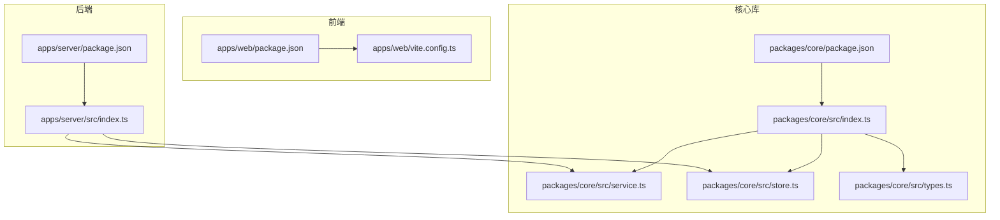
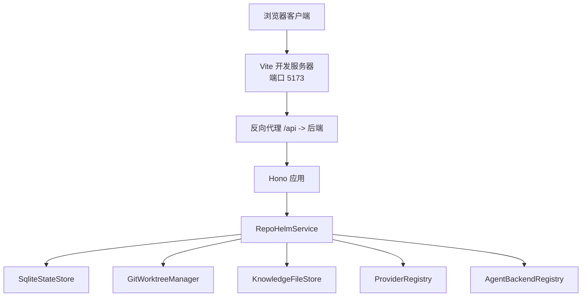
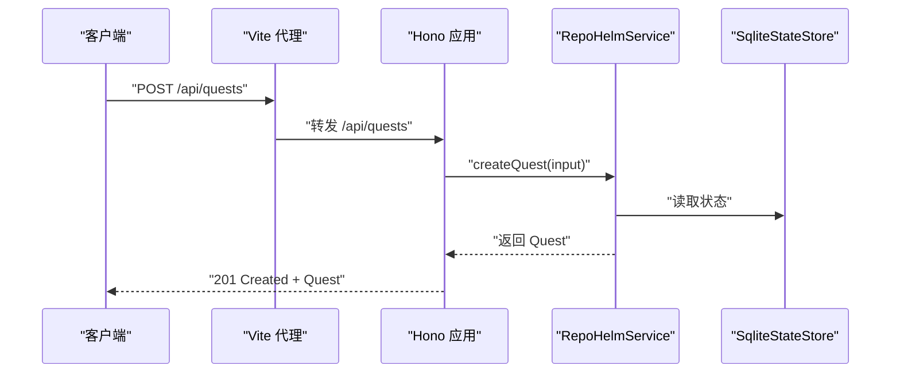
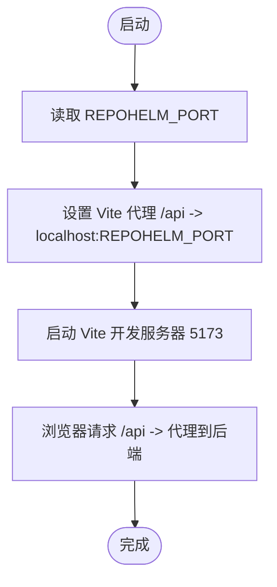
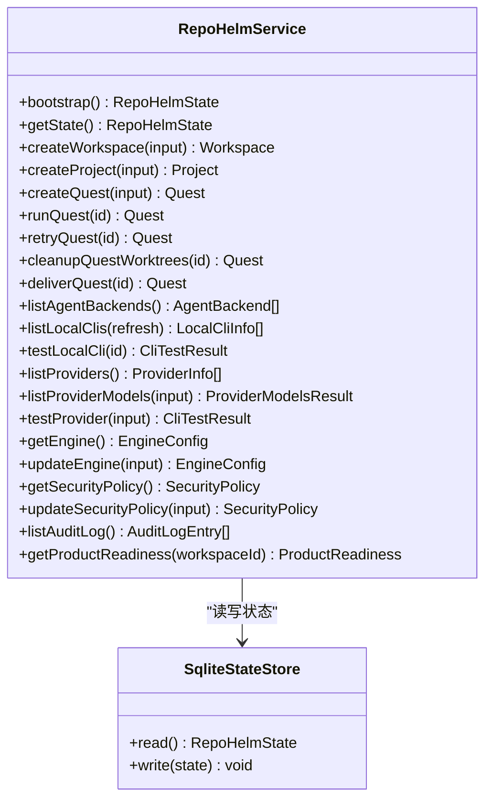
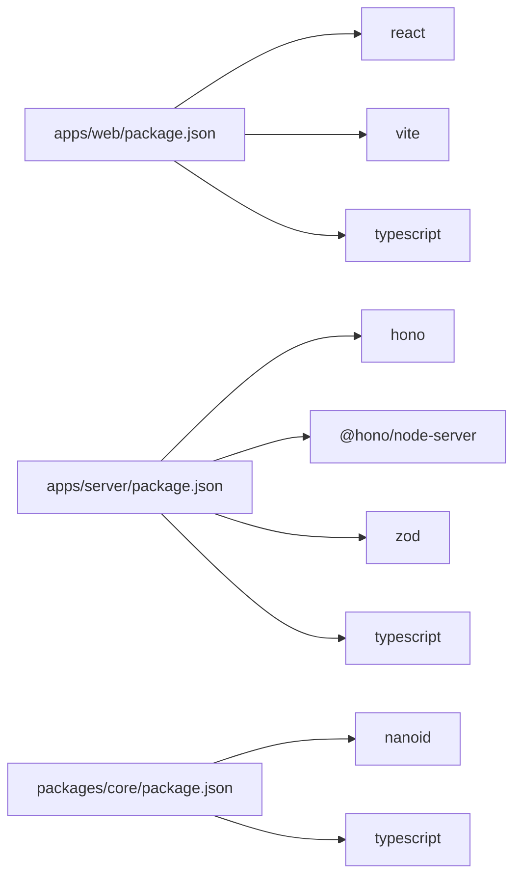

# 部署和生产配置

<cite>
**本文档引用的文件**
- [README.md](file://README.md)
- [package.json](file://package.json)
- [pnpm-workspace.yaml](file://pnpm-workspace.yaml)
- [apps/server/src/index.ts](file://apps/server/src/index.ts)
- [apps/server/package.json](file://apps/server/package.json)
- [apps/server/tsconfig.json](file://apps/server/tsconfig.json)
- [apps/web/vite.config.ts](file://apps/web/vite.config.ts)
- [apps/web/package.json](file://apps/web/package.json)
- [apps/web/tsconfig.json](file://apps/web/tsconfig.json)
- [packages/core/src/index.ts](file://packages/core/src/index.ts)
- [packages/core/src/service.ts](file://packages/core/src/service.ts)
- [packages/core/src/store.ts](file://packages/core/src/store.ts)
- [packages/core/src/types.ts](file://packages/core/src/types.ts)
- [playwright.config.ts](file://playwright.config.ts)
</cite>

## 目录
1. [简介](#简介)
2. [项目结构](#项目结构)
3. [核心组件](#核心组件)
4. [架构总览](#架构总览)
5. [详细组件分析](#详细组件分析)
6. [依赖关系分析](#依赖关系分析)
7. [性能考虑](#性能考虑)
8. [故障排除指南](#故障排除指南)
9. [结论](#结论)
10. [附录](#附录)

## 简介
本文件面向 RepoHelm 的部署与生产配置，覆盖前端构建、后端打包、环境变量管理、生产部署步骤与最佳实践、性能优化、监控与日志、容器化与镜像、负载均衡与高可用、备份与恢复、安全加固与合规、以及故障排除与运维支持。RepoHelm 采用 Monorepo 架构，包含前端 Web 应用、后端 API 服务与共享核心库，使用 Vite 与 TypeScript 构建，后端基于 Hono 框架。

## 项目结构
RepoHelm 采用 pnpm workspace 组织，核心模块如下：
- apps/server：后端 API 服务（Hono + Node）
- apps/web：前端应用（React + Vite）
- packages/core：共享业务逻辑与状态存储
- e2e：端到端测试（Playwright）

**图表来源**
- [apps/web/package.json:1-34](file://apps/web/package.json#L1-L34)
- [apps/web/vite.config.ts:1-16](file://apps/web/vite.config.ts#L1-L16)
- [apps/server/package.json:1-22](file://apps/server/package.json#L1-L22)
- [apps/server/src/index.ts:1-366](file://apps/server/src/index.ts#L1-L366)
- [packages/core/package.json:1-21](file://packages/core/package.json#L1-L21)
- [packages/core/src/index.ts:1-9](file://packages/core/src/index.ts#L1-L9)
- [packages/core/src/service.ts:1-800](file://packages/core/src/service.ts#L1-L800)
- [packages/core/src/store.ts:1-166](file://packages/core/src/store.ts#L1-L166)
- [packages/core/src/types.ts:1-334](file://packages/core/src/types.ts#L1-L334)

**章节来源**
- [pnpm-workspace.yaml:1-5](file://pnpm-workspace.yaml#L1-L5)
- [package.json:1-21](file://package.json#L1-L21)

## 核心组件
- 服务入口与路由：后端 API 使用 Hono，提供健康检查、工作区/项目/Quest 生命周期、引擎配置、安全策略、审计日志等接口。
- 服务层：RepoHelmService 负责业务编排，包括工作区与项目管理、Git worktree 管理、Agent 后端调度、知识库检索与持久化、模型列表缓存、安全策略评估与审计。
- 存储层：SqliteStateStore 提供高性能状态持久化，支持从旧版 JSON 迁移。
- 类型定义：统一的数据模型与状态结构，确保前后端契约一致。

**章节来源**
- [apps/server/src/index.ts:114-366](file://apps/server/src/index.ts#L114-L366)
- [packages/core/src/service.ts:56-800](file://packages/core/src/service.ts#L56-L800)
- [packages/core/src/store.ts:117-166](file://packages/core/src/store.ts#L117-L166)
- [packages/core/src/types.ts:173-334](file://packages/core/src/types.ts#L173-L334)

## 架构总览
后端 API 通过 Hono 提供 REST 接口，前端通过 Vite 开发服务器代理到后端。核心业务逻辑集中在共享库中，后端仅负责路由与状态存储。

**图表来源**
- [apps/web/vite.config.ts:5-14](file://apps/web/vite.config.ts#L5-L14)
- [apps/server/src/index.ts:39-49](file://apps/server/src/index.ts#L39-L49)
- [packages/core/src/service.ts:56-71](file://packages/core/src/service.ts#L56-L71)
- [packages/core/src/store.ts:117-166](file://packages/core/src/store.ts#L117-L166)

## 详细组件分析

### 后端 API（Hono）与路由
- 健康检查与根目录解析：支持通过环境变量指定根目录、状态目录、worktree 与知识库目录。
- CORS 与日志中间件：限制来源为前端开发端口，便于本地联调。
- 数据校验：使用 Zod 对请求体进行严格校验。
- 主要接口：
  - 引擎配置：GET/PUT 引擎模式、CLI/Provider 列表与测试、模型列表缓存。
  - 安全策略：GET/PUT 命令白名单、文件/网络作用域、密钥策略、沙箱运行时。
  - 工作区/项目：增删改查、链接/解绑项目、健康检查。
  - Quest 生命周期：创建、运行、重试、清理、交付。
  - 审计日志与产品就绪度。

**图表来源**
- [apps/web/vite.config.ts:11-13](file://apps/web/vite.config.ts#L11-L13)
- [apps/server/src/index.ts:317-321](file://apps/server/src/index.ts#L317-L321)
- [packages/core/src/service.ts:478-542](file://packages/core/src/service.ts#L478-L542)

**章节来源**
- [apps/server/src/index.ts:13-37](file://apps/server/src/index.ts#L13-L37)
- [apps/server/src/index.ts:41-49](file://apps/server/src/index.ts#L41-L49)
- [apps/server/src/index.ts:114-366](file://apps/server/src/index.ts#L114-L366)

### 前端构建与开发配置
- Vite 开发服务器：默认监听 5173，通过代理将 /api 转发至后端端口。
- 代理端口来自环境变量 REPOHELM_PORT，默认 4300。
- React + TailwindCSS 插件，TypeScript 类型检查。

**图表来源**
- [apps/web/vite.config.ts:5-14](file://apps/web/vite.config.ts#L5-L14)

**章节来源**
- [apps/web/vite.config.ts:1-16](file://apps/web/vite.config.ts#L1-L16)
- [apps/web/package.json:6-10](file://apps/web/package.json#L6-L10)

### 核心服务与状态存储
- RepoHelmService：工作区/项目/Quest 生命周期管理、Git worktree 创建与清理、Agent 后端执行、知识库写入与检索、模型列表缓存（TTL）、安全策略评估与审计。
- SqliteStateStore：SQLite 持久化，支持旧 JSON 状态迁移，提供并发安全写入。

**图表来源**
- [packages/core/src/service.ts:56-800](file://packages/core/src/service.ts#L56-L800)
- [packages/core/src/store.ts:117-166](file://packages/core/src/store.ts#L117-L166)

**章节来源**
- [packages/core/src/service.ts:56-800](file://packages/core/src/service.ts#L56-L800)
- [packages/core/src/store.ts:117-166](file://packages/core/src/store.ts#L117-L166)

### 类型与数据模型
- 统一的数据模型定义，涵盖 Workspace、Project、Quest、Worktree、ChangedFile、SecurityPolicy、EngineConfig、Provider 等。
- 保证前后端契约一致性，便于生成 API 文档与自动化测试。

**章节来源**
- [packages/core/src/types.ts:1-334](file://packages/core/src/types.ts#L1-L334)

## 依赖关系分析
- 前端依赖 React、Vite、TailwindCSS、React Router 等，构建脚本同时执行 TypeScript 检查与 Vite 构建。
- 后端依赖 Hono、@hono/node-server、Zod，使用 TypeScript 编译。
- 核心库依赖 nanoid，提供唯一 ID 生成。

**图表来源**
- [apps/web/package.json:11-32](file://apps/web/package.json#L11-L32)
- [apps/server/package.json:11-20](file://apps/server/package.json#L11-L20)
- [packages/core/package.json:13-19](file://packages/core/package.json#L13-L19)

**章节来源**
- [apps/web/package.json:1-34](file://apps/web/package.json#L1-L34)
- [apps/server/package.json:1-22](file://apps/server/package.json#L1-L22)
- [packages/core/package.json:1-21](file://packages/core/package.json#L1-L21)

## 性能考虑
- 模型列表缓存：Provider 模型列表带 TTL，减少频繁请求，提升 UI 响应速度。
- SQLite 写入优化：使用冲突更新语句，避免重复写入。
- 前端代理：开发期通过 Vite 代理减少跨域与额外跳转。
- 并发执行：工作流中对多个项目的 worktree 创建采用并发 Promise，缩短整体耗时。
- 建议
  - 生产环境启用静态资源压缩与缓存头。
  - 合理设置代理超时与后端连接池参数。
  - 对高频查询（如模型列表）增加本地缓存层。
  - 使用 CDN 分发前端静态资源。

**章节来源**
- [packages/core/src/service.ts:422-455](file://packages/core/src/service.ts#L422-L455)
- [packages/core/src/store.ts:141-148](file://packages/core/src/store.ts#L141-L148)

## 故障排除指南
- 健康检查
  - 访问后端健康接口，确认根目录、状态目录、worktree 与知识库路径解析正确。
- CORS 问题
  - 确认前端代理指向正确的后端端口，后端允许前端来源。
- 代理与端口
  - 若后端端口非默认值，请设置 REPOHELM_PORT 并重启 Vite。
- e2e 测试
  - 使用 Playwright 配置启动独立状态目录，避免污染本地开发状态。
- 常见错误
  - 项目路径不存在或非 Git 仓库：检查项目健康状态与路径。
  - Agent 后端被安全策略阻止：调整命令白名单或审批模式。
  - 模型列表获取失败：检查 Provider 基础地址与密钥。

**章节来源**
- [apps/server/src/index.ts:114-123](file://apps/server/src/index.ts#L114-L123)
- [apps/server/src/index.ts:41-49](file://apps/server/src/index.ts#L41-L49)
- [apps/web/vite.config.ts:5-14](file://apps/web/vite.config.ts#L5-L14)
- [playwright.config.ts:19-25](file://playwright.config.ts#L19-L25)

## 结论
RepoHelm 的部署与生产配置围绕 Monorepo 架构展开：前端通过 Vite 快速迭代，后端以 Hono 提供稳定 API，核心逻辑集中于共享库并通过 SQLite 持久化。通过合理的环境变量管理、代理配置、缓存策略与安全策略，可在开发与生产环境中获得一致的体验与性能表现。

## 附录

### 构建流程与优化策略
- 前端构建
  - 开发：Vite 启动 + React + TailwindCSS，代理 /api。
  - 生产：Vite 构建产物交由反向代理或静态站点托管。
- 后端打包
  - TypeScript 编译为 NodeNext 模块，配合 Hono 运行时。
- 优化建议
  - 启用静态资源压缩与缓存头。
  - 对高频接口增加本地缓存与限流。
  - 使用连接池与超时配置提升稳定性。

**章节来源**
- [apps/web/package.json:6-10](file://apps/web/package.json#L6-L10)
- [apps/server/package.json:6-10](file://apps/server/package.json#L6-L10)
- [apps/server/tsconfig.json:1-12](file://apps/server/tsconfig.json#L1-L12)
- [apps/web/tsconfig.json:1-11](file://apps/web/tsconfig.json#L1-L11)

### 环境变量配置与管理
- 后端
  - REPOHELM_ROOT：根目录解析优先级。
  - REPOHELM_STATE_ROOT：状态目录（默认根目录下）。
  - REPOHELM_WORKTREE_ROOT：worktree 目录（默认状态目录下）。
  - REPOHELM_KNOWLEDGE_ROOT：知识库目录（默认状态目录下）。
  - REPOHELM_PORT：后端监听端口（默认 4300）。
- 前端
  - REPOHELM_PORT：Vite 代理目标端口（默认 4300）。
- Agent Backend
  - 支持通过环境变量配置外部 CLI 或 OpenAI 兼容 Provider。

**章节来源**
- [apps/server/src/index.ts:13-37](file://apps/server/src/index.ts#L13-L37)
- [apps/web/vite.config.ts:5-14](file://apps/web/vite.config.ts#L5-L14)
- [README.md:62-77](file://README.md#L62-L77)

### 生产环境部署步骤与最佳实践
- 准备
  - 安装依赖：使用 pnpm workspace 安装所有包。
  - 构建：执行前端与后端构建脚本。
- 部署
  - 后端：以进程管理器（如 PM2、systemd）运行编译后的 Node 服务。
  - 前端：将 Vite 构建产物部署至 Nginx/Apache 或 CDN。
  - 代理：将 /api 前缀代理至后端服务。
- 最佳实践
  - 使用独立状态目录与数据库文件，避免与开发态混用。
  - 设置最小权限与白名单策略，启用审计日志。
  - 配置健康检查与自动重启策略。

**章节来源**
- [package.json:7-14](file://package.json#L7-L14)
- [README.md:33-50](file://README.md#L33-L50)

### 性能优化配置与调优建议
- 缓存
  - Provider 模型列表缓存（TTL），减少实时请求。
- 存储
  - SQLite 写入使用冲突更新，降低写放大。
- 网络
  - 合理设置代理超时与后端连接池。
- 前端
  - 启用静态资源压缩与缓存头，CDN 加速。

**章节来源**
- [packages/core/src/service.ts:422-455](file://packages/core/src/service.ts#L422-L455)
- [packages/core/src/store.ts:141-148](file://packages/core/src/store.ts#L141-L148)

### 监控与日志记录
- 日志
  - 后端使用 Hono logger 中间件输出请求日志。
- 健康检查
  - 提供 /api/health 接口返回服务状态与目录信息。
- 建议
  - 集成结构化日志与指标（如 Prometheus）。
  - 对关键操作（Agent 执行、交付）记录审计日志。

**章节来源**
- [apps/server/src/index.ts:41-41](file://apps/server/src/index.ts#L41-L41)
- [apps/server/src/index.ts:114-123](file://apps/server/src/index.ts#L114-L123)

### 容器化部署与 Docker 配置
- 建议
  - 使用多阶段构建：前端构建产物复制至 Nginx 镜像，后端复制 Node 运行时镜像。
  - 将 REPOHELM_* 环境变量注入容器。
  - 将状态目录与数据库挂载为持久卷。
  - 使用反向代理（Nginx）统一暴露端口与 TLS。
- 注意
  - 本仓库未包含 Dockerfile，需按上述建议自行编写。

[本节为概念性指导，不直接分析具体文件]

### 负载均衡与高可用配置建议
- 前端：多实例 Nginx 前置，静态资源就近分发。
- 后端：多实例 Node 进程，使用反向代理轮询。
- 数据：单点 SQLite 不适合高并发写入，建议迁移至外部数据库（如 PostgreSQL）。
- 健康检查：定期调用 /api/health，结合自动扩缩容。

[本节为概念性指导，不直接分析具体文件]

### 备份与恢复策略
- 备份
  - 状态目录（含 SQLite 与知识库）定期快照。
  - 外部数据库（如迁移后）开启 WAL 与归档日志。
- 恢复
  - 停止服务 -> 恢复状态目录 -> 启动服务。
  - 数据库迁移后，确保版本兼容与索引重建。

**章节来源**
- [packages/core/src/store.ts:117-166](file://packages/core/src/store.ts#L117-L166)

### 安全加固与合规要求
- 安全策略
  - 命令白名单与手动审批模式。
  - 文件/网络作用域限制。
  - 密钥策略（脱敏/拒绝）。
  - 沙箱运行时选择。
- 合规
  - 审计日志记录所有关键决策与操作。
  - 最小权限原则与最小暴露面设计。

**章节来源**
- [packages/core/src/types.ts:135-143](file://packages/core/src/types.ts#L135-L143)
- [apps/server/src/index.ts:97-104](file://apps/server/src/index.ts#L97-L104)

### 故障排除与运维支持
- 常见问题
  - CORS 与代理：确认前端代理端口与后端来源。
  - 端口占用：修改 REPOHELM_PORT 并重启服务。
  - e2e 独立状态：使用 Playwright 配置的独立状态目录。
- 运维
  - 健康检查与日志聚合。
  - 定期巡检安全策略与审计日志。

**章节来源**
- [apps/web/vite.config.ts:5-14](file://apps/web/vite.config.ts#L5-L14)
- [apps/server/src/index.ts:41-49](file://apps/server/src/index.ts#L41-L49)
- [playwright.config.ts:19-25](file://playwright.config.ts#L19-L25)