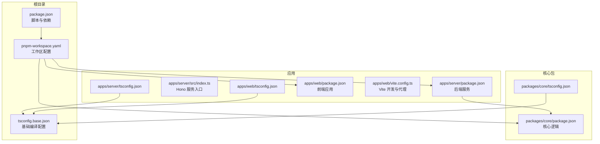
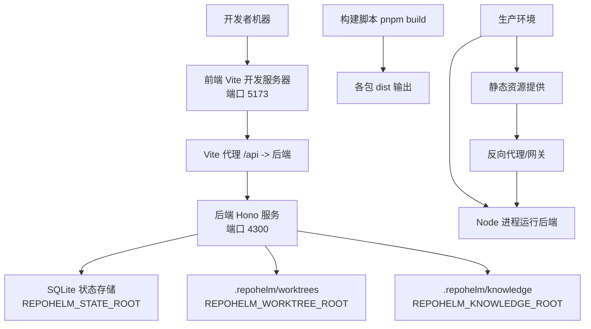
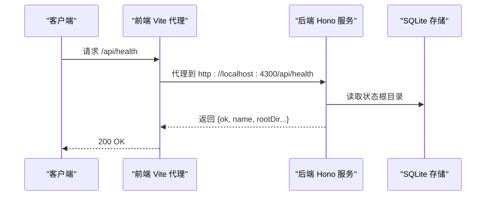
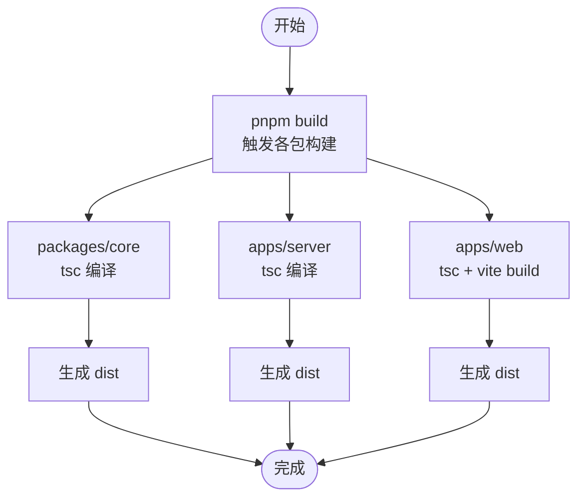
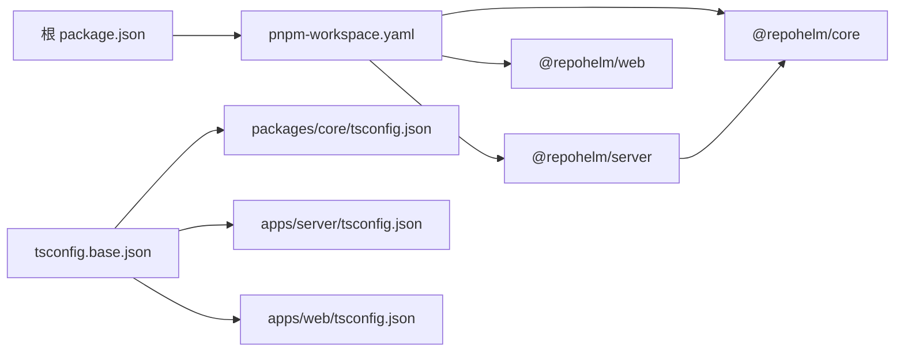

# 部署流程

<cite>
**本文引用的文件**
- [README.md](file://README.md)
- [package.json](file://package.json)
- [pnpm-workspace.yaml](file://pnpm-workspace.yaml)
- [tsconfig.base.json](file://tsconfig.base.json)
- [apps/server/package.json](file://apps/server/package.json)
- [apps/server/src/index.ts](file://apps/server/src/index.ts)
- [apps/server/tsconfig.json](file://apps/server/tsconfig.json)
- [apps/web/package.json](file://apps/web/package.json)
- [apps/web/vite.config.ts](file://apps/web/vite.config.ts)
- [apps/web/tsconfig.json](file://apps/web/tsconfig.json)
- [packages/core/package.json](file://packages/core/package.json)
- [packages/core/tsconfig.json](file://packages/core/tsconfig.json)
- [playwright.config.ts](file://playwright.config.ts)
- [TODO.md](file://TODO.md)
</cite>

## 目录
1. [简介](#简介)
2. [项目结构](#项目结构)
3. [核心组件](#核心组件)
4. [架构总览](#架构总览)
5. [详细组件分析](#详细组件分析)
6. [依赖关系分析](#依赖关系分析)
7. [性能考虑](#性能考虑)
8. [故障排查指南](#故障排查指南)
9. [结论](#结论)
10. [附录](#附录)

## 简介
本文件面向 RepoHelm 的部署与运维，提供从源码到生产的完整部署步骤、不同部署场景（传统服务器、容器化、云平台）的配置方法、部署前准备与检查清单、回滚与版本管理策略、自动化与 CI/CD 集成建议、部署监控与健康检查设置，以及常见问题与解决方案。RepoHelm 采用 pnpm workspace 管理多包，前端为 React/Vite，后端为 Hono/Node，核心逻辑位于 packages/core，前后端通过本地代理进行联调。

## 项目结构
RepoHelm 采用 monorepo 结构，使用 pnpm workspace 管理多个包：
- packages/core：核心业务逻辑与工具集
- apps/server：基于 Hono 的 Node API 服务
- apps/web：React/Vite 前端应用
- e2e：端到端测试（Playwright）
- docs：文档
- 根目录脚本与工作区配置

图表来源
- [pnpm-workspace.yaml:1-5](file://pnpm-workspace.yaml#L1-L5)
- [package.json:1-21](file://package.json#L1-L21)
- [apps/server/package.json:1-22](file://apps/server/package.json#L1-L22)
- [apps/server/src/index.ts:1-366](file://apps/server/src/index.ts#L1-L366)
- [apps/web/package.json:1-34](file://apps/web/package.json#L1-L34)
- [apps/web/vite.config.ts:1-16](file://apps/web/vite.config.ts#L1-L16)
- [packages/core/package.json:1-21](file://packages/core/package.json#L1-L21)
- [tsconfig.base.json:1-14](file://tsconfig.base.json#L1-L14)

章节来源
- [pnpm-workspace.yaml:1-5](file://pnpm-workspace.yaml#L1-L5)
- [package.json:1-21](file://package.json#L1-L21)
- [tsconfig.base.json:1-14](file://tsconfig.base.json#L1-L14)

## 核心组件
- 核心包（packages/core）：提供状态存储、Git 与工作树管理、知识库、服务编排等能力，供 server 与测试使用。
- 服务端（apps/server）：基于 Hono 的 Node 服务，提供 REST API，支持 CORS、日志、健康检查、工作区/项目/Quest 生命周期管理等。
- 前端（apps/web）：React/Vite 应用，开发时通过 Vite 代理转发 /api 到后端，默认端口 5173，后端端口默认 4300。
- 测试（e2e）：Playwright 配置，启动本地开发环境并运行端到端测试。

章节来源
- [packages/core/package.json:1-21](file://packages/core/package.json#L1-L21)
- [apps/server/package.json:1-22](file://apps/server/package.json#L1-L22)
- [apps/web/package.json:1-34](file://apps/web/package.json#L1-L34)
- [playwright.config.ts:1-33](file://playwright.config.ts#L1-L33)

## 架构总览
RepoHelm 的部署涉及三个层面：
- 开发与本地联调：前端 Vite 代理到后端，后端监听端口并通过环境变量定位根目录与状态目录。
- 构建与打包：根脚本统一触发各包构建，生成 dist 输出。
- 生产运行：后端以 Node 进程运行，前端静态资源由反向代理或容器内 Nginx 提供。

图表来源
- [apps/server/src/index.ts:13-37](file://apps/server/src/index.ts#L13-L37)
- [apps/web/vite.config.ts:5-14](file://apps/web/vite.config.ts#L5-L14)
- [package.json:7-14](file://package.json#L7-L14)

## 详细组件分析

### 后端服务（apps/server）
- 端口与根目录解析：后端通过环境变量 REPOHELM_PORT、REPOHELM_ROOT、REPOHELM_STATE_ROOT、REPOHELM_WORKTREE_ROOT、REPOHELM_KNOWLEDGE_ROOT 控制运行参数与数据目录。
- 健康检查：提供 /api/health 返回服务基本信息与目录定位。
- API 路由：涵盖工作区、项目、引擎、安全策略、审计日志、产品就绪度、Quest 生命周期等。
- 错误处理：全局错误拦截返回标准错误结构。
- 进程启动：使用 Hono Node 服务器监听端口。

图表来源
- [apps/server/src/index.ts:114-123](file://apps/server/src/index.ts#L114-L123)
- [apps/web/vite.config.ts:11-13](file://apps/web/vite.config.ts#L11-L13)

章节来源
- [apps/server/src/index.ts:13-37](file://apps/server/src/index.ts#L13-L37)
- [apps/server/src/index.ts:114-123](file://apps/server/src/index.ts#L114-L123)
- [apps/server/src/index.ts:353-361](file://apps/server/src/index.ts#L353-L361)
- [apps/server/src/index.ts:363-365](file://apps/server/src/index.ts#L363-L365)

### 前端应用（apps/web）
- 开发代理：Vite 默认端口 5173，将 /api 代理到后端端口（默认 4300），可通过 REPOHELM_PORT 覆盖。
- 构建产物：Vite 构建输出静态资源，配合反向代理或容器内 Nginx 提供。
- 类型检查：通过 tsc 与 Vite 类型检查集成。

章节来源
- [apps/web/vite.config.ts:5-14](file://apps/web/vite.config.ts#L5-L14)
- [apps/web/package.json:6-10](file://apps/web/package.json#L6-L10)

### 核心包（packages/core）
- 作用：封装 RepoHelm 服务、状态存储、Git 与工作树操作、知识库等核心能力。
- 测试：使用 Vitest 运行单元测试。
- 构建：TypeScript 编译生成 dist。

章节来源
- [packages/core/package.json:8-12](file://packages/core/package.json#L8-L12)
- [packages/core/tsconfig.json:1-13](file://packages/core/tsconfig.json#L1-L13)

### 构建与打包流程
- 根脚本统一构建：dev、build、typecheck、test、test:e2e、test:all。
- 并发启动：dev 使用 concurrently 同时启动前端与后端开发进程。
- 包内脚本：各包独立的 dev/build/typecheck/test。

图表来源
- [package.json:8-13](file://package.json#L8-L13)
- [packages/core/package.json](file://packages/core/package.json#L9)
- [apps/server/package.json](file://apps/server/package.json#L8)
- [apps/web/package.json](file://apps/web/package.json#L8)

章节来源
- [package.json:7-14](file://package.json#L7-L14)

## 依赖关系分析
- 工作区：pnpm-workspace.yaml 壇含 packages/* 与 apps/*。
- 依赖链：apps/server 依赖 @repohelm/core；apps/web 为独立前端；根 package.json 统一脚本。
- 编译配置：各包继承 tsconfig.base.json 的基础编译选项。

图表来源
- [pnpm-workspace.yaml:1-5](file://pnpm-workspace.yaml#L1-L5)
- [apps/server/package.json:11-12](file://apps/server/package.json#L11-L12)
- [tsconfig.base.json:1-14](file://tsconfig.base.json#L1-L14)

章节来源
- [pnpm-workspace.yaml:1-5](file://pnpm-workspace.yaml#L1-L5)
- [apps/server/package.json:11-12](file://apps/server/package.json#L11-L12)
- [tsconfig.base.json:1-14](file://tsconfig.base.json#L1-L14)

## 性能考虑
- 并发开发：根脚本使用并发启动前后端，缩短联调等待时间。
- 代理优化：Vite 代理仅在开发环境生效，生产环境通过反向代理或容器内 Nginx 提供静态资源与 API 转发。
- 构建缓存：pnpm store 缓存可提升重复安装速度（CI 中建议开启缓存）。
- 端口与目录：合理设置 REPOHELM_* 环境变量，避免磁盘 IO 竞争与跨盘符性能问题。

## 故障排查指南
- 健康检查失败
  - 现象：访问 /api/health 返回异常。
  - 排查：确认后端端口（REPOHELM_PORT）与代理配置一致；检查状态目录（REPOHELM_STATE_ROOT）权限；查看后端日志。
- 前端无法访问后端
  - 现象：浏览器 Network 显示 404 或跨域错误。
  - 排查：确认 Vite 代理 /api 的目标端口与后端实际端口一致；检查 CORS 配置是否允许前端地址。
- 端到端测试失败
  - 现象：Playwright 报错或超时。
  - 排查：检查 webServer 命令是否正确设置 REPOHELM_ROOT 与 REPOHELM_STATE_ROOT；确保本地代理与端口无冲突；必要时关闭已有开发进程。
- 构建失败
  - 现象：TypeScript 或 Vite 构建报错。
  - 排查：先执行类型检查（pnpm typecheck）定位问题；核对 tsconfig 继承与模块解析配置；确保 pnpm 安装完成。

章节来源
- [apps/server/src/index.ts:42-49](file://apps/server/src/index.ts#L42-L49)
- [apps/web/vite.config.ts:11-13](file://apps/web/vite.config.ts#L11-L13)
- [playwright.config.ts:19-25](file://playwright.config.ts#L19-L25)

## 结论
RepoHelm 的部署以 pnpm workspace 为核心，前后端分离但通过本地代理紧密联调。生产部署建议将前端静态资源与后端 Node 进程解耦，通过反向代理或容器编排统一对外提供服务。结合本文提供的环境变量、健康检查、监控与回滚策略，可在不同场景下稳定落地。

## 附录

### 部署前准备与检查清单
- 环境要求
  - Node.js 与 pnpm 版本满足各包依赖。
  - 已安装 Git，具备 worktree 相关权限。
- 目录规划
  - 准备状态目录（REPOHELM_STATE_ROOT）、工作树目录（REPOHELM_WORKTREE_ROOT）、知识库目录（REPOHELM_KNOWLEDGE_ROOT）。
- 端口与代理
  - 确认后端端口（REPOHELM_PORT，默认 4300）未被占用；前端代理 /api 正确指向该端口。
- 依赖安装
  - 使用 pnpm 安装依赖并执行类型检查与单元测试。

章节来源
- [README.md:35-60](file://README.md#L35-L60)
- [apps/server/src/index.ts:13-37](file://apps/server/src/index.ts#L13-L37)
- [apps/web/vite.config.ts:5-14](file://apps/web/vite.config.ts#L5-L14)
- [package.json:15-18](file://package.json#L15-L18)

### 传统服务器部署
- 安装与构建
  - 安装依赖后执行 pnpm build 生成 dist。
- 运行后端
  - 设置 REPOHELM_* 环境变量，以 Node 进程运行后端（apps/server）。
- 提供前端
  - 将 apps/web 构建产物部署至 Nginx/Apache，配置 /api 代理到后端端口。
- 健康检查
  - 对外暴露 /api/health，定期探活。

章节来源
- [package.json:8-13](file://package.json#L8-L13)
- [apps/server/src/index.ts:114-123](file://apps/server/src/index.ts#L114-L123)

### 容器化部署（Docker）
- 多阶段构建建议
  - 基础镜像安装 Node 与 pnpm；构建阶段执行 pnpm build；运行阶段仅拷贝 dist 与运行时依赖。
- 环境变量
  - 通过 Docker 环境变量设置 REPOHELM_* 与端口映射。
- 健康检查
  - 在容器中执行 curl 访问 /api/health，作为健康探针。

章节来源
- [package.json:8-13](file://package.json#L8-L13)
- [apps/server/src/index.ts:114-123](file://apps/server/src/index.ts#L114-L123)

### 云平台部署（Kubernetes/Helm）
- 部署策略
  - 使用 Deployment 运行后端 Node 进程；使用 Ingress/NLB 暴露服务；使用 ConfigMap/Secret 注入 REPOHELM_*。
- 存储
  - 将状态目录挂载为持久卷（PVC），确保重启后数据不丢失。
- 健康检查
  - liveness/readiness 探针指向 /api/health。

章节来源
- [apps/server/src/index.ts:114-123](file://apps/server/src/index.ts#L114-L123)

### 部署回滚与版本管理
- 回滚策略
  - 保留最近 N 个版本的容器镜像或二进制包；回滚时切换镜像标签或替换产物目录。
- 版本标记
  - 使用 Git 标签或制品库版本号标识发布版本。
- 数据迁移
  - 若状态存储为 SQLite，注意备份与迁移脚本；必要时在回滚前导出状态。

章节来源
- [README.md:95-96](file://README.md#L95-L96)

### 部署自动化与 CI/CD 集成
- GitHub Actions 建议
  - 依赖安装：使用 pnpm cache 与工作流缓存。
  - 质量门禁：执行 pnpm typecheck、pnpm test、pnpm test:e2e。
  - 构建与制品：执行 pnpm build，产出前端静态资源与后端 dist。
  - 最小权限：使用最小权限的 GitHub Token。
- Playwright 集成
  - 在 webServer 中设置 REPOHELM_ROOT 与 REPOHELM_STATE_ROOT，避免与本地开发状态冲突。

章节来源
- [TODO.md:15-23](file://TODO.md#L15-L23)
- [playwright.config.ts:19-25](file://playwright.config.ts#L19-L25)

### 部署监控与健康检查
- 健康检查
  - 对外暴露 /api/health，返回服务名称与目录定位信息，便于探活。
- 日志
  - 后端使用 Hono logger，生产环境建议集中收集与聚合。
- 性能指标
  - 可在反向代理或容器侧统计请求量、延迟与错误率。

章节来源
- [apps/server/src/index.ts:114-123](file://apps/server/src/index.ts#L114-L123)
- [apps/server/src/index.ts:41-49](file://apps/server/src/index.ts#L41-L49)