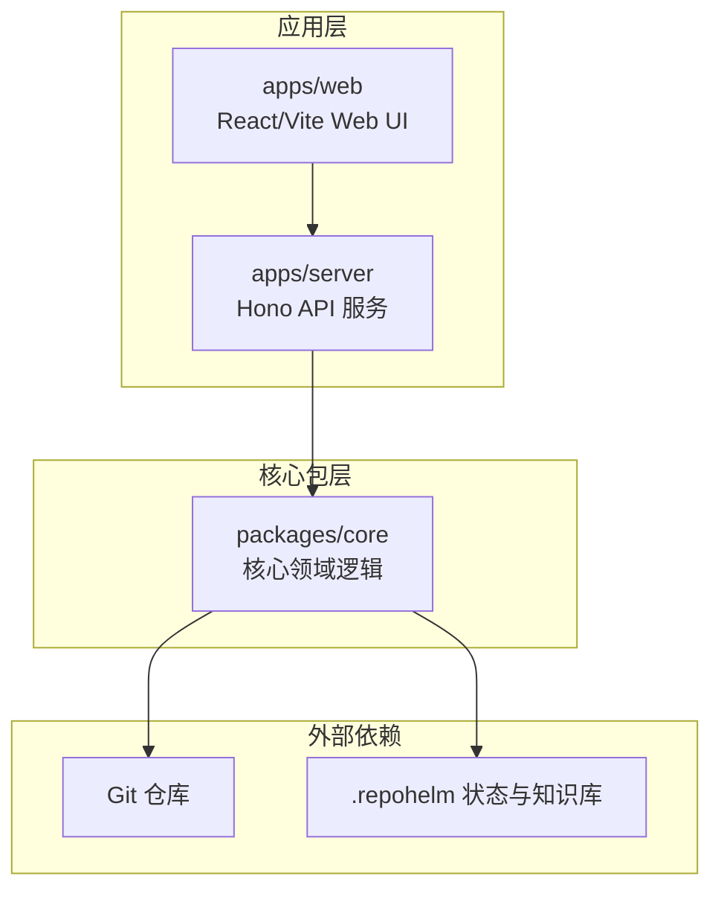
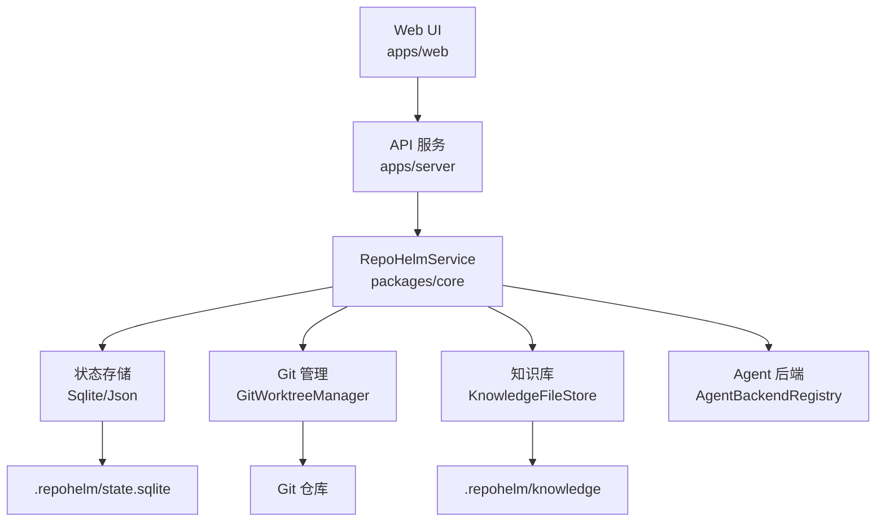
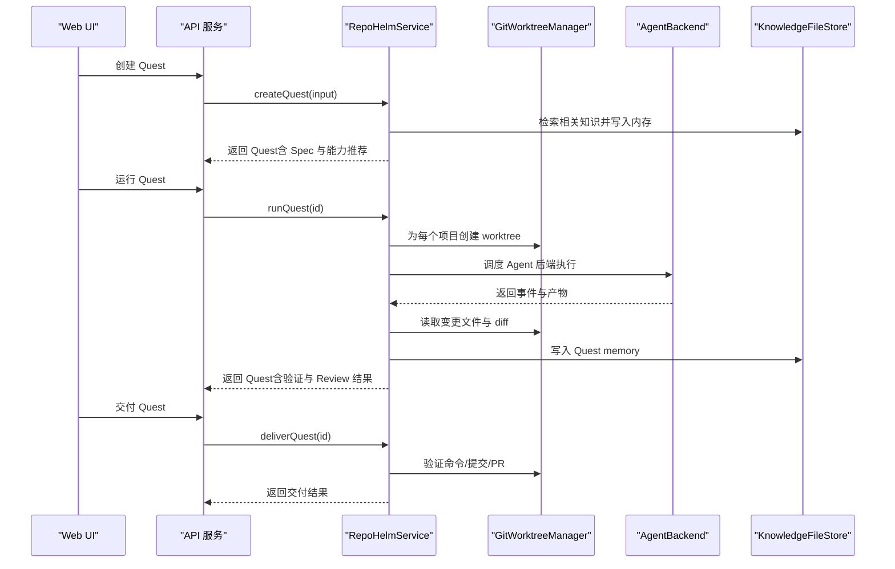
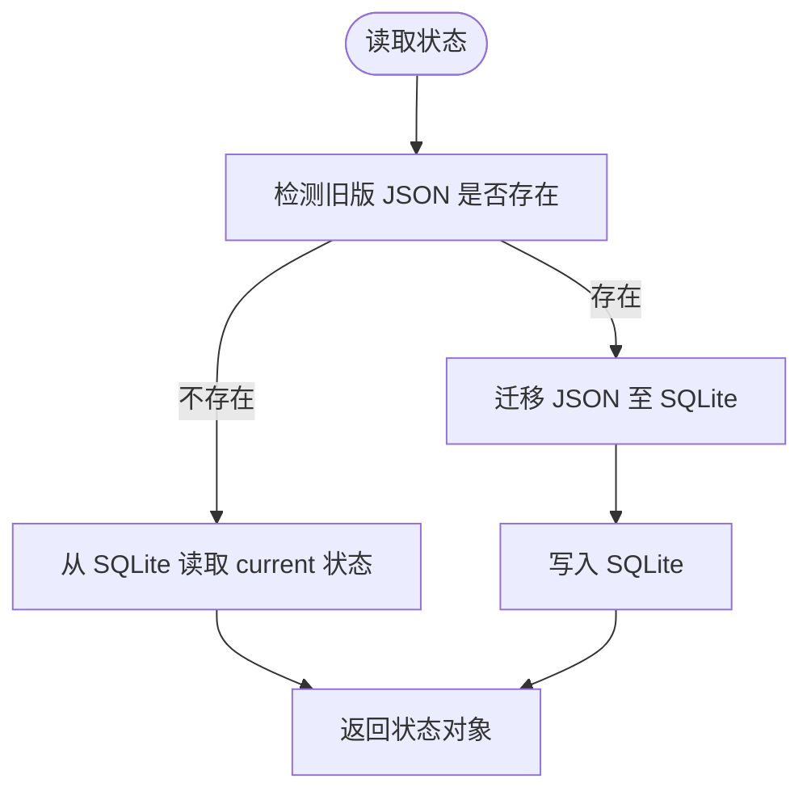
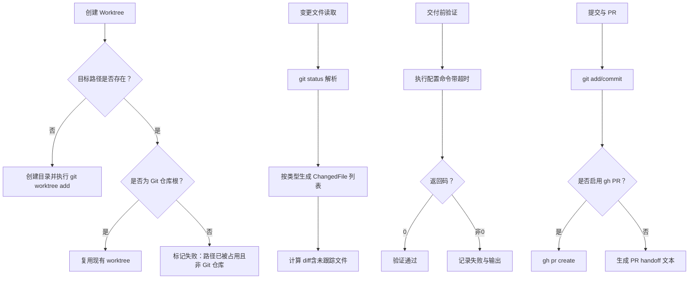
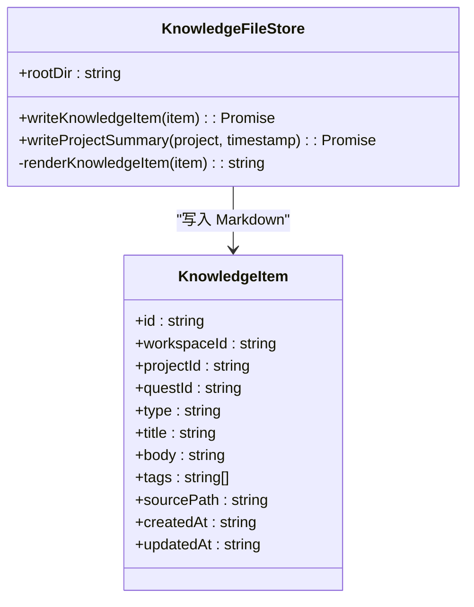
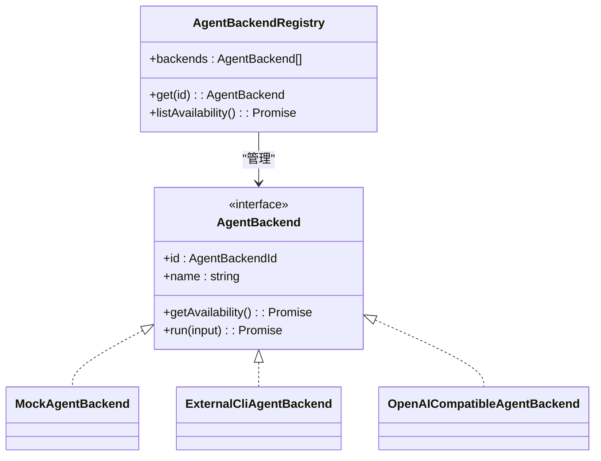
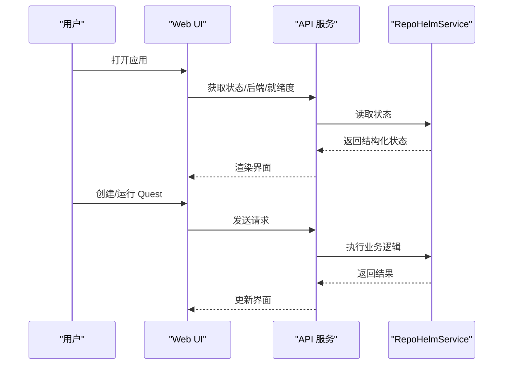
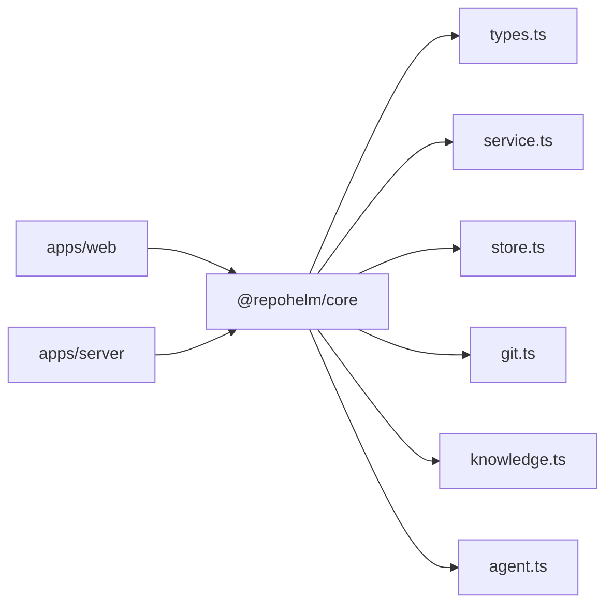

# 项目概述

<cite>
**本文档引用的文件**
- [README.md](file://README.md)
- [package.json](file://package.json)
- [pnpm-workspace.yaml](file://pnpm-workspace.yaml)
- [apps/server/src/index.ts](file://apps/server/src/index.ts)
- [packages/core/src/index.ts](file://packages/core/src/index.ts)
- [packages/core/src/service.ts](file://packages/core/src/service.ts)
- [packages/core/src/store.ts](file://packages/core/src/store.ts)
- [packages/core/src/types.ts](file://packages/core/src/types.ts)
- [packages/core/src/git.ts](file://packages/core/src/git.ts)
- [packages/core/src/knowledge.ts](file://packages/core/src/knowledge.ts)
- [packages/core/src/agent.ts](file://packages/core/src/agent.ts)
- [apps/web/src/main.tsx](file://apps/web/src/main.tsx)
- [apps/web/src/App.tsx](file://apps/web/src/App.tsx)
- [MILESTONES.md](file://MILESTONES.md)
- [TODO.md](file://TODO.md)
</cite>

## 目录
1. [引言](#引言)
2. [项目结构](#项目结构)
3. [核心组件](#核心组件)
4. [架构总览](#架构总览)
5. [详细组件分析](#详细组件分析)
6. [依赖关系分析](#依赖关系分析)
7. [性能考量](#性能考量)
8. [故障排查指南](#故障排查指南)
9. [结论](#结论)
10. [附录](#附录)

## 引言
RepoHelm 是一个开源的 Quest 工作区原型，旨在验证“虚拟 workspace + 多项目 Quest + Spec 驱动 + worktree 隔离 + Agent 编排 + 知识库”的产品方向。当前版本为 MVP 骨架，已具备本地 Web UI 与 API、demo workspace 自动创建、项目关联管理、SQLite 状态持久化、知识库系统、Quest 工作流闭环、Git worktree 隔离、安全策略控制等关键能力。

RepoHelm 的核心目标是通过可审计、可复现的工作流，将多项目协作、Agent 执行、变更隔离与知识沉淀整合在一个统一的 Quest 工作区中，为后续产品化奠定基础。

**章节来源**
- [README.md:1-100](file://README.md#L1-L100)

## 项目结构
RepoHelm 采用 pnpm monorepo 结构，分为应用层与核心包层：
- 应用层
  - apps/server：基于 Hono 的本地 API 服务，提供 Web UI 所需的 REST 接口
  - apps/web：基于 React/Vite 的本地 Web UI
- 核心包层
  - packages/core：核心领域逻辑，包含服务编排、状态存储、Git 管理、知识库、Agent 后端注册等

**图表来源**
- [pnpm-workspace.yaml:1-5](file://pnpm-workspace.yaml#L1-L5)
- [apps/server/src/index.ts:1-366](file://apps/server/src/index.ts#L1-L366)
- [apps/web/src/main.tsx:1-13](file://apps/web/src/main.tsx#L1-L13)

**章节来源**
- [pnpm-workspace.yaml:1-5](file://pnpm-workspace.yaml#L1-L5)
- [package.json:1-21](file://package.json#L1-L21)

## 核心组件
- 服务编排层（RepoHelmService）
  - 负责工作区、项目、Quest、知识库、能力推荐、安全策略等的业务编排
  - 提供状态持久化、Git worktree 管理、Agent 后端调度、交付流程等能力
- 状态存储层（SqliteStateStore/JsonStateStore）
  - 默认使用 SQLite 存储结构化状态，兼容旧版 JSON 迁移
  - 维护工作区、项目、Quest、事件、能力、安全策略、模型缓存等
- Git 管理层（GitWorktreeManager）
  - 封装 Git 操作，包括仓库健康检查、分支查询、worktree 创建/清理、变更文件读取、交付前验证、提交与 PR 生成
- 知识库层（KnowledgeFileStore）
  - 将知识项以 Markdown 文件形式写入文件系统，并维护元数据
- Agent 后端层（AgentBackendRegistry）
  - 抽象多种 Agent 后端，包括内置 Mock、外部 CLI（Codex/Claude/OpenCode）、OpenAI 兼容 Provider
- Web UI 层（React/Vite）
  - 提供三栏式 Quest 工作台，支持工作区树、Agent 对话、Inspector 详情面板

**章节来源**
- [packages/core/src/service.ts:56-133](file://packages/core/src/service.ts#L56-L133)
- [packages/core/src/store.ts:117-166](file://packages/core/src/store.ts#L117-L166)
- [packages/core/src/git.ts:33-343](file://packages/core/src/git.ts#L33-L343)
- [packages/core/src/knowledge.ts:12-68](file://packages/core/src/knowledge.ts#L12-L68)
- [packages/core/src/agent.ts:395-436](file://packages/core/src/agent.ts#L395-L436)
- [apps/web/src/App.tsx:85-659](file://apps/web/src/App.tsx#L85-L659)

## 架构总览
RepoHelm 的整体架构围绕“工作区（Workspace）—项目（Project）—Quest（任务）—Worktree（隔离工作区）—Agent（执行器）—知识库（Knowledge）—安全策略（Security Policy）”展开，形成闭环的工作流。

**图表来源**
- [apps/server/src/index.ts:37-366](file://apps/server/src/index.ts#L37-L366)
- [packages/core/src/service.ts:56-133](file://packages/core/src/service.ts#L56-L133)
- [packages/core/src/store.ts:117-166](file://packages/core/src/store.ts#L117-L166)
- [packages/core/src/git.ts:33-343](file://packages/core/src/git.ts#L33-L343)
- [packages/core/src/knowledge.ts:12-68](file://packages/core/src/knowledge.ts#L12-L68)
- [packages/core/src/agent.ts:395-436](file://packages/core/src/agent.ts#L395-L436)

## 详细组件分析

### 服务编排层（RepoHelmService）
- 职责
  - 初始化 demo workspace 与项目，写入种子知识
  - 管理工作区与项目关联、健康检查、分支查询
  - 创建与运行 Quest，生成 Spec，调度 Agent 后端，收集事件与审计日志
  - 管理 worktree 生命周期（创建/清理/重试/交付），汇总变更文件与 diff
  - 维护能力推荐与知识库记忆，支持搜索与文件化
- 关键流程
  - Quest 创建：检索相关知识 → 生成 Spec → 推荐能力 → 记录事件
  - Quest 运行：创建工作树 → 调度 Agent → 采集变更 → 生成验证与 Review 结果 → 写入知识库
  - 交付流程：按项目验证命令执行 → 提交变更 → 生成 PR handoff 或 PR

**图表来源**
- [packages/core/src/service.ts:478-698](file://packages/core/src/service.ts#L478-L698)
- [packages/core/src/git.ts:79-120](file://packages/core/src/git.ts#L79-L120)
- [packages/core/src/agent.ts:48-115](file://packages/core/src/agent.ts#L48-L115)
- [packages/core/src/knowledge.ts:15-43](file://packages/core/src/knowledge.ts#L15-L43)

**章节来源**
- [packages/core/src/service.ts:56-133](file://packages/core/src/service.ts#L56-L133)
- [packages/core/src/service.ts:478-698](file://packages/core/src/service.ts#L478-L698)

### 状态存储层（SqliteStateStore）
- 特性
  - 默认使用 SQLite 存储结构化状态，文件位于 .repohelm/state.sqlite
  - 自动迁移旧版 JSON（.repohelm/state.json）至 SQLite
  - 维护引擎配置、模型缓存、审计日志、安全策略等
- 设计要点
  - 单表 state，主键 id=“current”，payload 为序列化后的状态对象
  - 提供读写封装，确保并发安全与一致性

**图表来源**
- [packages/core/src/store.ts:125-148](file://packages/core/src/store.ts#L125-L148)
- [packages/core/src/store.ts:91-115](file://packages/core/src/store.ts#L91-L115)

**章节来源**
- [packages/core/src/store.ts:117-166](file://packages/core/src/store.ts#L117-L166)

### Git 管理层（GitWorktreeManager）
- 能力
  - 仓库健康检查：路径存在性、是否 Git 仓库、当前分支与默认分支
  - 分支列表与默认分支推断
  - Worktree 创建/复用/清理：支持起点分支解析、重复路径保护
  - 变更文件读取：支持新增/修改/删除/重命名/未跟踪
  - 交付前验证：执行配置命令，捕获输出
  - 提交与 PR：自动添加、提交、生成 PR handoff 或调用 gh 创建 PR

**图表来源**
- [packages/core/src/git.ts:79-120](file://packages/core/src/git.ts#L79-L120)
- [packages/core/src/git.ts:122-140](file://packages/core/src/git.ts#L122-L140)
- [packages/core/src/git.ts:159-187](file://packages/core/src/git.ts#L159-L187)
- [packages/core/src/git.ts:189-249](file://packages/core/src/git.ts#L189-L249)

**章节来源**
- [packages/core/src/git.ts:33-343](file://packages/core/src/git.ts#L33-L343)

### 知识库层（KnowledgeFileStore）
- 能力
  - 将知识项渲染为 Markdown 文件，写入 .repohelm/knowledge/{type}/
  - 自动生成项目摘要知识项，便于检索与回顾
  - 启动时补写缺失 sourcePath 的知识文件
- 数据模型
  - 知识项包含 workspaceId、projectId、questId、类型、标题、正文、标签、时间戳等

**图表来源**
- [packages/core/src/knowledge.ts:12-68](file://packages/core/src/knowledge.ts#L12-L68)
- [packages/core/src/types.ts:193-205](file://packages/core/src/types.ts#L193-L205)

**章节来源**
- [packages/core/src/knowledge.ts:12-68](file://packages/core/src/knowledge.ts#L12-L68)
- [packages/core/src/types.ts:193-205](file://packages/core/src/types.ts#L193-L205)

### Agent 后端层（AgentBackendRegistry）
- 能力
  - 抽象多种 Agent 后端：Mock、Codex CLI、Claude Code、OpenCode、OpenAI 兼容 Provider
  - 检测可用性与配置状态，生成标准化事件与产物
  - 通过环境变量注入外部 CLI 命令模板，在 worktree 中执行并采集输出
- 执行协议
  - 在 worktree/.repohelm 下写入 agent-input.json
  - 外部 CLI 通过 REPOHELM_AGENT_INPUT 读取输入，返回 stdout/stderr/退出码
  - RepoHelm 标准化为事件与产物，供 UI 展示与审计

**图表来源**
- [packages/core/src/agent.ts:395-436](file://packages/core/src/agent.ts#L395-L436)
- [packages/core/src/agent.ts:48-115](file://packages/core/src/agent.ts#L48-L115)
- [packages/core/src/agent.ts:117-259](file://packages/core/src/agent.ts#L117-L259)
- [packages/core/src/agent.ts:261-393](file://packages/core/src/agent.ts#L261-L393)

**章节来源**
- [packages/core/src/agent.ts:395-436](file://packages/core/src/agent.ts#L395-L436)

### Web UI 层（React/Vite）
- 能力
  - 三栏式 Quest 工作台：左侧工作区树与请求列表、中间 Agent 对话、右侧 Inspector 详情
  - 支持工作区创建/配置、项目关联/移除、Quest 创建/运行/重试/清理/交付
  - 展示 Spec、Timeline、Worktree、Review、Knowledge、Changed Files、Diff、Audit Log、Product Readiness
- 交互流程
  - 加载状态与产品就绪度 → 选择工作区与 Quest → 创建/运行 Quest → 查看事件与产物 → 交付与清理

**图表来源**
- [apps/web/src/App.tsx:136-152](file://apps/web/src/App.tsx#L136-L152)
- [apps/web/src/App.tsx:217-247](file://apps/web/src/App.tsx#L217-L247)
- [apps/web/src/App.tsx:249-264](file://apps/web/src/App.tsx#L249-L264)

**章节来源**
- [apps/web/src/App.tsx:85-659](file://apps/web/src/App.tsx#L85-L659)
- [apps/web/src/main.tsx:1-13](file://apps/web/src/main.tsx#L1-L13)

## 依赖关系分析
- 包依赖
  - apps/server 依赖 @repohelm/core 提供服务编排能力
  - apps/web 依赖 @repohelm/core 类型与 API 定义
  - packages/core 内部模块解耦，通过统一导出入口暴露能力
- 外部依赖
  - Git 命令行工具用于 worktree 管理与仓库操作
  - Node child_process 用于执行外部 CLI 与命令
  - Hono 作为轻量 Web 框架提供 REST API
  - React/Vite 提供本地 Web UI

**图表来源**
- [packages/core/src/index.ts:1-9](file://packages/core/src/index.ts#L1-L9)
- [apps/server/src/index.ts:2-37](file://apps/server/src/index.ts#L2-L37)

**章节来源**
- [packages/core/src/index.ts:1-9](file://packages/core/src/index.ts#L1-L9)
- [apps/server/src/index.ts:2-37](file://apps/server/src/index.ts#L2-L37)

## 性能考量
- 状态存储
  - SQLite 相比 JSON 更适合增量写入与复杂查询，建议在大规模数据场景下关注索引与事务优化
- Git 操作
  - worktree 创建/清理涉及磁盘 IO 与网络（远程仓库），建议在批量操作时合并请求并控制并发
- Agent 执行
  - 外部 CLI 与 Provider 调用受网络与外部服务影响，建议设置合理超时与重试策略
- UI 响应
  - 大量事件与知识项渲染时，建议采用虚拟滚动与懒加载优化

[本节为通用指导，无需特定文件来源]

## 故障排查指南
- 启动与连接
  - 确认本地端口未被占用（API 默认 4300，Web 默认 5173）
  - 检查跨域配置是否允许 http://localhost:5173
- Git 相关
  - worktree 创建失败：检查目标路径是否被占用且非 Git 仓库；确认仓库根路径正确
  - 交付前验证失败：检查项目 validationCommand 配置与执行权限
- Agent 后端
  - 外部 CLI 未检测到：检查 REPOHELM_*_COMMAND 环境变量与二进制可执行性
  - Provider 调用失败：检查 REPOHELM_OPENAI_BASE_URL、MODEL、API_KEY 配置
- 知识库与状态
  - 知识文件缺失：启动时会自动补写，若仍异常，检查 .repohelm/knowledge 权限
  - 状态迁移失败：检查 .repohelm/state.json 与 state.sqlite 权限与磁盘空间

**章节来源**
- [apps/server/src/index.ts:42-49](file://apps/server/src/index.ts#L42-L49)
- [packages/core/src/git.ts:159-187](file://packages/core/src/git.ts#L159-L187)
- [packages/core/src/agent.ts:117-259](file://packages/core/src/agent.ts#L117-L259)
- [packages/core/src/store.ts:125-148](file://packages/core/src/store.ts#L125-L148)

## 结论
RepoHelm 已在 MVP 阶段完成了“虚拟 workspace + 多项目 Quest + Spec 驱动 + worktree 隔离 + Agent 编排 + 知识库”的关键闭环验证，具备本地 Web UI 与 API、demo workspace 自动创建、项目关联管理、SQLite 状态持久化、知识库系统、Quest 工作流闭环、Git worktree 隔离、安全策略控制等能力。后续可在真实 Agent Backend、Worktree 生命周期与交付、Capability Agent、安全执行与权限模型等方面持续演进，逐步完善产品形态。

[本节为总结性内容，无需特定文件来源]

## 附录

### 快速开始
- 安装与启动
  - 安装依赖：pnpm install
  - 启动开发：pnpm dev
  - 访问 Web UI：http://localhost:5173
  - 访问 API：http://localhost:4300
- 常用命令
  - 类型检查：pnpm typecheck
  - 构建：pnpm build
  - 单元测试：pnpm test
  - 端到端测试：pnpm test:e2e
  - 全链路测试：pnpm test:all

**章节来源**
- [README.md:33-86](file://README.md#L33-L86)
- [package.json:7-14](file://package.json#L7-L14)

### 已实现能力与当前状态
- 已实现
  - 本地 Web UI 与 API、demo workspace 自动创建、项目关联管理
  - SQLite 状态持久化、知识库系统、Quest 工作流闭环
  - Git worktree 隔离、安全策略控制、产品就绪度展示
- 当前状态（MVP 骨架）
  - Agent Backend 已抽象并支持内置与外部 CLI/Provider
  - Capability Agent 仅做推荐与人工确认
  - 安全策略为本地 allowlist 与审计模型，sandbox runtime 默认 local
  - Worktree 已接入真实 git worktree，支持清理、重试、交付前验证、commit 与 PR handoff
  - 状态存储默认 .repohelm/state.sqlite，知识库默认 .repohelm/knowledge

**章节来源**
- [README.md:5-31](file://README.md#L5-L31)
- [MILESTONES.md:45-107](file://MILESTONES.md#L45-L107)
- [MILESTONES.md:200-228](file://MILESTONES.md#L200-L228)
- [MILESTONES.md:229-251](file://MILESTONES.md#L229-L251)
- [MILESTONES.md:259-281](file://MILESTONES.md#L259-L281)
- [MILESTONES.md:288-310](file://MILESTONES.md#L288-L310)
- [MILESTONES.md:317-344](file://MILESTONES.md#L317-L344)