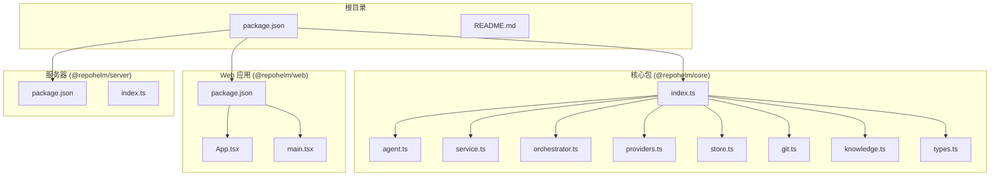
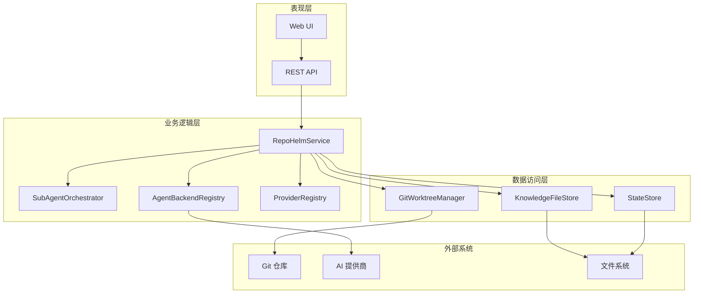
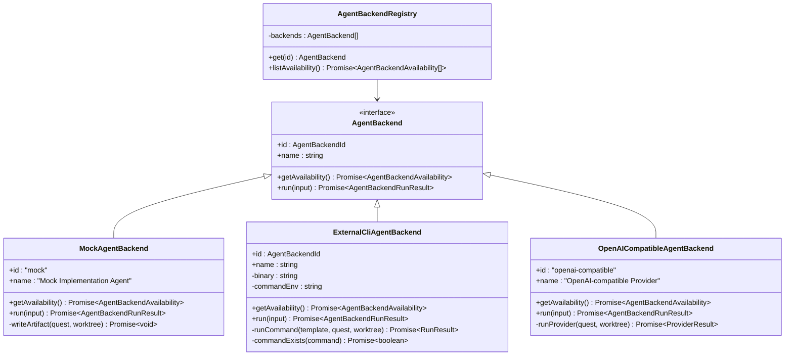
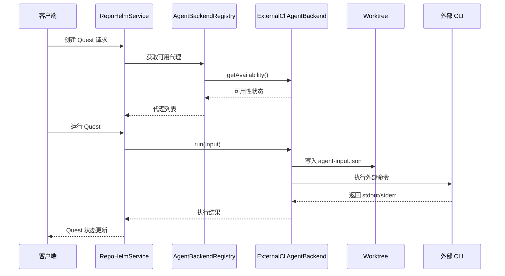
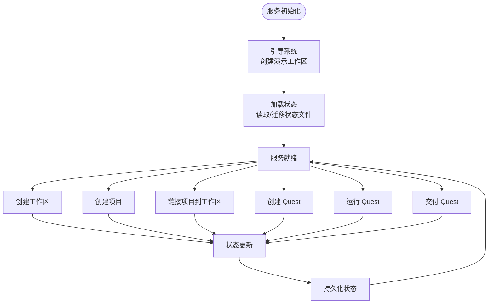
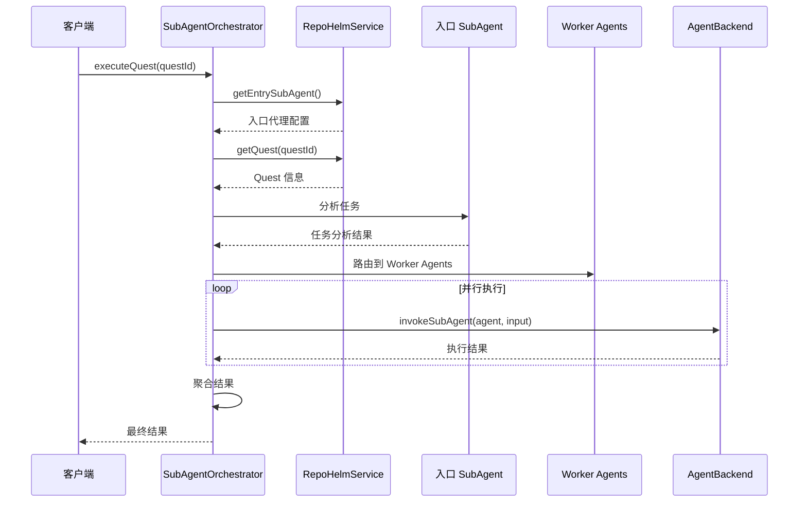
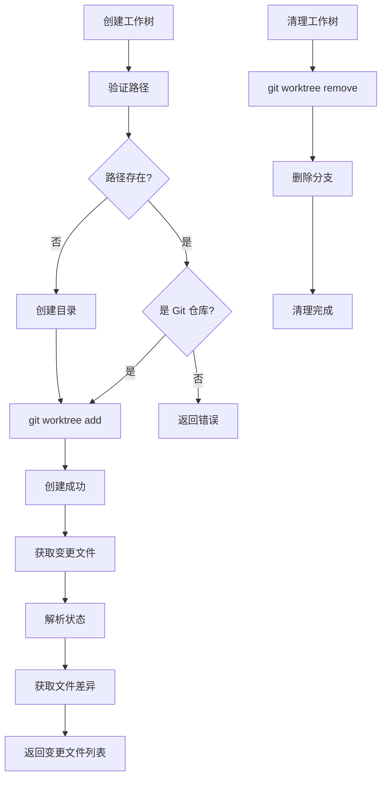
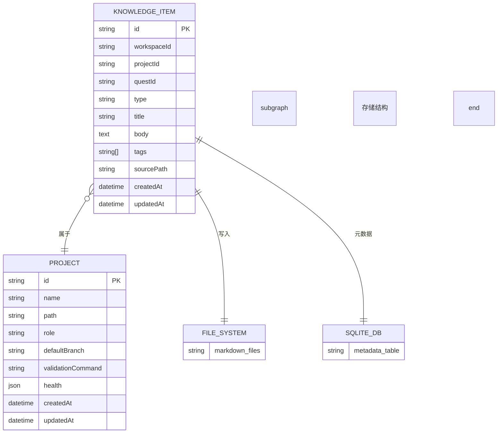
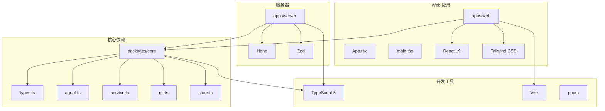

# 研究文档

<cite>
**本文档引用的文件**
- [README.md](file://README.md)
- [package.json](file://package.json)
- [packages/core/src/index.ts](file://packages/core/src/index.ts)
- [packages/core/src/agent.ts](file://packages/core/src/agent.ts)
- [packages/core/src/service.ts](file://packages/core/src/service.ts)
- [packages/core/src/orchestrator.ts](file://packages/core/src/orchestrator.ts)
- [packages/core/src/providers.ts](file://packages/core/src/providers.ts)
- [packages/core/src/store.ts](file://packages/core/src/store.ts)
- [packages/core/src/git.ts](file://packages/core/src/git.ts)
- [packages/core/src/knowledge.ts](file://packages/core/src/knowledge.ts)
- [packages/core/src/types.ts](file://packages/core/src/types.ts)
- [apps/web/package.json](file://apps/web/package.json)
- [apps/server/package.json](file://apps/server/package.json)
- [apps/web/src/App.tsx](file://apps/web/src/App.tsx)
- [apps/web/src/main.tsx](file://apps/web/src/main.tsx)
</cite>

## 目录
1. [简介](#简介)
2. [项目结构](#项目结构)
3. [核心组件](#核心组件)
4. [架构概览](#架构概览)
5. [详细组件分析](#详细组件分析)
6. [依赖分析](#依赖分析)
7. [性能考虑](#性能考虑)
8. [故障排除指南](#故障排除指南)
9. [结论](#结论)

## 简介

RepoHelm 是一个开源的 Quest 工作区原型，用于验证"虚拟 workspace + 多项目 Quest + Spec 驱动 + worktree 隔离 + Agent 编排 + 知识库"的产品方向。该项目采用现代前端技术栈，包括 React、TypeScript 和 Vite，构建了一个功能完整的开发工作区管理平台。

当前版本是 MVP 骨架，已经实现了以下核心功能：
- 启动本地 Web UI 和 API 服务
- 自动创建演示工作区
- 支持多种 Agent 后端（Mock、Codex CLI、Claude Code、OpenCode、OpenAI 兼容）
- Git worktree 管理和隔离
- 知识库管理和存储
- 安全策略和审计日志
- 产品就绪度状态展示

## 项目结构

RepoHelm 采用 Monorepo 结构，主要包含以下模块：

**图表来源**
- [package.json:1-21](file://package.json#L1-L21)
- [packages/core/src/index.ts:1-9](file://packages/core/src/index.ts#L1-L9)
- [apps/web/package.json:1-34](file://apps/web/package.json#L1-L34)
- [apps/server/package.json:1-24](file://apps/server/package.json#L1-L24)

**章节来源**
- [README.md:1-100](file://README.md#L1-L100)
- [package.json:1-21](file://package.json#L1-L21)

## 核心组件

RepoHelm 的核心组件围绕 Quest 工作流展开，主要包括以下关键模块：

### Agent 后端系统
- **MockAgentBackend**: 内置实现代理，用于验证 Quest、worktree 和 diff review 闭环
- **ExternalCliAgentBackend**: 外部 CLI 代理后端，支持 Codex、Claude Code、OpenCode
- **OpenAICompatibleAgentBackend**: OpenAI 兼容提供程序代理

### 服务层架构
- **RepoHelmService**: 主要业务逻辑服务，负责工作区、项目、Quest 管理
- **SubAgentOrchestrator**: 多代理协作编排引擎
- **GitWorktreeManager**: Git worktree 管理和操作

### 数据存储系统
- **JsonStateStore**: JSON 格式状态存储
- **SqliteStateStore**: SQLite 格式状态存储，支持自动迁移

**章节来源**
- [packages/core/src/agent.ts:1-436](file://packages/core/src/agent.ts#L1-L436)
- [packages/core/src/service.ts:1-800](file://packages/core/src/service.ts#L1-L800)
- [packages/core/src/orchestrator.ts:1-203](file://packages/core/src/orchestrator.ts#L1-L203)
- [packages/core/src/store.ts:1-170](file://packages/core/src/store.ts#L1-L170)

## 架构概览

RepoHelm 采用分层架构设计，清晰分离了表现层、业务逻辑层和数据持久化层：

**图表来源**
- [packages/core/src/service.ts:63-78](file://packages/core/src/service.ts#L63-L78)
- [packages/core/src/orchestrator.ts:27-28](file://packages/core/src/orchestrator.ts#L27-L28)
- [packages/core/src/agent.ts:395-411](file://packages/core/src/agent.ts#L395-L411)
- [packages/core/src/providers.ts:163-190](file://packages/core/src/providers.ts#L163-L190)

## 详细组件分析

### Agent 后端系统

Agent 后端系统提供了灵活的代理执行机制，支持多种执行模式：

**图表来源**
- [packages/core/src/agent.ts:41-46](file://packages/core/src/agent.ts#L41-L46)
- [packages/core/src/agent.ts:48-115](file://packages/core/src/agent.ts#L48-L115)
- [packages/core/src/agent.ts:117-259](file://packages/core/src/agent.ts#L117-L259)
- [packages/core/src/agent.ts:261-393](file://packages/core/src/agent.ts#L261-L393)
- [packages/core/src/agent.ts:395-411](file://packages/core/src/agent.ts#L395-L411)

#### 外部 CLI 代理执行流程

**图表来源**
- [packages/core/src/agent.ts:144-221](file://packages/core/src/agent.ts#L144-L221)
- [packages/core/src/agent.ts:223-249](file://packages/core/src/agent.ts#L223-L249)

**章节来源**
- [packages/core/src/agent.ts:1-436](file://packages/core/src/agent.ts#L1-L436)

### 服务层架构

RepoHelmService 是整个系统的核心业务逻辑层，负责协调各个组件的工作：

**图表来源**
- [packages/core/src/service.ts:80-140](file://packages/core/src/service.ts#L80-L140)
- [packages/core/src/service.ts:150-208](file://packages/core/src/service.ts#L150-L208)

#### 多代理编排引擎

SubAgentOrchestrator 实现了复杂的多代理协作机制：

**图表来源**
- [packages/core/src/orchestrator.ts:33-59](file://packages/core/src/orchestrator.ts#L33-L59)
- [packages/core/src/orchestrator.ts:64-105](file://packages/core/src/orchestrator.ts#L64-L105)

**章节来源**
- [packages/core/src/service.ts:63-800](file://packages/core/src/service.ts#L63-L800)
- [packages/core/src/orchestrator.ts:1-203](file://packages/core/src/orchestrator.ts#L1-L203)

### Git 工作树管理系统

GitWorktreeManager 提供了完整的 Git 工作树生命周期管理：

**图表来源**
- [packages/core/src/git.ts:79-120](file://packages/core/src/git.ts#L79-L120)
- [packages/core/src/git.ts:122-140](file://packages/core/src/git.ts#L122-L140)
- [packages/core/src/git.ts:142-157](file://packages/core/src/git.ts#L142-L157)

**章节来源**
- [packages/core/src/git.ts:1-343](file://packages/core/src/git.ts#L1-L343)

### 知识库管理系统

知识库系统采用文件系统存储 + SQLite 元数据的混合方案：

**图表来源**
- [packages/core/src/knowledge.ts:12-43](file://packages/core/src/knowledge.ts#L12-L43)
- [packages/core/src/types.ts:193-205](file://packages/core/src/types.ts#L193-L205)

**章节来源**
- [packages/core/src/knowledge.ts:1-68](file://packages/core/src/knowledge.ts#L1-L68)
- [packages/core/src/types.ts:193-205](file://packages/core/src/types.ts#L193-L205)

## 依赖分析

RepoHelm 的依赖关系体现了清晰的模块化设计：

**图表来源**
- [apps/web/package.json:11-26](file://apps/web/package.json#L11-L26)
- [apps/server/package.json:12-17](file://apps/server/package.json#L12-L17)
- [package.json:15-18](file://package.json#L15-L18)

**章节来源**
- [apps/web/package.json:1-34](file://apps/web/package.json#L1-L34)
- [apps/server/package.json:1-24](file://apps/server/package.json#L1-L24)
- [package.json:1-21](file://package.json#L1-L21)

## 性能考虑

RepoHelm 在设计时充分考虑了性能优化：

### 状态存储优化
- **SQLite 迁移**: 自动从旧的 JSON 格式迁移到 SQLite，提升查询性能
- **缓存机制**: 提供模型缓存和状态缓存机制
- **增量更新**: 仅更新变更的状态部分

### 并行处理
- **并发代理执行**: 多个代理后端可以并行执行
- **异步操作**: 大量 I/O 操作采用异步方式处理
- **Promise 并发**: 使用 Promise.all 进行批量操作

### 资源管理
- **工作树隔离**: 每个 Quest 使用独立的工作树，避免资源冲突
- **内存管理**: 及时清理临时文件和缓存
- **超时控制**: 为外部操作设置合理的超时时间

## 故障排除指南

### 常见问题及解决方案

#### Agent 后端不可用
**症状**: 代理后端显示不可用状态
**原因**: 
- 外部 CLI 未安装或未配置
- 环境变量未正确设置
- API 密钥无效

**解决方法**:
1. 检查外部 CLI 是否已安装
2. 验证环境变量配置
3. 确认 API 密钥有效性

#### Git 操作失败
**症状**: 工作树创建或清理失败
**原因**:
- 路径权限问题
- Git 仓库状态异常
- 磁盘空间不足

**解决方法**:
1. 检查目标路径权限
2. 验证 Git 仓库完整性
3. 清理磁盘空间

#### 状态存储问题
**症状**: 状态丢失或损坏
**原因**:
- 文件权限问题
- SQLite 数据库损坏
- 迁移失败

**解决方法**:
1. 检查文件权限
2. 备份并重建 SQLite 数据库
3. 手动执行状态迁移

**章节来源**
- [packages/core/src/agent.ts:125-142](file://packages/core/src/agent.ts#L125-L142)
- [packages/core/src/git.ts:34-61](file://packages/core/src/git.ts#L34-L61)
- [packages/core/src/store.ts:95-119](file://packages/core/src/store.ts#L95-L119)

## 结论

RepoHelm 作为一个先进的 Quest 工作区原型，展现了现代软件开发工具的完整生态。其设计特点包括：

### 技术优势
- **模块化架构**: 清晰的分层设计和模块化组织
- **多后端支持**: 灵活的代理后端系统，支持多种执行模式
- **Git 集成**: 深度集成 Git 工作流，提供完整的版本控制支持
- **状态管理**: 采用 SQLite 进行高效的状态持久化

### 架构特色
- **可扩展性**: 支持插件化的代理后端和提供程序
- **安全性**: 内置安全策略和审计日志机制
- **用户体验**: 提供直观的 Web 界面和丰富的交互功能

### 发展方向
RepoHelm 为未来的开发工作区生态系统奠定了坚实基础，其设计理念和实现方式为类似工具的开发提供了宝贵的参考价值。随着功能的不断完善，RepoHelm 有望成为开发工作流管理的标准解决方案。