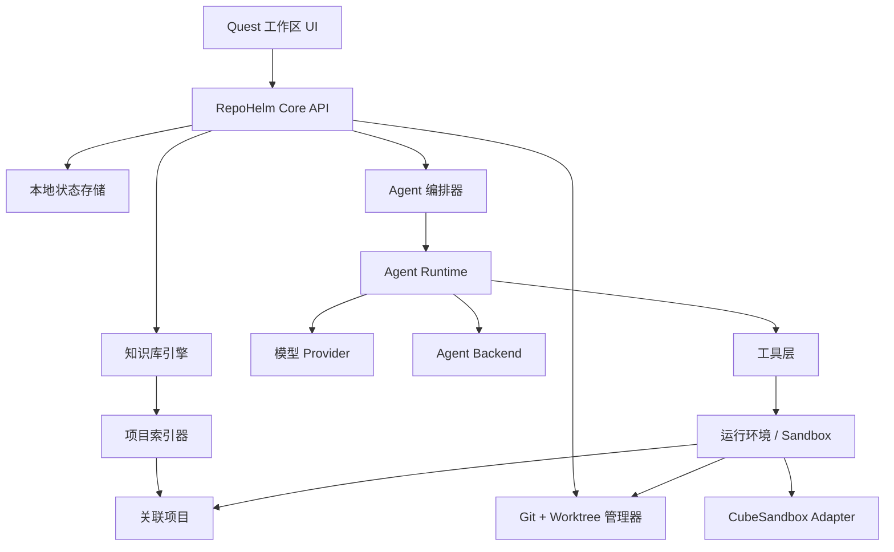

# RepoHelm 架构文档

状态：草案  
最后更新：2026-06-04

## 1. 产品方向

RepoHelm 是一个开源的 Quest 工作区，用于承载软件研发任务。

它不是 AI 编辑器、IDE 插件，也不是代码补全工具。它的核心目标是帮助开发者把一个需求，转化为一次可审计、可隔离、可验证、可交付的多项目研发任务。

产品围绕四个核心概念展开：

- Workspace：一个虚拟研发空间，可以关联多个本地项目。
- Quest：一个任务级执行单元，包含需求、Spec、计划、worktree、执行、审查和交付。
- Knowledge：一个持久化知识库，用来沉淀项目理解、架构背景、决策和历史经验。
- Agent Orchestration：由主干 Agent 负责任务编排，多个专业 sub-agent 分工执行。

RepoHelm 的长期产品定位是：

> 一个面向多项目软件研发的 Agentic Quest 工作台，强调 Spec 驱动、worktree 隔离、过程可审计和知识沉淀。

## 2. 非目标

除非后续通过新的架构决策明确调整方向，否则以下内容不是 RepoHelm 的目标：

- 不做通用代码编辑器。
- MVP 阶段不做 VS Code、JetBrains 或其他 IDE 插件。
- 不竞争 inline completion。
- 不假设一个目录就是一个 workspace。
- 不允许 Agent 在没有审查和权限边界的情况下安装或执行来自网络的能力。
- 不把 Agent 行为隐藏在黑盒聊天窗口后面。

## 3. 设计原则

### 3.1 Quest 优先

所有主要工作流都应该从 Quest 开始，或者挂载到某个 Quest 上。聊天可以作为交互方式存在，但持久化对象应该是 Quest，而不是聊天记录。

一个 Quest 应该拥有：

- 用户需求
- Spec 和验收标准
- 相关 workspace 项目
- worktree 状态
- 执行计划
- Agent 执行记录
- 文件变更
- 测试和验证结果
- Review 记录
- Commit、Pull Request 等交付产物

### 3.2 虚拟 Workspace

Workspace 是一个由项目维护的虚拟研发空间，类似 VS Code workspace 的思想。它可以关联多个项目，这些项目共同组成一个产品、服务、系统或工程域。

示例：

```yaml
workspace:
  id: billing-platform
  name: Billing Platform
  projects:
    - id: web
      name: Billing Web
      path: ~/code/billing-web
      role: frontend
    - id: api
      name: Billing API
      path: ~/code/billing-api
      role: backend
    - id: docs
      name: Billing Docs
      path: ~/code/billing-docs
      role: documentation
```

Workspace 不是目录，而是配置边界、任务边界和知识边界。

### 3.3 先 Spec，后实现

对于有实际影响的研发任务，RepoHelm 应该优先采用 Spec 驱动流程：

1. 澄清需求。
2. 生成或更新 Spec。
3. 识别受影响项目。
4. 生成实施计划。
5. 在隔离的 worktree 中执行。
6. 按验收标准验证结果。
7. Review diff 和风险后再交付。

小型 Quest 可以使用轻量 Spec，但系统仍然应该记录意图、范围和验收标准。

### 3.4 Worktree 隔离

实现工作应该发生在 Git worktree 中，而不是直接修改用户当前正在使用的项目目录。

对于一个多项目 workspace，一个 Quest 可以为每个受影响项目创建对应 worktree：

```text
workspace project: ~/code/billing-api
quest branch:      repohelm/add-refund-flow
quest worktree:    .repohelm/worktrees/add-refund-flow/billing-api

workspace project: ~/code/billing-web
quest branch:      repohelm/add-refund-flow
quest worktree:    .repohelm/worktrees/add-refund-flow/billing-web
```

这样可以隔离并行 Quest，让审查更清晰，也方便用户丢弃、合并或继续迭代某个任务。

### 3.5 主干 Agent 负责编排

主干 Agent 应该像技术负责人，而不是普通执行者。它默认不直接做低层实现，而是负责理解目标、拆解任务、分配工作和汇总结果。

主干 Agent 负责：

- 理解 Quest 目标。
- 判断哪些项目相关。
- 创建和维护任务计划。
- 给 sub-agent 分配任务。
- 跟踪进度和阻塞。
- 审查 sub-agent 输出。
- 判断是否需要继续探索、实现或验证。
- 生成最终 Quest 报告。

专业 sub-agent 负责具体工作：

- Spec Agent：澄清需求，编写 Spec。
- Workspace Analyst：分析需求影响哪些 workspace 项目。
- Knowledge Agent：读取和更新知识库。
- Implementation Agent：修改代码，执行本地命令。
- Test Agent：补充或运行测试，记录验证结果。
- Review Agent：审查 diff、风险和验收标准。
- Capability Agent：根据当前任务推荐或创建 skills、agents、MCP 集成。

### 3.6 能力发现必须有信任边界

Capability Agent 是 RepoHelm 的一等能力，但必须被约束。

它可以：

- 搜索相关 skills、agents、MCP servers、库、示例和文档。
- 推荐应该新增的能力。
- 生成本地 skill 或 agent 定义。
- 草拟 MCP 配置。
- 说明来源、许可证、权限和风险。

它不能：

- 自动执行下载代码。
- 自动安装拥有宽泛文件系统或网络权限的 MCP server。
- 静默修改用户全局配置。
- 把网络片段当作可信项目代码直接使用。

所有导入能力都必须有来源记录、权限审查和本地批准步骤。

## 4. 核心领域模型

### 4.1 Workspace

Workspace 是顶层虚拟研发空间。

主要字段：

- id
- name
- description
- projects
- knowledge settings
- model and agent defaults
- trust and permission policy

### 4.2 Project

Project 是 workspace 中关联的本地仓库或目录。

主要字段：

- id
- name
- path
- type
- default branch
- package manager or build system
- allowed commands
- indexing settings

### 4.3 Quest

Quest 是持久化任务对象。

主要字段：

- id
- title
- status
- requirement
- spec
- acceptance criteria
- affected projects
- worktrees
- plan
- agent runs
- changed files
- validation results
- review results
- delivery state

建议状态流转：

```text
draft -> specifying -> planning -> preparing -> executing -> validating -> reviewing -> ready -> delivered
                                             \-> blocked
                                             \-> cancelled
```

### 4.4 Spec

Spec 是用户和系统之间的任务契约。

主要字段：

- background
- user goal
- functional requirements
- non-functional requirements
- affected surfaces
- out-of-scope items
- acceptance criteria
- open questions

### 4.5 Agent Run

Agent Run 是一次 Agent 执行的结构化记录。

主要字段：

- agent id
- role
- input
- model or backend
- tools used
- commands run
- files read
- files changed
- result
- risks
- next actions

### 4.6 Knowledge Item

Knowledge Item 是挂载到 workspace、project 或 Quest 上的持久化知识。

类型包括：

- Repo Wiki 页面
- 架构说明
- 业务领域概念
- 决策记录
- Memory
- 排障记录
- API 契约
- 测试说明

## 5. 系统架构



### 5.1 Quest 工作区 UI

UI 是任务导向的，不是编辑器导向的。

MVP 页面：

- Workspace 总览
- Project 列表
- Quest 列表
- Quest 详情
- Spec 视图
- 计划和执行时间线
- Worktree 状态
- Diff Review
- 验证结果
- 知识库浏览

### 5.2 Core API

Core API 负责领域操作：

- 创建和更新 workspace。
- 关联项目。
- 创建 Quest。
- 生成或编辑 Spec。
- 创建 worktree。
- 启动、暂停、恢复或取消 Agent run。
- 记录执行事件。
- 读取变更文件和 diff。
- Commit 或准备交付产物。
- 读取和更新知识库。

Core API 应该同时服务于本地 UI 和 CLI。

### 5.3 本地状态存储

MVP 应该优先采用 local-first 架构。

推荐形态：

- SQLite 存储结构化状态。
- 文件系统存储 Spec、日志、生成产物和知识库页面。
- 可选向量索引用于语义检索。

MVP 不应该依赖托管后端。

### 5.4 知识库引擎

知识库引擎维护每个 workspace 和 project 的持久化上下文。

MVP 能力：

- 项目摘要
- Repo Wiki 页面
- 架构说明
- Quest Memory
- 知识项搜索
- 将知识项关联到 project 和 Quest

未来能力：

- 符号图谱
- 依赖图谱
- 语义代码搜索
- 自动生成 onboarding 文档
- 业务领域模型抽取
- 知识新鲜度检查

### 5.5 项目索引器

项目索引器负责从关联项目中收集上下文。

MVP 能力：

- 文件树扫描
- 支持 `.gitignore` 和 `.repohelmignore`
- 文本搜索
- 基础语言和框架识别
- README 和文档提取

未来能力：

- Tree-sitter 解析
- LSP 集成
- Embedding 索引
- 调用图和依赖图
- 增量索引

### 5.6 Agent 编排器

编排器应该尽可能确定性地工作。它负责状态流转、任务分配、权限控制和结果汇总。

它不应该只是一个长 prompt。LLM 可以负责判断和生成，但系统本身应该负责：

- Quest 状态
- Agent 队列
- 工具权限
- Worktree 生命周期
- 重试策略
- 验证关卡
- Review 关卡
- 事件日志

### 5.7 Agent Runtime

Agent Runtime 负责执行主干 Agent 和 sub-agent 的每一轮调用。

它应该支持：

- 结构化输入和输出
- 工具调用
- MCP 访问
- 权限确认
- 超时和取消
- 事件流
- token 和成本追踪
- 模型或 backend 选择

### 5.8 模型 Provider 与 Agent Backend

RepoHelm 应该区分模型 Provider 和 Agent Backend。

模型 Provider：

- OpenAI-compatible APIs
- Qwen
- DeepSeek
- Anthropic
- OpenRouter
- Ollama 或本地 OpenAI-compatible runtime

Agent Backend：

- RepoHelm native agent runtime
- Codex CLI
- Claude Code
- OpenCode

这个分层可以避免把原始模型调用和完整 coding-agent runtime 混为一谈。

### 5.9 工具层

工具必须显式、可审计、受权限约束。

MVP 工具：

- 读取文件
- 搜索文件
- 编辑文件
- 执行命令
- Git status/diff
- 创建和移除 worktree
- 执行测试命令
- 读取和写入知识库

未来工具：

- 浏览器自动化
- GitHub Pull Request 和 Issue
- 包管理器或包注册表查询
- 文档搜索
- 云部署检查
- 数据库 schema 查看
- 自定义 MCP 工具

### 5.10 运行环境 / Sandbox

运行环境是 Agent 工具调用真正落地执行的边界。

MVP 可以先使用本地进程和 Quest worktree 执行命令，但完整形态应该支持可插拔 sandbox runtime。RepoHelm 应该把“要执行什么”和“在哪里执行”解耦：

- 本地 worktree runtime：适合用户明确信任的本地开发任务。
- CubeSandbox runtime：适合运行不可信命令、第三方 MCP、下载来的 skills/agents，以及需要强隔离和高并发 agent 执行的场景。
- 未来其他 runtime：例如 Docker、Firecracker、E2B-compatible sandbox、远程 team runner。

CubeSandbox 可以作为优先适配对象。它是腾讯云开源的 AI Agent 沙箱运行环境，定位是轻量、安全、高并发的 sandbox service，并兼容 E2B 接口。RepoHelm 可以通过 adapter 把 `shell.run`、代码执行、测试命令和部分 MCP 工具调用路由到 CubeSandbox 中执行。

运行环境层必须记录：

- 使用了哪个 runtime。
- 执行时挂载了哪些项目或 worktree。
- 是否允许网络访问。
- 是否注入了环境变量或 secrets。
- 命令输出和文件变更如何回传。
- sandbox 生命周期和清理结果。

## 6. MVP 范围

MVP 要证明核心闭环：

> 创建 workspace -> 关联项目 -> 创建 Quest -> 生成 Spec -> 创建 worktree -> 运行 Agent -> Review diff -> 记录知识。

### 6.1 MVP 产品能力

- 创建虚拟 workspace。
- 关联多个本地项目。
- 创建和管理 Quest。
- 编写或生成轻量 Spec。
- 手动或通过分析选择受影响项目。
- 为 Quest 创建每项目 worktree。
- 运行主干 Agent 驱动的计划。
- 至少运行一个 Implementation Agent。
- 展示执行时间线。
- 展示变更文件和 diff。
- 运行配置好的验证命令。
- 存储 Quest 结果和知识记录。

### 6.2 MVP Agent 能力

- Lead Agent
- Spec Agent
- Workspace Analyst
- Implementation Agent
- Review Agent

Capability Agent 可以在 MVP 中作为“只推荐、不自动安装”的 Agent 存在。它暂时不应该自动安装 skills、agents 或 MCP servers。

### 6.3 MVP 知识库能力

- Workspace 知识库目录。
- Project summary 页面。
- Quest memory note。
- 手动知识搜索。
- Agent 可以引用和更新知识库。

### 6.4 MVP 模型支持

MVP 至少应该支持：

- 一个 OpenAI-compatible provider。
- 一个 Anthropic-compatible provider 或 Claude Code backend。
- 一个本地或自定义 base URL provider。

Qwen 和 DeepSeek 可以先通过 OpenAI-compatible 配置支持。如果没有必要，MVP 不需要先做 native SDK。

### 6.5 MVP 交付能力

- 生成 branch name。
- 创建 worktree。
- 展示 `git diff`。
- 按 project commit。
- Pull Request 创建可以放到后续版本，除非通过现有 GitHub 工具能很低成本支持。

## 7. 完整产品形态

完整形态应该增强能力，但不改变核心方向。

### 7.1 高级 Workspace

- Workspace 模板
- 多项目依赖地图
- 项目 owner 和角色
- 每项目命令策略
- 每 workspace 模型和 Agent profile
- 团队共享 workspace 配置

### 7.2 高级 Quest 系统

- Quest 模板
- Quest 依赖图
- 并行 sub-agent 执行
- 暂停和恢复
- 人工批准检查点
- Review gate
- Delivery gate
- Quest 归档和历史搜索

### 7.3 高级知识库

- Repo Wiki 生成
- 架构图谱
- 领域图谱
- 决策记录
- 自动知识新鲜度检测
- 知识导入导出
- 从已完成 Quest 中提炼知识

### 7.4 高级 Agent 平台

- Custom Agent
- Skill marketplace
- MCP registry
- 带受控安装流程的 Capability Agent
- 沙箱化工具执行
- CubeSandbox runtime adapter
- Agent evaluation suites
- Agent replay 和调试

### 7.5 高级模型和 Backend 层

- Provider profile
- 每 Agent 独立模型选择
- 模型 fallback
- 成本和延迟路由
- BYOK
- 本地模型支持
- Codex、Claude Code、OpenCode backend adapter

### 7.6 高级交付

- GitHub 和 GitLab PR 创建
- CI 检查
- 失败 CI 修复 Quest
- Release notes
- Changelog 生成
- 跨 repo 交付计划

## 8. 技术实现架构

本节描述 RepoHelm 的推荐技术架构。目标不是追求一开始就“大而全”，而是选择一套足够清晰、可测试、可演进的实现方式，先把 Quest 闭环跑通。

### 8.1 总体技术路线

MVP 推荐采用：

- TypeScript 全栈。
- Local-first 本地应用架构。
- 本地 Web UI + 本地 Core API。
- CLI 作为辅助入口。
- SQLite + 文件系统作为主要存储。
- Git worktree 作为任务隔离机制。
- Provider adapter 接入主流模型。
- Agent backend adapter 接入 Codex CLI、Claude Code、OpenCode 等外部 coding agent。

推荐第一阶段不要直接做 Electron 或 Tauri 桌面壳。先用本地 Web 应用和 CLI 验证核心流程，等 Quest 工作流稳定后，再决定是否封装桌面版本。

### 8.2 进程模型

MVP 可以采用三层本地进程模型：

```text
Browser UI
  -> Local API Server
    -> Core Runtime
      -> Agent Runtime
      -> Git / Worktree
      -> Local Projects
      -> SQLite / Knowledge Files
```

建议形态：

- `repohelm dev` 启动本地 API server 和 Web UI。
- 浏览器访问本地 UI。
- API server 负责 Quest、Agent、worktree、知识库等本地操作。
- Agent Runtime 作为 API server 内部模块运行。
- 外部 agent backend 通过子进程调用。

未来可以演进为：

```text
Desktop Shell
  -> Web UI
  -> Local Daemon
    -> Worker Processes
      -> Sandboxed Tools
```

MVP 不需要过早引入分布式任务系统、远程队列或云端后端。

### 8.3 推荐技术栈

#### Web UI

推荐：

- React
- TypeScript
- Vite
- TanStack Router
- TanStack Query
- Zustand 或 Jotai
- Tailwind CSS
- Radix UI 或 shadcn/ui
- Monaco Editor 仅用于展示和编辑 Spec、diff、配置，不作为完整代码编辑器

UI 重点不是代码编辑，而是 Quest 工作台：

- 任务列表
- Spec 面板
- Plan 面板
- Agent 执行时间线
- Worktree 状态
- Diff Review
- Validation 结果
- Knowledge 浏览

#### Local API Server

推荐：

- Node.js
- TypeScript
- Hono 或 Fastify
- Zod
- Server-Sent Events 或 WebSocket

API server 需要支持：

- 普通 REST/RPC 请求
- 长任务启动和取消
- Agent 事件流
- 工具调用事件流
- Diff 和日志的增量更新

MVP 可以优先使用 Server-Sent Events，因为 Quest 执行日志主要是服务端到客户端的流式事件。

#### CLI

推荐：

- TypeScript
- Commander.js 或 oclif
- execa

CLI 职责：

- 初始化 workspace。
- 关联项目。
- 启动本地 server。
- 创建 Quest。
- 执行无 UI 的 Quest。
- 查看 worktree 和 diff。
- 导出日志或知识库。

CLI 不应该成为另一套独立业务逻辑，应该调用同一个 Core API 或 Core package。

#### Core Packages

核心包全部使用 TypeScript，保持纯领域逻辑和基础设施适配分离。

建议分层：

```text
core domain
  -> application services
    -> infrastructure adapters
```

核心原则：

- `core` 不直接依赖具体 UI。
- `core` 不直接绑定某个模型厂商。
- `core` 不直接绑定某个外部 coding agent。
- `core` 通过接口调用 storage、git、tools、provider、backend。

### 8.4 数据存储架构

MVP 推荐使用 SQLite + 文件系统。

SQLite 存：

- workspace
- project
- quest
- spec metadata
- agent run
- event log
- worktree state
- validation result
- review result
- provider profile
- permission policy

文件系统存：

- Spec Markdown
- Knowledge Markdown
- Agent 日志
- 工具调用原始输出
- 生成报告
- 导入的 skills、agents、MCP definitions

推荐目录：

```text
.repohelm/
  repohelm.db
  workspaces/
    <workspace-id>/
      workspace.yaml
      knowledge/
      quests/
        <quest-id>/
          spec.md
          plan.md
          report.md
          events/
          artifacts/
  worktrees/
```

SQLite 技术选择：

- `better-sqlite3` 或同类本地 SQLite driver。
- Drizzle ORM 或轻量 SQL migration。
- SQLite FTS5 用于知识库和日志全文检索。
- 后续可加入 `sqlite-vec`、LanceDB 或其他本地向量索引。

### 8.5 事件日志架构

Quest 执行过程应该采用事件日志，而不是只保存最终状态。

事件示例：

```text
quest.created
spec.generated
plan.created
worktree.created
agent.started
agent.tool_called
agent.file_changed
validation.started
validation.failed
review.completed
quest.ready
```

事件日志用途：

- 驱动 UI 时间线。
- 支持 Agent replay。
- 追踪工具调用。
- 生成最终报告。
- 调试失败 Quest。
- 为未来评测系统提供数据。

MVP 可以采用 SQLite 事件表；未来如果需要更强能力，再引入专门的事件流或任务队列。

### 8.6 Agent 编排实现

Agent 编排器应该是确定性状态机 + LLM 决策的组合。

推荐结构：

```text
Quest Orchestrator
  -> State Machine
  -> Task Planner
  -> Agent Scheduler
  -> Permission Gate
  -> Result Aggregator
```

状态机负责：

- Quest 状态流转。
- 是否允许进入下一阶段。
- 哪些 Agent 可以运行。
- 哪些工具可以使用。
- 出错时如何重试、阻塞或回滚。

LLM 负责：

- 需求理解。
- Spec 生成。
- 影响面分析。
- 计划生成。
- 代码修改建议。
- Review 总结。

系统不应该把整个 Quest 流程藏进一个超长 prompt。流程控制属于 RepoHelm，判断和生成才交给模型。

### 8.7 Agent Runtime 技术设计

Agent Runtime 需要支持两类执行方式：

1. Native Agent：RepoHelm 自己通过模型 provider 和 tools 运行 Agent。
2. Backend Agent：RepoHelm 调用外部 coding agent，例如 Codex CLI、Claude Code、OpenCode。

统一接口示例：

```ts
interface AgentBackend {
  id: string
  run(input: AgentRunInput): AsyncIterable<AgentEvent>
  cancel(runId: string): Promise<void>
}
```

Native Agent 使用内部 tool layer。Backend Agent 通过 adapter 适配外部工具：

- 启动子进程。
- 设置工作目录为 Quest worktree。
- 注入任务说明和约束。
- 读取 stdout、stderr 或结构化输出。
- 将外部事件转换成 RepoHelm 的 `AgentEvent`。

所有 Agent 都必须输出结构化结果：

```yaml
summary:
files_read:
files_changed:
commands_run:
validation:
risks:
next_actions:
```

### 8.8 模型 Provider 架构

模型 Provider 和 Agent Backend 必须分离。

模型 Provider 只负责模型调用：

```ts
interface ModelProvider {
  id: string
  listModels(): Promise<ModelInfo[]>
  complete(input: ModelInput): AsyncIterable<ModelEvent>
}
```

首批支持：

- OpenAI-compatible
- Anthropic-compatible
- OpenRouter
- Ollama 或本地 OpenAI-compatible runtime

Qwen 和 DeepSeek 可以先通过 OpenAI-compatible provider 支持。后续如果需要专有参数、鉴权或多模态能力，再增加 native provider。

Provider 配置参考 OpenCode 的思路：

```yaml
providers:
  deepseek:
    type: openai-compatible
    baseURL: https://api.deepseek.com
    apiKeyEnv: DEEPSEEK_API_KEY
    models:
      - deepseek-chat
      - deepseek-reasoner

  qwen:
    type: openai-compatible
    baseURL: https://dashscope.aliyuncs.com/compatible-mode/v1
    apiKeyEnv: DASHSCOPE_API_KEY
    models:
      - qwen3-coder
```

### 8.9 Tool Layer 技术设计

Tool Layer 是 Agent 和本地系统之间的唯一通道。

推荐工具接口：

```ts
interface Tool {
  name: string
  description: string
  inputSchema: ZodSchema
  riskLevel: "read" | "write" | "execute" | "network"
  run(input: unknown, context: ToolContext): Promise<ToolResult>
}
```

MVP 工具实现：

- `file.read`
- `file.search`
- `file.write`
- `shell.run`
- `git.status`
- `git.diff`
- `git.worktree.create`
- `git.worktree.remove`
- `knowledge.search`
- `knowledge.write`

工具调用必须记录：

- 谁调用的。
- 在哪个 Quest 中调用。
- 输入摘要。
- 输出摘要。
- 是否修改文件。
- 是否执行命令。
- 是否触发权限确认。

命令执行建议使用 `execa`，并强制设置 cwd 为 Quest worktree。

### 8.10 Sandbox Runtime 技术设计

Sandbox Runtime 负责为工具调用提供隔离执行环境。它不是 Tool Layer 的替代品，而是 Tool Layer 下方的执行后端。

推荐接口：

```ts
interface SandboxRuntime {
  id: string
  prepare(input: SandboxPrepareInput): Promise<SandboxSession>
  run(session: SandboxSession, command: SandboxCommand): AsyncIterable<SandboxEvent>
  copyOut(session: SandboxSession, paths: string[]): Promise<SandboxArtifact[]>
  dispose(session: SandboxSession): Promise<void>
}
```

第一阶段至少保留两个 runtime：

- `local-worktree`：在本机 Quest worktree 中执行，适合可信项目和 MVP。
- `cubesandbox`：通过 CubeSandbox / E2B-compatible API 创建隔离环境，在沙箱里执行命令和工具。

CubeSandbox 的推荐使用场景：

- Capability Agent 下载或生成的 skills、agents、MCP 需要试运行。
- Agent 要执行用户没有明确审查过的 shell 命令。
- 多个 Quest 或 sub-agent 需要高并发隔离执行。
- 需要限制网络访问、文件系统访问、环境变量和 secrets。
- 需要把不可信依赖安装、测试运行和代码片段执行隔离在主机之外。

CubeSandbox adapter 需要解决：

- 如何把 Quest worktree 或选定文件挂载/同步进 sandbox。
- 如何把 sandbox 中产生的文件变更同步回 worktree。
- 如何把 sandbox stdout、stderr、退出码和 artifacts 转换成 RepoHelm event log。
- 如何配置网络策略、环境变量和 secrets 注入。
- 如何限制 sandbox 生命周期，避免泄漏资源。
- 如何在失败时保留最小可调试上下文。

MVP 不强依赖 CubeSandbox。建议在真实 worktree 和本地工具权限模型稳定后，把 CubeSandbox 作为“安全执行优化层”接入。

### 8.11 Worktree 管理技术设计

Git worktree 通过 Git CLI 调用实现，不建议手写 Git 底层逻辑。

Worktree Manager 负责：

- 检测项目是否是 Git repo。
- 检查工作区是否干净。
- 生成 branch name。
- 创建 worktree。
- 查询 worktree 状态。
- 删除 worktree。
- 读取 diff。
- 创建 commit。

多项目 Quest 的 worktree 结构：

```text
.repohelm/worktrees/
  <quest-slug>/
    <project-id>/
```

每个 project 的 worktree 状态需要独立记录，因为多项目 Quest 可能出现部分项目有变更、部分项目无变更的情况。

### 8.12 Knowledge 技术设计

知识库第一版使用 Markdown + SQLite metadata。

知识内容存在文件系统：

```text
knowledge/
  repo-wiki/
  architecture/
  decisions/
  domain/
  memories/
  troubleshooting/
```

SQLite 保存：

- knowledge item id
- title
- type
- workspace id
- project id
- quest id
- file path
- tags
- created at
- updated at
- source

MVP 检索方式：

- 文件名和标题搜索。
- SQLite FTS5 全文检索。
- 由 Agent 显式引用知识项。

未来再加入：

- Embedding。
- 自动摘要。
- 知识图谱。
- freshness check。

### 8.13 MCP 和 Skills 技术设计

MVP 不需要完整 marketplace，但需要预留能力包模型。

建议定义三类可扩展资源：

```text
skills/
agents/
mcp/
```

每个资源都应该有 manifest：

```yaml
id:
name:
version:
description:
source:
license:
permissions:
entry:
```

Capability Agent 只能把资源放入待审批区：

```text
.repohelm/pending-capabilities/
```

用户批准后，才移动到 workspace 可用目录。

MCP server 必须声明权限：

- filesystem scope
- network scope
- command execution
- environment variables
- secrets access

### 8.14 测试策略

MVP 测试应该覆盖核心风险点。

推荐：

- Vitest：核心包单元测试。
- Playwright：Quest UI 端到端测试。
- 临时 Git repo fixture：worktree 和 git 流程测试。
- Mock provider：Agent 编排测试。
- Snapshot 或 golden files：Spec、plan、report 生成测试。

必须优先测试：

- workspace 多项目解析。
- Quest 状态流转。
- worktree 创建和清理。
- 工具权限。
- Agent event log。
- diff review 数据正确性。
- sandbox runtime 权限和 artifact 回传。

### 8.15 部署和分发

MVP 分发方式：

- pnpm/npm package 安装 CLI。
- CLI 启动本地 server。
- Web UI 作为打包静态资源随 CLI 发布。

示例：

```bash
pnpm add -g repohelm
repohelm init
repohelm dev
```

未来分发方式：

- Standalone binary。
- Desktop app。
- Docker image。
- Team server。

但是完整桌面壳和 team server 都不应该阻塞 MVP。

## 9. 建议仓库结构

该结构是暂定方案，开始实现后可以继续调整。

```text
RepoHelm/
  docs/
    architecture.md
    product.md
    adr/
  apps/
    web/
    cli/
  packages/
    core/
    agents/
    providers/
    worktree/
    knowledge/
    indexer/
    tools/
    ui/
  examples/
    workspaces/
    skills/
    agents/
  .repohelm/
    workspaces/
```

## 10. 早期技术判断

以下不是最终承诺，但代表当前优先方向：

- Local-first 架构。
- SQLite 存储结构化状态。
- 使用文件系统中的 Markdown 管理 Spec 和知识库。
- 使用 Git worktree 作为任务隔离原语。
- 借鉴 OpenCode 的 provider 配置思路。
- 支持外部 coding agent backend adapter。
- 用确定性编排管理 LLM 判断。
- 工具受权限约束，并记录完整事件日志。
- 预留 Sandbox Runtime 层，未来优先适配 CubeSandbox 作为安全执行环境。

## 11. 待定问题

- 第一版 UI 应该是 web app、TUI，还是两者都做？
- Workspace 配置应该放在项目仓库中、用户级配置中，还是两者都支持？
- Worktree 应该放在 `.repohelm/worktrees`，还是全局缓存目录？
- 外部 Agent backend 是否只能在 Quest worktree 中运行，还是也能读取源项目？
- 命令执行的最小安全权限模型是什么？
- CubeSandbox runtime 的文件同步策略应该是挂载、复制还是 patch/artifact 回传？
- 哪些工具调用必须进入 CubeSandbox，哪些可以允许在本地 worktree 执行？
- Skills、agents、MCP definitions 应该如何打包和版本化？
- Capability Agent 第一版应该只搜索 curated registry，还是可以搜索公网？

## 12. 架构护栏

添加或修改功能时，用以下问题避免产品走偏：

- 它是否增强了 Quest 工作流？
- 它是否保留了虚拟多项目 workspace 模型？
- 它是否让 Agent 行为更可审计？
- 它是否改善了 Spec、验证、Review 或知识沉淀？
- 它是否让实现过程远离用户当前活跃工作目录？
- 它是否避免把 RepoHelm 变成另一个编辑器或 IDE 插件？
- 它是否尊重下载能力和 MCP 工具的信任边界？
